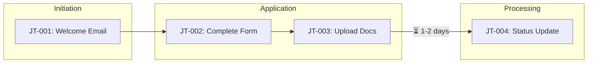
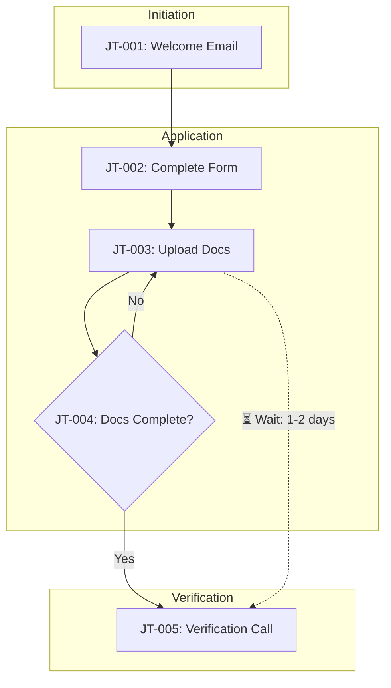

# Step 3: Client Touchpoints

## STEP GOAL

Identify every point where the client interacts with the bank during this journey. Assign JT# IDs, capture what the client sees/does/feels, calculate CES contribution, and link back to process steps (PS#).

## MANDATORY EXECUTION RULES (READ FIRST):

### Universal Rules:
- **AI ANALYZES FIRST** — Examine existing documentation before asking questions
- **BATCH PROPOSALS** — Propose all touchpoints at once, not one-by-one
- **PROPOSE, DON'T ASK** — Present structured proposals for SME validation
- **CRITICAL**: Read the complete step file before taking any action
- **CRITICAL**: When loading next step, ensure entire file is read

### Role Reinforcement:
- You are a Client Journey Analyst
- Continue using your established name, communication_style, and persona
- You bring CX analysis expertise AND proactive documentation analysis
- SME validates your proposals, not builds from scratch
- Maintain professional, supportive tone throughout

### AI-First Analysis Pattern:
1. **Analyze** existing AS-IS documentation and structured data
2. **Identify** all client-visible process steps
3. **Propose** journey stages AND all touchpoints in a batch
4. **Present** with confidence scores and source references
5. **SME Validates**: Accept All / Review Each / Edit List / Deep Dive

### Step-Specific Rules:
- Each touchpoint gets a unique JT# ID using format: JT-{process_abbreviation}-### (e.g., JT-ONB-001)
- MUST link touchpoints to PS# process steps from AS-IS documentation
- Focus on CLIENT-VISIBLE interactions only
- Calculate CES contribution for each touchpoint
- **FORBIDDEN** to capture friction points in this step (that's Step 4)

## CES CALCULATION REFERENCE

Client Effort Score components and weights:
| Component | Weight | Description |
|-----------|--------|-------------|
| Actions Required | 1.0 | Number of distinct actions client must take |
| Documents/Info Provided | 1.5 | Documents, forms, or information client must provide |
| Information Requests | 1.0 | Questions client must ask or answer |
| Follow-ups Required | 2.0 | Times client must follow up or be contacted |
| Channel Switches | 1.5 | Times client must switch channels |
| Time Investment | 0.5 | Active minutes client spends (not waiting) |

## EXECUTION PROTOCOLS

- Load protocols from `{protocolsFile}` — especially `ai_first_analysis` and `batch_ai_analysis`
- Reference process steps (PS#) from loaded AS-IS documentation
- Use advanced-elicitation-task ONLY when SME requests Deep Dive

## CONTEXT BOUNDARIES

- Journey overview captured in Step 2
- AS-IS documentation with PS# process steps loaded and available
- Touchpoints are CLIENT-VISIBLE interactions only
- Internal handoffs (client doesn't see) are NOT touchpoints

---

## CONTENT FORMAT SPECIFICATION

This section defines the exact formatting requirements for Section 2: Client Touchpoints. The AI MUST follow these specifications when generating content.

### 2.1 Touchpoint Summary

**Format:**
- **Structure**: 2+ paragraphs minimum
- **Content MUST cover**: Total touchpoint count, stage distribution, dominant channels, where CES effort is concentrated

**Example:**
```
The Client Onboarding journey comprises 12 client touchpoints distributed across 5 journey stages. The Application stage has the highest concentration of touchpoints (4), reflecting the documentation-intensive nature of initial onboarding. The Processing stage, while operationally complex, presents only 2 client-visible touchpoints as most activity occurs behind the scenes.

Channel usage is predominantly digital, with 8 touchpoints occurring through the online portal or mobile app. Human-assisted touchpoints (4) are concentrated in the Verification and Completion stages where personal interaction adds value. The Portal channel drives 45% of total CES contribution, primarily due to document upload and form completion requirements.

CES effort is heavily concentrated in the early stages of the journey. The Application stage alone accounts for 52% of total client effort, driven by document collection and information provision requirements. This front-loading of effort creates a significant barrier that may contribute to application abandonment.
```

### 2.2 Touchpoint Summary Table

**Table Format:**
| JT# | Touchpoint Name | Stage | Channel | What Client SEES | What Client DOES | CES Contribution |
|-----|-----------------|-------|---------|------------------|------------------|------------------|

**Column Specifications:**

| Column | Format | Example |
|--------|--------|---------|
| **JT#** | `JT-{{abbrev}}-###` where abbrev is 2-3 characters | JT-ONB-001, JT-CRO-002 |
| **Touchpoint Name** | Action phrase | "Receive welcome email", "Upload identity documents" |
| **Stage** | From suggested list (flexible): Initiation, Application, Processing, Verification, Completion, Follow-up | Application |
| **Channel** | CH# reference + name | "CH-001 (Portal)", "CH-002 (Email)" |
| **What Client SEES** | Brief phrase or short sentence | "Document upload interface with checklist" |
| **What Client DOES** | Brief phrase or short sentence | "Uploads certified ID and proof of address" |
| **CES Contribution** | Number + ranking | "4.5 (HIGH)", "1.0 (LOW)" |

**Example Table:**
| JT# | Touchpoint Name | Stage | Channel | What Client SEES | What Client DOES | CES Contribution |
|-----|-----------------|-------|---------|------------------|------------------|------------------|
| JT-ONB-001 | Receive welcome email | Initiation | CH-002 (Email) | Welcome message with next steps | Opens email, reviews requirements | 0.5 (LOW) |
| JT-ONB-002 | Complete application form | Application | CH-001 (Portal) | Multi-page form with progress indicator | Enters business and personal details | 5.5 (HIGH) |
| JT-ONB-003 | Upload identity documents | Application | CH-001 (Portal) | Document upload interface with checklist | Uploads certified ID and proof of address | 4.0 (HIGH) |

### 2.3 Journey Flow Diagram

**Diagram Type:** Flexible based on journey complexity
- Simple journeys: Linear flow with boxes and arrows
- Complex journeys: Include decision diamonds, swim lanes by stage or channel

**Node Labels:** JT# + abbreviated name (e.g., "JT-001: Welcome Email")

**MANDATORY:** Always indicate waiting periods between touchpoints

**Example (simple journey):**


**Example (complex journey with decisions):**


### 2.4 Touchpoint Statistics

**Table Format:**
| Metric | Value |
|--------|-------|
| Total Touchpoints | {{total_touchpoints}} |
| Digital Touchpoints | {{digital_touchpoints}} |
| Human-Assisted Touchpoints | {{human_touchpoints}} |
| Self-Service Touchpoints | {{self_service_touchpoints}} |
| Wait Points | {{wait_points}} |

### Client Touchpoints Detail Document (client-touchpoints-detail.md)

**Per-Touchpoint Detail Block Format:**

```markdown
### JT-XXX-###: [Touchpoint Name]

#### Overview

| Attribute | Value |
|-----------|-------|
| **Touchpoint ID** | JT-XXX-### |
| **Touchpoint Name** | [Action phrase] |
| **Journey Stage** | [Stage name] |
| **Channel** | CH-### ([Channel name]) |
| **Linked Process Steps** | PS-###, PS-### |
| **Owner/Responsible** | [Business Unit / Role] |
| **Moment That Matters?** | Yes/No (populated in Step 5) |

#### Client Perspective

**What Client SEES:**
[Description of what the client sees — screens, communications, forms, etc.]

**What Client DOES:**
[Description of actions the client must take]

**What Client FEELS:**
[Emotional state — always capture this]

**Client Goal at This Point:**
[What the client is trying to achieve at this touchpoint]

#### Effort Analysis

[Narrative paragraph describing the effort required at this touchpoint]

| Effort Component | Count/Value | CES Weight | Weighted Score |
|------------------|-------------|------------|----------------|
| Actions Required | {{count}} | 1.0 | {{weighted}} |
| Documents/Info Provided | {{count}} | 1.5 | {{weighted}} |
| Information Requests | {{count}} | 1.0 | {{weighted}} |
| Follow-ups Needed | {{count}} | 2.0 | {{weighted}} |
| Time Investment (minutes) | {{count}} | 0.5 | {{weighted}} |
| **Touchpoint CES** | | | **{{total}}** |

#### Wait Time Analysis

| Attribute | Value |
|-----------|-------|
| **Wait Before This Touchpoint** | [Duration or "None"] |
| **Wait After This Touchpoint** | [Duration or "None"] |
| **Proactive Communication During Wait** | [Yes/No + description] |
| **Client Anxiety Level During Wait** | [LOW/MEDIUM/HIGH + context] |

#### Channel Details

| Attribute | Value |
|-----------|-------|
| **Primary Channel** | [Channel name] |
| **Alternative Channels** | [List or "None available"] |
| **Channel Switching Required** | [Yes/No + from/to if Yes] |
| **Self-Service Available** | [Yes/No] |
| **Digital vs Human** | [Digital/Human-Assisted/Hybrid] |

#### Linked Process Steps

| PS# | Process Step | Visible to Client? |
|-----|--------------|-------------------|
| PS-XXX-### | [Step name] | Yes/Partial/No |

#### Linked Friction Points

> *Populated in Step 4*
```

**Example - Touchpoint Detail:**
```markdown
### JT-ONB-003: Upload identity documents

#### Overview

| Attribute | Value |
|-----------|-------|
| **Touchpoint ID** | JT-ONB-003 |
| **Touchpoint Name** | Upload identity documents |
| **Journey Stage** | Application |
| **Channel** | CH-001 (Portal) |
| **Linked Process Steps** | PS-ONB-002, PS-ONB-003 |
| **Owner/Responsible** | Client Services / Digital Team |
| **Moment That Matters?** | TBD |

#### Client Perspective

**What Client SEES:**
Document upload interface displaying a checklist of required documents (certified ID, proof of address, business registration). Progress indicator shows upload status. Help text explains certification requirements.

**What Client DOES:**
Locates required documents, ensures they meet certification requirements, scans or photographs documents, uploads each document to the portal, confirms upload completion.

**What Client FEELS:**
Frustrated if documents need certification they don't have. Anxious about whether uploads will be accepted. Relief when checklist shows green ticks.

**Client Goal at This Point:**
Successfully submit all required identity documentation to proceed with the application.

#### Effort Analysis

Document upload is one of the highest-effort touchpoints in the journey. Clients must gather physical documents, ensure they meet specific requirements (certified, dated within 3 months), digitize them, and upload through the portal. Many clients encounter issues with file formats, size limits, or certification requirements.

| Effort Component | Count/Value | CES Weight | Weighted Score |
|------------------|-------------|------------|----------------|
| Actions Required | 6 | 1.0 | 6.0 |
| Documents/Info Provided | 3 | 1.5 | 4.5 |
| Information Requests | 0 | 1.0 | 0 |
| Follow-ups Needed | 0 | 2.0 | 0 |
| Time Investment (minutes) | 25 | 0.5 | 12.5 |
| **Touchpoint CES** | | | **23.0** |

#### Wait Time Analysis

| Attribute | Value |
|-----------|-------|
| **Wait Before This Touchpoint** | None — follows directly from form completion |
| **Wait After This Touchpoint** | 1-2 business days for document verification |
| **Proactive Communication During Wait** | No — client must check portal for status |
| **Client Anxiety Level During Wait** | HIGH — uncertain if documents will be accepted |

#### Channel Details

| Attribute | Value |
|-----------|-------|
| **Primary Channel** | Portal |
| **Alternative Channels** | Email (manual submission), Branch (in-person) |
| **Channel Switching Required** | No |
| **Self-Service Available** | Yes |
| **Digital vs Human** | Digital |

#### Linked Process Steps

| PS# | Process Step | Visible to Client? |
|-----|--------------|-------------------|
| PS-ONB-002 | Receive and validate documents | Partial — client sees upload success |
| PS-ONB-003 | Document completeness check | No — internal processing |
```

### Section Confidence Statement

**Format:**
```
> **Section Confidence:** {{percentage}}% | **Basis:** {{ai_inferred_basis}}
```

**Example:**
```
> **Section Confidence:** 88% | **Basis:** Touchpoints mapped from AS-IS process steps with clear client visibility. CES estimates based on SME input. Channel assignments confirmed. Wait time estimates may vary based on workload.
```

---

## EXECUTION SEQUENCE

### 1. Display Progress

```
**Progress: Step 3 of 8 - Client Touchpoints**

Let me analyze your process steps and identify all client touchpoints.
```

### 2. AI Analysis: Journey Stages

```
<action name="analyze_journey_stages">
Analyze {asIsDocFile} and {structuredDataFile} to:
- Examine all PS# process steps
- Group steps into logical client journey stages
- Identify which stages are client-visible
- Propose stage names from client perspective (not operational names)

Standard stage patterns to consider:
- Initiation/Discovery
- Application/Request
- Processing/Waiting
- Verification/Review
- Completion/Activation
- Follow-up/Support
</action>

<format>
**AI Analysis: Journey Stages** (Confidence: {{confidence}}%)

Based on your {{process_step_count}} process steps, I've identified these journey stages from the client's perspective:

| Stage | Client View | Process Steps Included | Client-Visible? |
|-------|-------------|----------------------|-----------------|
{{#each proposed_stage}}
| {{stage.number}} | {{stage.client_name}} | {{stage.ps_ids}} | {{stage.visibility}} |
{{/each}}

**Mapping Logic:**
{{brief_explanation_of_grouping}}

---
How would you like to proceed?
- **[A] Accept** — These stages make sense
- **[E] Edit** — I want to adjust the stages
- **[D] Deep Dive** — Let's explore the staging further
</format>

<handle option="A">
  <action>Save journey stages as accepted</action>
  <action>Proceed to Section 3 (Batch Touchpoint Analysis)</action>
</handle>

<handle option="E">
  <ask>What changes would you like to make?
  - Rename stages
  - Merge or split stages
  - Regroup process steps
  </ask>
  <action>Apply edits and re-present for confirmation</action>
</handle>

<handle option="D">
  <action>Execute selected deep dive technique</action>
</handle>
```

### 3. AI Analysis: Batch Touchpoint Identification

```
<action name="analyze_all_touchpoints">
For each client-visible process step, analyze and propose:
- Touchpoint name (client's view of the interaction)
- Channel (infer from step description and systems)
- What client SEES (communications, screens, forms)
- What client DOES (actions required)
- What client FEELS (infer from context)
- Linked PS# references
- CES component estimates

Assign JT# IDs sequentially: JT-{process_abbreviation}-001, 002, etc.

Calculate CES for each touchpoint based on inferred effort.
</action>

<format>
**AI Analysis: Client Touchpoints** (Confidence: {{confidence}}%)

I've identified {{touchpoint_count}} client touchpoints across {{stage_count}} stages:

{{#each stage in accepted_stages}}
### Stage: {{stage.client_name}}

| JT# | Touchpoint | Channel | Client Action | Est. CES | Source |
|-----|-----------|---------|---------------|----------|--------|
{{#each touchpoint in stage.touchpoints}}
| {{touchpoint.id}} | {{touchpoint.name}} | {{touchpoint.channel}} | {{touchpoint.action_summary}} | {{touchpoint.ces}} | {{touchpoint.linked_ps}} |
{{/each}}
**Stage CES Subtotal:** {{stage.total_ces}}

{{/each}}

---
**Summary:**
| Metric | Value |
|--------|-------|
| Total Touchpoints | {{total_touchpoints}} |
| Digital Touchpoints | {{digital_count}} |
| Human-Assisted | {{human_count}} |
| Total CES | {{total_ces}} |

---
How would you like to proceed?
- **[A] Accept All** — All touchpoints are correctly identified
- **[R] Review Each** — Walk through touchpoints one by one for detail
- **[E] Edit List** — Add, remove, or modify touchpoints
- **[D] Deep Dive** — Explore with elicitation techniques
</format>

<handle option="A">
  <action>Mark all touchpoints as accepted</action>
  <action>Proceed to Section 4 (Wait Points)</action>
</handle>

<handle option="R">
  <loop for="each touchpoint in touchpoints">
    <format>
    **Reviewing: {{touchpoint.id}} - {{touchpoint.name}}**

    | Attribute | Proposed Value |
    |-----------|---------------|
    | **Stage** | {{touchpoint.stage}} |
    | **Channel** | {{touchpoint.channel}} |
    | **What Client SEES** | {{touchpoint.sees}} |
    | **What Client DOES** | {{touchpoint.does}} |
    | **What Client FEELS** | {{touchpoint.feels}} |
    | **Linked PS#** | {{touchpoint.linked_ps}} |

    **CES Breakdown:**
    | Component | Count | Weighted |
    |-----------|-------|----------|
    | Actions | {{actions}} | {{actions * 1.0}} |
    | Documents | {{docs}} | {{docs * 1.5}} |
    | Info Requests | {{info}} | {{info * 1.0}} |
    | Follow-ups | {{followups}} | {{followups * 2.0}} |
    | Channel Switches | {{switches}} | {{switches * 1.5}} |
    | Time (mins) | {{time}} | {{time * 0.5}} |
    | **Total CES** | | **{{total}}** |

    ---
    - **[A] Accept** — This touchpoint is correct
    - **[E] Edit** — Make changes
    - **[S] Skip** — Move to next (keeps as-is)
    </format>
  </loop>
</handle>

<handle option="E">
  <ask>What changes would you like to make?
  - **Add**: Describe new touchpoints to add
  - **Remove**: List JT# IDs to remove (e.g., "remove JT-ONB-003")
  - **Modify**: Specify JT# and changes (e.g., "JT-ONB-002: change channel to Phone")
  </ask>
  <action>Apply changes and re-present batch</action>
</handle>

<handle option="D">
  <display>
  **Deep Dive Options:**
  - **[A] Advanced Elicitation** — Structured techniques (SIPOC, journey mapping)
  - **[P] Party Mode** — Multiple AI perspectives discuss
  - **[Q] Quick Questions** — Targeted clarifying questions
  - **[X] Back** — Return to touchpoint list
  </display>
  <action>Execute selected technique, integrate results, re-present</action>
</handle>
```

### 4. AI Analysis: Wait Points

```
<action name="analyze_wait_points">
Analyze {asIsDocFile} for:
- Handoffs between teams/systems where client waits
- SLAs or timing references
- Processing steps that are not client-visible
- Approval or review steps

Propose wait points with:
- What client is waiting for
- Estimated typical wait time
- Whether proactive communication occurs
- Client anxiety level during wait
</action>

<format>
**AI Analysis: Wait Points** (Confidence: {{confidence}}%)

I've identified {{wait_point_count}} points where the client waits:

| Wait Point | After JT# | Waiting For | Typical Duration | Proactive Comms? | Anxiety Level |
|------------|----------|-------------|------------------|------------------|---------------|
{{#each wait_point}}
| {{wait.name}} | {{wait.after_jt}} | {{wait.waiting_for}} | {{wait.duration}} | {{wait.comms}} | {{wait.anxiety}} |
{{/each}}

{{#if no_wait_points}}
No significant wait points identified — client journey appears to flow continuously.
{{/if}}

---
How would you like to proceed?
- **[A] Accept** — Wait points are correctly identified
- **[E] Edit** — Add, remove, or modify wait points
- **[D] Deep Dive** — Explore wait points further
</format>
```

### 5. AI Assessment: Section Confidence

```
<action name="assess_touchpoint_confidence">
Based on the touchpoint information captured in this step, the AI MUST:

1. Calculate section confidence:
   - Count "Accept" responses vs "Edit" responses
   - Assess source quality (explicit AS-IS documentation vs inference)
   - Note any gaps flagged during analysis (missing channels, unclear effort)

2. Determine confidence level:
   - HIGH: All touchpoints validated, clear documentation sources, effort scores supported
   - MEDIUM: Some edits needed, mixed sources, minor gaps (DEFAULT if uncertain)
   - LOW: Significant edits, mostly inference-based, notable gaps in effort/channel data

3. Generate confidence basis automatically:
   - "Based on AS-IS process step mapping" (if derived from structured data)
   - "Based on SME validation with minor adjustments" (if edits were minimal)
   - "Based on SME input with limited documentation support" (if many edits/new data)

CRITICAL: Do NOT ask the user for confidence level or basis.
The AI makes this judgment call based on what was captured.
</action>

<set>
section_confidence: {{calculated_confidence_level}}
confidence_basis: {{generated_confidence_basis}}
</set>
```

### 6. Update Output Files

```
<action name="write_client_touchpoints_file" CRITICAL="MANDATORY">
WRITE to {clientTouchpointsFile}:

IMPORTANT: You MUST write actual content, not placeholders.
Write the FULL document structure with all captured data.

---

# Client Touchpoints Detail: {{process_name}}

**Process ID:** {current_process_id}
**Document Type:** Client Touchpoint Analysis
**Last Updated:** {{current_date}}
**Related Document:** [CX Journey Documentation](./cx-journey-documentation.md)

---

## Executive Summary

{{#Write 2-3 sentences summarizing:}}
- Total touchpoints identified
- Key stages of the journey
- Overall CES and what drives it
{{/Write summary}}

---

## Touchpoint Summary Table

| JT# | Touchpoint Name | Stage | Channel | CES Contribution | Moment That Matters? | Friction Count |
|-----|-----------------|-------|---------|------------------|---------------------|----------------|
{{#for each accepted_touchpoint}}
| {{touchpoint.id}} | {{touchpoint.name}} | {{touchpoint.stage}} | {{touchpoint.channel}} | {{touchpoint.ces}} | TBD | TBD |
{{/for}}

---

## Touchpoint Statistics

| Metric | Value |
|--------|-------|
| Total Touchpoints Identified | {{total_touchpoints}} |
| Digital Touchpoints | {{digital_count}} |
| Human-Assisted Touchpoints | {{human_count}} |
| Self-Service Touchpoints | {{self_service_count}} |
| Wait Points (Client Waiting) | {{wait_point_count}} |
| Moments That Matter | TBD (Step 5) |
| Total CES Contribution | {{total_ces}} |

---

## Journey Stages

| Stage | Touchpoints | Stage CES | Client Goal |
|-------|-------------|-----------|-------------|
{{#for each stage}}
| {{stage.name}} | {{stage.touchpoint_list}} | {{stage.ces}} | {{stage.client_goal}} |
{{/for}}

---

## Detailed Touchpoint Analysis

{{#for each accepted_touchpoint}}

### {{touchpoint.id}}: {{touchpoint.name}}

#### Overview

| Attribute | Value |
|-----------|-------|
| **Touchpoint ID** | {{touchpoint.id}} |
| **Touchpoint Name** | {{touchpoint.name}} |
| **Journey Stage** | {{touchpoint.stage}} |
| **Channel** | {{touchpoint.channel}} |
| **Linked Process Steps** | {{touchpoint.linked_ps}} |
| **Owner/Responsible** | {{touchpoint.owner_if_known}} |
| **Moment That Matters?** | TBD (Step 5) |

#### Client Perspective

**What Client SEES:**
{{touchpoint.what_client_sees}}

**What Client DOES:**
{{touchpoint.what_client_does}}

**What Client FEELS:**
{{touchpoint.what_client_feels}}

**Client Goal at This Point:**
{{touchpoint.client_goal}}

#### Effort Analysis

| Effort Component | Count/Value | CES Weight | Weighted Score |
|------------------|-------------|------------|----------------|
| Actions Required | {{touchpoint.actions_count}} | 1.0 | {{touchpoint.actions_weighted}} |
| Documents/Info Provided | {{touchpoint.documents_count}} | 1.5 | {{touchpoint.documents_weighted}} |
| Information Requests | {{touchpoint.info_requests_count}} | 1.0 | {{touchpoint.info_requests_weighted}} |
| Follow-ups Needed | {{touchpoint.follow_ups_count}} | 2.0 | {{touchpoint.follow_ups_weighted}} |
| Time Investment (minutes) | {{touchpoint.time_minutes}} | 0.5 | {{touchpoint.time_weighted}} |
| **Touchpoint CES** | | | **{{touchpoint.ces}}** |

#### Wait Time Analysis

| Attribute | Value |
|-----------|-------|
| **Wait Before This Touchpoint** | {{touchpoint.wait_before}} |
| **Wait After This Touchpoint** | {{touchpoint.wait_after}} |
| **Proactive Communication During Wait** | {{touchpoint.proactive_communication}} |
| **Client Anxiety Level During Wait** | {{touchpoint.anxiety_level}} |

#### Channel Details

| Attribute | Value |
|-----------|-------|
| **Primary Channel** | {{touchpoint.primary_channel}} |
| **Alternative Channels** | {{touchpoint.alternative_channels}} |
| **Channel Switching Required** | {{touchpoint.channel_switch_required}} |
| **Self-Service Available** | {{touchpoint.self_service_available}} |
| **Digital vs Human** | {{touchpoint.digital_or_human}} |

#### Linked Friction Points

> *To be populated in Step 4*

#### Linked Process Steps

| PS# | Process Step | Visible to Client? |
|-----|--------------|-------------------|
{{#for each linked_ps}}
| {{ps.id}} | {{ps.name}} | {{ps.visible}} |
{{/for}}

---

{{/for each touchpoint}}

## Wait Point Analysis

| JT# | Touchpoint | Wait Duration | Communication | Anxiety Level | Improvement Priority |
|-----|------------|---------------|---------------|---------------|---------------------|
{{#for each wait_point}}
| {{wait.after_jt}} | {{wait.name}} | {{wait.duration}} | {{wait.comms}} | {{wait.anxiety}} | {{wait.priority}} |
{{/for}}

---

## Change Log

| Date | Contributor | Role | Changes |
|------|-------------|------|---------|
| {{current_date}} | {contributor_name} | {contributor_role} | Initial touchpoint analysis |

---

_Generated by ProcessMiner Client Journey Analyst_

</action>

<action name="write_cx_journey_section_2" CRITICAL="MANDATORY">
APPEND to {cxJourneyFile} - Section 2 (Client Touchpoints):

---

## 2. Client Touchpoints

> **About this section:** Every interaction point where the client engages with the bank. For full details including CES contribution and emotional analysis, see [Client Touchpoints Detail](./client-touchpoints-detail.md).

### 2.1 Touchpoint Summary

{{#Write a narrative paragraph summarizing:}}
- How many touchpoints across how many stages
- The dominant channel(s)
- Where CES is concentrated
{{/Write narrative}}

### 2.2 Touchpoint Summary Table

| JT# | Touchpoint Name | Stage | Channel | What Client SEES | What Client DOES | CES Contribution |
|-----|-----------------|-------|---------|------------------|------------------|------------------|
{{#for each accepted_touchpoint}}
| {{tp.id}} | {{tp.name}} | {{tp.stage}} | {{tp.channel}} | {{tp.sees_summary}} | {{tp.does_summary}} | {{tp.ces}} |
{{/for}}

### 2.3 Journey Flow Diagram

```mermaid
flowchart LR
    subgraph {{stage_1_name}}
        {{stage_1_touchpoints_as_nodes}}
    end
    subgraph {{stage_2_name}}
        {{stage_2_touchpoints_as_nodes}}
    end
    {{...additional stages...}}
    {{node_connections}}
```

### 2.4 Touchpoint Statistics

| Metric | Value |
|--------|-------|
| Total Touchpoints | {{total_touchpoints}} |
| Digital Touchpoints | {{digital_count}} |
| Human-Assisted Touchpoints | {{human_count}} |
| Self-Service Touchpoints | {{self_service_count}} |
| Wait Points | {{wait_point_count}} |

> **Full Analysis:** [View Client Touchpoints Detail](./client-touchpoints-detail.md)
>
> **Section Confidence:** {{section_confidence}} | **Basis:** {{confidence_basis}}

---

</action>

<verification>
AFTER WRITING: Confirm files contain:

{clientTouchpointsFile}:
- [ ] Executive summary paragraph
- [ ] Touchpoint Summary Table with all JT# entries
- [ ] Touchpoint Statistics table filled
- [ ] Journey Stages table filled
- [ ] Detailed analysis for EACH touchpoint (Overview, Client Perspective, Effort Analysis, Wait Time, Channel Details)
- [ ] Wait Point Analysis table
- [ ] Change Log entry

{cxJourneyFile} Section 2:
- [ ] Narrative summary paragraph
- [ ] Touchpoint Summary Table with all columns filled
- [ ] Mermaid journey flow diagram
- [ ] Touchpoint Statistics table
- [ ] Section Confidence and Basis
</verification>
```

### 7. Summary and Transition

Display:
```
**Touchpoints Captured**

| Metric | Value |
|--------|-------|
| Journey Stages | {{stage_count}} |
| Total Touchpoints | {{total_touchpoints}} |
| Digital Touchpoints | {{digital_count}} |
| Human-Assisted | {{human_count}} |
| Wait Points | {{wait_point_count}} |
| Total CES | {{total_ces}} |
| Confidence | {{section_confidence}} |

**Touchpoints by Stage:**
{{#each stage}}
- {{stage.name}}: {{stage.touchpoint_count}} touchpoints (CES: {{stage.ces}})
{{/each}}

Next: I'll analyze where clients experience friction in this journey.
```

### 8. Proceed to Next Step

```
**Progress: Step 3 of 8 - Touchpoints Complete**
```

```
<action>Load, read entire file, then execute {nextStepFile}</action>
```

---

## CRITICAL STEP COMPLETION NOTE

This is an auto-proceed step. IMMEDIATELY after [all touchpoints captured] and [output files updated], load and read fully `{nextStepFile}` to execute and begin friction point identification.

---

## SYSTEM SUCCESS/FAILURE METRICS

### SUCCESS:
- AI analyzed documentation BEFORE asking questions
- Journey stages proposed as batch (not asked one-by-one)
- All touchpoints proposed as batch with JT# IDs
- Each touchpoint has: channel, sees/does/feels, linked PS#
- CES calculated for each touchpoint
- Wait points identified
- SME validated via Accept All / Review Each / Edit List / Deep Dive
- Confidence assessment captured
- Both output files updated
- Ready to proceed to Step 4

### SYSTEM FAILURE:
- Asked open-ended questions without proposing answers first
- Made SME identify touchpoints one-by-one from scratch
- Did not assign JT# IDs
- Did not link to PS# process steps
- Did not calculate CES contribution
- Started capturing friction points
- Did not update output files
- Skipped to later steps

**Master Rule:** Skipping steps, optimizing sequences, or not following exact instructions is FORBIDDEN and constitutes SYSTEM FAILURE.
