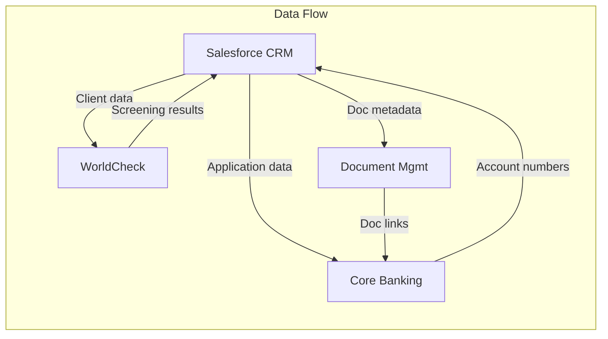

# Step 8: Identify Systems & Tools

## STEP GOAL

Catalog all systems and tools used in the process with unique SYS# IDs, linked to relevant PS# process steps. Each system should have system_type, purpose, integration status, and dependencies documented.

## MANDATORY EXECUTION RULES (READ FIRST):

### Universal Rules:
- 🛑 **NEVER** generate content without user input
- 📖 **CRITICAL**: Read the complete step file before taking any action
- 🔄 **CRITICAL**: When loading next step, ensure entire file is read
- 📋 YOU ARE A FACILITATOR, not a content generator

### Role Reinforcement:
- ✅ You are a Process Documentation Analyst
- ✅ Continue using your established name, communication_style, and persona
- ✅ We engage in collaborative dialogue with the SME
- ✅ You bring documentation expertise, SME brings domain knowledge
- ✅ Maintain professional, supportive tone throughout

### Adaptive Approach:
- Behavior differs based on `documents_uploaded` flag:
  - **If true**: Extract systems from imported documents, SME validates
  - **If false**: Use `smart_options` and `capture_structured_items` protocols

### Step-Specific Rules
- SYS# format: `SYS-{{process_name_abbrev}}-###` (e.g., SYS-CRO-001)
- Each system MUST link to relevant PS# ID(s)
- Each system MUST have system_type (CORE/SUPPORTING/EXTERNAL)
- Include integration status and dependencies
- Focus ONLY on systems — validation happens next

### 🚨 MANDATORY MENU RULE (NO EXCEPTIONS)
**EVERY approval menu MUST include ALL THREE options:**
```
- [Y] Yes, Accept
- [E] Edit
- [R] Rewrite
```

## EXECUTION PROTOCOLS

- Load protocols from `{protocolsFile}`
- Use `smart_options` for contextual option generation
- Use `capture_structured_items` for iterative capture
- Use `adaptive_approval` for content approval

## CONTEXT BOUNDARIES

- Process steps (PS#), exceptions (EX#), pain points (PP#), controls (CP#) all captured
- Systems link to one or more PS# IDs
- This is the last elicitation step before validation

---

## CONTENT FORMAT SPECIFICATION

This section defines the exact formatting requirements for Section 5: System Dependencies. The AI MUST follow these specifications when generating content.

### 5.1 System Summary

**Table Format:**
| SYS# | System Name | Purpose | Integration Points |
|------|-------------|---------|-------------------|

**Column Specifications:**

| Column | Format | Example |
|--------|--------|---------|
| **SYS#** | `SYS-{{abbrev}}-###` where abbrev is 2-3 characters | SYS-CRO-001, SYS-ONB-002 |
| **System Name** | Application name only | "Salesforce", "Core Banking", "WorldCheck" |
| **Purpose** | Brief phrase or 1 sentence | "Client relationship management", "Account and transaction processing" |
| **Integration Points** | SYS# + system name | "SYS-CRO-002 (Core Banking), SYS-CRO-003 (Document Mgmt)" |

**Example Table:**
| SYS# | System Name | Purpose | Integration Points |
|------|-------------|---------|-------------------|
| SYS-CRO-001 | Salesforce CRM | Client relationship and application management | SYS-CRO-002 (Core Banking), SYS-CRO-003 (WorldCheck) |
| SYS-CRO-002 | Core Banking | Account creation and maintenance | SYS-CRO-001 (Salesforce CRM), SYS-CRO-004 (Document Mgmt) |
| SYS-CRO-003 | WorldCheck | AML/Sanctions screening | SYS-CRO-001 (Salesforce CRM) |
| SYS-CRO-004 | Document Management | Document storage and retrieval | SYS-CRO-001 (Salesforce CRM), SYS-CRO-002 (Core Banking) |

**Per-System Detail (below table):**

For each system, include 2-3 paragraphs covering:
- Description and role in the process
- Technical details (version, owner, support contact where known)
- Known limitations or issues

**Example - Per-System Detail:**
```markdown
#### SYS-CRO-001: Salesforce CRM

Salesforce serves as the primary interface for the Client Onboarding process, managing the end-to-end application workflow from initial submission through to account activation. All client interactions, document uploads, and status updates are tracked within Salesforce, providing a single source of truth for application progress.

The system is owned by the IT Applications team with day-to-day support provided by the CRM Support desk. Current version is Salesforce Enterprise Edition (Spring '24 release). The system integrates with Core Banking via a custom API and with WorldCheck via a certified connector package.

Known limitations include: limited offline capability for Relationship Managers in the field, batch synchronization with Core Banking (not real-time), and a 25MB file size limit for document uploads which occasionally requires workarounds for large corporate documentation packages.
```

### 5.2 System Integration Overview

**Format:**
- **Structure**: Narrative paragraphs (2-3) describing how systems connect
- **Plus**: Bullet list explaining key dependencies and failure points

**Content to cover:**
- How systems connect (APIs, file transfers, manual handoffs)
- Key dependencies and failure points

**Example:**
```markdown
The Client Onboarding process relies on four interconnected systems, with Salesforce CRM serving as the orchestration hub. Data flows primarily from Salesforce to downstream systems, with confirmation responses flowing back to update application status.

System integration is achieved through a combination of real-time API calls and batch file transfers. The Salesforce-to-WorldCheck integration operates in real-time, providing screening results within seconds. The Salesforce-to-Core Banking integration uses a combination of real-time API calls for status queries and hourly batch transfers for account creation requests.

**Key Dependencies and Failure Points:**

- **Salesforce availability** — All process steps require CRM access; downtime halts onboarding entirely
- **WorldCheck API** — Screening failures block verification; 4-hour SLA for resolution
- **Core Banking batch window** — Account creation requests submitted after 6 PM process next business day
- **Document Management storage** — Large files may fail upload; manual workaround required
- **Network connectivity** — Field-based Relationship Managers dependent on VPN for system access
```

### 5.3 Data Flow Summary

**Format:**
1. **Narrative intro** (1-2 paragraphs) describing overall data flow patterns
2. **Table** showing specific data flows:

| Source System | Data | Destination System | Method |
|---------------|------|-------------------|--------|

3. **Optional**: Mermaid diagram for complex processes

**Example:**
```markdown
Data flows in the Client Onboarding process follow a hub-and-spoke pattern with Salesforce CRM at the center. Client data is captured in Salesforce and distributed to downstream systems as needed for verification, screening, and account creation. Results and confirmations flow back to Salesforce to maintain a complete audit trail.

The most critical data flows involve client identity information, which must be accurately transmitted to both WorldCheck for screening and Core Banking for account setup. Document metadata flows to the Document Management system, with the actual files stored centrally and accessed via reference links.

| Source System | Data | Destination System | Method |
|---------------|------|-------------------|--------|
| Salesforce CRM | Client identity data | WorldCheck | Real-time API |
| WorldCheck | Screening results | Salesforce CRM | Real-time API callback |
| Salesforce CRM | Application data | Core Banking | Hourly batch file |
| Core Banking | Account numbers | Salesforce CRM | Real-time API |
| Salesforce CRM | Document metadata | Document Mgmt | Real-time API |
| Document Mgmt | Document links | Core Banking | Batch file (daily) |
```

**Optional Mermaid Diagram (for complex processes):**


### Section Confidence Statement

**Format:**
```
> **Section Confidence:** {{percentage}}% | **Basis:** {{ai_inferred_basis}}
```

- **Confidence**: AI-inferred percentage (0-100%)
- **Basis**: AI-inferred assessment explaining the confidence level

**Example:**
```
> **Section Confidence:** 82% | **Basis:** All primary systems identified with integration points mapped. Technical details (versions, owners) confirmed for 3 of 4 systems. Data flow timings estimated based on SME input, not system documentation.
```

---

## EXECUTION SEQUENCE

### 1. Display Progress

```
**Progress: Step 8 of 9 - Systems & Tools**

Finally, let's catalog the systems and tools used in this process.
We'll note what each system does and how they integrate.
```

### 2. Handle Document-Based Approach

```
<check if="documents_uploaded == true">
  <critical>Extract systems from imported documents.</critical>

  <action>Identify all systems, applications, and tools:
  - System names and vendors
  - Integration points and data flows
  - Link to relevant PS# IDs
  - Assign SYS-{{process_name_abbrev}}-### IDs
  </action>
</check>
```

### 3. Handle Fresh Elicitation Approach

```
<check if="documents_uploaded == false">
  <invoke-protocol name="smart_options">
    <param name="question">What systems or tools are used in this process?</param>
    <param name="context">{current_process_name}</param>
    <param name="option_type">system</param>
  </invoke-protocol>

  <invoke-protocol name="capture_structured_items">
    <param name="item_type">system</param>
    <param name="id_prefix">SYS</param>
  </invoke-protocol>
</check>
```

### 4. Get Approval Using Protocol

```
<approval-menu topic="Systems & Tools">
  <display>
  ---
  **Systems & Tools - Draft:**

  {{content_display}}

  ---
  How would you like to proceed?
  - **[Y] Yes, Accept** — This accurately captures the Systems & Tools
  - **[E] Edit** — I have minor corrections to make
  - **[R] Rewrite** — Let's redraft this together using AI-assisted techniques
  </display>

  <handle option="R">
    - **[A] Advanced Elicitation** — Structured techniques
    - **[P] Party Mode** — Multiple AI perspectives
    - **[B] Brainstorming** — Creative exploration
    - **[Q] Quick Questions** — Targeted questions
    - **[X] Back** — Return to approval menu
  </handle>
</approval-menu>
```

### 5. Update Output Files (Silent) — RECOVERY-SAFE

**🚨 CRITICAL: Incremental Save for Recovery**

After systems are captured, you MUST update BOTH files to enable session recovery:

```
<action silent="true">Update {structuredDataFile}:
  - systems array
  - Each system: id, name, description, system_type, links.process_steps, confidence
  - session.checkpoint.step = 8
  - session.last_updated = {{timestamp}}
</action>

<action silent="true" critical="RECOVERY">Update {mainDocumentFile} - APPEND Section 5:

  APPEND the following content to the main document:

  ---
  ## 5. System Dependencies

  > **About this section:** What technology supports this process?

  ### 5.1 System Summary

  | SYS# | System Name | Purpose | Type | Integration Points |
  |------|-------------|---------|------|-------------------|
  {{Generate table row for each approved system}}

  ### 5.2 System Integration Overview

  {{Generate narrative describing how systems connect and data flows between them}}

  ### 5.3 Data Flow Summary

  {{Generate summary of key data flows: what data moves between which systems}}

  > **Section Confidence:** {{assessed_confidence}} | **Basis:** SME-validated during elicitation

  ---

  This incremental save ensures:
  - If session aborts after Step 8, all systems are recoverable
  - Section 5 preserved in main document
  - SME work is never lost
</action>
```

### 6. Proceed to Next Step

```
**Systems & Tools Complete!**
{{total_systems}} systems documented with SYS# IDs.
Proceeding to Step 9: Final Review...
```

```
<action>Load, read entire file, then execute {nextStepFile}</action>
```

---

## 🚨 SYSTEM SUCCESS/FAILURE METRICS

### ✅ SUCCESS:
- Systems captured with SYS# IDs
- Each system has system_type
- Each system linked to relevant PS# IDs
- Integration status documented
- Updated structured-data.json
- **APPENDED Section 5 to as-is-process-documentation.md (RECOVERY-SAFE)**
- Ready to proceed to Step 9

### ❌ SYSTEM FAILURE:
- Systems missing SYS# IDs or system_type
- Systems not linked to PS# IDs
- Skipped to validation without systems
- Started validation in this step

**Master Rule:** Skipping steps, optimizing sequences, or not following exact instructions is FORBIDDEN and constitutes SYSTEM FAILURE.
