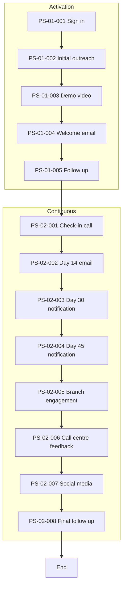

# As-Is Process Documentation: Onboarding of Corporate Clients

**Document Type:** Current State Process Analysis
**Business Unit:** All segments
**Region:** -
**Document Owner:** Markus
**Last Updated:** 2025-12-04
**Version:** 0.2 (Imported + SME Validated)

---

## Executive Summary

This process manages the communication journey for new corporate clients from initial sign-in through Day 180, covering activation activities and ongoing engagement touchpoints.

### Key Metrics at a Glance

| Metric | Value |
|--------|-------|
| Process Steps | 13 |
| Exceptions Identified | 0 [REQUIRES SME INPUT] |
| Pain Points Captured | 0 [REQUIRES SME INPUT] |
| Control Points Mapped | 0 [REQUIRES SME INPUT] |
| Systems Involved | 7 |
| Overall Confidence | MEDIUM (Imported from flowchart) |

---

## How to Read This Document

> This document captures the **current state (AS-IS)** of the Onboarding of Corporate Clients process. It provides a comprehensive overview with summary tables. For detailed analysis, see the linked companion documents.
>
> **Companion Documents:**
> - [Exception Details](./exceptions-detail.md) - Full exception analysis with root causes
> - [Pain Point Details](./pain-points-detail.md) - Detailed pain point analysis with improvement ideas
> - [Control Point Details](./control-points-detail.md) - Complete control mapping with compliance analysis
>
> **Confidence Indicators:** Each section includes an AI-assessed completeness confidence:
> - **[HIGH]** - Comprehensive coverage, validated by multiple sources
> - **[MEDIUM]** - Good coverage, some details may need validation
> - **[LOW]** - Preliminary capture, requires additional SME input
>
> **Data Source:** Imported from `customer_onboarding_process_flowchart_for_bank_slide01.jpg` and SME-validated on 2025-12-04

---

## 1. Process Overview

> **About this section:** Foundational context - what this process is, who owns it, and what business need it serves.

### 1.1 Process Identification

| Attribute | Value |
|-----------|-------|
| **Process Name** | Onboarding of Corporate Clients |
| **Process ID** | P004 |
| **Process Category** | Customer Onboarding |
| **Scope** | All segments |
| **Process Owner** | Peter Petersen |

### 1.2 Purpose and Trigger

**Purpose:** [HIGH] Continue communications with new customers through activation and ongoing engagement activities. The process ensures new corporate clients receive consistent touchpoints from Day 1 (sign-in) through Day 180, building relationship and driving product activation through multi-channel communications including SMS, email, chat, video content, and personal calls from branch and call centre staff.

**Trigger:** [HIGH] The process is triggered when a prospective corporate client initiates first contact with an onboarding request, AND that contact is formally registered in the bank's system of record (CRM/case management).

- **Trigger Type:** Client-initiated, system-captured. The client's outreach (via phone, email, web form, or branch visit) must be logged to create an auditable starting point.
- **Pre-condition:** Prior exposure to marketing channels (website, advertising) that informed the client about corporate banking offerings.
- **Compliance Note:** The formal registration timestamp marks Day 0 for all SLA and regulatory reporting purposes.

### 1.3 Operational Characteristics

**Frequency:** [HIGH] Continuous. Onboarding requests are received throughout the day, every business day. The process operates as a steady flow rather than batch processing.

**Volume:** [HIGH] Very High — 200+ corporate client onboarding requests per month. At this volume, the bank manages hundreds of concurrent 180-day journeys at any given time, with approximately 1,200+ clients active in the onboarding pipeline.

**Duration:** Day 1 to Day 180 (6-month journey)

### 1.4 Key Stakeholders

| Role | Responsibility | Confidence |
|------|----------------|------------|
| Bank Managers | Continue communications with new customers | [MEDIUM] |
| Call Centre Staff | Follow-up calls, feedback collection | [MEDIUM] |
| Branch Staff | Engagement calls | [LOW] |
| KYC Team | Defence client approval, compliance checks | [MEDIUM] |
| Marketing Team | Campaign execution, communications content | [MEDIUM] |

> **Section Confidence:** HIGH | **Basis:** SME elicitation completed for purpose, trigger, frequency, and volume

---

## 2. Process Steps

> **About this section:** The step-by-step flow of this process from start to finish.

### 2.1 Process Step Summary

| PS# | Step Name | Timeline | Owner | System(s) | Rationale |
|-----|-----------|----------|-------|-----------|-----------|
| PS-01-001 | Sign in | Day 1 | System | - | Drive activation |
| PS-01-002 | Initial outreach campaigns | Day 1 | Marketing | SMS Platform, E-mail | Drive activation |
| PS-01-003 | Demo video and presentation | Day 2 | Marketing | Video Platform | Drive activation |
| PS-01-004 | Welcome email | Day 2 | Marketing | E-mail | Drive activation |
| PS-01-005 | Follow up with customer | Day 5 | Sales | - | Drive activation |
| PS-02-001 | Bank check-in call | Day 7-30 | Call Centre | Genesys | Build relationship |
| PS-02-002 | Day 14 e-mail and targeted campaign | Day 14 | Marketing | E-mail, Campaign Tool | Build relationship |
| PS-02-003 | Day 30 activation notification | Day 30 | System | - | Build relationship |
| PS-02-004 | Day 45 activation notification | Day 45 | System | - | Build relationship |
| PS-02-005 | Branch engagement call | Day 30-60 | Branch Staff | - | Build relationship |
| PS-02-006 | Call centre feedback and engagement | Day 60-90 | Call Centre Staff | Genesys | Build relationship |
| PS-02-007 | Social media campaign | Day 60-90 | Marketing | Social Media Platform | Build relationship |
| PS-02-008 | Call centre follow up | Day 180 | Call Centre Staff | Genesys | Build relationship |

### 2.2 Process Flow Diagram

### 2.3 Step Details

**Phase 1: Activation (Day 1-5)**

Steps PS-01-001 through PS-01-005 cover initial customer activation including sign-in, welcome communications, demo content, and initial follow-up.

**Phase 2: Continuous Communication (Day 7-180)**

Steps PS-02-001 through PS-02-008 cover ongoing engagement including check-in calls, milestone notifications, branch and call centre engagement, and final follow-up.

> **Section Confidence:** HIGH | **Basis:** 13 steps validated with owners and rationale confirmed by SME.

---

## 3. Exception Paths and Variations

> **About this section:** Summary of exceptions. For full details including root cause analysis and handling procedures, see [Exception Details](./exceptions-detail.md).

### 3.1 Exception Summary

One exception path has been identified: Defence sector clients require additional KYC approval before the standard onboarding journey can begin.

### 3.2 Exception Summary Table

| EX# | Exception | Trigger | Affected Steps | Frequency | Impact |
|-----|-----------|---------|----------------|-----------|--------|
| EX-OCC-001 | Defence Client Additional Approval | Defence sector client | All steps (full hold) | Occasional | High |

### 3.3 Exception Statistics

| Metric | Value |
|--------|-------|
| Total Exceptions | 1 |
| High-Impact Exceptions | 1 |
| Frequently Occurring | 0 |

> **Full Analysis:** [View Exception Details](./exceptions-detail.md)
>
> **Section Confidence:** HIGH | **Basis:** SME elicitation completed

---

## 4. Control Points and Compliance

> **About this section:** Summary of controls. For full regulatory mapping and effectiveness analysis, see [Control Point Details](./control-points-detail.md).

### 4.1 Control Summary

One control has been identified for this process:

| CP# | Control Name | Type | System | Process Step | Method |
|-----|--------------|------|--------|--------------|--------|
| CP-OCC-001 | KYC Check and Approval | Preventive | dbCLM | Pre-process (before Day 1) | Semi-automated |

**Description:** KYC verification is performed in the dbCLM system before the client enters the onboarding journey. This is a gate control — clients cannot proceed to Day 1 activities until KYC is cleared.

**Defence Sector Enhancement:** Defence sector clients (EX-OCC-001) require additional manual KYC Team approval beyond the standard semi-automated check.

### 4.2 Control Point Summary Table

| CP# | Control Name | Type | Regulation | Process Step | Effectiveness |
|-----|--------------|------|------------|--------------|---------------|
| CP-OCC-001 | KYC Check and Approval | Preventive | KYC/AML | Pre-process | Medium |

### 4.3 Regulatory Coverage

| Regulation | Controls Mapped | Coverage Status |
|------------|-----------------|-----------------|
| KYC | CP-OCC-001 | Partial |
| AML | CP-OCC-001 | Partial |
| GDPR | None documented | Gap |

### 4.4 Control Statistics

| Metric | Value |
|--------|-------|
| Total Control Points | 1 |
| Regulatory Controls | 1 |
| Internal Controls | 0 |
| Automated Controls | 0 |
| Semi-Automated Controls | 1 |

> **Full Analysis:** [View Control Point Details](./control-points-detail.md)
>
> **Section Confidence:** MEDIUM | **Basis:** KYC control documented, GDPR gap flagged for future review

---

## 5. System Dependencies

> **About this section:** What technology supports this process?

### 5.1 System Summary

| SYS# | System Name | Purpose | Used In Steps | Confidence |
|------|-------------|---------|---------------|------------|
| SYS-01-001 | Mobile SMS Platform | Customer notifications via SMS | PS-01-002 | [HIGH] |
| SYS-01-002 | E-mail System | Communications, campaigns, welcome emails | PS-01-002, PS-01-004, PS-02-002 | [HIGH] |
| SYS-01-003 | Video Platform | Demo videos, introductory content | PS-01-003 | [MEDIUM] |
| SYS-01-004 | Genesys | Call centre system - customer call management, follow-up tracking | PS-02-001, PS-02-006, PS-02-008 | [HIGH] (SME validated) |
| SYS-01-005 | Social Media Platform | Marketing campaigns, customer engagement | PS-02-007 | [MEDIUM] |
| SYS-01-006 | Digital Campaign Tool | Targeted digital marketing campaigns | PS-02-002 | [MEDIUM] |
| SYS-01-007 | dbCLM | KYC verification and client lifecycle management | Pre-process (CP-OCC-001) | [HIGH] |

### 5.2 System Integration Overview

[REQUIRES SME INPUT] - Integration details not documented in source material.

### 5.3 Data Flow Summary

[REQUIRES SME INPUT] - Data flows not documented in source material.

> **Section Confidence:** MEDIUM | **Basis:** Systems identified from flowchart, Genesys name validated by SME

---

## 6. Organizational Mapping

> **About this section:** Who does what? Roles and responsibilities.

### 6.1 RACI Matrix

[REQUIRES SME INPUT]

### 6.2 Team Responsibilities

| Role | Responsibilities |
|------|------------------|
| Bank Managers | Overall process ownership, customer communications |
| Call Centre Staff | PS-02-001, PS-02-006, PS-02-008 - Check-in calls, feedback, follow-up |
| Branch Staff | PS-02-005 - Branch engagement calls |
| KYC Team | Pre-process KYC approval (CP-OCC-001), defence client escalations |
| Marketing Team | PS-01-002, PS-01-003, PS-01-004, PS-02-002, PS-02-007 - Campaigns, content, communications |
| Sales | PS-01-005 - Customer follow-up |

> **Section Confidence:** LOW | **Basis:** Team responsibilities documented, RACI matrix pending

---

## 7. Existing Documentation References

> **About this section:** Related documents and metrics.

### 7.1 Related Documents

| Document | Location | Status |
|----------|----------|--------|
| Customer onboarding process flowchart | source-documentation/ | Imported |

### 7.2 KPIs and Metrics

[REQUIRES SME INPUT]

### 7.3 DTPs (Detailed Task Procedures)

[REQUIRES SME INPUT]

> **Section Confidence:** LOW | **Basis:** Only source flowchart available

---

## 8. Process Gaps and Issues

> **About this section:** Known gaps and inconsistencies.

### 8.1 Identified Gaps

Based on import analysis (see [gap-analysis.md](./gap-analysis.md)):

| Gap Area | Priority | Description |
|----------|----------|-------------|
| Controls & Compliance | CRITICAL | No regulatory controls documented (KYC, AML, GDPR) |
| Pain Points | HIGH | No challenges or issues documented |
| Step Ownership | HIGH | Most steps lack defined owners |
| Step Rationale | HIGH | No "why" documented for any step |
| Exception Handling | HIGH | No exception paths documented |
| System Integration | MEDIUM | How systems connect not documented |

### 8.2 Missing Documentation

- Process frequency and volume metrics
- SLAs and performance targets
- Decision points and approval gates
- Data inputs/outputs per step
- RACI matrix

### 8.3 Inconsistencies

No conflicts identified (single source document).

> **Section Confidence:** HIGH | **Basis:** Gap analysis complete

---

## 9. Pain Points and Improvement Opportunities

> **About this section:** Summary of pain points. For full analysis including root causes and improvement ideas, see [Pain Point Details](./pain-points-detail.md).

### 9.1 Pain Points Summary

Two significant pain points have been identified:
1. **No Client Portal** — Clients cannot self-serve and must contact ACO to initiate onboarding
2. **Manual Email Handoffs** — Team coordination relies entirely on email, creating risk of delays

### 9.2 Pain Point Summary Table

| PP# | Pain Point | Category | Affected Steps | Impact | Frequency | Priority |
|-----|------------|----------|----------------|--------|-----------|----------|
| PP-OCC-001 | No Client Portal | Customer Experience | All steps | High | Every case | High |
| PP-OCC-002 | Manual Email Handoffs | Efficiency | Transition points | High | Every case | High |

### 9.3 Pain Point Statistics

| Metric | Value |
|--------|-------|
| Total Pain Points | 2 |
| High-Impact | 2 |
| Client-Facing | 1 |
| Quick Win Opportunities | 1 (web form) |

### 9.4 Top Improvement Opportunities

1. **Quick Win:** Add web form for online onboarding initiation
2. **Strategic:** Build client portal with progress tracking
3. **Strategic:** Implement workflow automation for team handoffs

> **Full Analysis:** [View Pain Point Details](./pain-points-detail.md)
>
> **Section Confidence:** HIGH | **Basis:** SME elicitation completed

---

## Document Metadata

**SME Contributors:** Markus (CEO)
**Interview Date(s):** 2025-12-04
**Documentation Method:** Import from existing documentation + Progressive Elicitation via ProcessMiner
**Source Documents:** customer_onboarding_process_flowchart_for_bank_slide01.jpg

### Overall Document Confidence

| Section | Confidence | Key Gaps |
|---------|------------|----------|
| 1. Process Overview | MEDIUM | Owner, frequency, volume |
| 2. Process Steps | MEDIUM | Ownership, rationale, inputs/outputs |
| 3. Exceptions | LOW | All details needed |
| 4. Controls | LOW | CRITICAL - All details needed |
| 5. Systems | MEDIUM | Integration details |
| 6. Organization | LOW | RACI matrix needed |
| 7. Documentation | LOW | KPIs, DTPs needed |
| 8. Gaps & Issues | HIGH | Gap analysis complete |
| 9. Pain Points | LOW | All details needed |

**Overall Confidence:** MEDIUM (32% completeness from import)

### Companion Documents

| Document | Purpose | Link |
|----------|---------|------|
| Exception Details | Full exception analysis | [exceptions-detail.md](./exceptions-detail.md) |
| Pain Point Details | Full pain point analysis | [pain-points-detail.md](./pain-points-detail.md) |
| Control Point Details | Full control analysis | [control-points-detail.md](./control-points-detail.md) |
| Gap Analysis | Import completeness report | [gap-analysis.md](./gap-analysis.md) |
| Imported Data | Structured JSON data | [imported-data.json](./imported-data.json) |

---

## Change Log

| Date | Contributor | Role | Changes |
|------|-------------|------|---------|
| 2025-12-04 | Peter | COO | Completed full document review: 9 sections reviewed, 4 approved with changes, 5 validated as-is |
| 2025-12-04 | Peter | COO | Reviewed Section 5: Added SYS-01-007 dbCLM to systems table |
| 2025-12-04 | Peter | COO | Reviewed Section 6: Updated team responsibilities table with KYC Team, Marketing Team, Sales |
| 2025-12-04 | Peter | COO | Reviewed Section 4: Added CP-OCC-001 KYC Check and Approval control (dbCLM, semi-automated, medium effectiveness), updated regulatory coverage |
| 2025-12-04 | Peter | COO | Reviewed Section 1: Added Process Owner (Peter Petersen), added KYC Team and Marketing Team as stakeholders |
| 2025-12-04 | Markus | SME | Enhanced: PP-OCC-001 — No Client Portal (Direct narrative) |
| 2025-12-04 | Markus | CEO | Initial documentation |
| 2025-12-04 | Markus | CEO | Imported from flowchart, SME validated systems (Genesys) |
| 2025-12-04 | Markus | CEO | Completed Step 3: Process Overview - added purpose (with chat channel), trigger (client-initiated + system-captured), frequency (continuous), volume (200+/month) |
| 2025-12-04 | Markus | CEO | Completed Step 4: Process Steps - confirmed 13 steps with owners (System, Marketing, Sales, Call Centre, Branch Staff) |
| 2025-12-04 | Markus | CEO | Completed Step 5: Exceptions - captured 1 exception (EX-OCC-001 Defence Client Additional Approval) |
| 2025-12-04 | Markus | CEO | Completed Step 6: Pain Points - captured 2 pain points (PP-OCC-001 No Client Portal, PP-OCC-002 Manual Email Handoffs) |
| 2025-12-04 | Markus | CEO | Completed Step 7: Controls - no formal controls documented (gap flagged for Compliance review) |
| 2025-12-04 | Markus | CEO | Completed Step 8: Systems - confirmed 6 systems (SMS, Email, Video, Campaign, Social Media, Genesys) |

---

## Glossary

*To be populated during elicitation*

---

_Generated by ProcessMiner Process Documentation Analyst_
_Document ID: P004-as-is_
