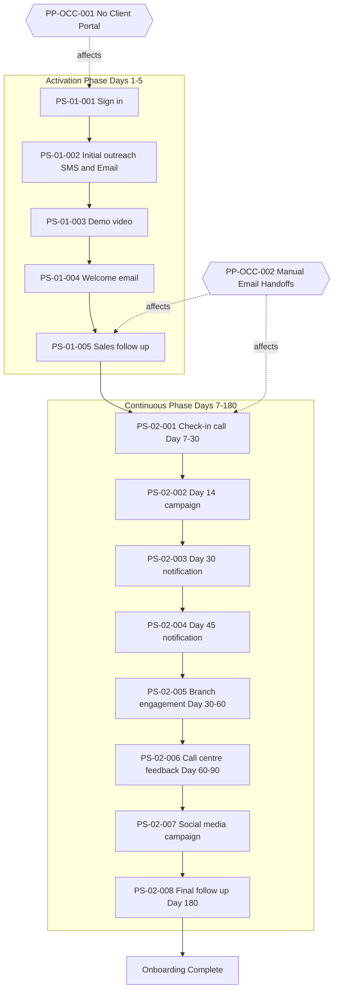

# Onboarding of Corporate Clients: Current State Analysis

**Process ID:** P004 | **Date:** 2025-12-04 | **Prepared by:** Markus, CEO

---

## Why This Process Matters

Corporate client onboarding represents the critical first six months of every banking relationship. The quality of this experience directly influences client retention, product activation rates, and the foundation for long-term revenue. When done well, onboarding transforms a signed contract into an engaged client who actively uses the bank's products and services. When done poorly, it creates confusion, delays, and relationship erosion that can take years to repair.

This document provides senior leadership with a comprehensive understanding of how the Onboarding of Corporate Clients process operates today, where friction exists, and what opportunities merit attention. The analysis draws from existing process documentation, flowchart analysis, and SME elicitation conducted with the CEO. The findings reflect the current state across all client segments.

---

## The Process at a Glance

The Onboarding of Corporate Clients process is triggered when a prospective corporate client initiates first contact with an onboarding request, and that contact is formally registered in the bank's system of record. This trigger requires formal system capture—the client's outreach via phone, email, web form, or branch visit must be logged to create an auditable starting point for all SLA and regulatory reporting purposes.

The organization processes over 200 corporate client onboarding requests per month on a continuous basis throughout every business day. Each onboarding journey spans 180 days from Day 1 (sign-in) through final follow-up, meaning the bank manages approximately 1,200 concurrent client journeys at any given time.

The process operates in two distinct phases. The Activation Phase (Days 1-5) focuses on initial contact, welcome communications, demo content, and early follow-up to drive product activation. The Continuous Communication Phase (Days 7-180) maintains relationship momentum through scheduled touchpoints including check-in calls, milestone notifications, branch engagement, and social media campaigns.

**Boundaries:** This analysis covers the post-sign-up communication journey from Day 1 through Day 180 across all client segments. It does not address the pre-onboarding sales cycle or the KYC approval process that must complete before Day 1 begins.

---

## What "Good" Looks Like

Success for this process is measured by client activation rates—the percentage of clients who actively use banking products following onboarding—and relationship strength at the 180-day mark. While specific targets were not documented in the source material, the process design emphasizes two strategic outcomes: driving activation and building relationship.

The current state reflects a MEDIUM overall confidence level with 32% completeness from the initial import. Key performance indicators including activation rates, touchpoint completion rates, and client satisfaction scores require further definition and measurement. The absence of documented KPIs represents a significant gap that limits the organization's ability to assess process effectiveness objectively.

---

## Constraints We Operate Under

Several non-negotiable requirements shape how this process must function:

**Regulatory Requirements:** The process operates under KYC and AML compliance requirements. A preventive control (CP-OCC-001) requires KYC verification through the dbCLM system before any client can enter the onboarding journey. This is a gate control—clients cannot proceed to Day 1 activities until KYC is cleared. Defence sector clients face additional scrutiny, requiring manual KYC Team approval that can add 3-5 business days before onboarding can begin.

A notable gap exists in GDPR compliance documentation. While the process handles personal client data through multiple communication channels, no formal GDPR controls have been documented. This represents a compliance risk requiring attention.

**System Dependencies:** The process relies on seven interconnected systems. The Genesys call centre platform (SYS-01-004) manages all telephone touchpoints at Days 7-30, 60-90, and 180. The Email System (SYS-01-002) supports welcome communications, Day 14 campaigns, and ongoing engagement. Mobile SMS (SYS-01-001), Video Platform (SYS-01-003), Digital Campaign Tool (SYS-01-006), and Social Media Platform (SYS-01-005) handle their respective communication channels. The dbCLM system (SYS-01-007) manages KYC verification and client lifecycle data.

Integration details between these systems are not documented, creating potential risk for data consistency and handoff reliability.

---

## How We Work Today

### The Journey from Start to Finish

The client journey begins at sign-in (PS-01-001) when the system registers a new corporate client. Within the same day, Marketing launches initial outreach campaigns via SMS and email (PS-01-002), introducing the client to available products and services. Day 2 brings a demo video presentation (PS-01-003) followed by a formal welcome email (PS-01-004). Sales follows up directly with the customer on Day 5 (PS-01-005), completing the Activation Phase.

The Continuous Communication Phase begins with a bank check-in call between Days 7-30 (PS-02-001), managed through the Genesys call centre system. Day 14 brings a targeted email campaign (PS-02-002). System-generated activation notifications mark the Day 30 (PS-02-003) and Day 45 (PS-02-004) milestones. Branch staff make engagement calls between Days 30-60 (PS-02-005), while call centre staff collect feedback and conduct engagement calls during Days 60-90 (PS-02-006). A social media campaign runs concurrently during this period (PS-02-007). The journey concludes with a final call centre follow-up at Day 180 (PS-02-008).

### Process Flow

### Handoffs and Decision Points

The process involves multiple handoffs between teams: System to Marketing (Day 1), Marketing to Sales (Day 5), Sales to Call Centre (Day 7), Call Centre to Branch Staff (Day 30), and Branch back to Call Centre (Day 60). The most critical handoff occurs when Sales completes initial follow-up and the client enters the longer-term relationship building phase.

The primary decision point occurs before Day 1 when KYC verification determines whether the client can proceed. Defence sector clients trigger an exception path (EX-OCC-001) requiring additional KYC Team approval before the standard journey can begin.

### The Control Environment

The current control framework consists of a single documented control: KYC Check and Approval (CP-OCC-001). This preventive control operates through the dbCLM system in a semi-automated fashion, verifying client identity and compliance status before onboarding begins. The control's effectiveness is rated MEDIUM.

The control framework achieves basic KYC and AML compliance but has notable gaps. No internal controls are documented, and no fully automated controls exist. GDPR compliance controls are entirely absent from documentation, representing a significant regulatory risk.

---

## Where It Hurts

Two pain points emerge consistently from stakeholder analysis:

### No Client Portal (PP-OCC-001)

The absence of a self-service client portal creates a significant operational bottleneck in the corporate client onboarding process. Staff must handle all client inquiries and onboarding initiation requests manually through email, with no automated self-service channel available. Clients cannot start the process themselves, track progress, or access information online.

The downstream effect is significant: staff spend a minimum of one hour per day reading and responding to emails that could be handled through self-service. This administrative burden directly reduces selling capacity, as relationship managers and sales staff have less time available for revenue-generating activities. At a volume of 200+ corporate client onboarding requests per month, this email overhead compounds significantly across the team.

Currently, there is no formal workaround in place—staff absorb the email volume as part of their daily workload, accepting reduced sales productivity as an unavoidable cost.

### Manual Email Handoffs Between Teams (PP-OCC-002)

All handoffs between teams—Marketing to Sales to Call Centre to Branch—are coordinated via email. There is no system-based workflow or automatic task assignment. This creates multiple operational risks: no visibility into handoff status, risk of emails being missed or delayed, no audit trail of who did what and when, manual effort to track and coordinate, difficulty reporting on process performance, and clients potentially falling through the cracks.

This manifests most acutely at transition points between process phases. Every handoff depends on someone sending an email, someone else reading it, and manual action being taken. With hundreds of concurrent client journeys, the coordination burden is substantial.

---

## What Needs Attention

Based on this analysis, three areas merit leadership attention:

### Immediate Priority: Implement Web Form for Onboarding Initiation

As a quick win, the organization should implement a web form that allows corporate clients to initiate the onboarding process online. This directly addresses the highest-impact component of the No Client Portal pain point by providing a digital entry point that reduces email volume and staff burden.

**Expected outcome:** Reduced email handling time, faster client intake, improved data quality from structured form submission.
**Investment required:** Minimal—web form implementation requires modest development effort.
**Risk of inaction:** Continued productivity drain on sales staff, potential friction in client acquisition.

### Near-Term Opportunity: Implement Workflow Automation for Team Handoffs

The organization should evaluate workflow automation tools that can replace email-based handoffs with system-based task assignment. This would address PP-OCC-002 by creating automatic triggers when clients move between process stages.

This initiative would address the coordination overhead and audit trail gaps while positioning the organization for better process visibility and reporting capabilities. Integration with existing systems (Genesys, dbCLM) should be assessed as part of implementation planning.

### Strategic Consideration: Build Comprehensive Client Portal

Looking further ahead, a full client portal with self-service onboarding initiation, progress tracking, and information access would transform the client experience. This represents a larger transformation that warrants further analysis through detailed requirements gathering, build-vs-buy assessment, and business case development.

---

## Next Steps

The analysis reveals a process that functions but carries significant manual overhead and limited visibility. The recommended path forward begins with implementing the web form quick win, which can be delivered with modest investment while demonstrating value. Concurrently, the compliance gap around GDPR should be addressed through documentation and control implementation.

The immediate next action is to define requirements for the web form, owned by the process owner (Peter Petersen) with input from IT, targeting completion within the current quarter.

---

## Appendix

### A. Process Flow Diagram

See embedded diagram in main narrative.

### B. Pain Point Registry

| ID | Description | Impact | Frequency | Affected Areas |
|----|-------------|--------|-----------|----------------|
| PP-OCC-001 | No Client Portal - clients cannot self-serve | High | Every case | Pre-process, PS-01-001, all communication steps |
| PP-OCC-002 | Manual Email Handoffs - no workflow automation | High | Every case | PS-01-002, PS-01-005, PS-02-001, PS-02-005 |

### C. Control Point Inventory

| ID | Control | Type | Requirement | Status |
|----|---------|------|-------------|--------|
| CP-OCC-001 | KYC Check and Approval | Preventive | KYC/AML | Medium effectiveness |

### D. Systems Landscape

| ID | System | Role in Process | Steps Used |
|----|--------|-----------------|------------|
| SYS-01-001 | Mobile SMS Platform | Customer notifications via SMS | PS-01-002 |
| SYS-01-002 | E-mail System | Communications, campaigns, welcome emails | PS-01-002, PS-01-004, PS-02-002 |
| SYS-01-003 | Video Platform | Demo videos, introductory content | PS-01-003 |
| SYS-01-004 | Genesys | Call centre system | PS-02-001, PS-02-006, PS-02-008 |
| SYS-01-005 | Social Media Platform | Marketing campaigns | PS-02-007 |
| SYS-01-006 | Digital Campaign Tool | Targeted digital marketing | PS-02-002 |
| SYS-01-007 | dbCLM | KYC verification, client lifecycle | Pre-process (CP-OCC-001) |

### E. Exception Registry

| ID | Exception | Trigger | Frequency | Impact |
|----|-----------|---------|-----------|--------|
| EX-OCC-001 | Defence Client Additional Approval | Defence sector client | Occasional | High - full process hold |

### F. Stakeholders Consulted

- Markus (CEO) - SME elicitation and validation
- Peter (COO) - Document review

---

**Document ID:** EXEC-AS-IS-P004 | **Version:** 1.0 | **Confidence Level:** MEDIUM

---

## Change Log

| Date | Contributor | Role | Changes |
|------|-------------|------|---------|
| 2025-12-04 | Markus | CEO | Generated executive summary from as-is-process-documentation.md; 9 sections approved, 0 sections amended |
