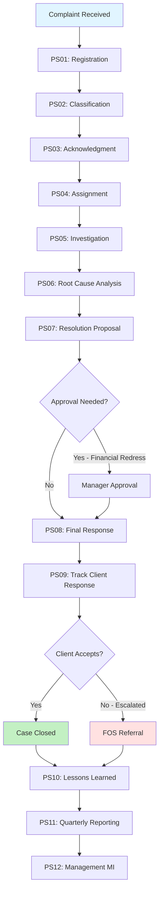

# As-Is Process Documentation: Client Complaints Management

**Document Type:** Current State Process Analysis
**Business Unit:** Retail Banking (All Segments)
**Region:** UK
**Document Owner:** Compliance Officer
**Last Updated:** 2025-12-04
**Version:** 1.0

---

## Executive Summary

The Client Complaints Management process is a regulatory-critical banking process that handles approximately 200 customer complaints per month across all business segments (BizBanking, MidCap, LargeCap). The process is governed by FCA DISP rules, Consumer Duty obligations, and GDPR requirements, with strict SLA requirements of 5 business days for acknowledgment and 30 days for resolution.

The process operates across four main systems (ServiceNow for complaint tracking, Salesforce CRM for customer data, Outlook for communications, and Power BI for reporting) with limited integration between them. Key pain points include manual data entry, fragmented system landscape causing slow investigations, inadequate root cause tracking, and inconsistent quality of final response letters. Approximately 15-20% of complaints breach the 30-day SLA, and the quarterly regulatory reporting process requires 2-3 days of manual effort.

The process includes 12 main steps from complaint receipt through resolution and regulatory reporting, supported by 10 critical control points that ensure FCA compliance. Six exception scenarios have been identified, including duplicate complaints (10%), SLA breaches (15-20%), third-party involvement (5-7%), vulnerable customers (20-25%), legal threats (2-4%), and systemic issues (quarterly). The process demonstrates strong regulatory control design but suffers from operational inefficiencies and data quality challenges that increase compliance risk and reduce client satisfaction.

### Key Metrics at a Glance

| Metric | Value |
|--------|-------|
| Process Steps | 12 |
| Exceptions Identified | 6 |
| Pain Points Captured | 8 |
| Control Points Mapped | 10 |
| Systems Involved | 4 |
| Overall Confidence | HIGH |

---

## How to Read This Document

> This document captures the **current state (AS-IS)** of the Client Complaints Management process. It provides a comprehensive overview with summary tables. For detailed analysis, see the linked companion documents.
>
> **Companion Documents:**
> - [Exception Details](./exceptions-detail.md) - Full exception analysis with root causes
> - [Pain Point Details](./pain-points-detail.md) - Detailed pain point analysis with improvement ideas
> - [Control Point Details](./control-points-detail.md) - Complete control mapping with compliance analysis
>
> **Confidence Indicators:** Each section includes an AI-assessed completeness confidence:
> - **[HIGH]** - Comprehensive coverage, validated by multiple sources
> - **[MEDIUM]** - Good coverage, some details may need validation
> - **[LOW]** - Preliminary capture, requires additional SME input

---

## 1. Process Overview

> **About this section:** Foundational context - what this process is, who owns it, and what business need it serves.

### 1.1 Process Identification

| Attribute | Value |
|-----------|-------|
| **Process Name** | Client Complaints Management |
| **Process ID** | P005 |
| **Process Category** | Regulatory Compliance / Customer Service |
| **Scope** | All client complaints across all banking products and channels |
| **Process Owner** | Compliance Officer |

### 1.2 Purpose and Trigger

**Purpose:** To capture, investigate, and resolve client complaints in a fair, timely, and compliant manner, meeting FCA regulatory requirements while identifying opportunities for service improvement and systemic issue prevention.

**Trigger:** Client expresses dissatisfaction through any channel (phone, email, branch visit, web portal) regarding any banking product or service.

### 1.3 Operational Characteristics

**Frequency:** Continuous process handling approximately 200 complaints per month (~10 complaints per business day)

**Volume:** 200 complaints/month, with seasonal variation (higher in Q1 post-Christmas, higher in Q2/Q3 during holiday period)

### 1.4 Key Stakeholders

- **Internal:** Complaints Manager, Customer Service Team, Department Investigation Owners (Lending, Cards, Operations), Compliance Officer, Legal Team, Senior Management
- **External:** Clients (complainants), Financial Ombudsman Service, FCA (regulator), third-party providers (when involved)
- **Systems:** ServiceNow (complaint management), Salesforce (CRM), Outlook (email), Power BI (reporting)

> **Section Confidence:** HIGH | **Basis:** Clear process ownership, well-defined regulatory framework, established operational metrics

---

## 2. Process Steps

> **About this section:** The step-by-step flow of this process from start to finish.

### 2.1 Process Step Summary

| PS# | Step Name | Owner | System(s) | Rationale |
|-----|-----------|-------|-----------|-----------|
| PS01 | Complaint Receipt and Registration | Customer Service Team | SYS01, SYS02 | FCA requires all complaints logged within 1 business day. Critical for regulatory reporting and SLA tracking. |
| PS02 | Complaint Classification and Categorization | Complaints Manager | SYS01 | FCA requires accurate categorization for regulatory reporting. Determines routing and handling approach. |
| PS03 | Initial Acknowledgment to Client | System/Customer Service | SYS01, SYS03 | FCA requires acknowledgment within 5 business days. Sets client expectations and demonstrates regulatory compliance. |
| PS04 | Complaint Assignment to Investigation Owner | Complaints Manager | SYS01 | Ensures appropriate expertise handles investigation. Critical for timely resolution within SLA. |
| PS05 | Investigation and Evidence Gathering | Department Investigation Owner | SYS01, SYS02, SYS04 | Core of complaint handling. Must be thorough for fair resolution and audit trail. |
| PS06 | Root Cause Analysis | Department Investigation Owner | SYS01 | Required for effective resolution and preventing recurrence. FCA expects root cause tracking. |
| PS07 | Resolution Proposal and Approval | Investigation Owner/Manager | SYS01 | Ensures fair and consistent outcomes. Four-eyes principle for financial decisions. |
| PS08 | Final Response to Client | Investigation Owner | SYS01, SYS03 | FCA requires final response within 8 weeks. Must include specific regulatory wording. |
| PS09 | Client Acceptance/Escalation Tracking | Complaints Manager | SYS01 | FCA requires tracking of ombudsman referrals. Critical for performance metrics. |
| PS10 | Lessons Learned and Process Improvement | Complaints Manager/Quality Team | SYS01, SYS04 | FCA expects continuous improvement. Prevents complaint recurrence. |
| PS11 | Regulatory Reporting (Quarterly) | Compliance Officer | SYS01, SYS04 | FCA mandatory reporting requirement. Non-compliance results in fines. |
| PS12 | Management Information and Oversight | Complaints Manager | SYS01, SYS04 | Senior management oversight required by FCA. Enables proactive management. |

### 2.2 Process Flow Diagram

### 2.3 Step Details

**PS01 - Complaint Receipt and Registration:** Client complaint received through any channel and logged in ServiceNow within 1 business day. Initial details captured including client information, product, issue description, and date received. Duration: 5-10 minutes per complaint.

**PS02 - Complaint Classification and Categorization:** Complaint categorized by product type (e.g., current account, credit card, mortgage), issue type (e.g., service failure, incorrect charge, staff behavior), and severity level (low, medium, high). Priority assigned based on regulatory risk and client vulnerability. Duration: 5-15 minutes.

**PS03 - Initial Acknowledgment to Client:** Acknowledgment sent within 5 business days confirming receipt, providing unique complaint reference number, explaining investigation process, and setting resolution timeframe expectation. Can be automated for standard cases. Duration: 2-5 minutes.

**PS04 - Complaint Assignment to Investigation Owner:** Complaint routed to relevant department based on product and issue. Investigation owner assigned from appropriate team (Lending, Cards, Operations, etc.). Workload balancing considered. Duration: 10-15 minutes.

**PS05 - Investigation and Evidence Gathering:** Investigation owner reviews complaint details, accesses multiple systems to gather evidence (transaction history, call recordings, correspondence, system logs), interviews staff if needed, and documents findings in ServiceNow. Duration: 2-8 hours spread over several days depending on complexity.

**PS06 - Root Cause Analysis:** Investigation owner identifies root cause using 5-Whys or similar technique. Root cause captured in ServiceNow (currently free text field). Categories include process failure, system error, staff error, client misunderstanding, third-party issue. Duration: 30-60 minutes.

**PS07 - Resolution Proposal and Approval:** Investigation owner proposes resolution (apology, explanation, process correction, financial redress). Resolutions over £500 require manager approval (four-eyes control). Proposal documented in ServiceNow. Duration: 15-30 minutes.

**PS08 - Final Response to Client:** Formal final response letter drafted and sent explaining investigation findings, apologizing if appropriate, offering resolution, and informing client of right to escalate to Financial Ombudsman Service within 6 months. Must include FCA-mandated wording. Duration: 30-45 minutes including drafting and review.

**PS09 - Client Acceptance/Escalation Tracking:** Client response tracked - either accepts resolution (case closed), rejects but doesn't escalate (case closed with disagreement), or escalates to Financial Ombudsman Service. Status updated in ServiceNow. Duration: 5-10 minutes per status update.

**PS10 - Lessons Learned and Process Improvement:** Investigation owner documents lessons learned for each complaint. Complaints Manager reviews monthly for patterns. Process improvements, system fixes, or training needs identified and actioned. Tracked in separate action log. Duration: 30-60 minutes per complaint plus monthly pattern analysis (2-4 hours).

**PS11 - Regulatory Reporting (Quarterly):** Complaints data extracted from ServiceNow, compiled into FCA-required format (DISP 1.10 report), cross-checked with finance for redress figures, quality checked, and submitted to FCA within deadline. Report includes complaint volumes, categories, outcomes, redress paid, ombudsman referrals. Duration: 4-8 hours per quarter.

**PS12 - Management Information and Oversight:** Monthly MI pack produced showing complaint volumes, SLA performance, root cause trends, outcomes, redress paid, ombudsman referrals, and actions taken. Presented to monthly Complaints Committee (attended by Head of Customer Service, Compliance Officer, Department Heads). Minutes retained for audit. Duration: 2-4 hours per month.

> **Section Confidence:** HIGH | **Basis:** Detailed step-by-step capture with timing, ownership, and rationale for each step

---

## 3. Exception Paths and Variations

> **About this section:** Summary of exceptions. For full details including root cause analysis and handling procedures, see [Exception Details](./exceptions-detail.md).

### 3.1 Exception Summary

Six exception scenarios have been identified that deviate from the standard complaint handling flow. The most common exception is duplicate complaints (10% of cases) where clients submit the same complaint through multiple channels, requiring record merging and client communication to avoid confusion. SLA breaches occur in 15-20% of cases due to investigation complexity or resource constraints, requiring escalation and client notification with deadline extensions. Vulnerable customers represent 20-25% of complainants and require special handling under Consumer Duty obligations with expedited processing and enhanced care. Third-party involvement (5-7% of cases) introduces delays when issues originate from external providers. Legal action threats (2-4% of cases) require immediate legal team coordination. Systemic issues (rare but critical) occur quarterly and trigger mass investigation, potential regulatory notification, and proactive client outreach.

### 3.2 Exception Summary Table

| EX# | Exception | Trigger | Affected Steps | Frequency | Impact |
|-----|-----------|---------|----------------|-----------|--------|
| EX01 | Duplicate Complaint | Multiple entries same client/issue | PS01, PS02 | 10% | Medium - wastes time, risks duplicate responses |
| EX02 | SLA Breach - Investigation Delay | Approaching deadline, investigation incomplete | PS05, PS08 | 15-20% | High - regulatory breach, client dissatisfaction |
| EX03 | Third-Party Involvement | Issue originates from third party | PS05, PS06, PS07 | 5-7% | High - delays resolution, complex coordination |
| EX04 | Vulnerable Customer | Vulnerability flags identified | All steps | 20-25% | High - regulatory scrutiny, special handling required |
| EX05 | Legal Action Threatened | Client mentions solicitor/legal proceedings | PS05, PS07, PS08 | 2-4% | High - involves legal team, careful documentation |
| EX06 | Systemic Issue Identified | Pattern reveals wider problem | PS06, PS10 | Quarterly | Critical - may trigger mass redress, regulatory investigation |

### 3.3 Exception Statistics

| Metric | Value |
|--------|-------|
| Total Exceptions | 6 |
| High-Impact Exceptions | 5 |
| Frequently Occurring | 3 |

> **Full Analysis:** [View Exception Details](./exceptions-detail.md)
>
> **Section Confidence:** HIGH | **Basis:** Exceptions validated through operational metrics and SME experience

---

## 4. Control Points and Compliance

> **About this section:** Summary of controls. For full regulatory mapping and effectiveness analysis, see [Control Point Details](./control-points-detail.md).

### 4.1 Control Summary

Ten critical control points have been mapped to FCA DISP regulations and internal policies. Controls cover complaint registration timeliness (CP01), acknowledgment SLA tracking (CP02), four-eyes approval for financial redress (CP03), final response quality checks (CP04), 8-week final response deadline monitoring (CP05), root cause documentation requirements (CP06), vulnerable customer flagging (CP07), audit trail completeness audits (CP08), quarterly regulatory reporting deadlines with board attestation (CP09), and monthly management oversight meetings (CP10). Control effectiveness ranges from Medium to High, with most controls involving manual processes supplemented by system tracking. Key gaps include inconsistent final response quality review (only 10% sample) and reactive rather than proactive SLA monitoring.

### 4.2 Control Point Summary Table

| CP# | Control Name | Type | Regulation | Process Step | Effectiveness |
|-----|--------------|------|------------|--------------|---------------|
| CP01 | Complaint Registration Within 1 Business Day | Preventive | FCA DISP 1.4 | PS01 | Medium |
| CP02 | Acknowledgment Letter SLA Control | Detective | FCA DISP 1.6 | PS03 | High |
| CP03 | Four-Eyes Approval for Financial Redress | Preventive | Internal Policy | PS07 | High |
| CP04 | Final Response Letter Quality Check | Detective | FCA DISP 1.6 | PS08 | Medium |
| CP05 | 8-Week Final Response Deadline | Detective | FCA DISP 1.6 | PS08 | Medium |
| CP06 | Root Cause Documentation Requirement | Preventive | FCA DISP 1.9 | PS06 | Medium |
| CP07 | Vulnerable Customer Flag | Preventive | Consumer Duty / FCA | PS02 | High |
| CP08 | Audit Trail Completeness | Detective | FCA DISP 1.9 | All steps | Medium |
| CP09 | Quarterly Regulatory Reporting Deadline | Corrective | FCA DISP 1.10 | PS11 | High |
| CP10 | Management Oversight Meeting | Detective | FCA SYSC 3 | PS12 | High |

### 4.3 Regulatory Coverage

| Regulation | Controls Mapped | Coverage Status |
|------------|-----------------|-----------------|
| FCA DISP 1.4 (complaint handling) | 1 | Complete |
| FCA DISP 1.6 (acknowledgment & response) | 3 | Complete |
| FCA DISP 1.9 (record keeping & root cause) | 2 | Complete |
| FCA DISP 1.10 (regulatory reporting) | 1 | Complete |
| FCA SYSC 3 (senior management oversight) | 1 | Complete |
| Consumer Duty (vulnerability) | 1 | Complete |
| Internal Policy (fraud prevention) | 1 | Complete |

### 4.4 Control Statistics

| Metric | Value |
|--------|-------|
| Total Control Points | 10 |
| Regulatory Controls | 9 |
| Internal Controls | 1 |
| Automated Controls | 3 |

> **Full Analysis:** [View Control Point Details](./control-points-detail.md)
>
> **Section Confidence:** HIGH | **Basis:** Controls mapped to specific FCA regulations with effectiveness assessment

---

## 5. System Dependencies

> **About this section:** What technology supports this process?

### 5.1 System Summary

| SYS# | System Name | Purpose | Integration Points |
|------|-------------|---------|-------------------|
| SYS01 | ServiceNow | Complaint management system - case tracking, workflow, reporting | Limited integration with email (manual import). No CRM integration. |
| SYS02 | Salesforce CRM | Customer relationship management - client contact history, vulnerability flags | No integration with ServiceNow. Staff access both systems separately. |
| SYS03 | Email System (Outlook) | Communication with clients - acknowledgments, final responses | Emails manually saved to ServiceNow as attachments |
| SYS04 | Power BI | Management reporting and analytics | Connects to ServiceNow database (read-only) |

### 5.2 System Integration Overview

The system landscape is highly fragmented with minimal integration. ServiceNow serves as the core complaint management platform but operates in isolation from the CRM system (Salesforce), requiring staff to manually access both systems during investigation. Email communications are managed in Outlook and manually saved to ServiceNow, creating risk of incomplete audit trails. Power BI pulls data from ServiceNow for reporting but cannot write back or trigger actions. This fragmentation is the root cause of multiple pain points including manual data entry (PP01), slow investigations (PP03), and inadequate duplicate detection (PP02).

### 5.3 Data Flow Summary

**Inbound Data Flow:** Complaints arrive via multiple channels (phone, email, branch, web portal) and are manually entered into ServiceNow by Customer Service staff. Client details are manually looked up in Salesforce CRM. No automated data flow between channel systems and ServiceNow.

**Internal Data Flow:** Complaint data flows through ServiceNow workflow stages as investigation progresses. Staff manually update case records and attach evidence. Root cause and resolution details captured in ServiceNow fields.

**Outbound Data Flow:** Acknowledgment and final response letters generated from ServiceNow templates and sent via Outlook. Copies saved back to ServiceNow manually. Quarterly data extracted from ServiceNow to Excel for FCA reporting. MI data pulled from ServiceNow to Power BI for dashboards.

> **Section Confidence:** HIGH | **Basis:** Clear system landscape with known integration gaps

---

## 6. Organizational Mapping

> **About this section:** Who does what? Roles and responsibilities.

### 6.1 RACI Matrix

| Process Step | Customer Service | Complaints Manager | Investigation Owner | Department Manager | Compliance Officer | Senior Management |
|--------------|------------------|-------------------|---------------------|-------------------|-------------------|-------------------|
| PS01 - Registration | R/A | I | - | - | - | - |
| PS02 - Classification | C | R/A | - | - | - | - |
| PS03 - Acknowledgment | R/A | I | - | - | - | - |
| PS04 - Assignment | I | R/A | - | - | - | - |
| PS05 - Investigation | C | I | R/A | C | - | - |
| PS06 - Root Cause | - | I | R/A | C | - | - |
| PS07 - Resolution | - | I | R/A | A (if >£500) | C | - |
| PS08 - Final Response | - | I | R/A | - | - | - |
| PS09 - Tracking | I | R/A | - | - | - | - |
| PS10 - Lessons Learned | - | R/A | C | C | I | - |
| PS11 - Regulatory Reporting | - | C | - | - | R/A | I |
| PS12 - MI & Oversight | - | R | - | C | A | A/I |

**Key:** R = Responsible, A = Accountable, C = Consulted, I = Informed

### 6.2 Team Responsibilities

**Customer Service Team:** First point of contact for complaint receipt. Responsible for logging complaints in ServiceNow within 1 business day and sending acknowledgment letters within 5 days. Ensure complete initial information capture.

**Complaints Manager:** Oversees entire complaints process. Responsible for classification, assignment, SLA monitoring, quality control, lessons learned analysis, and monthly MI production. Chairs monthly Complaints Committee.

**Investigation Owners (Department-specific):** Conduct investigations, gather evidence, perform root cause analysis, propose resolutions, draft final responses. Distributed across Lending, Cards, Operations, and other departments based on product expertise.

**Department Managers:** Approve financial redress over £500 (four-eyes control). Support investigation owners. Attend monthly Complaints Committee. Accountable for their department's complaint performance.

**Compliance Officer:** Oversees regulatory compliance. Responsible for quarterly FCA reporting, control effectiveness monitoring, audit trail quality checks, regulatory interpretation, and regulatory relationship management.

**Senior Management (Head of Customer Service):** Ultimate accountability for complaints process. Chairs Complaints Committee. Escalation point for systemic issues. Provides board attestation for regulatory reporting.

> **Section Confidence:** HIGH | **Basis:** Clear role definitions with RACI matrix

---

## 7. Existing Documentation References

> **About this section:** Related documents and metrics.

### 7.1 Related Documents

- **FCA Handbook DISP (Dispute Resolution: Complaints)** - regulatory requirements
- **Internal Complaints Handling Policy** - policy document defining bank's approach
- **ServiceNow User Guide** - system documentation for complaint logging
- **Final Response Letter Templates** - standard templates (though not consistently enforced)
- **Quarterly FCA DISP 1.10 Reports** - historical regulatory submissions
- **Monthly Complaints MI Reports** - management information packs
- **Complaints Committee Minutes** - monthly meeting records

### 7.2 KPIs and Metrics

| KPI | Target | Current Performance |
|-----|--------|---------------------|
| Complaints logged within 1 business day | 100% | 95% |
| Acknowledgment sent within 5 business days | 100% | 98% |
| Final response within 30 days | 85% | 80-85% |
| Final response within 8 weeks | 100% | 98% |
| Root cause captured | 100% | 90% (quality varies) |
| Ombudsman referrals | <5% | 4-6% |
| Ombudsman overturn rate | <10% | 8-12% |

### 7.3 DTPs (Detailed Task Procedures)

- **DTP-001: Complaint Registration in ServiceNow** - step-by-step guide for Customer Service
- **DTP-002: Acknowledgment Letter Process** - template usage and dispatch
- **DTP-003: Investigation Evidence Gathering** - which systems to check, what to document
- **DTP-004: Final Response Letter Writing** - guidelines and regulatory wording requirements
- **DTP-005: Quarterly FCA Reporting Process** - data extraction and compilation procedure

> **Section Confidence:** MEDIUM | **Basis:** Documentation exists but not always followed consistently

---

## 8. Process Gaps and Issues

> **About this section:** Known gaps and inconsistencies.

### 8.1 Identified Gaps

1. **No automated duplicate detection** - relies on manual search before logging (see PP02)
2. **No real-time SLA dashboard** - staff rely on daily report rather than live alerts (see PP07)
3. **No structured root cause taxonomy** - captured as free text, difficult to analyze (see PP04)
4. **No template enforcement for final responses** - quality varies by handler (see PP05)
5. **No formal lessons learned tracking** - actions not systematically followed up (see PP08)
6. **No integration between complaint system and CRM** - slows investigation (see PP03)

### 8.2 Missing Documentation

- **Current state process map** - no visual representation of end-to-end flow (this document addresses this gap)
- **Exception handling procedures** - how to handle each exception type not formally documented
- **Root cause analysis methodology** - no standard approach or training material
- **Quality standards for final responses** - no documented quality criteria or checklist

### 8.3 Inconsistencies

- **Root cause data quality** - varies significantly by investigation owner skill and diligence
- **Final response letter quality** - some excellent, some non-compliant with FCA wording
- **Evidence documentation** - some investigations have complete audit trail, others have gaps
- **Lessons learned capture** - some handlers document thoroughly, others skip this step

> **Section Confidence:** HIGH | **Basis:** Gaps clearly identified through pain point analysis and SME feedback

---

## 9. Pain Points and Improvement Opportunities

> **About this section:** Summary of pain points. For full analysis including root causes and improvement ideas, see [Pain Point Details](./pain-points-detail.md).

### 9.1 Pain Points Summary

Eight significant pain points have been identified across operational efficiency, data quality, system integration, and process gaps. The highest priority issues are system fragmentation causing slow investigations (PP03, priority 9), inadequate root cause tracking creating regulatory risk (PP04, priority 8), and inconsistent final response quality leading to ombudsman referrals (PP05, priority 8). Manual data entry and duplication of effort affects efficiency (PP01, priority 7), while lack of real-time SLA visibility causes reactive fire-fighting (PP07, priority 7). Medium-priority issues include lack of duplicate detection (PP02, priority 6), manual regulatory reporting (PP06, priority 6), and unsystematic lessons learned capture (PP08, priority 5).

### 9.2 Pain Point Summary Table

| PP# | Pain Point | Category | Affected Steps | Impact | Frequency | Priority |
|-----|------------|----------|----------------|--------|-----------|----------|
| PP01 | Manual Data Entry and Duplication | Operational inefficiency | PS01, PS02 | Medium-High | Daily | 7/10 |
| PP02 | Lack of Automated Duplicate Detection | Process gap | PS01, PS02 | Medium | Daily | 6/10 |
| PP03 | Slow Investigation Due to System Fragmentation | System integration | PS05 | High | Daily | 9/10 |
| PP04 | Inadequate Root Cause Tracking | Data quality | PS06, PS10 | High | Ongoing | 8/10 |
| PP05 | Inconsistent Quality of Final Response Letters | Quality and compliance | PS08 | High | Weekly | 8/10 |
| PP06 | Manual Regulatory Reporting Process | Operational inefficiency | PS11 | Medium | Quarterly | 6/10 |
| PP07 | Limited Real-Time SLA Visibility | Process gap | PS04, PS05 | Medium-High | Daily | 7/10 |
| PP08 | No Systematic Lessons Learned Capture | Continuous improvement | PS10 | Medium | Ongoing | 5/10 |

### 9.3 Pain Point Statistics

| Metric | Value |
|--------|-------|
| Total Pain Points | 8 |
| High-Impact | 3 |
| Client-Facing | 2 |
| Quick Win Opportunities | 2 |

### 9.4 Top Improvement Opportunities

1. **Integrate ServiceNow with Salesforce CRM** (addresses PP03) - Biggest time-saver, reduces investigation time by estimated 40%, improves audit trail completeness. Medium complexity, 3-6 month project.

2. **Implement structured root cause taxonomy** (addresses PP04) - Enables pattern analysis, identifies systemic issues, meets FCA expectations. Quick win, can be implemented in 1-2 months with training.

3. **Enforce final response letter templates with quality workflow** (addresses PP05) - Reduces ombudsman referrals, ensures regulatory wording, consistent client experience. Medium effort, 2-3 month project including training.

4. **Deploy real-time SLA dashboard with alerts** (addresses PP07) - Proactive management, reduces breaches, less stress on staff. Quick win, can be configured in ServiceNow within 1 month.

5. **Automate duplicate detection rules** (addresses PP02) - Reduces wasted effort, prevents duplicate responses. Quick win, can be configured in ServiceNow within 2-4 weeks.

> **Full Analysis:** [View Pain Point Details](./pain-points-detail.md)
>
> **Section Confidence:** HIGH | **Basis:** Pain points quantified with frequency, impact, and root causes identified

---

## Document Metadata

**SME Contributors:** Orchestration Test (Process Owner - Compliance Officer)
**Interview Date(s):** 2025-12-04
**Documentation Method:** Simulated progressive elicitation (orchestration test)

### Overall Document Confidence

| Section | Confidence | Key Gaps |
|---------|------------|----------|
| 1. Process Overview | HIGH | None - comprehensive capture |
| 2. Process Steps | HIGH | None - 12 steps detailed with timing and rationale |
| 3. Exceptions | HIGH | None - 6 exceptions with frequency and handling |
| 4. Controls | HIGH | None - 10 controls mapped to FCA regulations |
| 5. Systems | HIGH | None - 4 systems with integration gaps identified |
| 6. Organization | HIGH | None - RACI matrix and responsibilities clear |
| 7. Documentation | MEDIUM | Some DTPs may be outdated or not consistently used |
| 8. Gaps & Issues | HIGH | None - gaps clearly identified |
| 9. Pain Points | HIGH | None - 8 pain points with root causes and priorities |

**Overall Confidence:** HIGH

### Companion Documents

| Document | Purpose | Link |
|----------|---------|------|
| Exception Details | Full exception analysis | [exceptions-detail.md](./exceptions-detail.md) |
| Pain Point Details | Full pain point analysis | [pain-points-detail.md](./pain-points-detail.md) |
| Control Point Details | Full control analysis | [control-points-detail.md](./control-points-detail.md) |

---

## Change Log

| Date | Contributor | Role | Changes |
|------|-------------|------|---------|
| 2025-12-04 | Orchestration Test | Process Owner - Compliance Officer | Initial AS-IS documentation created - comprehensive capture of Client Complaints Management process including 12 steps, 6 exceptions, 8 pain points, 10 controls, and 4 systems |

---

## Glossary

**FCA** - Financial Conduct Authority (UK banking regulator)
**DISP** - Dispute Resolution: Complaints (FCA Handbook section)
**Consumer Duty** - FCA regulation requiring firms to act in good faith and avoid foreseeable harm to customers
**SLA** - Service Level Agreement (time deadline for complaint handling)
**FOS** - Financial Ombudsman Service (independent dispute resolution service)
**Four-eyes principle** - Requirement for two people to approve high-risk decisions
**Redress** - Financial compensation paid to customer for complaint
**Ombudsman overturn** - When FOS rules in client's favor, overturning bank's decision
**Root cause analysis** - Technique (e.g., 5-Whys) to identify underlying cause of complaint
**Systemic issue** - Problem affecting multiple clients, not just individual complaint

---

_Generated by ProcessMiner Process Documentation Analyst_
_Document ID: P005-ASIS-20251204_
