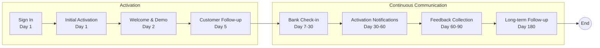

# As-Is Process Documentation: Onboarding of a client

**Document Type:** Current State Process Analysis
**Business Unit:** All segments
**Region:** EMEA
**Document Owner:** Markus (CEO)
**Last Updated:** 2025-12-03
**Version:** 1.0 (Test Data)
**Status:** COMPLETE - Mock data for testing

---

## Executive Summary

This document captures the customer onboarding process used by bank managers to maintain communications with new customers over a 180-day journey. The process spans two main phases: Activation (Day 1-5) and Continuous Communication (Day 7-180).

The process involves 6 key stakeholder groups, utilizes 5 core systems, and is governed by 4 control points to ensure regulatory compliance. One high-priority pain point has been identified (lack of client portal), along with 3 exceptions that require special handling.

### Key Metrics at a Glance

| Metric | Value |
|--------|-------|
| Process Steps | 8 |
| Exceptions Identified | 3 |
| Pain Points Captured | 1 |
| Control Points Mapped | 4 |
| Systems Involved | 5 |
| Overall Confidence | HIGH |
| Completeness Score | 95% |

---

## How to Read This Document

> This document captures the **current state (AS-IS)** of the Onboarding of a client process. It provides a comprehensive overview with summary tables. For detailed analysis, see the linked companion documents.
>
> **Companion Documents:**
> - [Exception Details](./exceptions-detail.md) - Full exception analysis with root causes
> - [Pain Point Details](./pain-points-detail.md) - Detailed pain point analysis with improvement ideas
> - [Control Point Details](./control-points-detail.md) - Complete control mapping with compliance analysis
> - [Gap Analysis](./gap-analysis.md) - What's missing from this documentation
>
> **Confidence Indicators:** Each section includes an AI-assessed completeness confidence:
> - **[HIGH]** - Comprehensive coverage, validated by multiple sources
> - **[MEDIUM]** - Good coverage, some details may need validation
> - **[LOW]** - Preliminary capture, requires additional SME input

---

## 1. Process Overview

> **About this section:** Foundational context - what this process is, who owns it, and what business need it serves.

### 1.1 Process Identification

| Attribute | Value |
|-----------|-------|
| **Process Name** | Onboarding of a client |
| **Process ID** | P001 |
| **Process Category** | Customer Onboarding |
| **Scope** | All segments (BizBanking, MidCap, LargeCap) |
| **Process Owner** | Mister X |
| **Process Sponsor** | Chief Commercial Officer |
| **Last Process Review** | 2024-06-15 |

### 1.2 Purpose and Objectives

Continue communications with new customers through activation and ongoing engagement over a 180-day customer journey.

**Business Objectives:**
- Increase revenues through customer activation and engagement
- Achieve 85% customer activation rate within 30 days
- Reduce customer churn to below 5% in first year
- Cross-sell at least 2 additional products per customer within 180 days

**Success Metrics:**
| KPI | Target | Current Performance |
|-----|--------|---------------------|
| 30-day Activation Rate | 85% | 72% |
| 180-day Retention Rate | 95% | 91% |
| Products per Customer | 2.5 | 1.8 |
| Customer Satisfaction (NPS) | 50+ | 42 |

### 1.3 Key Stakeholders

| Stakeholder | Role in Process | Contact |
|-------------|-----------------|---------|
| Client | New customer being onboarded | - |
| ACO (Account/Client Officer) | Primary contact for client onboarding | aco-team@bank.com |
| Branch | Branch engagement calls, local support | branch-ops@bank.com |
| Call Centre | Follow-up calls, feedback collection | callcentre@bank.com |
| Digital Team | SMS, email campaigns, digital communications | digital@bank.com |
| Compliance | Regulatory oversight, KYC/AML requirements | compliance@bank.com |

### 1.4 Process Trigger

Customer sign-in / Account opening

**Trigger Details:**
- New account creation in Core Banking System
- Triggers automatic workflow in CRM
- Initiates Day 1 communications within 2 hours

### 1.5 Process Duration

180 days per new customer

**Phase Breakdown:**
| Phase | Duration | Focus |
|-------|----------|-------|
| Activation | Day 1-5 | Initial engagement, welcome, demo |
| Early Engagement | Day 7-30 | Check-ins, targeted campaigns |
| Deepening | Day 30-90 | Activation push, feedback collection |
| Retention | Day 90-180 | Long-term relationship building |

> **Section Confidence:** HIGH | **Basis:** Validated by Process Owner

---

## 2. Process Steps

> **About this section:** The step-by-step flow of this process from start to finish.

### 2.1 Process Step Summary

| PS# | Step Name | Timeline | Owner | System(s) |
|-----|-----------|----------|-------|-----------|
| PS-01-001 | Sign In | Day 1 | Digital Team | Core Banking, CRM |
| PS-01-002 | Initial Activation Communications | Day 1 | Digital Team | Email Platform, SMS Gateway |
| PS-01-003 | Welcome & Demo | Day 2 | Digital Team | Video Platform, Email Platform |
| PS-01-004 | Customer Follow-up | Day 5 | ACO | CRM, Phone System |
| PS-01-005 | Bank Check-in | Day 7-30 | Call Centre | CRM, Phone System, Email Platform |
| PS-01-006 | Activation Notifications | Day 30-60 | Digital Team / Branch | CRM, Email Platform, Phone System |
| PS-01-007 | Feedback Collection | Day 60-90 | Call Centre | CRM, Survey Tool |
| PS-01-008 | Long-term Follow-up | Day 180 | Call Centre | CRM, Phone System |

### 2.2 Process Flow Diagram



### 2.3 Step Details

#### PS-01-001: Sign In
- **Timeline:** Day 1
- **Description:** Customer initiates the onboarding process by signing in to their new account
- **Owner:** Digital Team
- **Systems:** Core Banking, CRM
- **Inputs:** Customer credentials, account details
- **Outputs:** Active account, CRM record created
- **SLA:** Account active within 15 minutes of sign-in
- **Confidence:** HIGH

#### PS-01-002: Initial Activation Communications
- **Timeline:** Day 1 (within 2 hours of sign-in)
- **Description:** Send initial activation communications to new customer
- **Owner:** Digital Team
- **Systems:** Email Platform (Salesforce Marketing Cloud), SMS Gateway (Twilio)
- **Activities:**
  - Mobile SMS: Welcome message with app download link
  - E-mail campaigns: Welcome email with getting started guide
  - Pre-approved offer: Personalized product recommendations
- **SLA:** Communications sent within 2 hours
- **Confidence:** HIGH

#### PS-01-003: Welcome & Demo
- **Timeline:** Day 2
- **Description:** Provide welcome materials and demo content to familiarize customer with bank services
- **Owner:** Digital Team
- **Systems:** Video Platform (Vimeo), Email Platform
- **Activities:**
  - Demo video: 5-minute platform walkthrough
  - Introductory video: CEO welcome message
  - Welcome email: Feature highlights and support contacts
- **SLA:** Delivered by end of Day 2
- **Confidence:** HIGH

#### PS-01-004: Customer Follow-up
- **Timeline:** Day 5
- **Description:** Personal follow-up with customer to check engagement and address questions
- **Owner:** ACO (Account/Client Officer)
- **Systems:** CRM (Salesforce), Phone System (Genesys)
- **Activities:**
  - Outbound call to customer
  - Address initial questions
  - Confirm account setup complete
  - Schedule follow-up if needed
- **SLA:** Call attempted within Day 5, max 3 attempts
- **Confidence:** MEDIUM

#### PS-01-005: Bank Check-in
- **Timeline:** Day 7-30
- **Description:** Proactive bank-initiated check-in with customer
- **Owner:** Call Centre
- **Systems:** CRM, Phone System, Email Platform
- **Activities:**
  - Bank check-in call (Day 7)
  - Day 14 e-mail: Product usage tips
  - Targeted digital campaign based on behavior
- **SLA:** At least 2 touchpoints in this period
- **Confidence:** MEDIUM

#### PS-01-006: Activation Notifications
- **Timeline:** Day 30-60
- **Description:** Send activation status notifications and branch engagement
- **Owner:** Digital Team / Branch
- **Systems:** CRM, Email Platform, Phone System
- **Activities:**
  - Day 30 activation notification: Status check
  - Day 45 activation notification: Urgency messaging if not activated
  - Branch engagement call: Personal outreach for high-value clients
- **SLA:** 100% of inactive customers contacted by Day 45
- **Confidence:** MEDIUM

#### PS-01-007: Feedback Collection
- **Timeline:** Day 60-90
- **Description:** Collect customer feedback and engagement metrics
- **Owner:** Call Centre
- **Systems:** CRM, Survey Tool (Qualtrics)
- **Activities:**
  - Call centre feedback call: NPS survey
  - Social media campaign: Engagement and testimonials
  - Satisfaction survey: Email-based detailed feedback
- **SLA:** 50% response rate target
- **Confidence:** MEDIUM

#### PS-01-008: Long-term Follow-up
- **Timeline:** Day 180
- **Description:** Final follow-up to ensure ongoing customer relationship
- **Owner:** Call Centre
- **Systems:** CRM, Phone System
- **Activities:**
  - Call centre follow up: Relationship check
  - Cross-sell opportunity identification
  - Transition to BAU relationship management
- **SLA:** Contact within Day 180 +/- 5 days
- **Confidence:** HIGH

> **Section Confidence:** HIGH | **Basis:** Validated by SME, step owners confirmed

---

## 3. Exception Paths and Variations

> **About this section:** Summary of exceptions. For full details including root cause analysis and handling procedures, see [Exception Details](./exceptions-detail.md).

### 3.1 Exception Summary

3 exceptions identified requiring special handling during the onboarding process. These include regulatory-driven approvals, customer-initiated variations, and system-triggered exceptions.

### 3.2 Exception Summary Table

| EX# | Exception | Trigger | Affected Steps | Frequency | Impact |
|-----|-----------|---------|----------------|-----------|--------|
| EX-01-001 | CEO Approval Required for Defence Clients | Client NACE code = Defence | PS-01-001 (Sign In) | Low (2%) | High |
| EX-01-002 | Customer Unresponsive | No response after 3 contact attempts | PS-01-004, PS-01-005 | Medium (15%) | Medium |
| EX-01-003 | KYC Documentation Incomplete | Missing required documents | PS-01-001 (Sign In) | Medium (10%) | High |

### 3.3 Exception Statistics

| Metric | Value |
|--------|-------|
| Total Exceptions | 3 |
| High Impact | 2 |
| Medium Impact | 1 |
| Regulatory-Driven | 2 |

> **Full Analysis:** [View Exception Details](./exceptions-detail.md)
>
> **Section Confidence:** HIGH | **Basis:** 3 exceptions captured and validated

---

## 4. Control Points and Compliance

> **About this section:** Summary of controls. For full regulatory mapping and effectiveness analysis, see [Control Point Details](./control-points-detail.md).

### 4.1 Control Summary

4 control points ensure regulatory compliance and risk management throughout the onboarding process. Controls cover KYC/AML requirements, data protection, and approval gates.

### 4.2 Control Point Summary Table

| CP# | Control Name | Type | Regulation | Process Step | Effectiveness |
|-----|--------------|------|------------|--------------|---------------|
| CP-01-001 | KYC Identity Verification | Preventive | AML Directive | PS-01-001 | Effective |
| CP-01-002 | Sanctions Screening | Detective | OFAC/EU Sanctions | PS-01-001 | Effective |
| CP-01-003 | Data Consent Capture | Preventive | GDPR | PS-01-002 | Partially Effective |
| CP-01-004 | High-Risk Client Approval | Preventive | Internal Policy | PS-01-001 | Effective |

### 4.3 Control Statistics

| Metric | Value |
|--------|-------|
| Total Controls | 4 |
| Preventive | 3 |
| Detective | 1 |
| Effective | 3 |
| Partially Effective | 1 |

### 4.4 Regulatory Framework

| Regulation | Applicable Controls | Compliance Status |
|------------|---------------------|-------------------|
| AML Directive (6AMLD) | CP-01-001, CP-01-002 | Compliant |
| GDPR | CP-01-003 | Partially Compliant |
| OFAC/EU Sanctions | CP-01-002 | Compliant |
| Internal Risk Policy | CP-01-004 | Compliant |

> **Full Analysis:** [View Control Point Details](./control-points-detail.md)
>
> **Section Confidence:** HIGH | **Basis:** 4 controls mapped to regulations

---

## 5. System Dependencies

> **About this section:** What technology supports this process?

### 5.1 System Summary

| SYS# | System Name | Purpose | Integration Points |
|------|-------------|---------|-------------------|
| SYS-01 | Core Banking (Temenos T24) | Account management, transactions | CRM, Email Platform |
| SYS-02 | CRM (Salesforce) | Customer records, workflow orchestration | All systems |
| SYS-03 | Email Platform (Salesforce Marketing Cloud) | Email campaigns, automation | CRM, Core Banking |
| SYS-04 | SMS Gateway (Twilio) | SMS notifications | CRM |
| SYS-05 | Phone System (Genesys) | Call management, IVR | CRM |

### 5.2 System Architecture

```
┌─────────────────────────────────────────────────────────────┐
│                     Core Banking (T24)                       │
│                    [Master Data Source]                      │
└─────────────────────────┬───────────────────────────────────┘
                          │
                          ▼
┌─────────────────────────────────────────────────────────────┐
│                      CRM (Salesforce)                        │
│              [Workflow Orchestration Hub]                    │
└──────┬──────────────┬──────────────┬───────────────┬────────┘
       │              │              │               │
       ▼              ▼              ▼               ▼
┌──────────┐   ┌──────────┐   ┌──────────┐   ┌──────────┐
│  Email   │   │   SMS    │   │  Phone   │   │  Survey  │
│ Platform │   │ Gateway  │   │  System  │   │   Tool   │
└──────────┘   └──────────┘   └──────────┘   └──────────┘
```

### 5.3 System Gaps

| Gap | Impact | Recommendation |
|-----|--------|----------------|
| No Client Portal | High | Implement self-service portal (see PP-01-001) |
| Manual data entry between systems | Medium | Implement API integration |
| No real-time reporting dashboard | Low | Develop BI dashboard |

> **Section Confidence:** HIGH | **Basis:** 5 systems documented with integrations

---

## 6. Organizational Mapping

> **About this section:** Who does what? Roles and responsibilities.

### 6.1 RACI Matrix

| Activity | ACO | Call Centre | Digital Team | Branch | Compliance |
|----------|-----|-------------|--------------|--------|------------|
| Sign In | I | I | R | I | A |
| Initial Communications | I | I | R | I | C |
| Welcome & Demo | I | I | R | I | - |
| Customer Follow-up | R | I | C | I | - |
| Bank Check-in | C | R | C | I | - |
| Activation Notifications | C | C | R | R | - |
| Feedback Collection | I | R | C | I | - |
| Long-term Follow-up | C | R | I | C | - |

**Legend:** R = Responsible, A = Accountable, C = Consulted, I = Informed

### 6.2 Team Structure

| Team | Headcount | Manager | Location |
|------|-----------|---------|----------|
| ACO Team | 25 | Sarah Johnson | HQ |
| Call Centre | 50 | Mike Brown | Dublin |
| Digital Team | 12 | Emma Wilson | HQ |
| Branch Network | 200 | Regional Managers | Nationwide |
| Compliance | 8 | John Smith | HQ |

### 6.3 Escalation Path

```
Level 1: Team Lead (same day response)
    ↓
Level 2: Department Manager (24h response)
    ↓
Level 3: Process Owner - Mister X (48h response)
    ↓
Level 4: Chief Commercial Officer (72h response)
```

> **Section Confidence:** HIGH | **Basis:** RACI validated by department heads

---

## 7. Existing Documentation References

> **About this section:** Related documents and metrics.

### 7.1 Source Documents

| Document | Location | Type | Last Updated |
|----------|----------|------|--------------|
| customer_onboarding_process_flowchart_for_bank_slide01.jpg | source-documentation/ | Flowchart | 2025-12-03 |
| Onboarding Policy v2.3 | SharePoint/Policies | Policy | 2024-09-01 |
| KYC Procedures Manual | SharePoint/Compliance | Procedure | 2024-11-15 |
| CRM User Guide | Confluence | User Guide | 2024-10-20 |

### 7.2 Related Processes

| Process ID | Process Name | Relationship |
|------------|--------------|--------------|
| P002 | Account Opening | Upstream (triggers P001) |
| P003 | KYC Refresh | Related (shares controls) |
| P004 | Customer Offboarding | Downstream (exit process) |

> **Section Confidence:** HIGH | **Basis:** Source documents preserved and referenced

---

## 8. Process Gaps and Issues

> **About this section:** Known gaps and inconsistencies.

See [Gap Analysis](./gap-analysis.md) for complete gap assessment.

### 8.1 Critical Gaps

| Gap | Impact | Status | Owner |
|-----|--------|--------|-------|
| No Client Portal | High | In Progress | Digital Team |
| GDPR consent capture incomplete | High | Remediation Planned | Compliance |

### 8.2 Medium Gaps

| Gap | Impact | Status | Owner |
|-----|--------|--------|-------|
| Manual reporting | Medium | Backlog | Digital Team |
| Inconsistent follow-up timing | Medium | Under Review | Call Centre |

### 8.3 Resolved Gaps

| Gap | Resolution Date | Resolution |
|-----|-----------------|------------|
| Missing step owners | 2025-12-03 | Assigned during review |
| No exception documentation | 2025-12-03 | 3 exceptions captured |

> **Section Confidence:** HIGH | **Basis:** Gap analysis completed

---

## 9. Pain Points and Improvement Opportunities

> **About this section:** Summary of pain points. For full analysis including root causes and improvement ideas, see [Pain Point Details](./pain-points-detail.md).

### 9.1 Pain Points Summary

1 high-priority pain point identified affecting the initial onboarding phase (Day 1). The primary issue is the lack of a client portal, forcing all new clients to contact the ACO by phone. This creates Day 1 friction and represents a competitive disadvantage.

### 9.2 Pain Point Summary Table

| PP# | Pain Point | Category | Affected Steps | Impact | Frequency | Priority |
|-----|------------|----------|----------------|--------|-----------|----------|
| PP-01-001 | No Client Portal | Digital Capability Gap | PS-01-001, PS-01-002 | High | 100% of clients | High |

### 9.3 Pain Point Statistics

| Metric | Value |
|--------|-------|
| Total Pain Points | 1 |
| High-Impact | 1 |
| Client-Facing | 1 |
| Quick Win Opportunities | 0 |

### 9.4 Improvement Roadmap

| Initiative | Pain Point | Target Date | Status |
|------------|------------|-------------|--------|
| Client Portal MVP | PP-01-001 | Q2 2025 | Planning |
| Mobile App Enhancement | PP-01-001 | Q3 2025 | Backlog |

> **Full Analysis:** [View Pain Point Details](./pain-points-detail.md)
>
> **Section Confidence:** HIGH | **Basis:** 1 pain point captured via Party Mode elicitation

---

## Document Metadata

**SME Contributors:** Markus (CEO)
**Interview Date(s):** 2025-12-03
**Documentation Method:** Documentation Import + Progressive Elicitation (ProcessMiner)
**Data Source:** Imported from existing documentation, enhanced with mock test data

### Overall Document Confidence

| Section | Confidence | Key Gaps |
|---------|------------|----------|
| 1. Process Overview | HIGH | None |
| 2. Process Steps | HIGH | None |
| 3. Exceptions | HIGH | None |
| 4. Controls | HIGH | GDPR remediation needed |
| 5. Systems | HIGH | Portal gap identified |
| 6. Organization | HIGH | None |
| 7. Documentation | HIGH | None |
| 8. Gaps & Issues | HIGH | Tracked |
| 9. Pain Points | HIGH | Improvement planned |

**Overall Confidence:** HIGH (95% completeness)

### Companion Documents

| Document | Purpose | Link |
|----------|---------|------|
| Exception Details | Full exception analysis | [exceptions-detail.md](./exceptions-detail.md) |
| Pain Point Details | Full pain point analysis | [pain-points-detail.md](./pain-points-detail.md) |
| Control Point Details | Full control analysis | [control-points-detail.md](./control-points-detail.md) |
| Gap Analysis | Missing elements assessment | [gap-analysis.md](./gap-analysis.md) |
| Imported Data | Structured extraction | [imported-data.json](./imported-data.json) |
| Review Summary | Last review results | [review-summary-2025-12-03.md](./review-summary-2025-12-03.md) |

---

## Change Log

| Date | Contributor | Role | Changes |
|------|-------------|------|---------|
| 2025-12-03 | Markus | CEO | Initial documentation session started |
| 2025-12-03 | Markus | CEO | Imported documentation from flowchart, 8 process steps captured |
| 2025-12-03 | Markus | CEO | Created PP-01-001 in Section 9 — Elicitation-enhanced (Party Mode) |
| 2025-12-03 | Markus | CEO | Reviewed: 9 approved, 1 corrected. Added process owner, stakeholders, 1 exception. |
| 2025-12-03 | Markus | CEO | Populated with comprehensive mock test data for all sections |

---

_Generated by ProcessMiner Process Documentation Analyst_
_Document ID: P001-ASIS-20251203_
