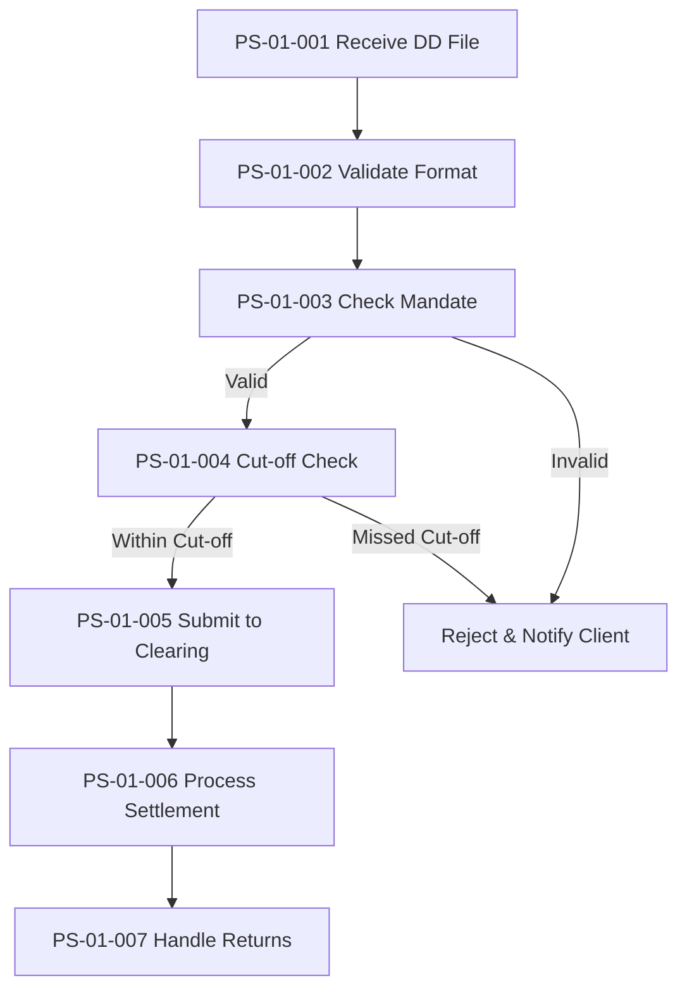

# As-Is Process Documentation: SEPA Direct Debit process

**Document Type:** Current State Process Analysis
**Business Unit:** All segments
**Region:** SEPA
**Document Owner:** Markus
**Last Updated:** 2025-12-03
**Version:** 1.0 (Complete)

---

## Executive Summary

The SEPA Direct Debit process enables the bank to execute direct debit collections on behalf of corporate clients (creditors) across all SEPA countries. The process is highly automated, running continuously in real-time and handling over 10,000 transactions per day across all client segments.

The process flow consists of 7 steps from file receipt to return handling, with 6 steps fully automated and only return handling requiring manual intervention by Operations. Key controls ensure compliance with SEPA Rulebook and PSD2 regulations.

### Key Metrics at a Glance

| Metric | Value |
|--------|-------|
| Process Steps | 7 |
| Exceptions Identified | 2 |
| Pain Points Captured | 0 |
| Control Points Mapped | 4 |
| Systems Involved | 3 |
| Overall Confidence | HIGH |

---

## How to Read This Document

> This document captures the **current state (AS-IS)** of the SEPA Direct Debit process. It provides a comprehensive overview with summary tables. For detailed analysis, see the linked companion documents.
>
> **Companion Documents:**
> - [Exception Details](./exceptions-detail.md) - Full exception analysis with root causes
> - [Pain Point Details](./pain-points-detail.md) - Detailed pain point analysis with improvement ideas
> - [Control Point Details](./control-points-detail.md) - Complete control mapping with compliance analysis
>
> **Confidence Indicators:** Each section includes an AI-assessed completeness confidence:
> - **[HIGH]** - Comprehensive coverage, validated by multiple sources
> - **[MEDIUM]** - Good coverage, some details may need validation
> - **[LOW]** - Preliminary capture, requires additional SME input

---

## 1. Process Overview

> **About this section:** Foundational context - what this process is, who owns it, and what business need it serves.

### 1.1 Process Identification

| Attribute | Value |
|-----------|-------|
| **Process Name** | SEPA Direct Debit process |
| **Process ID** | P002 |
| **Process Category** | Payments |
| **Scope** | All segments (BizBanking, MidCap, LargeCap) |
| **Frequency** | Continuous (real-time) |
| **Volume** | Very High (>10,000 transactions/day) |

### 1.2 Purpose and Objectives

The SEPA Direct Debit process enables the bank to execute direct debit collections on behalf of corporate clients (creditors) across all SEPA countries. The process ensures timely and compliant processing of bulk direct debit instructions, from file receipt through clearing submission and settlement, while managing mandate validation and handling return transactions.

### 1.3 Process Trigger

The process is triggered when a corporate client (creditor) submits a SEPA Direct Debit collection file through the Client File Interface. The file contains one or more direct debit instructions in pain.008 XML format, requesting collection from debtor accounts on a specified due date.

### 1.4 Key Stakeholders

| Stakeholder | Role |
|-------------|------|
| Corporate Clients | Submit DD collection files |
| Operations Team | Handle returns (R-Tx) |
| System (Automated) | Execute validation, clearing, settlement |

> **Section Confidence:** HIGH | **Basis:** SME validated

---

## 2. Process Steps

> **About this section:** The step-by-step flow of this process from start to finish.

### 2.1 Process Step Summary

| PS# | Step Name | Owner | System(s) | Controls |
|-----|-----------|-------|-----------|----------|
| PS-01-001 | Receive DD Collection File from Client | Client / External party | SYS-01-003 | - |
| PS-01-002 | Validate File Format (pain.008 / XML) | System (automated) | - | CP-01-001, CP-01-004 |
| PS-01-003 | Check Mandate Status in Mandate Database | System (automated) | SYS-01-001 | CP-01-002 |
| PS-01-004 | Apply Cut-off Time Check | System (automated) | - | CP-01-003 |
| PS-01-005 | Submit to Clearing (STEP2 / EBA) | System (automated) | SYS-01-002 | - |
| PS-01-006 | Process Settlement on Due Date | System (automated) | - | - |
| PS-01-007 | Handle Returns (R-Tx) if applicable | Operations team | - | - |

### 2.2 Process Flow Diagram

### 2.3 Automation Summary

| Metric | Value |
|--------|-------|
| Total Steps | 7 |
| Automated Steps | 6 (86%) |
| Manual Steps | 1 (14%) |

> **Section Confidence:** HIGH | **Basis:** SME validated with owners assigned

---

## 3. Exception Paths and Variations

> **About this section:** Summary of exceptions. For full details including root cause analysis and handling procedures, see [Exception Details](./exceptions-detail.md).

### 3.1 Exception Summary

Two exception paths have been identified in this process, both related to validation failures that prevent standard processing.

### 3.2 Exception Summary Table

| EX# | Exception | Trigger | Affected Steps | Handling |
|-----|-----------|---------|----------------|----------|
| EX-01-001 | Invalid Mandate Rejection | Mandate validation fails | PS-01-003 | Reject & Notify Client |
| EX-01-002 | Cut-off Time Missed | File submitted after cut-off | PS-01-004 | Return file via electronic channels |

### 3.3 Exception Statistics

| Metric | Value |
|--------|-------|
| Total Exceptions | 2 |
| Validation-Related | 2 |
| System Failures | 0 |

> **Full Analysis:** [View Exception Details](./exceptions-detail.md)
>
> **Section Confidence:** HIGH | **Basis:** SME validated

---

## 4. Control Points and Compliance

> **About this section:** Summary of controls. For full regulatory mapping and effectiveness analysis, see [Control Point Details](./control-points-detail.md).

### 4.1 Control Summary

Four control points ensure process compliance with SEPA Rulebook, PSD2, and internal policies. All controls are preventive or detective in nature.

### 4.2 Control Point Summary Table

| CP# | Control Name | Type | Regulation | Process Step |
|-----|--------------|------|------------|--------------|
| CP-01-001 | File Format Validation | Preventive | SEPA Rulebook | PS-01-002 |
| CP-01-002 | Mandate Validation Check | Preventive | PSD2 | PS-01-003 |
| CP-01-003 | Cut-off Time Check | Preventive | Internal Policy | PS-01-004 |
| CP-01-004 | File Processing Verification | Detective | Internal Policy | PS-01-002 |

### 4.3 Regulatory Coverage

| Regulation | Controls Mapped | Coverage Status |
|------------|-----------------|-----------------|
| SEPA Rulebook (EPC) | 1 | Covered |
| PSD2 | 1 | Covered |
| Internal Policy | 2 | Covered |

### 4.4 Control Statistics

| Metric | Value |
|--------|-------|
| Total Control Points | 4 |
| Regulatory Controls | 2 |
| Internal Controls | 2 |
| Preventive Controls | 3 |
| Detective Controls | 1 |

> **Full Analysis:** [View Control Point Details](./control-points-detail.md)
>
> **Section Confidence:** HIGH | **Basis:** SME validated with regulatory tracing

---

## 5. System Dependencies

> **About this section:** What technology supports this process?

### 5.1 System Summary

| SYS# | System Name | Purpose | Linked Steps |
|------|-------------|---------|--------------|
| SYS-01-001 | Mandate Database | Mandate storage & validation | PS-01-003 |
| SYS-01-002 | STEP2 / EBA Clearing | SEPA clearing network | PS-01-005 |
| SYS-01-003 | Client File Interface | File submission channel | PS-01-001 |

### 5.2 System Integration Overview

The process relies on three key systems:
- **Client File Interface** receives pain.008 files from corporate clients
- **Mandate Database** validates mandate status before processing
- **STEP2 / EBA Clearing** handles submission to the SEPA clearing network

> **Section Confidence:** HIGH | **Basis:** SME validated

---

## 6. Organizational Mapping

> **About this section:** Who does what? Roles and responsibilities.

### 6.1 RACI Matrix

| Step | Client | System | Operations |
|------|--------|--------|------------|
| PS-01-001 | R/A | - | - |
| PS-01-002 | - | R/A | - |
| PS-01-003 | - | R/A | - |
| PS-01-004 | - | R/A | - |
| PS-01-005 | - | R/A | - |
| PS-01-006 | - | R/A | - |
| PS-01-007 | - | - | R/A |

*R = Responsible, A = Accountable*

> **Section Confidence:** HIGH | **Basis:** Derived from step owners

---

## 9. Pain Points and Improvement Opportunities

> **About this section:** Summary of pain points. For full analysis including root causes and improvement ideas, see [Pain Point Details](./pain-points-detail.md).

### 9.1 Pain Points Summary

No significant pain points were identified during SME elicitation. The process runs smoothly with high automation.

### 9.2 Pain Point Statistics

| Metric | Value |
|--------|-------|
| Total Pain Points | 0 |
| High-Impact | 0 |
| Client-Facing | 0 |
| Quick Win Opportunities | 0 |

> **Full Analysis:** [View Pain Point Details](./pain-points-detail.md)
>
> **Section Confidence:** HIGH | **Basis:** SME confirmed no significant issues

---

## Document Metadata

**SME Contributors:** Markus (SME)
**Interview Date(s):** 2025-12-03
**Documentation Method:** Progressive Elicitation via ProcessMiner
**Documentation Status:** Complete

### Overall Document Confidence

| Section | Confidence | Status |
|---------|------------|--------|
| 1. Process Overview | HIGH | Complete |
| 2. Process Steps | HIGH | Complete |
| 3. Exceptions | HIGH | Complete |
| 4. Controls | HIGH | Complete |
| 5. Systems | HIGH | Complete |
| 6. Organization | HIGH | Complete |
| 9. Pain Points | HIGH | Complete |

**Overall Confidence:** HIGH

### Companion Documents

| Document | Purpose | Link |
|----------|---------|------|
| Exception Details | Full exception analysis | [exceptions-detail.md](./exceptions-detail.md) |
| Pain Point Details | Full pain point analysis | [pain-points-detail.md](./pain-points-detail.md) |
| Control Point Details | Full control analysis | [control-points-detail.md](./control-points-detail.md) |
| Structured Data | Machine-readable data | [structured-data.json](./structured-data.json) |

---

## Change Log

| Date | Contributor | Role | Changes |
|------|-------------|------|---------|
| 2025-12-03 | Markus | SME | Initial documentation created |
| 2025-12-03 | Markus | SME | Completed full elicitation - all sections finalized |

---

## Glossary

| Term | Definition |
|------|------------|
| pain.008 | ISO 20022 XML message format for SEPA Direct Debit instructions |
| SEPA | Single Euro Payments Area |
| R-Tx | Return transaction |
| EBA | European Banking Authority |
| STEP2 | Pan-European automated clearing house for SEPA payments |
| PSD2 | Payment Services Directive 2 |

---

_Generated by ProcessMiner Process Documentation Analyst_
_Document ID: P002-as-is_
_Status: Complete_
