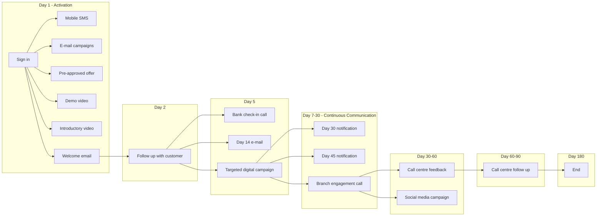

# As-Is Process Documentation: Onboarding for Corporate Clients

**Document Type:** Current State Process Analysis
**Process ID:** P003
**Client Segments:** All segments (BizBanking, MidCap, LargeCap)
**Document Owner:** Markus (CEO)
**Last Updated:** 2025-12-04
**Version:** 0.2 (Imported - Incomplete)
**Status:** SME Validated | Completeness: 40%

---

## Document Status

| Step | Status | Completed |
|------|--------|-----------|
| 1. Initialization | Complete | 2025-12-04 |
| 2. Existing Docs | Complete | 2025-12-04 |
| 3. Overview | Partial | 2025-12-04 |
| 4. Process Steps | Complete | 2025-12-04 |
| 5. Exceptions | [REQUIRES SME INPUT] | - |
| 6. Pain Points | [REQUIRES SME INPUT] | - |
| 7. Controls | [REQUIRES SME INPUT] | - |
| 8. Systems | Partial | 2025-12-04 |
| 9. Validation | Pending | - |

---

## Executive Summary

This document captures the current state (AS-IS) of the **Onboarding for Corporate Clients** process, which spans 180 days from customer sign-in to completion.

The process consists of two main phases:
1. **Activation Phase** (Day 1-5): Initial customer engagement through multiple channels
2. **Continuous Communication Phase** (Day 7-180): Ongoing engagement and follow-up

**Key Metrics at a Glance**

| Metric | Value |
|--------|-------|
| Process Steps | 18 |
| Exceptions Identified | 0 [REQUIRES SME INPUT] |
| Pain Points Captured | 0 [REQUIRES SME INPUT] |
| Control Points Mapped | 0 [REQUIRES SME INPUT] |
| Systems Involved | 5 [MEDIUM - Names inferred] |
| Overall Confidence | 40% (Incomplete) |

---

## How to Read This Document

> This document captures the **current state (AS-IS)** of the Onboarding for Corporate Clients process. It was imported from existing documentation and requires SME input to complete.
>
> **Companion Documents:**
> - [Exception Details](./exceptions-detail.md) - Full exception analysis
> - [Pain Point Details](./pain-points-detail.md) - Detailed pain point analysis
> - [Control Point Details](./control-points-detail.md) - Complete control mapping
>
> **Confidence Indicators:**
> - **[HIGH]** - Comprehensive coverage, validated
> - **[MEDIUM]** - Good coverage, some details may need validation
> - **[LOW]** - Preliminary capture, requires SME input
> - **[REQUIRES SME INPUT]** - Missing data

---

## 1. Process Overview

> **Section Confidence:** MEDIUM

### 1.1 Process Identification

| Attribute | Value |
|-----------|-------|
| **Process Name** | Onboarding for Corporate Clients |
| **Process ID** | P003 |
| **Process Category** | [REQUIRES SME INPUT] |
| **Scope** | All segments (BizBanking, MidCap, LargeCap) |
| **Process Owner** | [REQUIRES SME INPUT] |

### 1.2 Purpose and Trigger

**Purpose:** Continue communications with new customers through activation and continuous communication phases.

**Trigger:** [REQUIRES SME INPUT]

### 1.3 Operational Characteristics

**Frequency:** [REQUIRES SME INPUT]

**Volume:** [REQUIRES SME INPUT]

### 1.4 Key Stakeholders

| Role | Responsibility |
|------|----------------|
| Bank Manager | Continue communications with new customers |
| Call Centre Staff | Phone-based follow-up activities |
| Branch Staff | Branch engagement calls |

---

## 2. Process Steps

> **Section Confidence:** HIGH (85%)

### 2.1 Process Step Summary

| PS# | Step Name | Day | Phase | Owner | System(s) |
|-----|-----------|-----|-------|-------|-----------|
| PS-01-001 | Sign in | Day 1 | Activation | [REQUIRES SME INPUT] | - |
| PS-01-002 | Mobile SMS | Day 1 | Activation | [REQUIRES SME INPUT] | SMS Platform |
| PS-01-003 | E-mail campaigns | Day 1 | Activation | [REQUIRES SME INPUT] | Email System |
| PS-01-004 | Pre-approved offer | Day 1 | Activation | [REQUIRES SME INPUT] | - |
| PS-01-005 | Demo video and presentation | Day 1 | Activation | [REQUIRES SME INPUT] | Video Platform |
| PS-01-006 | Introductory video | Day 1 | Activation | [REQUIRES SME INPUT] | Video Platform |
| PS-01-007 | Welcome email | Day 1 | Activation | [REQUIRES SME INPUT] | Email System |
| PS-01-008 | Follow up with customer | Day 2 | Activation | [REQUIRES SME INPUT] | - |
| PS-01-009 | Bank check-in call | Day 5 | Activation | [REQUIRES SME INPUT] | Call Centre System |
| PS-01-010 | Day 14 e-mail | Day 5 | Activation | [REQUIRES SME INPUT] | Email System |
| PS-01-011 | Targeted digital campaign | Day 5 | Activation | [REQUIRES SME INPUT] | - |
| PS-01-012 | Day 30 activation notification | Day 7-30 | Continuous Comm | [REQUIRES SME INPUT] | - |
| PS-01-013 | Day 45 activation notification | Day 7-30 | Continuous Comm | [REQUIRES SME INPUT] | - |
| PS-01-014 | Branch engagement call | Day 7-30 | Continuous Comm | Branch Staff | Call Centre System |
| PS-01-015 | Call centre feedback call | Day 30-60 | Continuous Comm | Call Centre Staff | Call Centre System |
| PS-01-016 | Social media campaign | Day 30-60 | Continuous Comm | [REQUIRES SME INPUT] | Social Media Platform |
| PS-01-017 | Call centre follow up | Day 60-90 | Continuous Comm | Call Centre Staff | Call Centre System |
| PS-01-018 | End / Process Complete | Day 180 | Continuous Comm | [REQUIRES SME INPUT] | - |

### 2.2 Process Flow Diagram

---

## 3. Exception Paths and Variations

> **Section Confidence:** LOW - [REQUIRES SME INPUT]

*No exceptions were identified in the source documentation.*

> **Full Analysis:** [View Exception Details](./exceptions-detail.md)

---

## 4. Control Points and Compliance

> **Section Confidence:** LOW - [REQUIRES SME INPUT]

*No controls or compliance requirements were identified in the source documentation.*

**Note:** Corporate onboarding typically requires KYC, AML, and GDPR controls. These should be captured during SME elicitation.

> **Full Analysis:** [View Control Point Details](./control-points-detail.md)

---

## 5. System Dependencies

> **Section Confidence:** MEDIUM (60%)

### 5.1 System Summary

| SYS# | System Name | Purpose | Linked Steps |
|------|-------------|---------|--------------|
| SYS-01-001 | SMS Platform [MEDIUM] | Mobile SMS notifications | PS-01-002 |
| SYS-01-002 | Email System [MEDIUM] | Campaigns & transactional emails | PS-01-003, PS-01-007, PS-01-010 |
| SYS-01-003 | Video Platform [MEDIUM] | Demo/welcome videos | PS-01-005, PS-01-006 |
| SYS-01-004 | Call Centre System [MEDIUM] | Phone communications | PS-01-009, PS-01-014, PS-01-015, PS-01-017 |
| SYS-01-005 | Social Media Platform [MEDIUM] | Engagement campaigns | PS-01-016 |

*Note: System names are inferred from activities. Actual system names should be captured during SME elicitation.*

---

## 6. Pain Points and Improvement Opportunities

> **Section Confidence:** LOW - [REQUIRES SME INPUT]

*No pain points were identified in the source documentation.*

> **Full Analysis:** [View Pain Point Details](./pain-points-detail.md)

---

## 7. Process Gaps and Issues

> **Section Confidence:** HIGH

### 7.1 Identified Gaps

| Category | Gap Description | Priority |
|----------|-----------------|----------|
| Process Metadata | Business unit, process owner, trigger event missing | HIGH |
| Pain Points | No challenges or issues documented | HIGH |
| Controls | No compliance or control requirements identified | HIGH |
| Regulatory | KYC/AML for corporate onboarding not mentioned | HIGH |
| Volume/Frequency | Number of onboardings per period unknown | MEDIUM |
| Step Rationale | "Why" behind each step not documented | MEDIUM |

### 7.2 Items Needing SME Clarification

1. Corporate vs Retail: Is this process specific to corporate clients?
2. Day 14 Email: Referenced at Day 5 - is this scheduled for future?
3. Activation Notifications: What triggers Day 30/45 notifications?
4. End State: What defines successful onboarding completion at Day 180?
5. Pre-approved Offer: What offers? Who approves? What criteria?

---

## Document Metadata

**SME Contributors:** Markus (CEO)
**Import Date:** 2025-12-04
**Documentation Method:** AI-assisted extraction from flowchart

### Source Documentation

| Document | Format | Confidence |
|----------|--------|------------|
| customer_onboarding_process_flowchart_for_bank_slide01.jpg | Image/Flowchart | HIGH |

### Companion Documents

| Document | Purpose | Link |
|----------|---------|------|
| Exception Details | Full exception analysis | [exceptions-detail.md](./exceptions-detail.md) |
| Pain Point Details | Full pain point analysis | [pain-points-detail.md](./pain-points-detail.md) |
| Control Point Details | Full control analysis | [control-points-detail.md](./control-points-detail.md) |
| Gap Analysis | Import gap report | [gap-analysis.md](./gap-analysis.md) |
| Structured Data | Machine-readable data | [imported-data.json](./imported-data.json) |

---

## Change Log

| Date | Contributor | Role | Changes |
|------|-------------|------|---------|
| 2025-12-04 | Markus | CEO | Imported from flowchart, SME validated, accepted as-is (40% complete) |
| 2025-12-04 | Markus | CEO | Initial documentation - session initialized |

---

_Generated by ProcessMiner Process Documentation Analyst_
_Document ID: P003-DOC-001_
_Import Status: Incomplete - Requires SME Input_
