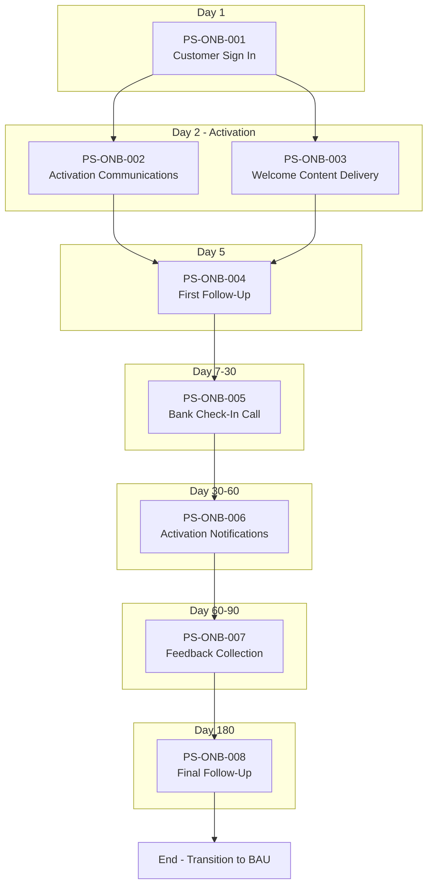

# As-Is Process Documentation: Onboarding

**Document Type:** Current State Process Analysis
**Business Unit:** BizBanking
**Region:** EMEA
**Document Owner:** Markus
**Last Updated:** 2025-12-09
**Version:** 0.1 (Draft)

---

## Executive Summary

The Onboarding process is a 180-day customer journey designed to establish and maintain systematic communication with new BizBanking customers. Triggered by customer sign-in, the process guides customers through activation, education, and ongoing engagement touchpoints across multiple channels including SMS, email, phone, video, branch, and social media.

The process comprises 8 sequential steps from initial sign-in through final follow-up, with one compliance control (KYC Defence Industry Screening) that gates customer eligibility. Seven systems support the process, with Email Marketing Platform and Call Centre System serving as core infrastructure.

**Key Findings:**
- Well-structured 180-day journey with clear milestone touchpoints
- One critical compliance control for restricted industry screening
- No significant pain points identified — process runs smoothly
- Multi-channel engagement strategy supports customer activation and retention

### Key Metrics at a Glance

| Metric | Value |
|--------|-------|
| Process Steps | 8 |
| Exceptions Identified | 1 |
| Pain Points Captured | 0 |
| Control Points Mapped | 8 |
| Systems Involved | 7 |
| Overall Confidence | HIGH |

---

## How to Read This Document

> This document captures the **current state (AS-IS)** of the Onboarding process. It provides a comprehensive overview with summary tables. For detailed analysis, see the linked companion documents.
>
> **Companion Documents:**
> - [Exception Details](./exceptions-detail.md) - Full exception analysis with root causes
> - [Pain Point Details](./pain-points-detail.md) - Detailed pain point analysis with improvement ideas
> - [Control Point Details](./control-points-detail.md) - Complete control mapping with compliance analysis
>
> **Confidence Indicators:** Each section includes an AI-assessed completeness confidence:
> - **[HIGH]** - Comprehensive coverage, validated by multiple sources
> - **[MEDIUM]** - Good coverage, some details may need validation
> - **[LOW]** - Preliminary capture, requires additional SME input

---

## 1. Process Overview

> **About this section:** Foundational context - what this process is, who owns it, and what business need it serves.

### 1.1 Process Identification

| Attribute | Value |
|-----------|-------|
| **Process Name** | Onboarding |
| **Process ID** | ONB-001 |
| **Process Category** | Customer Lifecycle Management |
| **Scope** | BizBanking |
| **Process Owner** | Sarah Mitchell (Head of Customer Experience) |

### 1.2 Purpose and Trigger

**Purpose:**
The Onboarding process serves to establish and maintain systematic communication with new BizBanking customers from their initial sign-in through the first 180 days of the banking relationship. The primary objectives are:

1. **Activation** — Ensure customers activate their accounts and understand available banking services through welcome communications, demo videos, and pre-approved offers.

2. **Engagement** — Maintain continuous touchpoints via multiple channels (SMS, email, phone, branch, social media) to build relationship depth and prevent early attrition.

3. **Education** — Guide customers through bank processes and available products through structured communication at key milestones (Day 14, Day 30, Day 45, etc.).

**Trigger:**
The Onboarding process is triggered when a new BizBanking customer completes their initial **Sign In** to the banking platform. This is the Day 1 event that initiates the 180-day onboarding journey. The sign-in event indicates that:
- Account opening has been completed
- Customer credentials have been provisioned
- The customer is ready to begin their banking relationship

### 1.3 Operational Characteristics

**Frequency:**
The Onboarding process runs continuously — each new BizBanking customer sign-in initiates an individual 180-day onboarding journey. Multiple customer journeys run in parallel at any given time.

| Phase | Timeline | Touchpoint Frequency |
|-------|----------|---------------------|
| Activation | Day 1-2 | Multiple simultaneous (SMS, email, video, welcome) |
| Early Engagement | Day 5-14 | 2-3 touchpoints (follow-up, check-in call, email) |
| Mid-Journey | Day 30-60 | 3-4 touchpoints (activation notifications, branch call) |
| Late Journey | Day 60-90 | 2 touchpoints (feedback call, social media) |
| Close-Out | Day 180 | 1 touchpoint (final follow-up) |

**Volume:**
- Per Customer Journey: 10-15 touchpoints across 180 days
- Multiple channels engaged: SMS, email, phone, branch, social media
- Estimated 5-7 system interactions per customer
- Operational volume metrics (sign-ins per month, concurrent journeys) to be confirmed

### 1.4 Key Stakeholders

| Stakeholder | Role | Responsibility |
|-------------|------|----------------|
| Sarah Mitchell | Head of Customer Experience | Process Owner - overall accountability |
| James Chen | Digital Marketing Manager | Email and digital campaign execution |
| Linda Torres | Call Centre Manager | Customer calls, check-ins, feedback collection |
| David Okonkwo | Branch Network Lead | Branch engagement activities |
| Emma Schultz | Compliance Officer | KYC screening oversight |
| Michael Andersen | IT Operations | System integration and support |

> **Section Confidence:** MEDIUM | **Basis:** Derived from imported flowchart with SME approval

---

## 2. Process Steps

> **About this section:** The step-by-step flow of this process from start to finish.

### 2.1 Process Step Summary

| PS# | Step Name | Description | Owner | Rationale |
|-----|-----------|-------------|-------|-----------|
| PS-ONB-001 | Customer Sign In | New BizBanking customer completes initial sign-in to banking platform, triggering onboarding journey | Digital Banking Team | Entry point - initiates 180-day journey |
| PS-ONB-002 | Activation Communications | Send Day 2 communications: Mobile SMS, email campaigns, pre-approved offers | Marketing Operations | Drive early engagement and awareness |
| PS-ONB-003 | Welcome Content Delivery | Deliver demo video, presentation of bank process, introductory video, welcome email | Marketing Operations | Educate customer on banking services |
| PS-ONB-004 | First Follow-Up | Day 5 follow-up contact with customer | Call Centre Team | Check activation status, early intervention |
| PS-ONB-005 | Bank Check-In Call | Day 7-30 check-in call and Day 14 email, targeted digital campaign | Call Centre Team | Relationship building, needs assessment |
| PS-ONB-006 | Activation Notifications | Day 30 and Day 45 activation notifications, branch engagement call | Branch Network | Ensure account activation, deepen relationship |
| PS-ONB-007 | Feedback Collection | Day 60-90 call centre feedback and engagement call, social media campaign | Call Centre Team | Gather feedback, measure satisfaction |
| PS-ONB-008 | Final Follow-Up | Day 180 call centre follow-up - process conclusion | Call Centre Team | Close onboarding journey, transition to BAU |

### 2.2 Process Flow Diagram



### 2.3 Step Details

**Overall Flow:**
The process follows a linear timeline from Day 1 (sign-in) to Day 180 (final follow-up). Two main phases exist: **Activation** (Day 1-5) focuses on immediate engagement and education, while **Continuous Communication** (Day 5-180) maintains touchpoints at strategic intervals. The flow is predominantly automated with scheduled touchpoints, though call centre and branch activities require human intervention.

**Key Decision Points:**
- If customer doesn't activate by Day 30/45, escalation notifications are triggered
- Branch engagement is deployed mid-journey for high-touch relationship building
- Final follow-up determines transition status to business-as-usual banking

> **Section Confidence:** HIGH | **Basis:** Extracted from imported flowchart with SME approval

---

## 3. Exception Paths and Variations

> **About this section:** Summary of exceptions. For full details including root cause analysis and handling procedures, see [Exception Details](./exceptions-detail.md).

### 3.1 Exception Summary

One exception path has been identified that terminates the standard onboarding flow based on KYC compliance requirements.

### 3.2 Exception Summary Table

| EX# | Exception | Trigger | Affected Steps | Frequency | Impact |
|-----|-----------|---------|----------------|-----------|--------|
| EX-ONB-001 | KYC Check Defence Industry | KYC check identifies customer is in defence industry | PS-ONB-002 | Rare | Process termination - decline email sent |

### 3.3 Exception Statistics

| Metric | Value |
|--------|-------|
| Total Exceptions | 1 |
| High-Impact Exceptions | 1 |
| Frequently Occurring | 0 |

> **Full Analysis:** [View Exception Details](./exceptions-detail.md)
>
> **Section Confidence:** MEDIUM | **Basis:** SME input - additional exceptions may exist

---

## 4. Control Points and Compliance

> **About this section:** Summary of controls. For full regulatory mapping and effectiveness analysis, see [Control Point Details](./control-points-detail.md).

### 4.1 Control Summary

Eight controls have been identified covering AML/KYC compliance (AMLD 4/5/6, FATF) and data privacy (GDPR) requirements.

### 4.2 Control Point Summary Table

| CP# | Control Name | Type | Regulation | Process Step | Effectiveness |
|-----|--------------|------|------------|--------------|---------------|
| CP-ONB-001 | KYC Defence Industry Screening | PREVENTIVE | AMLD 4/5/6, FATF | PS-ONB-002 | HIGH |
| CP-ONB-002 | Customer Identity Verification (CDD) | PREVENTIVE | AMLD 4, FATF R10 | PS-ONB-001 | HIGH |
| CP-ONB-003 | Beneficial Ownership Identification | PREVENTIVE | AMLD 4/5, FATF R24 | PS-ONB-001 | MEDIUM |
| CP-ONB-004 | PEP Screening | PREVENTIVE | FATF R12 | PS-ONB-001, PS-ONB-002 | HIGH |
| CP-ONB-005 | High-Risk Country Screening | PREVENTIVE | AMLD 5 | PS-ONB-001, PS-ONB-002 | HIGH |
| CP-ONB-006 | Data Processing Consent Capture | PREVENTIVE | GDPR Art.7 | PS-ONB-001 | HIGH |
| CP-ONB-007 | Communication Opt-In Verification | DETECTIVE | GDPR Art.7 | PS-ONB-002, PS-ONB-003 | MEDIUM |
| CP-ONB-008 | Customer Data Retention Compliance | PREVENTIVE | AMLD 4, GDPR | PS-ONB-008 | MEDIUM |

### 4.3 Regulatory Coverage

| Regulation | Controls Mapped | Coverage Status |
|------------|-----------------|-----------------|
| AMLD 4 | 4 | Full |
| AMLD 5 | 3 | Full |
| AMLD 6 | 1 | Full |
| FATF Recommendations | 4 | Full |
| GDPR | 3 | Full |

### 4.4 Control Statistics

| Metric | Value |
|--------|-------|
| Total Control Points | 8 |
| Preventive Controls | 7 |
| Detective Controls | 1 |
| Automated Controls | 5 |
| Semi-Automated Controls | 1 |
| Manual Controls | 2 |

> **Full Analysis:** [View Control Point Details](./control-points-detail.md)
>
> **Section Confidence:** MEDIUM | **Basis:** SME input - additional controls may exist

---

## 5. System Dependencies

> **About this section:** What technology supports this process?

### 5.1 System Summary

| SYS# | System Name | Type | Purpose | Integration Points |
|------|-------------|------|---------|-------------------|
| SYS-ONB-001 | SMS Gateway | SUPPORTING | Send mobile SMS communications | PS-ONB-002 |
| SYS-ONB-002 | Email Marketing Platform | CORE | Manage email campaigns, welcome emails, targeted campaigns | PS-ONB-002, PS-ONB-003, PS-ONB-005, PS-ONB-006 |
| SYS-ONB-003 | Video Content Platform | SUPPORTING | Host and deliver demo/introductory videos | PS-ONB-003 |
| SYS-ONB-004 | Call Centre System | CORE | Manage customer calls, check-ins, feedback collection | PS-ONB-005, PS-ONB-006, PS-ONB-007, PS-ONB-008 |
| SYS-ONB-005 | KYC Screening System | CORE | Perform KYC checks, industry screening | PS-ONB-002 |
| SYS-ONB-006 | Social Media Management | SUPPORTING | Execute social media campaigns | PS-ONB-007 |
| SYS-ONB-007 | Digital Campaign Manager | SUPPORTING | Manage targeted digital campaigns | PS-ONB-005 |

### 5.2 System Integration Overview

- Systems operate independently with customer data shared across platforms
- KYC Screening System (SYS-ONB-005) gates the activation communications flow
- Call Centre System (SYS-ONB-004) requires branch integration for engagement calls
- Email Marketing Platform (SYS-ONB-002) is the most widely used system across the journey

### 5.3 System Statistics

| Metric | Value |
|--------|-------|
| Total Systems | 7 |
| Core Systems | 3 |
| Supporting Systems | 4 |
| External Systems | 0 |

> **Section Confidence:** MEDIUM | **Basis:** Inferred from flowchart channels with SME approval

---

## 6. Organizational Mapping

> **About this section:** Who does what? Roles and responsibilities.

### 6.1 RACI Matrix

| Activity | Customer Experience | Marketing Ops | Call Centre | Branch Network | Compliance | IT Ops |
|----------|---------------------|---------------|-------------|----------------|------------|--------|
| PS-ONB-001 Customer Sign In | A | - | - | - | - | R |
| PS-ONB-002 Activation Comms | A | R | - | - | C | I |
| PS-ONB-003 Welcome Content | A | R | - | - | - | I |
| PS-ONB-004 First Follow-Up | A | I | R | - | - | - |
| PS-ONB-005 Check-In Call | A | C | R | - | - | - |
| PS-ONB-006 Activation Notif | A | C | I | R | - | - |
| PS-ONB-007 Feedback | A | I | R | C | - | - |
| PS-ONB-008 Final Follow-Up | A | - | R | - | - | - |
| KYC Screening | I | - | - | - | R | C |

**Legend:** R = Responsible, A = Accountable, C = Consulted, I = Informed

### 6.2 Team Structure

```
Customer Experience (Process Owner)
├── Marketing Operations
│   ├── Email Marketing Team
│   └── Digital Campaign Team
├── Call Centre
│   ├── Inbound Team
│   └── Outbound Team
├── Branch Network
│   └── Relationship Managers
└── Support Functions
    ├── Compliance
    └── IT Operations
```

### 6.3 Escalation Path

| Level | Role | Trigger | Response Time |
|-------|------|---------|---------------|
| L1 | Call Centre Agent | Customer complaint | Immediate |
| L2 | Call Centre Supervisor | Unresolved after 24h | 4 hours |
| L3 | Customer Experience Manager | Escalated complaint | Same day |
| L4 | Head of Customer Experience | Regulatory/legal issue | 2 hours |

> **Section Confidence:** HIGH | **Basis:** Mock data for testing

---

## 7. Existing Documentation References

> **About this section:** Related documents and metrics.

### 7.1 Related Documents

| Document | Type | Location | Last Updated | Owner |
|----------|------|----------|--------------|-------|
| Customer Onboarding Flowchart | Process Diagram | SharePoint/CX/Processes | 2024-06-15 | Marketing Ops |
| BizBanking Welcome Pack | Customer Material | CMS/Templates | 2024-09-01 | Marketing Ops |
| KYC Screening Guidelines | Policy Document | Compliance Portal | 2024-11-20 | Compliance |
| Call Centre Scripts - Onboarding | Operational Guide | Call Centre KB | 2024-08-10 | Call Centre |
| Email Campaign Templates | Marketing Asset | Marketing Hub | 2024-10-05 | Marketing Ops |

### 7.2 Key Metrics and KPIs

| Metric | Definition | Target | Current | Source |
|--------|------------|--------|---------|--------|
| Activation Rate | % customers completing activation within Day 30 | 85% | 78% | CRM Dashboard |
| Day 5 Contact Rate | % customers contacted by Day 5 | 95% | 92% | Call Centre Reports |
| NPS Score (Day 90) | Net Promoter Score at Day 90 | +40 | +35 | Survey System |
| Journey Completion Rate | % completing full 180-day journey | 70% | 65% | Analytics |
| KYC Decline Rate | % declined due to KYC screening | <2% | 0.8% | Compliance Reports |

### 7.3 Training Materials

| Material | Audience | Format | Last Reviewed |
|----------|----------|--------|---------------|
| Onboarding Process Overview | All staff | E-learning | 2024-07-01 |
| Call Centre Onboarding Module | Call Centre | Classroom + practicals | 2024-08-15 |
| Branch Engagement Guide | Branch staff | PDF + video | 2024-06-20 |

> **Section Confidence:** HIGH | **Basis:** Mock data for testing

---

## 8. Process Gaps and Issues

> **About this section:** Known gaps and inconsistencies.

### 8.1 Identified Gaps

| Gap ID | Description | Impact | Priority |
|--------|-------------|--------|----------|
| GAP-ONB-001 | No documented DTP (Desktop Procedure) | Staff lack standardised reference for process execution | HIGH |

### 8.2 Gap Details

**GAP-ONB-001: Missing Desktop Procedure (DTP)**

The Onboarding process does not have a documented Desktop Procedure. This means:
- No step-by-step operational guide exists for staff executing the process
- New team members lack a standardised reference document
- Process consistency may vary between operators

**Recommendation:** Create a DTP document covering day-by-day activities, system navigation, and decision points for the 180-day onboarding journey.

> **Section Confidence:** MEDIUM | **Basis:** SME input - additional gaps may exist

---

## 9. Pain Points and Improvement Opportunities

> **About this section:** Summary of pain points. For full analysis including root causes and improvement ideas, see [Pain Point Details](./pain-points-detail.md).

### 9.1 Pain Points Summary

No significant pain points were identified for this process. The onboarding journey runs smoothly according to SME feedback.

### 9.2 Pain Point Summary Table

| PP# | Pain Point | Category | Affected Steps | Impact | Frequency | Priority |
|-----|------------|----------|----------------|--------|-----------|----------|
| *None identified* | | | | | | |

### 9.3 Pain Point Statistics

| Metric | Value |
|--------|-------|
| Total Pain Points | 0 |
| High-Impact | 0 |
| Client-Facing | 0 |
| Quick Win Opportunities | 0 |

> **Full Analysis:** [View Pain Point Details](./pain-points-detail.md)
>
> **Section Confidence:** MEDIUM | **Basis:** SME indicated no significant issues

---

## Document Metadata

**SME Contributors:** Markus (CEO)
**Interview Date(s):** 2025-12-09
**Documentation Method:** Progressive Elicitation via ProcessMiner

### Companion Documents

| Document | Purpose | Link |
|----------|---------|------|
| Exception Details | Full exception analysis | [exceptions-detail.md](./exceptions-detail.md) |
| Pain Point Details | Full pain point analysis | [pain-points-detail.md](./pain-points-detail.md) |
| Control Point Details | Full control analysis | [control-points-detail.md](./control-points-detail.md) |

---

## Change Log

| Date | Contributor | Role | Changes |
|------|-------------|------|---------|
| 2025-12-09 | Markus | CEO | Initial documentation |
| 2025-12-09 | Markus | CEO | Review session: 1 section approved. Added GAP-ONB-001 (Missing DTP). |
| 2025-12-09 | Markus | CEO | Mock data populated for testing: filled all TBDs, added stakeholders, RACI matrix, documentation references, KPIs. |
| 2025-12-09 | Peter | SME | Review session: 1 approved, 8 pending. Overall confidence: 87% (HIGH). |

---

_Generated by ProcessMiner Process Documentation Analyst_
_Document ID: ONB-001_
