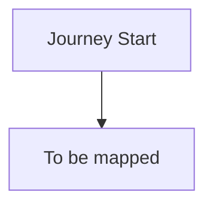

# Client Experience Journey: Onboarding

**Document Type:** Client Experience AS-IS Analysis
**Process ID:** ONB-001
**Business Unit:** BizBanking
**Client Segment:** All segments (general analysis)
**Analyst:** Markus
**Last Updated:** 2025-12-09
**Version:** 0.1 (Draft)

---

## Executive Summary

*To be completed during analysis*

### Key Metrics at a Glance

| Metric | Value |
|--------|-------|
| Journey Touchpoints | TBD |
| Friction Points Identified | TBD |
| Enhancement Ideas Captured | TBD |
| Client Effort Score (CES) | TBD |
| Moments That Matter | TBD |
| Channels Used | TBD |
| Overall Confidence | TBD |

### CES Baseline Summary

| Metric | Count | Weight | Weighted Score |
|--------|-------|--------|----------------|
| Client Actions | TBD | 1.0 | TBD |
| Documents Required | TBD | 1.5 | TBD |
| Information Requests | TBD | 1.0 | TBD |
| Follow-ups Required | TBD | 2.0 | TBD |
| Channel Switches | TBD | 1.5 | TBD |
| Active Time (minutes) | TBD | 0.5 | TBD |
| **TOTAL CES** | | | **TBD** |

---

## How to Read This Document

> This document captures the **client experience perspective (AS-IS)** of the Onboarding process. It maps the journey through client eyes, measuring effort and identifying friction.
>
> **Companion Documents:**
> - [Client Touchpoints Detail](./client-touchpoints-detail.md) - Full touchpoint analysis with CES contribution
> - [Friction Points Detail](./friction-points-detail.md) - Detailed friction analysis with enhancement ideas
> - [AS-IS Process Documentation](./as-is-process-documentation.md) - Operational process view
>
> **CES Interpretation:**
> - **Low CES (< 20)** - Excellent client experience, minimal effort
> - **Medium CES (20-40)** - Acceptable experience, improvement opportunities exist
> - **High CES (> 40)** - Poor experience, significant transformation required

---

## 1. Journey Overview

> **About this section:** What is this journey from the client's perspective? What outcome are they trying to achieve?

### 1.1 Journey Identification

| Attribute | Value |
|-----------|-------|
| **Journey Name** | Setting up my business banking |
| **Process ID** | ONB-001 |
| **Client Goal** | Get account set up as fast as possible |
| **Journey Trigger** | Starting a new business |
| **Success Outcome** | Receiving account details (client considers setup "done" at this point) |
| **Typical Duration** | TBD (Note: Bank sees 180-day journey; client sees it complete once they have account details) |

### 1.2 Client Persona

| Attribute | Value |
|-----------|-------|
| **Segment** | All segments (general analysis) |
| **Typical Profile** | Small SME companies, founder-led. Solo decision-makers who are time-poor and juggling everything themselves. |
| **Key Motivations** | Don't like hassle — want it simple, straightforward, no friction. Every extra step is a burden. |
| **Expected Experience** | Better service — expectations set by fintechs and modern digital experiences. Expect the bank to be better than what they've seen elsewhere. |

### 1.3 Journey Context

- **Client Type:** Mix of new and existing clients — some already familiar with the bank, others brand new
- **Time Pressure:** High urgency — they want to transact quickly. Every day without banking capability is a day they can't operate properly.
- **Emotional Stakes:** Critical business need — need the account working so they can start doing business
- **Alternatives:** Other banks, fintechs (clients have options and expect competitive experience)

> **Section Confidence:** HIGH | **Basis:** SME knowledge from direct client interaction

---

## 2. Client Touchpoints

> **About this section:** Every interaction point where the client engages with the bank. For full details including CES contribution and emotional analysis, see [Client Touchpoints Detail](./client-touchpoints-detail.md).

### 2.1 Touchpoint Summary

*To be captured during elicitation*

### 2.2 Touchpoint Summary Table

| JT# | Touchpoint Name | Stage | Channel | What Client SEES | What Client DOES | CES Contribution |
|-----|-----------------|-------|---------|------------------|------------------|------------------|
| *To be captured* | | | | | | |

### 2.3 Journey Flow Diagram

### 2.4 Touchpoint Statistics

| Metric | Value |
|--------|-------|
| Total Touchpoints | TBD |
| Digital Touchpoints | TBD |
| Human-Assisted Touchpoints | TBD |
| Self-Service Touchpoints | TBD |
| Wait Points | TBD |

> **Full Analysis:** [View Client Touchpoints Detail](./client-touchpoints-detail.md)
>
> **Section Confidence:** TBD | **Basis:** TBD

---

## 3. Moments That Matter

> **About this section:** Critical touchpoints that disproportionately define client perception. These must be protected or enhanced in any transformation.

### 3.1 Identified Moments

*To be captured during elicitation*

### 3.2 Moments Summary

| Moment | Touchpoint | Current State | Enhancement Priority |
|--------|-----------|---------------|---------------------|
| *To be captured* | | | |

> **Section Confidence:** TBD | **Basis:** TBD

---

## 4. Friction Point Analysis

> **About this section:** Summary of friction points. For full details including root cause analysis and enhancement ideas, see [Friction Points Detail](./friction-points-detail.md).

### 4.1 Friction Summary

*To be captured during elicitation*

### 4.2 Friction Point Summary Table

| FP# | Friction Point | Stage | Touchpoint | Severity | CES Impact | Client Emotion |
|-----|----------------|-------|------------|----------|------------|----------------|
| *To be captured* | | | | | | |

### 4.3 Friction by Type

| Friction Type | Count | Combined CES Impact | Priority Items |
|---------------|-------|---------------------|----------------|
| *To be captured* | | | |

### 4.4 Friction Statistics

| Metric | Value |
|--------|-------|
| Total Friction Points | TBD |
| High-Severity (P1) | TBD |
| Medium-Severity (P2) | TBD |
| Low-Severity (P3) | TBD |
| Quick Win Opportunities | TBD |

> **Full Analysis:** [View Friction Points Detail](./friction-points-detail.md)
>
> **Section Confidence:** TBD | **Basis:** TBD

---

## 5. Client Effort Score (CES) Analysis

> **About this section:** Quantified measurement of client effort across the journey. This is the baseline for transformation target comparison.

### 5.1 CES Breakdown by Stage

| Journey Stage | Actions | Documents | Info Requests | Follow-ups | Channel Switches | Wait Time | Stage CES |
|---------------|---------|-----------|---------------|------------|------------------|-----------|-----------|
| *To be captured* | | | | | | | |

### 5.2 CES Breakdown by Touchpoint

| Touchpoint | CES Contribution | % of Total | Reduction Priority |
|------------|------------------|------------|-------------------|
| *To be captured* | | | |

### 5.3 Benchmark Comparison

| Benchmark | Score | Our Gap |
|-----------|-------|---------|
| Industry Average | TBD | TBD |
| Best-in-Class | TBD | TBD |
| Internal Target | TBD | TBD |

### 5.4 CES Baseline Statement

> **CES BASELINE FOR TO-BE COMPARISON**
>
> This AS-IS CES score (**TBD**) establishes the baseline for transformation.
> During TO-BE design, this score will be compared against the target state to measure
> improvement. Industry standard for transformation projects is **30-40% CES reduction**.
>
> After the Transformation Agent designs the TO-BE state, the Client Journey Analyst
> will recalculate CES in **Flow 2 (Target Validation)** to verify improvements.

> **Section Confidence:** TBD | **Basis:** TBD

---

## 6. Channel Analysis

> **About this section:** How clients interact across different channels throughout the journey.

### 6.1 Channel Usage

| CH# | Channel | Touchpoints Using | Primary Purpose | Client Preference |
|-----|---------|-------------------|-----------------|-------------------|
| *To be captured* | | | | |

### 6.2 Channel Switching Analysis

*To be captured during elicitation*

### 6.3 Channel Gaps

*To be captured during elicitation*

> **Section Confidence:** TBD | **Basis:** TBD

---

## 7. Enhancement Ideas

> **About this section:** Captured enhancement ideas for TO-BE consideration. Prioritization will occur during transformation design.

### 7.1 Enhancement Catalog

| EI# | Target Friction | Enhancement Idea | Est. CES Reduction | Complexity | Priority |
|-----|-----------------|------------------|-------------------|------------|----------|
| *To be captured* | | | | | |

### 7.2 Enhancement Statistics

| Metric | Value |
|--------|-------|
| Total Enhancement Ideas | TBD |
| Quick Wins (Low Effort) | TBD |
| Strategic (High Effort) | TBD |
| Automation Opportunities | TBD |
| Total Est. CES Reduction | TBD |

### 7.3 Innovation Considerations

*To be captured during elicitation*

### 7.4 Exclusions (Not Recommended)

*To be captured during elicitation*

> **Section Confidence:** TBD | **Basis:** TBD

---

## 8. Industry Research & Benchmarks

> **About this section:** How does this journey compare to industry standards and emerging trends?

### 8.1 Industry Benchmarks

| Metric | Industry Average | Best-in-Class | Our AS-IS | Gap |
|--------|-----------------|---------------|-----------|-----|
| *To be captured* | | | | |

### 8.2 Relevant Trends

| Trend | Relevance | Assessment | Enhancement Alignment |
|-------|-----------|------------|----------------------|
| *To be captured* | | | |

### 8.3 Competitive Landscape

*To be captured during elicitation*

> **Section Confidence:** TBD | **Basis:** TBD

---

## 9. Inputs for TO-BE Design

> **About this section:** Consolidated inputs for the Transformation Agent.

### 9.1 CES Baseline Summary

The Transformation Agent should use these metrics as the baseline:

| Metric | AS-IS Value | Target (30% Reduction) |
|--------|-------------|------------------------|
| Overall CES Score | TBD | TBD |
| Client Actions | TBD | TBD |
| Documents Required | TBD | TBD |
| Channel Switches | TBD | TBD |

### 9.2 Critical Success Factors

For a successful TO-BE from a CX perspective:

*To be captured during elicitation*

### 9.3 Experience Degradation Risks

**DO NOT** make these changes in TO-BE (would worsen CX):

*To be captured during elicitation*

### 9.4 Enhancement Ideas Available

The Transformation Agent has **TBD** enhancement ideas to consider (see Section 7).

---

## 10. Discovery Logging Summary

> **About this section:** New items discovered during CX analysis that should be added to the AS-IS process documentation.

### 10.1 New Items Logged

| Type | Count | Files Updated |
|------|-------|---------------|
| Pain Points | 0 | pain-points-detail.md, as-is-process-documentation.md |
| Exceptions | 0 | exceptions-detail.md, as-is-process-documentation.md |
| Controls | 0 | control-points-detail.md, as-is-process-documentation.md |

### 10.2 Cross-References

- [pain-points-detail.md](./pain-points-detail.md) - Full pain point documentation
- [exceptions-detail.md](./exceptions-detail.md) - Full exception documentation
- [control-points-detail.md](./control-points-detail.md) - Full control documentation
- [as-is-process-documentation.md](./as-is-process-documentation.md) - Master AS-IS document

---

## Document Metadata

**SME Contributors:** Markus (COO)
**Analysis Date(s):** 2025-12-09
**Documentation Method:** Progressive Elicitation via ProcessMiner Client Journey Analyst

### Overall Document Confidence

| Section | Confidence | Key Gaps |
|---------|------------|----------|
| 1. Journey Overview | TBD | TBD |
| 2. Client Touchpoints | TBD | TBD |
| 3. Moments That Matter | TBD | TBD |
| 4. Friction Points | TBD | TBD |
| 5. CES Analysis | TBD | TBD |
| 6. Channel Analysis | TBD | TBD |
| 7. Enhancement Ideas | TBD | TBD |
| 8. Industry Research | TBD | TBD |

**Overall Confidence:** TBD

### Companion Documents

| Document | Purpose | Link |
|----------|---------|------|
| Client Touchpoints Detail | Full touchpoint analysis | [client-touchpoints-detail.md](./client-touchpoints-detail.md) |
| Friction Points Detail | Full friction analysis | [friction-points-detail.md](./friction-points-detail.md) |
| AS-IS Process Documentation | Operational view | [as-is-process-documentation.md](./as-is-process-documentation.md) |

---

## Change Log

| Date | Contributor | Role | Changes |
|------|-------------|------|---------|
| 2025-12-09 | Markus | COO | Initial CX analysis session started |

---

## Glossary

| Term | Definition |
|------|------------|
| CES | Client Effort Score - quantified measurement of client effort |
| JT# | Journey Touchpoint identifier |
| FP# | Friction Point identifier |
| EI# | Enhancement Idea identifier |
| CH# | Channel identifier |
| MTM | Moment That Matters |

---

_Generated by ProcessMiner Client Journey Analyst_
_Document ID: ONB-001-CX_
