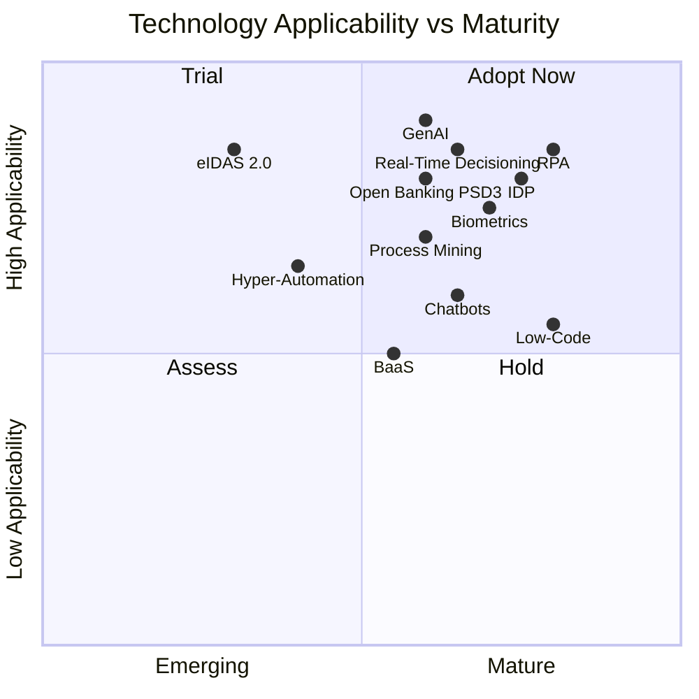
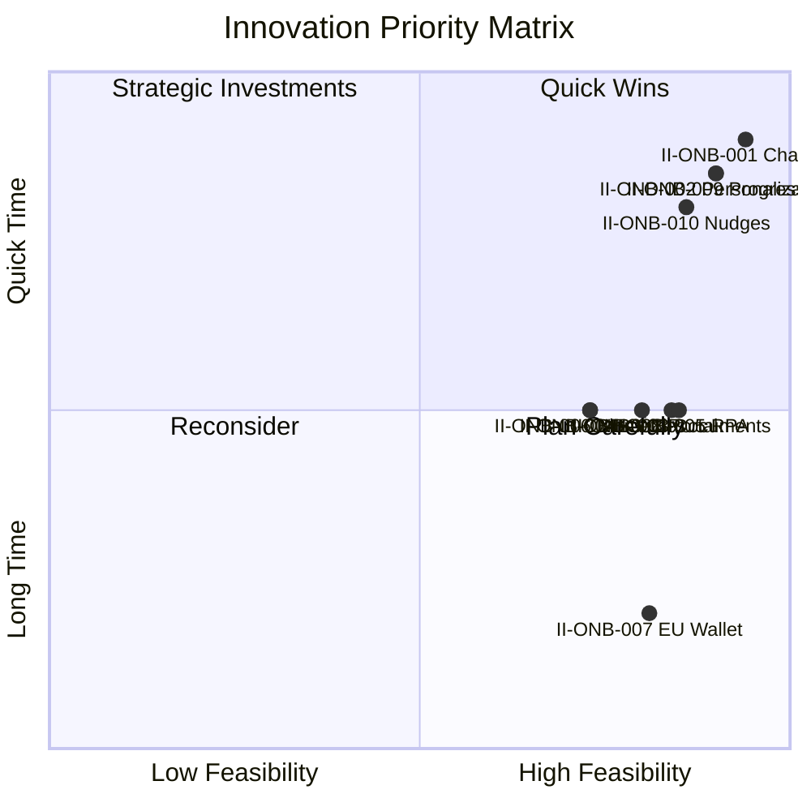
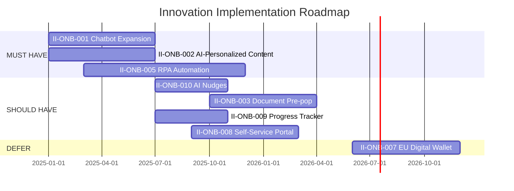

# Onboarding - Innovation Analysis

## 1. Executive Summary

| Field | Value |
|-------|-------|
| **Process** | Onboarding (ONB-001) |
| **Bank** | Deutsche Bank |
| **Region** | EU |
| **Analysis Date** | 2025-12-09 |
| **Analyst** | Markus (CEO) |
| **Status** | Complete |
| **Version** | 1.0 |

### Key Findings

| Category | Count |
|----------|-------|
| Total Innovations Identified | 10 |
| MUST HAVE (immediate) | 3 |
| SHOULD HAVE (next phase) | 4 |
| COULD HAVE (if capacity) | 2 |
| DEFER (future phases) | 1 |

### Top 3 MUST HAVE Innovations

1. **II-ONB-001**: Chatbot Expansion - Extend Google chatbot pilot to guide customers through 180-day onboarding journey
2. **II-ONB-002**: AI-Personalized Content - GenAI-powered personalization of all onboarding communications
3. **II-ONB-005**: RPA Automation - Robotic process automation across 7 onboarding systems

### Key Metrics

| Metric | Target | Timeline |
|--------|--------|----------|
| Activation Rate | 85% (from 78%) | 6 months |
| Call Centre Deflection | 30% | 6 months |
| Processing Time Reduction | 60% | 12 months |

### Investment & Returns

| Item | Value |
|------|-------|
| **Total Investment (3-year)** | €1.48M |
| **Annual Benefit** | €1M/year |
| **Average Payback** | 18 months |

### Key Risks

1. Legacy system integration challenges (RPA)
2. GenAI content quality issues
3. Resource constraints delaying SHOULD HAVEs

### Recommendation

Proceed with the 3 MUST HAVE innovations as part of the BizBanking Onboarding Redesign project. Start with chatbot expansion and AI-personalized content (quick wins), then build RPA foundation. Monitor EU Digital Identity Wallet (eIDAS 2.0) for first-mover opportunity in 2026.

---

### Sign-Off

| Field | Value |
|-------|-------|
| **Approver** | Markus |
| **Role** | CEO |
| **Date** | 2025-12-09 |
| **Status** | Approved |

## 2. Innovation Overview

### 2.1 Analysis Scope

| Attribute | Value |
|-----------|-------|
| Process | Onboarding (ONB-001) |
| Client Segment | BizBanking |
| Organization | Deutsche Bank |
| Region | EU |
| Analysis Date | 2025-12-09 |
| Contributor | Markus (CEO) |

**Process Context:**
- 180-day customer onboarding journey
- 8 process steps from sign-in to final follow-up
- 7 systems supporting multi-channel engagement (SMS, Email, Phone, Video, Branch, Social Media)
- 1 compliance control (KYC Defence Industry Screening)

**Current Performance Gaps:**
| KPI | Current | Target | Gap |
|-----|---------|--------|-----|
| Activation Rate | 78% | 85% | -7% |
| Day 5 Contact Rate | 92% | 95% | -3% |
| NPS Score (Day 90) | +35 | +40 | -5 |
| Journey Completion Rate | 65% | 70% | -5% |

### 2.2 Innovation Objectives

Based on strategic themes and performance gaps:

1. **Digital Transformation** - Modernize onboarding experience to match fintech standards
2. **Cost Cutting** - Automate manual touchpoints to reduce operational costs
3. **Activation Improvement** - Close the 7% gap in activation rate
4. **Journey Completion** - Increase 180-day completion from 65% to 70%+
5. **Customer Experience** - Improve NPS from +35 to +40+

### 2.3 Strategic Alignment

| Strategic Theme | Relevance to Onboarding | Priority |
|-----------------|------------------------|----------|
| Digital Transformation | High - Onboarding is first digital impression | Primary |
| Cost Cutting | High - Multiple manual touchpoints exist | Primary |
| Client Experience | High - Directly impacts NPS and retention | Secondary |

**Internal Initiative Alignment:**
- **BizBanking Onboarding Redesign Project** - This analysis directly feeds into active redesign initiative
- **dbLumina (GenAI)** - Potential application for personalized onboarding
- **Google Chatbot Pilot** - Opportunity to expand from FAQ to onboarding guidance
- **IBM Partnership** - Foundation for automation and hyper-automation

## 3. Market Trends

### 3.1 Trend Summary

| TR# | Trend Name | Category | Maturity | Relevance | Impact Potential |
|-----|-----------|----------|----------|-----------|------------------|
| TR-ONB-001 | Generative AI | Technology | Scaling | High | High |
| TR-ONB-002 | RPA (Robotic Process Automation) | Technology | Mature | High | High |
| TR-ONB-003 | Intelligent Document Processing | Technology | Mature | High | High |
| TR-ONB-004 | Biometric Authentication | Technology | Mature | High | Medium |
| TR-ONB-005 | Conversational AI / Chatbots | Technology | Scaling | Medium | Medium |
| TR-ONB-006 | EU Digital Identity Wallet (eIDAS 2.0) | Regulatory | Emerging | High | High |
| TR-ONB-007 | Hyper-Automation | Technology | Emerging | Medium | High |
| TR-ONB-008 | Banking-as-a-Service (BaaS) | Business Model | Scaling | Medium | Medium |
| TR-ONB-009 | Open Banking / PSD3 | Regulatory/Business | Scaling | High | High |
| TR-ONB-010 | Real-Time Decisioning | Technology | Scaling | High | High |
| TR-ONB-011 | Low-Code/No-Code Platforms | Technology | Mature | Medium | Medium |
| TR-ONB-012 | Process Mining & Digital Twins | Technology | Scaling | Medium | High |

### 3.2 Trend Analysis

**High-Impact Technology Trends:**

**TR-ONB-001: Generative AI**
- JPMorgan deploying GenAI assistant to 140,000 employees
- Deutsche Bank has dbLumina and 11,000+ employees AI-trained
- Applications: Personalized onboarding journeys, automated document processing, intelligent chatbots
- GenAI has moved "beyond experimentation" in banking (Gartner)

**TR-ONB-002: RPA (Robotic Process Automation)**
- Market reaching $1.12B in banking by 2025
- Can reduce onboarding time from 5 days to 10 minutes
- Automates document verification, data entry, compliance checks
- Typical bank saves ~$52M annually on KYC compliance through RPA

**TR-ONB-003: Intelligent Document Processing (IDP)**
- AI-powered OCR extracts data from IDs, forms, documents
- Reduces manual data entry by up to 60%
- Combined with AI/RPA enables straight-through processing

**TR-ONB-006: EU Digital Identity Wallet (eIDAS 2.0)**
- Mandatory by end of 2026
- Will streamline KYC - customers share verified identity data instantly
- Banks with early integration gain competitive advantage
- Game-changer for onboarding speed and compliance

**Existing Deutsche Bank Initiatives:**
| Technology | Status | Opportunity |
|------------|--------|-------------|
| dbLumina (GenAI) | Active | Expand to customer-facing onboarding |
| Google Chatbot | Pilot (FAQ) | Expand to onboarding guidance |
| IBM Partnership | Active | Foundation for RPA/hyper-automation |

### 3.3 Competitive Landscape

#### 3.3.1 Traditional Bank Competitors (EU + US)

| COMP# | Competitor | Region | Strengths | Key Innovations | Threat Level |
|-------|------------|--------|-----------|-----------------|--------------|
| COMP-ONB-001 | ING | EU | Digital-first culture, API leadership | Innovative business onboarding (industry benchmark) | High |
| COMP-ONB-002 | Commerzbank | DE | German market, SME focus | Digital SME banking transformation | High |
| COMP-ONB-003 | JPMorgan Chase | US | AI leader (#1 in banking AI adoption) | GenAI assistant to 140k employees, AI-powered onboarding | High |
| COMP-ONB-004 | Bank of America | US | Strong customer loyalty | AI facial recognition onboarding, ML personalization | Medium |
| COMP-ONB-005 | Wells Fargo | US | 4,000 employees AI-trained | AI chatbot support, digital onboarding automation | Medium |
| COMP-ONB-006 | Sparkassen | DE | 50M customers, local presence | Crypto integration (no extra KYC), embedded mobile banking | Medium |
| COMP-ONB-007 | Volksbanken/DZ Bank | DE | 700 cooperative banks | Customer self-service product catalog (Bloxx) | Medium |
| COMP-ONB-008 | HSBC | EU | Global reach | AI personalization, ESG integration | Medium |
| COMP-ONB-009 | BNP Paribas | EU | Pan-European scale | Digital onboarding investments | Low |

**Key Competitive Insights:**
- **ING** is the EU benchmark for business onboarding innovation
- **JPMorgan Chase** leads globally in AI - employs more AI researchers than next 7 banks combined
- **Sparkassen** model of embedding features without additional KYC is noteworthy
- **Volksbanken** "Bloxx" approach allows customers to configure their own service catalog
- US banks report 40-50% reduction in onboarding time through AI

#### 3.3.2 Fintech Disruptors

| FIN# | Fintech | What They Do | Threat Level | Partnership Potential |
|------|---------|--------------|--------------|----------------------|
| FIN-ONB-001 | Qonto | EU neobank for SMEs. Local IBANs, instant SEPA, expense management. Xero/Slack integrations. | High | Medium |
| FIN-ONB-002 | Wise Business | Multi-currency (40+), local accounts GBP/EUR/USD, bulk payments, transparent FX. | High | High |
| FIN-ONB-003 | Mercury | 10-min onboarding, no fees, Stripe/QuickBooks integrations. Startup favorite. | Medium | Medium |
| FIN-ONB-004 | Relay | Cash flow visibility, multiple accounts, accounting integrations. FDIC-insured. | Low | Low |
| FIN-ONB-005 | Brex | Full financial stack for VC-backed startups. Spend management, global payments. | Medium | Low |
| FIN-ONB-006 | Swan | BaaS across 30 EU countries. First Apple/Google Pay in 19 EU nations. | Medium | High |

**Key Fintech Insights:**
- Neobanks offer 10-minute account opening vs days at traditional banks
- 38% of customers drop off midway through traditional bank onboarding (Deloitte)
- Neobank market: $261.4B in 2025, business accounts = 67% revenue share
- **Qonto** and **Wise Business** are strongest threats in EU BizBanking

#### 3.3.3 Industry Best Practices

**Client Experience:**
- 10-minute digital onboarding without branch visits
- Self-service portals (mobile, desktop, tablet)
- AI-personalized journeys based on customer risk profile

**Automation:**
- AI-driven document verification (instant ID validation)
- Automated KYC/AML with straight-through processing for low-risk
- Intelligent Document Processing (60% reduction in manual entry)

**Risk & Compliance:**
- Behavioral biometrics for fraud detection
- Real-time ID verification with AI biometric checks
- API pre-population from internal/third-party data

**Speed & Efficiency:**
- RPA reducing onboarding from 5 days to 10 minutes
- Conversational AI guiding customers through process
- Straight-through processing for low-risk customers

**ROI Benchmarks:**
| Metric | Industry Benchmark | Source |
|--------|-------------------|--------|
| Cost Reduction | Up to 50% | Deloitte |
| Productivity Gains | 22-30% | Deloitte |
| Drop-off Rate Reduction | 60% | FICO |
| KYC Compliance Savings | ~$52M/year | Industry |
| Onboarding Time Reduction | 5 days → 10 mins | RPA providers |

### 3.4 Technology Radar



### 3.5 New Trend Analysis (TR-ONB-009 to TR-ONB-012)

**TR-ONB-009: Open Banking / PSD3**
- PSD3 expected 2026-2027, building on PSD2 foundations
- Enables Verification of Payee (VoP), stronger SCA requirements
- Opens door to embedded finance and data-driven personalization
- Deutsche Bank can leverage existing API infrastructure
- Key opportunity: Pre-populate onboarding data from other bank relationships

**TR-ONB-010: Real-Time Decisioning**
- Clients expect instant credit decisions and account approvals
- Fintechs deliver in minutes; traditional banks often take days
- Combines AI/ML with real-time data processing and risk scoring
- Critical for matching fintech experience expectations
- Directly addresses #1 client friction point: waiting

**TR-ONB-011: Low-Code/No-Code Platforms**
- Gartner predicts 70% of new apps will use low-code by 2025
- Accelerates onboarding flow changes from months to weeks
- Reduces IT bottleneck, empowers business teams to iterate
- Already mature technology with proven banking implementations
- Enables rapid experimentation with onboarding variations

**TR-ONB-012: Process Mining & Digital Twins**
- Tools like Celonis discover actual vs. intended process flows
- Digital twins enable simulation of changes before implementation
- Data-driven transformation approach, not guesswork
- Directly applicable to analyzing the 8-step onboarding process
- Note: Requires careful data governance (GDPR, DORA compliance)

### 3.6 Regulatory Horizon

| Regulation | Timeline | Impact Type | Description |
|------------|----------|-------------|-------------|
| DORA | Jan 2025 (active) | Constrains | Digital operational resilience requirements for ICT systems |
| eIDAS 2.0 | End 2026 | **Enables** | EU Digital Identity Wallet - streamlines KYC significantly |
| PSD3 | 2026-2027 | Enables | Verification of Payee, stronger SCA, fraud prevention |
| MiCA | Dec 2024 (active) | Neutral | Crypto-assets regulation |
| FIDA | ~2027 | Enables | Open Finance structure (data-driven personalization) |
| AML Package | Ongoing | Constrains | KYC/AML compliance burden (drives automation investment) |

**Key Regulatory Opportunity:** eIDAS 2.0 is the biggest game-changer - banks that integrate the EU Digital Identity Wallet early can offer near-instant, fully compliant KYC.

---

## 4. Innovation Backlog

### 4.1 Innovation Ideas Summary

| II# | Innovation Idea | Category | Type | Source | Feasibility |
|-----|----------------|----------|------|--------|-------------|
| II-ONB-001 | Expand chatbot to onboarding guidance | CX / Technology | Incremental | Party Mode, Google pilot | 3.75 (HIGH) |
| II-ONB-002 | AI-personalized email/SMS content | CX | Incremental | Party Mode, Best Practice | 3.60 (HIGH) |
| II-ONB-003 | Intelligent document pre-population | Technology | Adjacent | Party Mode, Best Practice | 3.35 (HIGH) |
| II-ONB-004 | AI-assisted KYC review (human approval) | Technology / Process | Adjacent | Party Mode, Compliance | 2.90 (MEDIUM) |
| II-ONB-005 | RPA for onboarding workflow automation | Process / Technology | Adjacent | Tech Trend TR-ONB-002 | 3.40 (HIGH) |
| II-ONB-006 | Biometric identity verification | Technology | Adjacent | Tech Trend TR-ONB-004 | 2.90 (MEDIUM) |
| II-ONB-007 | EU Digital Identity Wallet integration | Technology | Transformational | Regulatory (eIDAS 2.0) | 3.25 (HIGH) |
| II-ONB-008 | Self-service onboarding portal | CX | Adjacent | Fintech benchmark | 3.20 (HIGH) |
| II-ONB-009 | Real-time onboarding progress tracker | CX | Incremental | Best Practice | 3.60 (HIGH) |
| II-ONB-010 | Proactive AI-driven engagement nudges | CX / Technology | Incremental | Best Practice | 3.45 (HIGH) |

### 4.2 Innovation Details

#### II-ONB-001: Expand Chatbot to Onboarding Guidance
**Description:** Extend the existing Google chatbot pilot (currently FAQ-only) to guide new BizBanking customers through the 180-day onboarding journey - answering questions, prompting next steps, checking activation status.
**Business Case:** Reduce call centre load by 20-40%, improve activation rate, 24/7 availability.
**Dependencies:** None (foundation innovation)
**Enables:** II-ONB-010 (nudges can use chatbot channel)
**Time-to-Value:** Quick (0-6 months)
**Risk Level:** Low

#### II-ONB-002: AI-Personalized Email/SMS Content
**Description:** Use GenAI to generate personalized onboarding communications based on customer segment, behavior, and journey stage. Replace generic mass communications with tailored content.
**Business Case:** Improve activation rate (78% → 85%), increase engagement, improve NPS.
**Dependencies:** None (independent)
**Enables:** II-ONB-010 (personalization engine for nudges)
**Time-to-Value:** Quick (0-6 months)
**Risk Level:** Low

#### II-ONB-003: Intelligent Document Pre-population
**Description:** AI-powered extraction and pre-population of customer data from submitted documents (IDs, business documents) to reduce manual data entry and speed up onboarding.
**Business Case:** Reduce manual data entry by 60%, faster onboarding, fewer errors.
**Dependencies:** II-ONB-005 (RPA infrastructure)
**Enables:** II-ONB-004 (feeds into KYC review)
**Time-to-Value:** Medium (6-12 months)
**Risk Level:** Low

#### II-ONB-004: AI-Assisted KYC Review (Human Approval)
**Description:** GenAI assists compliance team by pre-analyzing KYC documents, flagging anomalies, and preparing review summaries. Human makes final decision.
**Business Case:** Faster KYC processing, cost reduction (~$52M industry benchmark), compliance maintained.
**Dependencies:** II-ONB-005 (RPA), II-ONB-003 (document processing)
**Enables:** None
**Time-to-Value:** Medium (6-12 months)
**Risk Level:** Medium (regulatory considerations)

#### II-ONB-005: RPA for Onboarding Workflow Automation
**Description:** Implement robotic process automation for repetitive onboarding tasks: data entry, system updates, notification triggers, compliance checks.
**Business Case:** Reduce onboarding time from days to minutes, cost reduction, consistency.
**Dependencies:** None (foundation innovation)
**Enables:** II-ONB-003, II-ONB-004 (automation foundation)
**Time-to-Value:** Medium (6-12 months)
**Risk Level:** Low

#### II-ONB-006: Biometric Identity Verification
**Description:** Implement facial recognition and/or behavioral biometrics for secure, frictionless identity verification during onboarding.
**Business Case:** Faster verification, improved security, fraud prevention, better CX.
**Dependencies:** None (independent)
**Synergy:** Complements II-ONB-007 (EU Digital Wallet)
**Time-to-Value:** Medium (6-12 months)
**Risk Level:** Medium (regulatory approval needed)

#### II-ONB-007: EU Digital Identity Wallet Integration
**Description:** Early integration with eIDAS 2.0 EU Digital Identity Wallet (mandatory by end 2026) to enable instant, compliant KYC verification.
**Business Case:** Near-instant KYC, first-mover advantage, regulatory compliance, competitive differentiation.
**Dependencies:** None (independent, but benefits from II-ONB-006)
**Enables:** Streamlined onboarding for all EU customers
**Time-to-Value:** Long (12+ months)
**Risk Level:** Medium (regulatory timeline dependency)

#### II-ONB-008: Self-Service Onboarding Portal
**Description:** Dedicated digital portal where BizBanking customers can complete onboarding at their own pace, upload documents, track status, and access resources.
**Business Case:** Reduce branch/call centre dependency, match fintech experience, improve completion rate.
**Dependencies:** None (independent)
**Synergy:** Should include II-ONB-009 (progress tracker)
**Time-to-Value:** Medium (6-12 months)
**Risk Level:** Low

#### II-ONB-009: Real-Time Onboarding Progress Tracker
**Description:** Visual dashboard showing customers exactly where they are in the 180-day journey, what's completed, and what's next.
**Business Case:** Reduce customer anxiety, fewer "where am I?" calls, improve NPS, proactive engagement.
**Dependencies:** None (independent)
**Synergy:** Should be part of II-ONB-008 (self-service portal)
**Time-to-Value:** Quick (0-6 months)
**Risk Level:** Low

#### II-ONB-010: Proactive AI-Driven Engagement Nudges
**Description:** AI monitors customer behavior and triggers personalized nudges at optimal moments to drive activation and engagement.
**Business Case:** Improve activation rate, reduce drop-off, personalized at scale.
**Dependencies:** II-ONB-002 (personalization engine)
**Synergy:** Can leverage II-ONB-001 (chatbot channel)
**Time-to-Value:** Quick (0-6 months)
**Risk Level:** Low

### 4.3 Innovation Categories

| Category | Count | Innovations |
|----------|-------|-------------|
| **Customer Experience** | 5 | II-ONB-001, II-ONB-002, II-ONB-008, II-ONB-009, II-ONB-010 |
| **Technology** | 4 | II-ONB-003, II-ONB-004, II-ONB-006, II-ONB-007 |
| **Process** | 1 | II-ONB-005 |

### 4.4 Innovation Types

| Type | Count | Description |
|------|-------|-------------|
| **Incremental** | 4 | Improve existing capabilities (II-ONB-001, 002, 009, 010) |
| **Adjacent** | 5 | Extend to new areas (II-ONB-003, 004, 005, 006, 008) |
| **Transformational** | 1 | Create new capability (II-ONB-007) |

---

## 5. Feasibility Matrix

### 5.1 Six-Dimension Scoring

| II# | Technical | Regulatory | ROI | Complexity | Adoption | Competitive | **Total** |
|-----|-----------|------------|-----|------------|----------|-------------|-----------|
| II-ONB-001 | 4 (0.80) | 4 (1.00) | 4 (0.80) | 4 (0.40) | 3 (0.45) | 3 (0.30) | **3.75** |
| II-ONB-002 | 3 (0.60) | 4 (1.00) | 4 (0.80) | 3 (0.30) | 4 (0.60) | 3 (0.30) | **3.60** |
| II-ONB-003 | 3 (0.60) | 3 (0.75) | 4 (0.80) | 3 (0.30) | 4 (0.60) | 3 (0.30) | **3.35** |
| II-ONB-004 | 3 (0.60) | 3 (0.75) | 3 (0.60) | 2 (0.20) | 3 (0.45) | 3 (0.30) | **2.90** |
| II-ONB-005 | 3 (0.60) | 4 (1.00) | 4 (0.80) | 2 (0.20) | 4 (0.60) | 2 (0.20) | **3.40** |
| II-ONB-006 | 3 (0.60) | 3 (0.75) | 3 (0.60) | 2 (0.20) | 3 (0.45) | 3 (0.30) | **2.90** |
| II-ONB-007 | 2 (0.40) | 4 (1.00) | 4 (0.80) | 2 (0.20) | 3 (0.45) | 4 (0.40) | **3.25** |
| II-ONB-008 | 3 (0.60) | 4 (1.00) | 3 (0.60) | 2 (0.20) | 4 (0.60) | 2 (0.20) | **3.20** |
| II-ONB-009 | 4 (0.80) | 4 (1.00) | 3 (0.60) | 3 (0.30) | 4 (0.60) | 3 (0.30) | **3.60** |
| II-ONB-010 | 3 (0.60) | 4 (1.00) | 4 (0.80) | 3 (0.30) | 3 (0.45) | 3 (0.30) | **3.45** |

### 5.2 Dimension Definitions

| Dimension | Weight | Description |
|-----------|--------|-------------|
| **Technical** | 0.20 | Can we build it with current/near-term capabilities? |
| **Regulatory** | 0.25 | Any regulatory barriers or requirements? (Highest weight - banking context) |
| **ROI** | 0.20 | Is the business case clear? |
| **Complexity** | 0.10 | How hard to implement? |
| **Adoption** | 0.15 | Will clients/users adopt it? |
| **Competitive** | 0.10 | Does it differentiate us? |

### 5.3 Feasibility Analysis

**High Feasibility (≥3.0): 8 innovations**
- Ready for prioritization and roadmap inclusion
- Clear path to implementation
- Strong alignment with strategic themes

**Medium Feasibility (2.0-2.9): 2 innovations**
- II-ONB-004 (AI-assisted KYC): Regulatory considerations require careful implementation
- II-ONB-006 (Biometrics): Requires regulatory approval and technical integration

**Low Feasibility (<2.0): 0 innovations**
- None identified - all opportunities are viable

### 5.4 Priority Matrix



### 5.5 Dependency Map

```
FOUNDATION LAYER (Enable Others)
├── II-ONB-001 (Chatbot) ──────────────────┐
│                                          ↓
├── II-ONB-002 (Personalization) ───→ II-ONB-010 (AI Nudges)
│
└── II-ONB-005 (RPA) ───→ II-ONB-003 (Doc Pre-pop) ───→ II-ONB-004 (AI KYC)

INDEPENDENT LAYER (Can Proceed Alone)
├── II-ONB-006 (Biometrics) ←──synergy──→ II-ONB-007 (EU Wallet)
├── II-ONB-008 (Self-service) ←──synergy──→ II-ONB-009 (Progress)
└── II-ONB-009 (Progress Tracker)
```

**Foundation Innovations:** II-ONB-001, II-ONB-005
**Dependent Innovations:** II-ONB-003, II-ONB-004, II-ONB-010
**Independent Innovations:** II-ONB-002, II-ONB-006, II-ONB-007, II-ONB-008, II-ONB-009

## 6. Innovation Deep Dives

### 6.1 MoSCoW Priority Summary

| Priority | Count | Innovations |
|----------|-------|-------------|
| **MUST HAVE** | 3 | II-ONB-001, II-ONB-002, II-ONB-005 |
| **SHOULD HAVE** | 4 | II-ONB-003, II-ONB-008, II-ONB-009, II-ONB-010 |
| **COULD HAVE** | 2 | II-ONB-004, II-ONB-006 |
| **DEFER Phase 2** | 1 | II-ONB-007 |

### 6.2 MUST HAVE Deep Dives

#### II-ONB-001: Expand Chatbot to Onboarding Guidance

**Priority:** MUST HAVE | **Score:** 3.75 | **Time-to-Value:** Quick (0-6 months)

**Why MUST HAVE:** Foundation innovation, existing Google pilot, quick win, reduces call centre costs, aligns with both strategic themes (digital transformation + cost cutting)

**Transformation Handoff:**

| Requirement Type | Details |
|------------------|---------|
| **TO-BE Must Include** | Chatbot accessible from all onboarding touchpoints (app, web portal, email links); Journey-aware responses; Escalation path to human agent; Integration with customer profile |
| **Integration Requirements** | Google chatbot platform; CRM/onboarding system API; Real-time journey status; Call centre handoff |
| **Technical Constraints** | DORA compliance; GDPR data handling; Response time < 3 seconds |
| **UX Requirements** | 24/7 availability; German + English; Clear escalation; Consistent brand voice |

**SMART Success Metrics:**

| Metric | Target | Timeline | Measurement |
|--------|--------|----------|-------------|
| Call Centre Deflection | 30% of onboarding queries | 6 months post-launch | Chatbot analytics |
| Customer Satisfaction | ≥4.0/5.0 CSAT | 3 months post-launch | Post-chat survey |
| Activation Rate Impact | +3% (78%→81%) | 6 months post-launch | CRM Dashboard |

**Risk Mitigation:**

| Risk | Mitigation | Contingency |
|------|------------|-------------|
| Poor chatbot accuracy | Extensive training, continuous improvement | Easy escalation, rollback to FAQ-only |
| Low customer adoption | Proactive promotion, easy access | A/B test positioning |
| Integration delays | Early API spec, phased rollout | Launch with limited integration |

---

#### II-ONB-002: AI-Personalized Email/SMS Content

**Priority:** MUST HAVE | **Score:** 3.60 | **Time-to-Value:** Quick (0-6 months)

**Why MUST HAVE:** Quick win, directly addresses activation rate KPI gap (78%→85%), leverages dbLumina/GenAI capabilities, low regulatory risk

**Transformation Handoff:**

| Requirement Type | Details |
|------------------|---------|
| **TO-BE Must Include** | GenAI-powered content generation; Customer segmentation engine; Dynamic content templates; A/B testing capability |
| **Integration Requirements** | Email Marketing Platform (SYS-ONB-002); SMS Gateway (SYS-ONB-001); CRM for customer data; dbLumina or equivalent GenAI |
| **Technical Constraints** | Auditable content generation (GDPR); Opt-out preferences; Regulatory disclaimers |
| **UX Requirements** | Personal feel; Consistent brand voice; Relevant timing; Clear value proposition |

**SMART Success Metrics:**

| Metric | Target | Timeline | Measurement |
|--------|--------|----------|-------------|
| Activation Rate | 85% (from 78%) | 6 months post-launch | CRM Dashboard |
| Email Open Rate | +15% vs current | 3 months post-launch | Email Marketing Platform |
| Click-Through Rate | +20% vs current | 3 months post-launch | Email Marketing Platform |

**Risk Mitigation:**

| Risk | Mitigation | Contingency |
|------|------------|-------------|
| GenAI generates inappropriate content | Human review, content guardrails, brand guidelines | Fallback to pre-approved templates |
| Personalization feels "creepy" | Customer panel testing | Adjust personalization depth |
| Low impact on activation | A/B test vs control | Combine with other tactics |

---

#### II-ONB-005: RPA for Onboarding Workflow Automation

**Priority:** MUST HAVE | **Score:** 3.40 | **Time-to-Value:** Medium (6-12 months)

**Why MUST HAVE:** Foundation innovation (enables II-ONB-003, II-ONB-004), strong cost cutting alignment, proven technology, leverages IBM partnership

**Transformation Handoff:**

| Requirement Type | Details |
|------------------|---------|
| **TO-BE Must Include** | RPA bots for data entry, system updates, notification triggers, compliance checks; Bot monitoring dashboard; Exception handling |
| **Integration Requirements** | All 7 onboarding systems (SYS-ONB-001 to SYS-ONB-007); IBM automation portfolio; Exception queue for human review |
| **Technical Constraints** | DORA compliance; Full audit trail; Graceful degradation; IBM partnership alignment |
| **UX Requirements** | Invisible to customer; Staff monitoring dashboard; Clear escalation paths |

**SMART Success Metrics:**

| Metric | Target | Timeline | Measurement |
|--------|--------|----------|-------------|
| Processing Time | -60% reduction | 6 months post-launch | RPA Dashboard |
| Manual Effort | -40% FTE hours | 9 months post-launch | Operations Reports |
| Error Rate | -50% data entry errors | 6 months post-launch | Quality Reports |
| Cost Savings | €500K+ annually | 12 months post-launch | Finance Reports |

**Risk Mitigation:**

| Risk | Mitigation | Contingency |
|------|------------|-------------|
| Legacy system integration | Early technical assessment, phased rollout | Manual workaround, prioritize easier systems |
| Bot failures | Robust exception handling, 24/7 monitoring | Manual fallback, rapid recovery |
| Staff resistance | Change management, retraining | Clear communication on augmentation vs replacement |

### 6.3 SHOULD HAVE Summary

| II# | Innovation | Score | Why SHOULD (not MUST) | Next Steps |
|-----|-----------|-------|----------------------|------------|
| II-ONB-010 | AI engagement nudges | 3.45 | Depends on II-ONB-002 | Implement after personalization engine live |
| II-ONB-009 | Progress tracker | 3.60 | Resource constraints | Plan for Phase 2 when resources available |
| II-ONB-003 | Document pre-population | 3.35 | Depends on II-ONB-005 | Implement after RPA foundation |
| II-ONB-008 | Self-service portal | 3.20 | Medium complexity | Consider for app renewal 2025 |

### 6.4 COULD HAVE Summary

| II# | Innovation | Score | Why COULD | Trigger for Upgrade |
|-----|-----------|-------|-----------|---------------------|
| II-ONB-004 | AI-assisted KYC | 2.90 | Multiple dependencies | When II-ONB-003 and II-ONB-005 complete |
| II-ONB-006 | Biometric verification | 2.90 | Regulatory approval needed | When regulatory clarity achieved |

### 6.5 DEFER Summary

| II# | Innovation | Score | Phase | Why Deferred | Unblock Condition |
|-----|-----------|-------|-------|--------------|-------------------|
| II-ONB-007 | EU Digital Identity Wallet | 3.25 | Phase 2 | Regulatory timeline (end 2026) | eIDAS 2.0 specs finalized |

---

## 7. Prioritized Roadmap

### 7.1 Roadmap Overview



### 7.2 Phase 1: Quick Wins (Months 1-6)

**Focus:** Immediate value delivery with low-risk innovations

| Innovation | Start | Duration | Key Milestone |
|------------|-------|----------|---------------|
| II-ONB-001 Chatbot Expansion | Month 1 | 6 months | Chatbot live with onboarding guidance |
| II-ONB-002 AI-Personalized Content | Month 1 | 6 months | Personalized communications active |

**Phase 1 Outcomes:**
- 30% call centre deflection for onboarding queries
- Activation rate improvement toward 85% target
- Foundation for AI engagement nudges

### 7.3 Phase 2: Foundation Building (Months 3-12)

**Focus:** Build automation foundation, enable future innovations

| Innovation | Start | Duration | Key Milestone |
|------------|-------|----------|---------------|
| II-ONB-005 RPA Automation | Month 3 | 9 months | RPA bots operational across all systems |

**Phase 2 Outcomes:**
- 60% reduction in processing time
- 40% reduction in manual effort
- Foundation for document pre-population and AI KYC

### 7.4 Phase 3: Enhanced Capabilities (Months 7-18)

**Focus:** Build on foundation, expand capabilities

| Innovation | Start | Duration | Key Milestone |
|------------|-------|----------|---------------|
| II-ONB-010 AI Nudges | Month 7 | 4 months | Proactive engagement active |
| II-ONB-009 Progress Tracker | Month 7 | 4 months | Customer dashboard live |
| II-ONB-003 Document Pre-pop | Month 10 | 6 months | Intelligent document processing |
| II-ONB-008 Self-Service Portal | Month 9 | 6 months | Self-service onboarding live |

### 7.5 Future Phase: Regulatory Innovations (2026+)

| Innovation | Timing | Trigger |
|------------|--------|---------|
| II-ONB-007 EU Digital Wallet | H1 2026 | eIDAS 2.0 specs finalized |

---

## 8. Strategic Recommendations

### 8.1 Quick Wins (0-6 months)

1. **Expand Google Chatbot (II-ONB-001)**
   - Leverage existing pilot infrastructure
   - Low risk, high visibility
   - Immediate cost savings through call deflection

2. **Deploy AI-Personalized Content (II-ONB-002)**
   - Leverage dbLumina/GenAI capabilities
   - Direct impact on activation rate KPI
   - Foundation for future personalization

### 8.2 Strategic Initiatives (6-12 months)

1. **Build RPA Foundation (II-ONB-005)**
   - Critical enabler for multiple future innovations
   - Significant cost savings potential (€500K+ annually)
   - Leverage IBM partnership for implementation

2. **Plan BizBanking Onboarding Redesign Integration**
   - Align all innovations with active redesign project
   - Ensure TO-BE state incorporates MUST HAVEs

### 8.3 Future Exploration (12+ months)

1. **EU Digital Identity Wallet (II-ONB-007)**
   - Monitor eIDAS 2.0 progress closely
   - Prepare technical architecture in advance
   - First-mover advantage opportunity

2. **AI-Assisted KYC (II-ONB-004)**
   - Evaluate after RPA and document processing mature
   - Maintain compliance-first approach

---

## 9. Investment Analysis

### 9.1 Cost Estimates

| II# | Innovation | Development | Infrastructure | Annual Ops | 3-Year TCO |
|-----|-----------|-------------|----------------|------------|------------|
| II-ONB-001 | Chatbot Expansion | €150K | €50K | €30K/yr | €290K |
| II-ONB-002 | AI-Personalized Content | €200K | €75K | €40K/yr | €395K |
| II-ONB-005 | RPA Automation | €400K | €150K | €80K/yr | €790K |
| **MUST HAVE Total** | | **€750K** | **€275K** | **€150K/yr** | **€1.48M** |

### 9.2 ROI Projections

| Innovation | Investment | Annual Benefit | Payback |
|------------|------------|----------------|---------|
| II-ONB-001 Chatbot | €290K | €200K (call deflection) | 18 months |
| II-ONB-002 Personalization | €395K | €300K (activation improvement) | 16 months |
| II-ONB-005 RPA | €790K | €500K (efficiency gains) | 19 months |
| **Total** | **€1.48M** | **€1M/year** | **18 months avg** |

### 9.3 Resource Requirements

| Role | II-ONB-001 | II-ONB-002 | II-ONB-005 | Total |
|------|------------|------------|------------|-------|
| Product Owner | 0.5 FTE | 0.5 FTE | 0.5 FTE | 1.5 FTE |
| Developer | 2 FTE | 2 FTE | 3 FTE | 7 FTE |
| UX Designer | 0.5 FTE | 0.5 FTE | 0.25 FTE | 1.25 FTE |
| QA | 0.5 FTE | 0.5 FTE | 1 FTE | 2 FTE |
| Change Manager | 0.25 FTE | 0.25 FTE | 0.5 FTE | 1 FTE |

---

## 10. Risk & Mitigation

### 10.1 Innovation Risks

| Risk ID | Risk Description | Likelihood | Impact | Mitigation Strategy |
|---------|-----------------|------------|--------|---------------------|
| R-001 | Legacy system integration challenges (RPA) | High | Medium | Early technical assessment, phased rollout |
| R-002 | GenAI content quality issues | Medium | High | Human review layer, content guardrails |
| R-003 | Low customer adoption of chatbot | Low | Medium | Proactive promotion, easy access points |
| R-004 | Resource constraints delay SHOULD HAVEs | Medium | Medium | Prioritize MUST HAVEs, clear sequencing |
| R-005 | Regulatory changes impact timeline | Low | High | Monitor regulatory landscape, flexible architecture |

### 10.2 Risk Mitigation Plan

**R-001: Legacy Integration**
- Action: Conduct technical assessment in Month 1
- Owner: IT Architecture team
- Checkpoint: Go/No-Go decision by Month 2

**R-002: GenAI Content Quality**
- Action: Implement human review for all templates
- Owner: Marketing Operations
- Checkpoint: Quality review after first 1,000 communications

**R-003: Customer Adoption**
- Action: Include chatbot in all onboarding touchpoints
- Owner: Digital Experience team
- Checkpoint: Usage metrics review at Month 3

---

## 11. Success Metrics

### 11.1 KPI Framework

| Category | Metric | Baseline | Target | Innovation |
|----------|--------|----------|--------|------------|
| **Activation** | Day 30 Activation Rate | 78% | 85% | II-ONB-001, II-ONB-002 |
| **Efficiency** | Processing Time | Baseline TBD | -60% | II-ONB-005 |
| **Cost** | Call Centre Volume | Baseline TBD | -30% | II-ONB-001 |
| **Experience** | NPS (Day 90) | +35 | +40 | II-ONB-002, II-ONB-009 |
| **Completion** | Journey Completion Rate | 65% | 70% | All |

### 11.2 Measurement Plan

| Metric | Source | Frequency | Owner |
|--------|--------|-----------|-------|
| Activation Rate | CRM Dashboard | Weekly | Customer Experience |
| Call Deflection | Chatbot Analytics | Daily | Digital Experience |
| Processing Time | RPA Dashboard | Daily | Operations |
| NPS | Survey System | Monthly | Customer Experience |
| Error Rate | Quality Reports | Weekly | Operations |

### 11.3 Target Outcomes

**6-Month Targets:**
- Chatbot handling 30% of onboarding queries
- Email open rates +15%
- Activation rate at 81%

**12-Month Targets:**
- RPA reducing processing time by 60%
- Manual effort reduced by 40%
- Activation rate at 85%
- NPS at +38

**18-Month Targets:**
- Full MUST HAVE implementation complete
- €1M annual benefit realized
- Journey completion rate at 70%
- NPS at +40

## 12. Appendices

### 12.1 Research Sources

**Bank-Specific:**
- [Deutsche Bank Technology Transformation](https://www.db.com/what-we-do/focus-topics/tech/index)
- [Deutsche Bank IBM Partnership](https://newsroom.ibm.com/2025-05-27-deutsche-bank-accelerates-dgital-transformation-with-ibms-software-portfolio)
- [Deutsche Bank Digital Transformation Strategies 2025](https://www.globenewswire.com/news-release/2025/07/07/3110853/28124/en/Deutsche-Bank-Digital-Transformation-Strategies-and-Innovation-Programs-Profile-2025.html)

**Competitor & Market:**
- [JPMorgan AI Leadership](https://www.bankingdive.com/news/jpmorgan-chase-capital-one-ai-adoption-leaders-evident/730268/)
- [How EU Banks Can Win Digital Onboarding 2025](https://evrotrust.com/how-eu-banks-can-win-digital-onboarding-in-2025/)
- [Top Neobanks for Business 2025](https://synodus.com/blog/fintech/neobank-for-business/)

**Best Practices & Technology:**
- [Digital Onboarding in Banking Best Practices](https://www.app0.io/blog/digital-onboarding-in-banking)
- [AI Customer Onboarding Automation Guide 2025](https://www.rapidinnovation.io/post/ai-agents-for-customer-onboarding)
- [2025 Banking Technology and Automation Trends](https://www.blueprism.com/resources/blog/banking-technology-automation-trends/)
- [RPA in Banking 2025](https://automationedge.com/blogs/rpa-in-banking-industry/)

**Regulatory:**
- [eIDAS 2.0 & EU Digital Wallet](https://contentservices.asee.io/eidas-eu-digital-wallet/)
- [PSD3 Compliance Guide](https://www.dotfile.com/blog-articles/psd3-compliance-complete-guide)
- [DORA - European Banking Authority](https://www.eba.europa.eu/activities/direct-supervision-and-oversight/digital-operational-resilience-act)

### 12.2 Market Data
{To be added}

### 12.3 Technical Specifications
{To be added}

### 12.4 Change Log

| Version | Date | Author | Changes |
|---------|------|--------|---------|
| 0.1 | 2025-12-09 | Markus | Initial creation - Step 1 (Initialization) |
| 0.2 | 2025-12-09 | Markus | Step 2 (Market Research) - Competitor, Fintech, Best Practices, Technology, Regulatory analysis |
| 0.3 | 2025-12-09 | Markus | Step 3 (Innovation Backlog) - 10 innovations with 6-dimension feasibility scoring, dependencies |
| 0.4 | 2025-12-09 | Markus | Step 4 (Priorities) - MoSCoW prioritization, 3 MUST HAVEs with transformation handoffs, roadmap, investment analysis |
| 1.0 | 2025-12-09 | Markus | Step 5 (Validation) - 20-point QA checklist passed, Executive Summary, formal sign-off, document finalized |
| 1.1 | 2025-12-09 | Markus | Party Mode Review - Added 4 new market trends (TR-ONB-009 to TR-ONB-012): Open Banking/PSD3, Real-Time Decisioning, Low-Code/No-Code, Process Mining & Digital Twins |

### 12.5 Glossary

| Term | Definition |
|------|------------|
| RPA | Robotic Process Automation - software robots automating repetitive tasks |
| IDP | Intelligent Document Processing - AI-powered extraction from documents |
| GenAI | Generative AI - AI that creates content (text, images, code) |
| eIDAS | Electronic Identification, Authentication and Trust Services |
| DORA | Digital Operational Resilience Act |
| PSD3 | Payment Services Directive 3 |
| KYC | Know Your Customer - identity verification requirements |
| AML | Anti-Money Laundering |
| BaaS | Banking-as-a-Service |
| NPS | Net Promoter Score |
