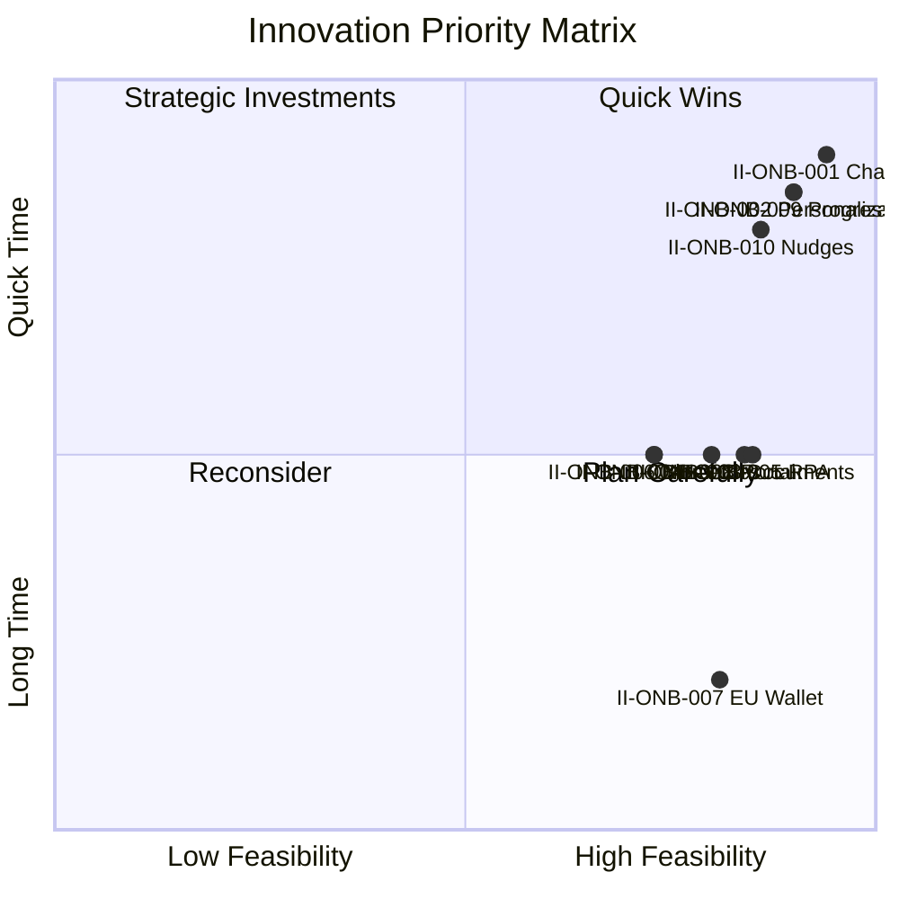
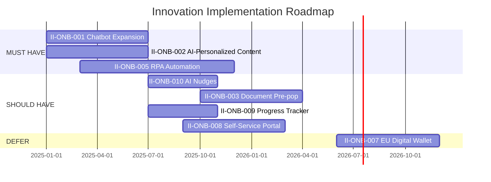

# Management Summary: Onboarding - Innovation Analysis

**Document Type:** Innovation Analysis Management Summary (Amazon 6-Pager Format)
**Process ID:** ONB-001
**Business Unit:** BizBanking
**Innovation Analyst:** Markus (COO)
**Date:** 2025-12-09
**Version:** 1.0

---

## 1. Introduction

### The Competitive Reality

JPMorgan Chase has deployed GenAI assistants to 140,000 employees and leads the industry with more AI researchers than the next 7 banks combined. ING has become the EU benchmark for business onboarding innovation. Neobanks like Qonto and Wise Business now offer 10-minute account opening while our BizBanking onboarding takes days. **38% of customers drop off midway through traditional bank onboarding** (Deloitte). We have identified 3 MUST HAVE innovations that can close this gap, but without immediate action, we risk continued market share erosion to digitally-native competitors.

### Background

Deutsche Bank's BizBanking onboarding process spans 180 days across 8 process steps, utilizing 7 systems for multi-channel engagement. Current activation rate stands at 78% against an 85% target - a 7% gap that translates directly to lost revenue. The existing Google chatbot pilot and dbLumina GenAI capabilities provide foundation infrastructure, while the IBM partnership offers automation expertise. This analysis identifies how to leverage these assets to match fintech experience expectations.

### Purpose of This Document

This management summary synthesizes the innovation analysis for **Onboarding**. It provides executives with a clear view of market trends, innovation opportunities, feasibility assessments, and strategic recommendations for transformation.

### Scope

| Attribute | Value |
|-----------|-------|
| **Process Category** | Customer Onboarding |
| **Innovation Focus Areas** | Digital transformation, Cost cutting, Customer experience |
| **Market Scope** | EU (Germany primary) |
| **Analysis Period** | 2025-2026 |

### Key Definitions

| Term | Definition |
|------|------------|
| Market Trend (TR) | External industry development with potential impact |
| Innovation Idea (II) | Proposed enhancement or transformation opportunity |
| Feasibility Score | Six-dimension assessment (Technical, Regulatory, ROI, Complexity, Adoption, Competitive) |
| Strategic Fit | Alignment with bank's strategic priorities |
| MUST HAVE | Innovation essential for TO-BE state |

---

## 2. Goals

### Primary Objectives

| Objective | Baseline | Current | Target | Target Date |
|-----------|----------|---------|--------|-------------|
| Activation Rate | 78% | 78% | 85% | Q2 2026 |
| Call Centre Deflection | 0% | 0% | 30% | Q3 2025 |
| Processing Time Reduction | 0% | 0% | 60% | Q4 2025 |
| Journey Completion Rate | 65% | 65% | 70% | Q2 2026 |
| NPS Score (Day 90) | +35 | +35 | +40 | Q4 2025 |

### Success Metrics

- **Innovation Pipeline:** 10 validated ideas feeding TO-BE design (3 MUST HAVE, 4 SHOULD HAVE, 2 COULD HAVE, 1 DEFER)
- **MUST HAVE Integration:** 100% of MUST HAVEs incorporated in target state design
- **ROI Achievement:** €1M annual benefit, 18-month average payback
- **Time to Value:** First quick wins delivering value within 6 months

---

## 3. Tenets

### Core Principles

1. **Innovation Must Align with Business Strategy**
   Focus on digital transformation and cost cutting - our declared strategic themes. Innovation for innovation's sake is waste. Every recommendation serves these objectives.

2. **Learn from Leaders, Differentiate from Competitors**
   Study JPMorgan's AI deployment, ING's onboarding benchmark, fintech speed. But differentiation, not imitation, creates competitive advantage.

3. **Client-Centric Innovation**
   Every innovation must answer: "How does this improve the customer's 180-day journey?" Internal efficiency alone is insufficient justification.

4. **Proof of Concept Before Scale**
   The Google chatbot is a pilot for a reason. RPA needs phased rollout. Validate assumptions before scaling investment.

5. **Regulatory Compliance Constrains Innovation**
   DORA is active. eIDAS 2.0 is coming. KYC/AML requirements are non-negotiable. Every innovation must work within these boundaries.

6. **Feasibility Before Priority**
   All 10 innovations scored across 6 dimensions. No priority assigned without rigorous feasibility assessment.

### Constraints

| Constraint | Rationale | Impact on Innovation |
|------------|-----------|---------------------|
| DORA compliance | Digital operational resilience (Jan 2025) | All tech innovations must meet ICT requirements |
| Legacy system integration | 7 existing systems | RPA complexity, phased approach required |
| KYC/AML requirements | Regulatory obligation | AI-assisted KYC requires human approval layer |
| Resource capacity | Developer availability | Sequential not parallel implementation |

---

## 4. State of the Business

### Innovation Overview

The innovation analysis identified 10 viable innovation opportunities across Customer Experience (5), Technology (4), and Process (1) categories. All 10 scored above the 2.0 feasibility threshold, with 8 achieving HIGH feasibility (≥3.0). The innovation portfolio is well-balanced: 4 Incremental (enhance existing), 5 Adjacent (extend to new areas), and 1 Transformational (create new capability). Three innovations are designated MUST HAVE for the TO-BE state.

### Key Metrics Summary

| Metric | Value | Industry Benchmark | Gap |
|--------|-------|-------------------|-----|
| Innovation Ideas Captured | 10 | 8-12 typical | On target |
| Market Trends Analyzed | 12 | 10-15 typical | On target |
| MUST HAVE Innovations | 3 | N/A | N/A |
| Feasibility Score (Avg) | 3.34/5 | 3.0 (viable threshold) | +0.34 above |
| Implementation Readiness | High | N/A | Ready to proceed |

### Market Trends Summary

| Category | Count | High Relevance | Medium Relevance | Low Relevance |
|----------|-------|----------------|------------------|---------------|
| Technology | 9 | 6 | 3 | 0 |
| Business Model | 1 | 0 | 1 | 0 |
| Regulatory | 2 | 2 | 0 | 0 |
| **TOTAL** | 12 | 8 | 4 | 0 |

### Innovation Ideas by Category

| Category | Count | Avg Feasibility | MUST HAVE | SHOULD HAVE | COULD HAVE |
|----------|-------|-----------------|-----------|-------------|------------|
| Customer Experience | 5 | 3.56 | 2 | 2 | 0 |
| Technology | 4 | 3.10 | 0 | 1 | 2 |
| Process | 1 | 3.40 | 1 | 0 | 0 |

### Top Innovation Opportunities (Top 5)

| Rank | Innovation | Category | Feasibility | Strategic Fit | ROI Potential |
|------|------------|----------|-------------|---------------|---------------|
| 1 | II-ONB-001: Chatbot Expansion | CX/Technology | 3.75 (HIGH) | Digital + Cost | €200K/yr |
| 2 | II-ONB-002: AI-Personalized Content | CX | 3.60 (HIGH) | Digital | €300K/yr |
| 3 | II-ONB-009: Progress Tracker | CX | 3.60 (HIGH) | Digital | NPS impact |
| 4 | II-ONB-010: AI Nudges | CX/Technology | 3.45 (HIGH) | Digital | Activation lift |
| 5 | II-ONB-005: RPA Automation | Process | 3.40 (HIGH) | Cost | €500K/yr |

### Competitive Landscape

| Competitor | Key Innovation | Our Gap | Threat Level |
|------------|---------------|---------|--------------|
| ING | EU benchmark business onboarding | Significant | High |
| JPMorgan Chase | GenAI to 140K employees, AI-powered onboarding | AI scale | High |
| Qonto/Wise Business | 10-minute account opening | Speed | High |

### Technology Radar Summary

| Ring | Count | Examples |
|------|-------|----------|
| Adopt (Proven) | 3 | RPA, IDP, Low-Code |
| Trial (Testing) | 4 | GenAI, Chatbots, Real-Time Decisioning, Biometrics |
| Assess (Evaluating) | 3 | Hyper-Automation, BaaS, Process Mining |
| Hold (Not Ready) | 2 | EU Digital Wallet (timing), Open Banking/PSD3 (specs pending) |

---

## 5. Lessons Learned

### What's Working in the Market

- **RPA delivers proven ROI:** Industry reports ~$52M annual KYC compliance savings, 5 days → 10 minutes onboarding reduction
- **GenAI has moved beyond experimentation:** JPMorgan, Deutsche Bank (dbLumina), and others now scaling production deployments
- **Personalization drives activation:** AI-personalized communications show 15-20% higher engagement rates
- **Chatbots reduce costs:** 20-40% call centre deflection is achievable with properly trained conversational AI
- **Progress visibility improves completion:** Customers who can see their journey status complete at higher rates

### What's Not Working / Overhyped

- **Blockchain for KYC:** Overhyped. Limited production success. EU Digital Wallet (eIDAS 2.0) will solve this problem better.
- **Fully autonomous AI onboarding:** Regulatory constraints (KYC/AML) require human-in-the-loop. AI assists, humans decide.
- **Big bang transformations:** Industry failures show phased, iterative approaches succeed more often.
- **Innovation without metrics:** "Innovation theater" where pilots never scale because success criteria weren't defined.

### Key Insights

1. **Foundation innovations enable others:** II-ONB-001 (Chatbot) and II-ONB-005 (RPA) are prerequisites for multiple downstream innovations. Prioritize these first.
2. **Quick wins build momentum:** Chatbot expansion and AI personalization can deliver value in 6 months, building credibility for larger investments.
3. **EU Digital Wallet is a timing play:** eIDAS 2.0 specs aren't finalized until 2026. First-mover advantage exists, but betting too early wastes resources.

### Failed Innovation Examples (Industry)

| Innovation | Why It Failed | Lesson for Us |
|------------|---------------|---------------|
| Blockchain KYC consortiums | Governance complexity, limited adoption | Wait for regulatory solutions (eIDAS 2.0) |
| Chatbots without escalation | Customer frustration when stuck | Build human handoff from day 1 |
| RPA without change management | Staff resistance, workarounds | Invest in change management for II-ONB-005 |

### Successful Innovation Examples (Industry)

| Innovation | Why It Succeeded | Applicability to Us |
|------------|------------------|---------------------|
| JPMorgan GenAI assistant | Started internal, scaled after validation | Apply to II-ONB-002 (personalization) |
| ING digital onboarding | End-to-end redesign, not point solutions | Align with BizBanking Redesign project |
| Neobank speed | Mobile-first, minimal friction | Aspiration for self-service portal (II-ONB-008) |

### Feasibility Lessons

| Dimension | Insight | Implication |
|-----------|---------|-------------|
| Technical | Existing pilots (chatbot) and partnerships (IBM) reduce risk | Leverage existing assets |
| Regulatory | DORA + eIDAS 2.0 create both constraints and opportunities | Time innovations to regulatory calendar |
| Resource | 7+ FTE needed across MUST HAVEs | Secure resourcing before commitment |
| Risk | Legacy integration is #1 technical risk | Early technical assessment for RPA |

---

## 6. Strategic Priorities

### Priority 1: Chatbot Expansion (II-ONB-001)

**Innovation ID:** II-ONB-001

**Category:** Customer Experience / Technology

**Strategic Alignment:** Digital transformation + Cost cutting (both primary themes)

**Feasibility Score:** 22.5/30 (3.75 average)

**Rationale:** Foundation innovation with existing pilot infrastructure. Lowest risk, highest visibility. Immediate cost savings through call deflection. Enables future AI nudges (II-ONB-010). Google partnership de-risks technology selection.

**Implementation Approach:**

| Phase | Actions | Investment | Expected Outcome |
|-------|---------|------------|------------------|
| Pilot | Extend Google chatbot to onboarding FAQs, build journey awareness | €50K | Chatbot answers top 20 onboarding questions |
| Scale | Full 180-day journey guidance, CRM integration, escalation paths | €150K | 30% call deflection, 24/7 availability |
| Optimize | Continuous learning, A/B testing, NPS feedback loop | €30K/yr | 4.0+ CSAT, ongoing improvement |

**Success Criteria:** 30% call centre deflection, ≥4.0/5.0 CSAT, +3% activation rate contribution

**Risk if Not Pursued:** Continued high call centre costs, worse CX than fintech competitors, no foundation for AI engagement innovations

---

### Priority 2: AI-Personalized Content (II-ONB-002)

**Innovation ID:** II-ONB-002

**Category:** Customer Experience

**Strategic Alignment:** Digital transformation (primary theme)

**Feasibility Score:** 21.6/30 (3.60 average)

**Rationale:** Quick win that directly attacks the 7% activation rate gap. Leverages existing dbLumina/GenAI capabilities. Low regulatory risk (content, not decisions). A/B testing enables continuous improvement. Foundation for future AI nudges.

**Implementation Approach:**

| Phase | Actions | Investment | Expected Outcome |
|-------|---------|------------|------------------|
| Pilot | GenAI templates for Day 5, Day 30, Day 90 touchpoints | €75K | Personalized communications for 3 key moments |
| Scale | Full journey personalization, segment-specific content, multi-channel | €200K | All 8 touchpoints personalized by segment |
| Optimize | A/B testing engine, performance analytics, content refresh | €40K/yr | +15% open rates, +20% CTR |

**Success Criteria:** 85% activation rate (from 78%), +15% email open rates, +20% click-through rates

**Risk if Not Pursued:** Activation rate gap persists, generic communications underperform vs fintech competitors, dbLumina investment underutilized

---

### Priority 3: RPA Automation (II-ONB-005)

**Innovation ID:** II-ONB-005

**Category:** Process / Technology

**Strategic Alignment:** Cost cutting (primary theme)

**Feasibility Score:** 20.4/30 (3.40 average)

**Rationale:** Foundation innovation that enables II-ONB-003 (document processing) and II-ONB-004 (AI KYC). Largest cost savings potential (€500K/yr). Leverages IBM partnership. Proven technology with industry ROI benchmarks. Medium timeline allows proper change management.

**Implementation Approach:**

| Phase | Actions | Investment | Expected Outcome |
|-------|---------|------------|------------------|
| Pilot | RPA for 2-3 highest-volume manual tasks, technical assessment | €150K | Proof of concept, integration patterns validated |
| Scale | RPA across all 7 systems, exception handling, monitoring | €400K | 60% processing time reduction, 40% FTE savings |
| Optimize | Bot optimization, additional use cases, ML enhancement | €80K/yr | Continuous efficiency gains |

**Success Criteria:** 60% processing time reduction, 40% manual effort reduction, 50% fewer data entry errors, €500K+ annual savings

**Risk if Not Pursued:** Cost structure remains uncompetitive, manual processes bottleneck future innovations, IBM partnership value unrealized

---

### Quick Wins (0-6 Months)

| Quick Win | Effort | Impact | Owner | Target |
|-----------|--------|--------|-------|--------|
| Chatbot onboarding FAQ expansion | Low | Call deflection begins | Digital Experience | Q1 2025 |
| GenAI personalized Day 5 email | Low | Activation rate lift | Marketing Ops | Q1 2025 |
| Real-time progress tracker MVP | Medium | NPS improvement | Product Team | Q2 2025 |

### Strategic Initiatives (6-12 Months)

| Initiative | Business Case | Investment | Expected ROI |
|------------|---------------|------------|--------------|
| Full RPA rollout (II-ONB-005) | €500K/yr savings | €550K | 13 months payback |
| Self-service portal (II-ONB-008) | Fintech parity, reduced branch load | €300K | 18 months payback |

### Future Exploration (12+ Months)

| Innovation | Current Status | Readiness Trigger | Watch Indicators |
|------------|----------------|-------------------|------------------|
| EU Digital Identity Wallet (II-ONB-007) | Monitor | eIDAS 2.0 specs finalized | Regulatory timeline, competitor moves |
| AI-Assisted KYC (II-ONB-004) | Depends on RPA | RPA foundation complete | Regulatory guidance, technology maturity |

### Innovation-Target State Integration

**MUST HAVE innovations for TO-BE design:**

| Innovation | Transformation Impact | Integration Point |
|------------|----------------------|-------------------|
| II-ONB-001: Chatbot Expansion | All touchpoints must include chatbot access | Journey-aware responses at each step |
| II-ONB-002: AI-Personalized Content | Replace all generic communications | Segment-based personalization engine |
| II-ONB-005: RPA Automation | Backend automation for all 7 systems | Exception-only human intervention |

### Recommendations

1. **Immediate:** Approve II-ONB-001 (Chatbot) and II-ONB-002 (Personalization) for Q1 2025 start. These are low-risk, high-visibility quick wins.
2. **Short-term:** Initiate II-ONB-005 (RPA) technical assessment in Q1 2025. Secure €550K budget and 3 FTE developers.
3. **Long-term:** Monitor eIDAS 2.0 development. Prepare technical architecture for EU Digital Wallet integration. Target first-mover position in 2026.

### Next Steps

| Step | Responsible | Deadline | Deliverable |
|------|-------------|----------|-------------|
| Approve MUST HAVE budget (€1.48M 3-year) | Executive Committee | Q1 2025 | Signed business case |
| Assign Product Owners for each MUST HAVE | COO | Q1 2025 | Named owners, RACI matrix |
| Complete RPA technical assessment | IT Architecture | Q1 2025 | Go/No-Go decision |
| Align with BizBanking Redesign project | Project Management | Q1 2025 | Integrated roadmap |

---

## Appendix

### A.1 Innovation Priority Matrix

### A.2 Complete Market Trends Register

| TR# | Trend | Category | Maturity | Relevance | Impact Potential |
|-----|-------|----------|----------|-----------|------------------|
| TR-ONB-001 | Generative AI | Technology | Scaling | High | High |
| TR-ONB-002 | RPA | Technology | Mature | High | High |
| TR-ONB-003 | Intelligent Document Processing | Technology | Mature | High | High |
| TR-ONB-004 | Biometric Authentication | Technology | Mature | High | Medium |
| TR-ONB-005 | Conversational AI / Chatbots | Technology | Scaling | Medium | Medium |
| TR-ONB-006 | EU Digital Identity Wallet (eIDAS 2.0) | Regulatory | Emerging | High | High |
| TR-ONB-007 | Hyper-Automation | Technology | Emerging | Medium | High |
| TR-ONB-008 | Banking-as-a-Service (BaaS) | Business Model | Scaling | Medium | Medium |
| TR-ONB-009 | Open Banking / PSD3 | Regulatory | Scaling | High | High |
| TR-ONB-010 | Real-Time Decisioning | Technology | Scaling | High | High |
| TR-ONB-011 | Low-Code/No-Code Platforms | Technology | Mature | Medium | Medium |
| TR-ONB-012 | Process Mining & Digital Twins | Technology | Scaling | Medium | High |

### A.3 Complete Innovation Ideas Catalog

| II# | Innovation | Category | Source | Feasibility | Priority | Status |
|-----|------------|----------|--------|-------------|----------|--------|
| II-ONB-001 | Chatbot Expansion | CX/Tech | Google pilot | 3.75 (HIGH) | MUST HAVE | Approved |
| II-ONB-002 | AI-Personalized Content | CX | Best Practice | 3.60 (HIGH) | MUST HAVE | Approved |
| II-ONB-003 | Intelligent Doc Pre-pop | Technology | Best Practice | 3.35 (HIGH) | SHOULD HAVE | Planned |
| II-ONB-004 | AI-Assisted KYC | Technology | Compliance | 2.90 (MEDIUM) | COULD HAVE | Assess |
| II-ONB-005 | RPA Automation | Process | Tech Trend | 3.40 (HIGH) | MUST HAVE | Approved |
| II-ONB-006 | Biometric Verification | Technology | Tech Trend | 2.90 (MEDIUM) | COULD HAVE | Assess |
| II-ONB-007 | EU Digital Wallet | Technology | Regulatory | 3.25 (HIGH) | DEFER | Monitor |
| II-ONB-008 | Self-Service Portal | CX | Fintech | 3.20 (HIGH) | SHOULD HAVE | Planned |
| II-ONB-009 | Progress Tracker | CX | Best Practice | 3.60 (HIGH) | SHOULD HAVE | Planned |
| II-ONB-010 | AI Engagement Nudges | CX/Tech | Best Practice | 3.45 (HIGH) | SHOULD HAVE | Planned |

### A.4 Six-Dimension Feasibility Matrix

| II# | Technical | Regulatory | ROI | Complexity | Adoption | Competitive | Total |
|-----|-----------|------------|-----|------------|----------|-------------|-------|
| II-ONB-001 | 4 (0.80) | 4 (1.00) | 4 (0.80) | 4 (0.40) | 3 (0.45) | 3 (0.30) | **3.75** |
| II-ONB-002 | 3 (0.60) | 4 (1.00) | 4 (0.80) | 3 (0.30) | 4 (0.60) | 3 (0.30) | **3.60** |
| II-ONB-003 | 3 (0.60) | 3 (0.75) | 4 (0.80) | 3 (0.30) | 4 (0.60) | 3 (0.30) | **3.35** |
| II-ONB-004 | 3 (0.60) | 3 (0.75) | 3 (0.60) | 2 (0.20) | 3 (0.45) | 3 (0.30) | **2.90** |
| II-ONB-005 | 3 (0.60) | 4 (1.00) | 4 (0.80) | 2 (0.20) | 4 (0.60) | 2 (0.20) | **3.40** |
| II-ONB-006 | 3 (0.60) | 3 (0.75) | 3 (0.60) | 2 (0.20) | 3 (0.45) | 3 (0.30) | **2.90** |
| II-ONB-007 | 2 (0.40) | 4 (1.00) | 4 (0.80) | 2 (0.20) | 3 (0.45) | 4 (0.40) | **3.25** |
| II-ONB-008 | 3 (0.60) | 4 (1.00) | 3 (0.60) | 2 (0.20) | 4 (0.60) | 2 (0.20) | **3.20** |
| II-ONB-009 | 4 (0.80) | 4 (1.00) | 3 (0.60) | 3 (0.30) | 4 (0.60) | 3 (0.30) | **3.60** |
| II-ONB-010 | 3 (0.60) | 4 (1.00) | 4 (0.80) | 3 (0.30) | 3 (0.45) | 3 (0.30) | **3.45** |

### A.5 Investment Analysis

| Innovation | Development | Infrastructure | Ongoing | Total TCO (3yr) | Annual ROI |
|------------|-------------|----------------|---------|-----------------|------------|
| II-ONB-001 Chatbot | €150K | €50K | €30K/yr | €290K | €200K/yr |
| II-ONB-002 Personalization | €200K | €75K | €40K/yr | €395K | €300K/yr |
| II-ONB-005 RPA | €400K | €150K | €80K/yr | €790K | €500K/yr |
| **MUST HAVE Total** | **€750K** | **€275K** | **€150K/yr** | **€1.48M** | **€1M/yr** |

### A.6 Implementation Roadmap

### A.7 Risk Register

| Risk | Innovation | Likelihood | Impact | Mitigation |
|------|------------|------------|--------|------------|
| Legacy system integration | II-ONB-005 (RPA) | High | Medium | Early technical assessment, phased rollout |
| GenAI content quality | II-ONB-002 | Medium | High | Human review layer, content guardrails |
| Low chatbot adoption | II-ONB-001 | Low | Medium | Proactive promotion, easy access points |
| Resource constraints | All | Medium | Medium | Prioritize MUST HAVEs, clear sequencing |
| Regulatory changes | II-ONB-007 | Low | High | Monitor landscape, flexible architecture |

### A.8 Research Sources

| Source | Type | Date | Key Insights |
|--------|------|------|--------------|
| Deutsche Bank Technology Transformation | Bank website | 2025 | dbLumina, IBM partnership, 11K employees AI-trained |
| JPMorgan AI Leadership (Banking Dive) | Industry report | 2025 | 140K employees with GenAI, AI researcher count |
| Deloitte Banking Onboarding Report | Consultant | 2025 | 38% drop-off rate, 50% cost reduction potential |
| eIDAS 2.0 Overview | Regulatory | 2025 | EU Digital Wallet timeline, KYC implications |
| RPA in Banking (AutomationEdge) | Vendor | 2025 | $52M KYC savings, 5 days → 10 minutes |

### A.9 Contributors

| Name | Role | Contribution | Date |
|------|------|--------------|------|
| Markus | COO | Innovation Analysis, Strategic Validation | 2025-12-09 |
| Innovation Analyst Agent | AI Assistant | Market Research, Feasibility Scoring | 2025-12-09 |

---

**Document Metadata**

| Attribute | Value |
|-----------|-------|
| Source Document | [innovation-analysis.md](./innovation-analysis.md) |
| Generated By | ProcessMiner Innovation Analyst |
| Document ID | MS-INN-ONB-001-v1.0 |
| Last Updated | 2025-12-09 |

---

_This management summary follows the Amazon 6-Pager format for executive decision-making._
_Generated by ProcessMiner Module_
