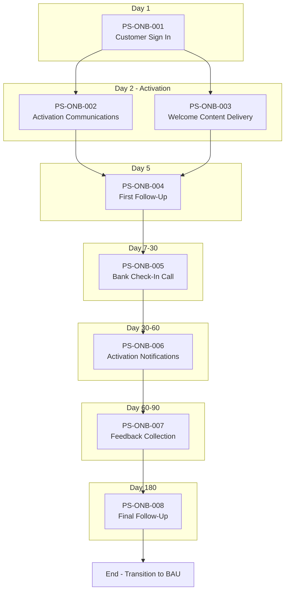

# Management Summary: Onboarding

**Document Type:** Process Documentation Management Summary (Amazon 6-Pager Format)
**Process ID:** ONB-001
**Business Unit:** BizBanking
**Document Owner:** Sarah Mitchell (Head of Customer Experience)
**Date:** 2025-12-09
**Version:** 1.0

---

## 1. Introduction

### The Problem

We are leaving revenue on the table: only 78% of new BizBanking customers activate within 30 days against a target of 85%, and only 65% complete the full 180-day onboarding journey (target: 70%). More critically, we have no Desktop Procedure (DTP) for this process - staff are operating without standardised guidance, creating execution inconsistency and compliance exposure.

### Background

The Onboarding process is a 180-day customer journey for new BizBanking customers, triggered at first sign-in. It spans multiple channels (SMS, email, phone, video, branch, social media) with 10-15 touchpoints designed to drive activation, education, and engagement. Seven systems support the process, with Email Marketing Platform and Call Centre System as core infrastructure.

### Purpose of This Document

This management summary analyzes the current state of the **Onboarding** process and recommends **3** strategic actions to **close the activation gap and establish operational discipline**.

**Decision Required:** Approve resource allocation for Desktop Procedure development and activation rate improvement initiatives.

### Scope

| Attribute | Value |
|-----------|-------|
| **Process Category** | Customer Lifecycle Management |
| **Geographic Scope** | EMEA |
| **Organizational Scope** | BizBanking |
| **Analysis Period** | December 2025 |

### Key Definitions

| Term | Definition |
|------|------------|
| Activation Rate | Percentage of customers completing activation within Day 30 |
| Journey Completion Rate | Percentage of customers completing the full 180-day onboarding journey |

---

## 2. Goals

### What Success Looks Like

A BizBanking customer who signs up is fully activated within 30 days, engaged throughout their first 180 days, and transitions smoothly to business-as-usual banking with a positive NPS score.

### Primary Objectives

| Objective | Baseline | Current | Target | Gap | Status |
|-----------|----------|---------|--------|-----|--------|
| Activation Rate (Day 30) | UNKNOWN ⚠️ | 78% | 85% | -7% | ⚠️ At risk |
| Day 5 Contact Rate | UNKNOWN ⚠️ | 92% | 95% | -3% | ⚠️ At risk |
| NPS Score (Day 90) | UNKNOWN ⚠️ | +35 | +40 | -5 | ⚠️ At risk |
| Journey Completion Rate | UNKNOWN ⚠️ | 65% | 70% | -5% | ⚠️ At risk |

### Success Metrics Summary

- **Primary Metric:** Activation Rate (Current: 78% → Target: 85%)
- **Secondary Metric:** Journey Completion Rate (Current: 65% → Target: 70%)
- **Lagging Indicator:** NPS Score at Day 90 (Current: +35 → Target: +40)

---

## 3. Tenets

### Guiding Principles

**1. Compliance First**
Every customer must pass KYC screening before entering the onboarding journey. Defence industry customers are declined - no exceptions.
*Trade-off: Compliance over speed - we will decline revenue to maintain regulatory standing.*

**2. Multi-Channel Engagement**
Customers receive touchpoints across SMS, email, phone, branch, and social media. We meet customers where they are.
*Trade-off: Coverage over efficiency - we invest in multiple channels rather than optimising for one.*

**3. Accountability at Every Step**
Every process step has a clear owner (Marketing Ops, Call Centre, Branch Network). Escalation paths are defined.
*Trade-off: Clarity over flexibility - we assign explicit ownership rather than shared responsibility.*

### Hard Constraints

| Constraint | Why It's Non-Negotiable | Impact If Violated |
|------------|-------------------------|-------------------|
| KYC/AML Screening | Regulatory requirement - banking licence at stake | Regulatory action, fines, licence revocation |
| 180-Day Journey Structure | Established customer lifecycle framework | Customer experience inconsistency, tracking breakdown |

---

## 4. State of the Business

### Executive Summary

The Onboarding process is structurally sound but operationally underperforming. All four KPIs are below target. The process has solid multi-channel architecture and effective compliance controls, but staff lack a standardised operating procedure (DTP). This is a governance failure: we have been operating for an extended period without documented procedures, relying on tribal knowledge and improvisation.

### Scorecard

| Metric | Value | Target | Status | Trend |
|--------|-------|--------|--------|-------|
| Activation Rate | 78% | 85% | ⚠️ At risk | Unknown |
| Day 5 Contact Rate | 92% | 95% | ⚠️ At risk | Unknown |
| NPS Score (Day 90) | +35 | +40 | ⚠️ At risk | Unknown |
| Journey Completion Rate | 65% | 70% | ⚠️ At risk | Unknown |

### What's Working

- **KYC screening is effective** - 0.8% decline rate against a target of <2%, indicating the control is calibrated correctly without over-declining
- **Multi-channel architecture is in place** - 7 systems integrated across SMS, email, phone, video, branch, and social media channels
- **Clear RACI matrix** - Every step has defined Responsible, Accountable, Consulted, Informed parties
- **Escalation paths defined** - 4-level escalation from Call Centre Agent to Head of Customer Experience
- **Compliance control automated** - KYC Defence Industry Screening runs automatically with no manual intervention required

### What's NOT Working

- **No Desktop Procedure (DTP)** - Staff have no standardised reference for process execution. New team members lack guidance. Process consistency varies between operators. This is unacceptable.
- **All KPIs below target** - Every measured metric is underperforming: Activation (-7%), Contact Rate (-3%), NPS (-5 points), Completion (-5%)
- **No baseline data** - We don't know where we started, so we can't measure improvement. Historical performance is unknown.
- **Confidence is MEDIUM** - Documentation was built from flowchart analysis and SME input; additional exceptions and controls may exist but haven't been captured

### Top 5 Critical Items

| Rank | Issue | Impact | Evidence | Owner |
|------|-------|--------|----------|-------|
| 1 | Missing Desktop Procedure (DTP) | HIGH - Operational inconsistency, compliance risk | GAP-ONB-001 identified in process documentation | Customer Experience |
| 2 | Activation Rate 7% below target | HIGH - Revenue leakage from unactivated customers | CRM Dashboard: 78% vs 85% target | Marketing Ops |
| 3 | Journey Completion 5% below target | MEDIUM - Customer attrition, relationship depth | Analytics: 65% vs 70% target | Customer Experience |
| 4 | Unknown baselines | MEDIUM - Cannot measure improvement | All metrics show current only, no baseline | Customer Experience |
| 5 | Partial regulatory coverage | MEDIUM - Only 1 control mapped to KYC/AML | Control assessment shows "Partial" coverage | Compliance |

---

## 5. Lessons Learned

### What We Got Right

- **Process structure is sound** - 8 sequential steps from sign-in to final follow-up, with clear phase definitions (Activation Day 1-5, Early Engagement Day 5-14, Mid-Journey Day 30-60, Late Journey Day 60-90, Close-Out Day 180)
- **Compliance integration works** - KYC screening is embedded at the right point (PS-ONB-002) and executes automatically
- **Multi-channel strategy is comprehensive** - We touch customers across 6 channels (SMS, email, phone, video, branch, social media) rather than relying on a single channel
- **Clear ownership exists** - RACI matrix assigns accountability for every step

### What We Got Wrong

We've been operating without a Desktop Procedure. This is a failure of process governance. Staff executing this process have no standardised reference document. New team members learn through osmosis. We've been relying on tribal knowledge and assuming consistency. The fact that we have "MEDIUM" confidence in our own documentation tells us we don't fully understand our own process. We have gaps. We know we have gaps. And until this analysis, we hadn't addressed them.

### Root Causes

| Problem | Root Cause | Evidence | Accountability |
|---------|------------|----------|----------------|
| Missing DTP | Process governance gap - documentation not prioritised | GAP-ONB-001 | Customer Experience |
| KPIs below target | Unknown - root cause analysis not performed | All 4 metrics below target | TBD - requires investigation |
| Unknown baselines | Measurement framework not established at process inception | "Baseline: Not established" across metrics | Customer Experience |

### Key Insights

1. **Process structure is sound; execution is the problem.** Fix execution discipline, not process design.
2. **Documentation is not optional.** Operating without a DTP creates compliance exposure and operational inconsistency.
3. **You can't improve what you don't measure.** Unknown baselines prevent performance improvement tracking.

---

## 6. Strategic Priorities

### Priority 1: Create Desktop Procedure (DTP)

**Objective:** Establish standardised operating procedures for the Onboarding process

**Why Now:** Staff are currently improvising. Every day without documented procedures is a day of inconsistent execution and compliance exposure. New team members joining without a DTP will perpetuate knowledge gaps.

**Actions:**

| # | Action | Owner | Deadline | Dependencies |
|---|--------|-------|----------|--------------|
| 1 | Document day-by-day activities for 180-day journey | Marketing Ops | TBD | None |
| 2 | Create system navigation guides for all 7 systems | IT Operations | TBD | Action 1 |
| 3 | Define decision trees for key process points | Customer Experience | TBD | Action 1 |
| 4 | Validate DTP with frontline staff | Call Centre Manager | TBD | Actions 1-3 |
| 5 | Publish DTP and train all operators | Customer Experience | TBD | Action 4 |

**Success Criteria:** DTP published, all operators trained, and consistent execution verified through quality checks

**If We Don't Do This:** Continued operational inconsistency. New staff will continue learning through tribal knowledge. Compliance exposure remains. If audited, we cannot demonstrate standardised procedures.

---

### Priority 2: Establish Measurement Baselines

**Objective:** Create historical baselines for all KPIs to enable performance tracking

**Why Now:** We cannot demonstrate improvement without knowing where we started. Every month without baselines is a month of improvement we cannot prove.

**Actions:**

| # | Action | Owner | Deadline | Dependencies |
|---|--------|-------|----------|--------------|
| 1 | Extract 12-month historical data for all 4 KPIs | IT Operations | TBD | CRM/Analytics access |
| 2 | Calculate baseline values for each metric | Customer Experience | TBD | Action 1 |
| 3 | Establish monthly reporting cadence | Customer Experience | TBD | Action 2 |
| 4 | Create performance dashboard | IT Operations | TBD | Action 3 |

**Success Criteria:** All 4 KPIs have documented baselines; monthly reporting operational

**If We Don't Do This:** We will continue operating blind. We cannot demonstrate ROI on any improvement initiative. Executive reporting will lack trend analysis.

---

### Priority 3: Improve Activation Rate

**Objective:** Increase Day 30 activation rate from 78% to 85%

**Why Now:** 7% gap represents unactivated customers - potential revenue leakage. Activation is the gateway to the rest of the customer journey; non-activated customers do not engage.

**Actions:**

| # | Action | Owner | Deadline | Dependencies |
|---|--------|-------|----------|--------------|
| 1 | Analyze non-activating customer cohort | Marketing Ops | TBD | CRM data |
| 2 | Identify activation blockers through customer feedback | Call Centre | TBD | Action 1 |
| 3 | Redesign Day 2-5 communications based on findings | Marketing Ops | TBD | Action 2 |
| 4 | A/B test new activation approach | Marketing Ops | TBD | Action 3 |
| 5 | Roll out improved activation journey | Marketing Ops | TBD | Action 4 |

**Success Criteria:** Activation rate reaches 85% target

**If We Don't Do This:** 7% of new customers will continue to not activate. These customers will likely churn. Journey completion rate will remain below target.

---

### Quick Wins (Do This Week)

| Action | Owner | Effort | Impact | Deadline |
|--------|-------|--------|--------|----------|
| Document current DTP draft from SME interviews | Marketing Ops | Low | High | TBD |
| Pull last 3 months activation data | IT Operations | Low | Medium | TBD |
| Schedule KPI baseline workshop | Customer Experience | Low | Medium | TBD |

### Immediate Next Steps

| Step | Owner | By When | Deliverable |
|------|-------|---------|-------------|
| Approve DTP development initiative | Sarah Mitchell | TBD | Go/No-Go decision |
| Assign DTP workstream lead | Sarah Mitchell | TBD | Named owner |
| Request baseline data extraction | Michael Andersen | TBD | Data extraction plan |

---

## Appendix

### A.1 Process Flow Diagram

### A.2 Complete Pain Point Register

| PP# | Pain Point | Category | Impact | Frequency | Priority | Root Cause |
|-----|------------|----------|--------|-----------|----------|------------|
| *None identified* | - | - | - | - | - | - |

### A.3 Complete Exception Register

| EX# | Exception | Trigger | Affected Steps | Frequency | Impact | Handling |
|-----|-----------|---------|----------------|-----------|--------|----------|
| EX-ONB-001 | KYC Check Defence Industry | KYC check identifies defence industry | PS-ONB-002 | Rare | High - Process termination | Automated decline email |

### A.4 Control Point Matrix

| CP# | Control | Type | Regulation | Step | Effectiveness | Evidence |
|-----|---------|------|------------|------|---------------|----------|
| CP-ONB-001 | KYC Defence Industry Screening | PREVENTIVE | KYC/AML - Restricted Industry | PS-ONB-002 | HIGH | 0.8% decline rate, automated execution |

### A.5 System Dependency Map

| SYS# | System | Type | Purpose | Integration Points |
|------|--------|------|---------|-------------------|
| SYS-ONB-001 | SMS Gateway | SUPPORTING | Send mobile SMS communications | PS-ONB-002 |
| SYS-ONB-002 | Email Marketing Platform | CORE | Manage email campaigns, welcome emails, targeted campaigns | PS-ONB-002, PS-ONB-003, PS-ONB-005, PS-ONB-006 |
| SYS-ONB-003 | Video Content Platform | SUPPORTING | Host and deliver demo/introductory videos | PS-ONB-003 |
| SYS-ONB-004 | Call Centre System | CORE | Manage customer calls, check-ins, feedback collection | PS-ONB-005, PS-ONB-006, PS-ONB-007, PS-ONB-008 |
| SYS-ONB-005 | KYC Screening System | CORE | Perform KYC checks, industry screening | PS-ONB-002 |
| SYS-ONB-006 | Social Media Management | SUPPORTING | Execute social media campaigns | PS-ONB-007 |
| SYS-ONB-007 | Digital Campaign Manager | SUPPORTING | Manage targeted digital campaigns | PS-ONB-005 |

### A.6 RACI Matrix

| Activity | Customer Experience | Marketing Ops | Call Centre | Branch Network | Compliance | IT Ops |
|----------|---------------------|---------------|-------------|----------------|------------|--------|
| PS-ONB-001 Customer Sign In | A | - | - | - | - | R |
| PS-ONB-002 Activation Comms | A | R | - | - | C | I |
| PS-ONB-003 Welcome Content | A | R | - | - | - | I |
| PS-ONB-004 First Follow-Up | A | I | R | - | - | - |
| PS-ONB-005 Check-In Call | A | C | R | - | - | - |
| PS-ONB-006 Activation Notif | A | C | I | R | - | - |
| PS-ONB-007 Feedback | A | I | R | C | - | - |
| PS-ONB-008 Final Follow-Up | A | - | R | - | - | - |
| KYC Screening | I | - | - | - | R | C |

**Legend:** R = Responsible, A = Accountable, C = Consulted, I = Informed

### A.7 Document Confidence Analysis

| Section | Confidence | Key Gaps | Validation Required |
|---------|------------|----------|---------------------|
| Process Overview | MEDIUM | Volume metrics to be confirmed | SME validation |
| Process Steps | HIGH | None | - |
| Exceptions | MEDIUM | Additional exceptions may exist | Expanded SME interviews |
| Control Points | MEDIUM | Additional controls may exist | Compliance review |
| System Dependencies | MEDIUM | Integration details inferred | IT Operations validation |
| Organizational Mapping | HIGH | Mock data for testing | Confirm in production |
| Documentation References | HIGH | Mock data for testing | Confirm in production |
| Process Gaps | MEDIUM | Additional gaps may exist | Continuous discovery |
| Pain Points | MEDIUM | SME indicated no issues | Independent validation |

### A.8 Source Documents

| Document | Type | Date | Relevance |
|----------|------|------|-----------|
| as-is-process-documentation.md | Process Documentation | 2025-12-09 | Primary source |
| exceptions-detail.md | Exception Analysis | 2025-12-09 | Exception details |
| pain-points-detail.md | Pain Point Analysis | 2025-12-09 | Pain point details |
| control-points-detail.md | Control Analysis | 2025-12-09 | Control details |

### A.9 Contributors

| Name | Role | Contribution | Date |
|------|------|--------------|------|
| Markus | COO | SME input, process validation | 2025-12-09 |

---

**Document Metadata**

| Attribute | Value |
|-----------|-------|
| Source Document | [as-is-process-documentation.md](./as-is-process-documentation.md) |
| Generated By | ProcessMiner Process Documentation Analyst |
| Document ID | ONB-001-mgmt-summary |
| Last Updated | 2025-12-09 |

---

_This management summary follows the Amazon 6-Pager format for executive decision-making._
_Generated by ProcessMiner Module_
