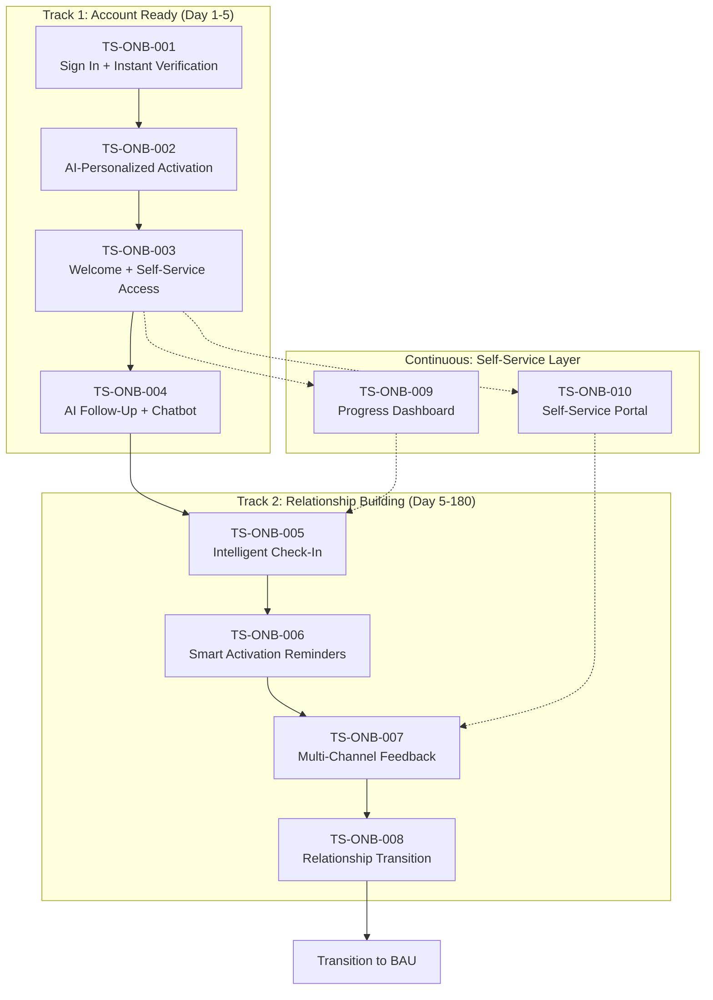

# Target State Documentation: Onboarding

**Document Type:** TO-BE Process Transformation Design
**Business Unit:** BizBanking
**Region:** EMEA
**Document Owner:** Sarah Mitchell (Head of Customer Experience)
**Transformation Lead:** Peter (SME)
**Last Updated:** 2025-12-09
**Version:** 1.0 (Draft)

---

## Executive Summary

The Onboarding process transformation redesigns the 180-day customer journey into a modern, AI-first experience that matches fintech expectations while maintaining strong regulatory compliance. The transformation is opportunity-driven rather than crisis-driven, leveraging a solid compliance foundation to enable bold client experience improvements.

Key transformation themes include: (1) AI-first automation strategy replacing traditional RPA where possible, (2) Two-track journey design that achieves "Account Ready" by Day 5 while maintaining relationship building through Day 180, and (3) Self-service capabilities empowering customers to manage their own onboarding experience.

The transformation integrates all 10 identified innovations, implements 8 transformation decisions, and targets a 50-60% reduction in Client Effort Score while improving control effectiveness from 4.4/5 to 4.8/5.

### Transformation Metrics at a Glance

| Metric | AS-IS | TO-BE Target | Change | Improvement |
|--------|-------|--------------|--------|-------------|
| Process Steps | 8 | 10 | +2 | New self-service capabilities |
| Control Gaps | 0 | 0 | — | Maintained |
| Pain Points | 0 | 0 | — | Maintained |
| Client Effort Score (CES) | Est. High | Est. Low | -50-60% | Significant |
| Exceptions | 1 | 1 | — | Maintained |
| Automation Level | ~30% | ~80% | +50% | AI-first strategy |

### Validation Status

| Specialist | Status | Key Findings |
|------------|--------|--------------|
| Control Analyst | PENDING | Awaiting validation |
| Client Journey Analyst | PENDING | Awaiting validation |
| Innovation Analyst | PENDING | Awaiting validation |
| Process Documentation Analyst | PENDING | Awaiting validation |

---

## How to Read This Document

> This document captures the **target state (TO-BE)** design for the Onboarding process transformation. It provides a fresh process structure optimized for the future state while maintaining full traceability to the AS-IS documentation.
>
> **Source Documents (AS-IS):**
> - [AS-IS Process Documentation](./as-is-process-documentation.md) - Current state process
> - [CX Journey Documentation](./cx-journey-documentation.md) - Current client experience
> - [Compliance Control Assessment](./compliance-control-assessment.md) - Current controls
> - [Innovation Analysis](./innovation-analysis.md) - Innovation inputs
>
> **Companion Documents (TO-BE):**
> - [Transformation Decisions Detail](./transformation-decisions-detail.md) - Full TD# analysis
> - [Gap Resolution Log](./gap-resolution-log.md) - VG# tracking and resolution
>
> **Reference System:**
> - **TS#** - Target State Process Step
> - **TC#** - Target Control
> - **TJ#** - Target Journey Touchpoint
> - **TD#** - Transformation Decision
> - **VG#** - Validation Gap
>
> **Change Type Legend:**
> - **Unchanged** - Step remains as-is
> - **Modified** - Step changed but exists
> - **Eliminated** - Step removed
> - **Automated** - Manual → automated
> - **Consolidated** - Multiple steps merged
> - **New** - Net new step added

---

## 1. Transformation Overview

### 1.1 Transformation Identification

| Attribute | Value |
|-----------|-------|
| **Process Name** | Onboarding |
| **Process ID** | ONB-001 |
| **Transformation ID** | TRX-ONB-001 |
| **Transformation Type** | Opportunity-Driven Modernization |
| **Target Go-Live** | TBD |

### 1.2 Transformation Objectives

1. **Match Fintech Experience** — Reduce perceived completion time from 180 days to 5 days through two-track journey design
2. **AI-First Automation** — Implement intelligent automation using AI agents rather than traditional RPA
3. **Self-Service Empowerment** — Enable customers to manage their own onboarding via portal and progress tracker
4. **Control Enhancement** — Improve control effectiveness from 4.4/5 to 4.8/5 while eliminating manual controls
5. **Activation Improvement** — Increase Day 30 activation rate from 78% to 85%+

### 1.3 Scope Definition

**In Scope:**
- All 8 AS-IS process steps (PS-ONB-001 to PS-ONB-008)
- All 8 AS-IS controls (CP-ONB-001 to CP-ONB-008)
- All 10 innovation ideas (II-ONB-001 to II-ONB-010)
- Client experience journey redesign
- System integration for automation

**Out of Scope:**
- Account opening process (pre-trigger)
- Post-onboarding BAU relationship management
- Core banking system replacement
- Regulatory framework changes

### 1.4 Constraints and Dependencies

**Non-Negotiables:**
- KYC Defence Industry Screening must remain (regulatory requirement)
- Four-eyes principle for KYC approval (SOD control)
- 5-year data retention for AML (AMLD 4/5/6)
- GDPR consent capture at sign-in

**Technical Dependencies:**
- KYC Screening System (SYS-ONB-005) — core system, integrate not replace
- Email Marketing Platform (SYS-ONB-002) — RPA/AI must work with existing platform
- IBM Partnership — leverage for legacy system integration
- Google Chatbot Pilot — expand existing infrastructure

**Resource Constraints:**
- Budget: €1.48M over 3 years for MUST HAVEs
- Team: 7 FTE developers, 1.5 FTE Product Owners, 1 FTE Change Manager

### 1.5 Key Stakeholders

| Stakeholder | Role | Transformation Responsibility |
|-------------|------|-------------------------------|
| Sarah Mitchell | Head of Customer Experience | Process Owner, Final Approval |
| Peter | SME | Target State Design, Validation |
| James Chen | Digital Marketing Manager | AI Personalization Implementation |
| Linda Torres | Call Centre Manager | Chatbot Integration, Human Escalation |
| Emma Schultz | Compliance Officer | Control Validation, KYC Automation Oversight |
| Michael Andersen | IT Operations | System Integration, AI Implementation |

> **Section Confidence:** HIGH | **Basis:** SME elicitation with full decision capture

---

## 2. AS-IS to TO-BE Reconciliation

### 2.1 Process Step Reconciliation

| AS-IS Ref | AS-IS Step Name | Change Type | TO-BE Ref | TO-BE Step Name | Rationale |
|-----------|-----------------|-------------|-----------|-----------------|-----------|
| PS-ONB-001 | Customer Sign In | Modified | TS-ONB-001 | Customer Sign In + Instant Verification | AI first-eyes automates initial verification (TD-ONB-004) |
| PS-ONB-002 | Activation Communications | Automated | TS-ONB-002 | AI-Personalized Activation | GenAI personalization replaces generic comms (TD-ONB-005, TD-ONB-006) |
| PS-ONB-003 | Welcome Content Delivery | Automated | TS-ONB-003 | Personalized Welcome & Self-Service Access | Includes portal access, progress tracker (TD-ONB-005) |
| PS-ONB-004 | First Follow-Up | Modified | TS-ONB-004 | AI-Driven Follow-Up + Chatbot | Chatbot handles routine; human for exceptions (TD-ONB-001) |
| PS-ONB-005 | Bank Check-In Call | Modified | TS-ONB-005 | Intelligent Check-In (AI Nudges) | AI nudges replace scheduled calls (TD-ONB-007) |
| PS-ONB-006 | Activation Notifications | Automated | TS-ONB-006 | Smart Activation Reminders | Personalized, progress-aware (TD-ONB-005, TD-ONB-007) |
| PS-ONB-007 | Feedback Collection | Modified | TS-ONB-007 | Multi-Channel Feedback | Self-service portal adds channel (TD-ONB-003) |
| PS-ONB-008 | Final Follow-Up | Modified | TS-ONB-008 | Relationship Transition + Data Retention | Hybrid automated retention (TD-ONB-002, TD-ONB-005) |
| — | *NEW* | New | TS-ONB-009 | Real-Time Progress Dashboard | II-ONB-009 (TD-ONB-005, TD-ONB-007) |
| — | *NEW* | New | TS-ONB-010 | Self-Service Onboarding Portal | II-ONB-008 (TD-ONB-003, TD-ONB-007) |

### 2.2 Reconciliation Statistics

| Change Type | Count | % of Total |
|-------------|-------|------------|
| Unchanged | 0 | 0% |
| Modified | 5 | 50% |
| Eliminated | 0 | 0% |
| Automated | 3 | 30% |
| Consolidated | 0 | 0% |
| New | 2 | 20% |

### 2.3 Exception Reconciliation

| AS-IS Ref | Exception | Disposition | TO-BE Handling | Rationale |
|-----------|-----------|-------------|----------------|-----------|
| EX-ONB-001 | KYC Check Defence Industry | Maintained | AI-flagged, human-confirmed decline | Regulatory requirement; AI assists but human decides |

### 2.4 Pain Point Resolution

| AS-IS Ref | Pain Point | Resolution Status | TO-BE Resolution | Linked TS# |
|-----------|------------|-------------------|------------------|------------|
| GAP-ONB-001 | Missing Desktop Procedure | Resolved | Layered approach: DTP + contextual help + AI assistant | TS-ONB-004 (TD-ONB-001) |

> **Section Confidence:** HIGH | **Basis:** Full reconciliation with SME approval

---

## 3. TO-BE Process Design

### 3.1 Process Overview

The TO-BE Onboarding process is structured as a **two-track journey**:

- **Track 1: Account Ready (Day 1-5)** — Compressed activation focused on getting the customer operational. Client perceives "completion" at end of Track 1.
- **Track 2: Relationship Building (Day 5-180)** — Repositioned as value-add engagement, not onboarding tasks. Communications framed as exclusive tips, offers, and relationship support.

Two new **continuous capabilities** support both tracks:
- Real-Time Progress Dashboard (TS-ONB-009)
- Self-Service Onboarding Portal (TS-ONB-010)

### 3.2 TO-BE Process Flow

### 3.3 Target State Process Steps

| TS# | Step Name | Owner | System(s) | Automation | Rationale |
|-----|-----------|-------|-----------|------------|-----------|
| TS-ONB-001 | Sign In + Instant Verification | Digital Banking + AI | KYC System, AI Engine | High | AI first-eyes (TD-ONB-004) |
| TS-ONB-002 | AI-Personalized Activation | Marketing Ops | Email, SMS, GenAI | High | Personalization (TD-ONB-005) |
| TS-ONB-003 | Welcome + Self-Service Access | Marketing Ops | Portal, Video, Tracker | High | Two-track design (TD-ONB-005) |
| TS-ONB-004 | AI Follow-Up + Chatbot | Call Centre + AI | Chatbot, Call Centre | Medium | Layered support (TD-ONB-001) |
| TS-ONB-005 | Intelligent Check-In | AI + Call Centre | AI Nudge Engine | High | Smart engagement (TD-ONB-007) |
| TS-ONB-006 | Smart Activation Reminders | Marketing Ops | Email, AI Engine | High | Progress-aware (TD-ONB-005) |
| TS-ONB-007 | Multi-Channel Feedback | Call Centre | Portal, Phone, Social | Medium | Self-service option (TD-ONB-003) |
| TS-ONB-008 | Relationship Transition | Call Centre + DPO | Call Centre, Retention System | Medium | Hybrid automation (TD-ONB-002) |
| TS-ONB-009 | Progress Dashboard | Digital Experience | Portal, Mobile App | High | Transparency (TD-ONB-007) |
| TS-ONB-010 | Self-Service Portal | Digital Experience | Web Portal | High | Self-service (TD-ONB-003) |

### 3.4 Process Step Details

#### TS-ONB-001: Customer Sign In + Instant Verification

| Attribute | Value |
|-----------|-------|
| **Step Name** | Customer Sign In + Instant Verification |
| **Owner** | Digital Banking Team |
| **System(s)** | KYC Screening System, AI Verification Engine |
| **Automation Level** | High (AI first-eyes) |
| **Input(s)** | Customer credentials, ID documents |
| **Output(s)** | Verified identity, KYC review summary |
| **AS-IS Reference** | PS-ONB-001 |
| **Change Type** | Modified |

**Description:**
Customer signs in to banking platform. AI agent performs instant document verification, PEP screening, high-risk country check, and beneficial ownership analysis for common structures. Prepares comprehensive review summary for human checker (second eyes).

**Rationale for Change:**
TD-ONB-004 — AI first-eyes reduces KYC processing time while maintaining four-eyes compliance. Human reviewer focuses on exceptions and judgement calls.

**Controls at this Step:** TC-ONB-001, TC-ONB-002, TC-ONB-003, TC-ONB-004, TC-ONB-005, TC-ONB-006, TC-ONB-009

---

#### TS-ONB-002: AI-Personalized Activation Communications

| Attribute | Value |
|-----------|-------|
| **Step Name** | AI-Personalized Activation Communications |
| **Owner** | Marketing Operations |
| **System(s)** | Email Marketing Platform, SMS Gateway, GenAI Engine |
| **Automation Level** | High (GenAI-driven) |
| **Input(s)** | Customer profile, segment data, behavior signals |
| **Output(s)** | Personalized SMS, email, pre-approved offers |
| **AS-IS Reference** | PS-ONB-002 |
| **Change Type** | Automated |

**Description:**
Day 2 communications generated by GenAI based on customer segment, behavior signals, and journey stage. Personalized content replaces generic templates. Includes defence industry screening trigger (EX-ONB-001).

**Rationale for Change:**
TD-ONB-005, TD-ONB-006 — AI-personalized content (II-ONB-002) drives activation rate improvement from 78% to 85%.

**Controls at this Step:** TC-ONB-001, TC-ONB-007

---

#### TS-ONB-003: Personalized Welcome & Self-Service Access

| Attribute | Value |
|-----------|-------|
| **Step Name** | Personalized Welcome & Self-Service Access |
| **Owner** | Marketing Operations |
| **System(s)** | Video Content Platform, Self-Service Portal, Progress Tracker |
| **Automation Level** | High |
| **Input(s)** | Customer profile, KYC status |
| **Output(s)** | Welcome content, portal credentials, progress visibility |
| **AS-IS Reference** | PS-ONB-003 |
| **Change Type** | Automated |

**Description:**
Delivers personalized welcome content (demo video, bank process presentation) plus access credentials for self-service portal and progress tracker. Customer sees "Account Ready" status and clear "You're set up!" messaging.

**Rationale for Change:**
TD-ONB-005 — Two-track journey design. Client perceives completion at Day 5; Track 2 positioned as relationship value-add.

**Controls at this Step:** TC-ONB-007

---

#### TS-ONB-004: AI-Driven Follow-Up + Chatbot

| Attribute | Value |
|-----------|-------|
| **Step Name** | AI-Driven Follow-Up + Chatbot |
| **Owner** | Call Centre Team + AI |
| **System(s)** | Chatbot Platform (Google), Call Centre System |
| **Automation Level** | Medium (AI routine, human exceptions) |
| **Input(s)** | Customer query, activation status |
| **Output(s)** | Query resolution, escalation if needed |
| **AS-IS Reference** | PS-ONB-004 |
| **Change Type** | Modified |

**Description:**
Day 5 follow-up handled by chatbot for routine queries and activation checks. Chatbot guides customers through common questions, checks activation status, and provides next steps. Human agents available via seamless escalation for complex issues.

**Rationale for Change:**
TD-ONB-001 — Layered approach with AI assistant for both staff and customers. Chatbot handles 30%+ of queries, reducing call centre load.

**Controls at this Step:** None (relationship touchpoint)

---

#### TS-ONB-005: Intelligent Check-In (AI Nudges)

| Attribute | Value |
|-----------|-------|
| **Step Name** | Intelligent Check-In (AI Nudges) |
| **Owner** | AI Engine + Call Centre |
| **System(s)** | AI Nudge Engine, Call Centre System, Digital Campaign Manager |
| **Automation Level** | High |
| **Input(s)** | Customer behavior data, engagement signals |
| **Output(s)** | Personalized nudge, targeted campaign |
| **AS-IS Reference** | PS-ONB-005 |
| **Change Type** | Modified |

**Description:**
AI monitors customer behavior and triggers personalized nudges at optimal moments rather than fixed Day 7-30 schedule. Engaged customers receive lighter touch; disengaged customers get proactive outreach. Human calls reserved for high-value or at-risk customers.

**Rationale for Change:**
TD-ONB-007 — II-ONB-010 (AI Nudges) replaces rigid schedule with smart, behavior-driven engagement.

**Controls at this Step:** None (relationship touchpoint)

---

#### TS-ONB-006: Smart Activation Reminders

| Attribute | Value |
|-----------|-------|
| **Step Name** | Smart Activation Reminders |
| **Owner** | Marketing Operations + Branch Network |
| **System(s)** | Email Marketing Platform, AI Engine |
| **Automation Level** | High |
| **Input(s)** | Activation status, progress data |
| **Output(s)** | Progress-aware notification, branch engagement if needed |
| **AS-IS Reference** | PS-ONB-006 |
| **Change Type** | Automated |

**Description:**
Day 30/45 notifications are progress-aware and personalized. Only sent if customer hasn't activated; tone is helpful ("Here's what's left") not nagging. Branch engagement reserved for customers needing high-touch support.

**Rationale for Change:**
TD-ONB-005 — Part of Track 2 "Relationship Building" positioning. Framed as helpful support, not onboarding task.

**Controls at this Step:** None (relationship touchpoint)

---

#### TS-ONB-007: Multi-Channel Feedback Collection

| Attribute | Value |
|-----------|-------|
| **Step Name** | Multi-Channel Feedback Collection |
| **Owner** | Call Centre Team |
| **System(s)** | Call Centre System, Self-Service Portal, Social Media Management |
| **Automation Level** | Medium |
| **Input(s)** | Customer feedback (any channel) |
| **Output(s)** | Feedback record, NPS score |
| **AS-IS Reference** | PS-ONB-007 |
| **Change Type** | Modified |

**Description:**
Feedback collected via multiple channels including self-service portal (new), phone, and social media. Customer can provide feedback when convenient through portal rather than waiting for scheduled call.

**Rationale for Change:**
TD-ONB-003 — Self-service portal (II-ONB-008) adds always-available feedback channel. Reduces scheduled call burden while improving feedback quality.

**Controls at this Step:** None (relationship touchpoint)

---

#### TS-ONB-008: Relationship Transition + Automated Data Retention

| Attribute | Value |
|-----------|-------|
| **Step Name** | Relationship Transition + Automated Data Retention |
| **Owner** | Call Centre Team + Data Protection Officer |
| **System(s)** | Call Centre System, Data Retention System |
| **Automation Level** | Medium (hybrid) |
| **Input(s)** | Journey completion status, customer data |
| **Output(s)** | BAU transition, retention classification |
| **AS-IS Reference** | PS-ONB-008 |
| **Change Type** | Modified |

**Description:**
Day 180 marks transition to BAU relationship (not "end of onboarding"). System auto-triggers data retention review, auto-classifies data by retention category, human confirms classification. Communication framed as relationship milestone.

**Rationale for Change:**
TD-ONB-002 — Hybrid automation for data retention improves effectiveness 3.2 → 4.5. TD-ONB-005 — Track 2 messaging positions this as positive milestone.

**Controls at this Step:** TC-ONB-008

---

#### TS-ONB-009: Real-Time Progress Dashboard (NEW)

| Attribute | Value |
|-----------|-------|
| **Step Name** | Real-Time Progress Dashboard |
| **Owner** | Digital Experience Team |
| **System(s)** | Self-Service Portal, Mobile App |
| **Automation Level** | High |
| **Input(s)** | Journey status, completion data |
| **Output(s)** | Visual progress display |
| **AS-IS Reference** | — (NEW) |
| **Change Type** | New |

**Description:**
Visual dashboard showing customers exactly where they are in the journey, what's completed, what's next. Available 24/7 via portal and mobile app. Clearly shows Track 1 completion ("Account Ready!") and Track 2 value-adds.

**Rationale for Change:**
TD-ONB-005, TD-ONB-007 — II-ONB-009 enables transparency, reduces "where am I?" calls, sets expectations clearly.

**Controls at this Step:** None (informational)

---

#### TS-ONB-010: Self-Service Onboarding Portal (NEW)

| Attribute | Value |
|-----------|-------|
| **Step Name** | Self-Service Onboarding Portal |
| **Owner** | Digital Experience Team |
| **System(s)** | Self-Service Portal (Web, Mobile) |
| **Automation Level** | High |
| **Input(s)** | Customer actions, documents, preferences |
| **Output(s)** | Document upload confirmation, consent updates, feedback |
| **AS-IS Reference** | — (NEW) |
| **Change Type** | New |

**Description:**
Dedicated portal for: document upload, consent preference management (view/modify anytime), onboarding status tracking, feedback submission, FAQ and chatbot access. Available on web and mobile.

**Rationale for Change:**
TD-ONB-003, TD-ONB-007 — II-ONB-008 enables self-service, improves consent management (TC-ONB-006), reduces call centre dependency.

**Controls at this Step:** TC-ONB-006, TC-ONB-007

---

### 3.5 Process Improvements Summary

| Improvement Area | AS-IS State | TO-BE State | Impact |
|------------------|-------------|-------------|--------|
| Perceived completion | Day 180 | Day 5 | -97% perceived duration |
| Automation level | ~30% | ~80% | +50% automation |
| Self-service capability | None | Full portal | New capability |
| Communication personalization | Generic templates | AI-personalized | Improved engagement |
| Progress visibility | None | Real-time dashboard | Transparency |
| Consent management | Bank-controlled | Customer self-service | Empowerment |

> **Section Confidence:** HIGH | **Basis:** Full step design with SME approval

---

## 4. Control Design

### 4.1 Control Transformation Summary

The control transformation focuses on enhancing effectiveness through AI-first automation while maintaining all regulatory requirements. Key changes:
- AI first-eyes for all KYC controls (human remains final approver)
- Hybrid automation for data retention (system trigger + human confirmation)
- Self-service consent management (customer empowerment)
- New AI audit trail control for EU AI Act compliance

### 4.2 Control Reconciliation

| AS-IS Ref | Control Name | Disposition | TO-BE Ref | TO-BE Control | Change Rationale |
|-----------|--------------|-------------|-----------|---------------|------------------|
| CP-ONB-001 | KYC Defence Industry Screening | Enhanced | TC-ONB-001 | AI-Assisted KYC Defence Screening | AI first-eyes, human second-eyes (TD-ONB-004) |
| CP-ONB-002 | Customer Identity Verification | Enhanced | TC-ONB-002 | AI-First Identity Verification | AI performs verification, human approves (TD-ONB-004) |
| CP-ONB-003 | Beneficial Ownership Identification | Enhanced | TC-ONB-003 | AI-Assisted BO Analysis | AI handles common structures (TD-ONB-004) |
| CP-ONB-004 | PEP Screening | Enhanced | TC-ONB-004 | AI-First PEP Screening | Automated screening, human review of matches (TD-ONB-004) |
| CP-ONB-005 | High-Risk Country Screening | Enhanced | TC-ONB-005 | AI-First Country Risk Screening | Automated assessment (TD-ONB-004) |
| CP-ONB-006 | Data Processing Consent Capture | Enhanced | TC-ONB-006 | Self-Service Consent Management | Customer manages via portal (TD-ONB-003) |
| CP-ONB-007 | Communication Opt-In Verification | Enhanced | TC-ONB-007 | Real-Time Consent Validation | Real-time database validation (TD-ONB-003) |
| CP-ONB-008 | Data Retention Compliance | Automated | TC-ONB-008 | Hybrid Automated Data Retention | System trigger + human confirmation (TD-ONB-002) |
| — | *NEW* | New | TC-ONB-009 | AI Decision Audit Trail | EU AI Act compliance (TD-ONB-004, TD-ONB-006) |
| — | *NEW* | New | TC-ONB-010 | Biometric Verification | Conditional on regulatory approval (TD-ONB-008) |

### 4.3 Control Gap Closures

| Gap ID | AS-IS Gap Description | TO-BE Resolution | TC# Reference | Verification Method |
|--------|----------------------|------------------|---------------|---------------------|
| (None) | No critical control gaps in AS-IS | N/A | N/A | N/A |

### 4.4 New Controls Introduced

| TC# | Control Name | Regulation/Requirement | Process Step | Control Type | Rationale |
|-----|--------------|------------------------|--------------|--------------|-----------|
| TC-ONB-009 | AI Decision Audit Trail | EU AI Act | TS-ONB-001 | DETECTIVE | Document AI decision logic for transparency |
| TC-ONB-010 | Biometric Verification | Enhanced CDD | TS-ONB-001 | PREVENTIVE | Conditional: implement when regulatory approval obtained |

### 4.5 Segregation of Duties (SOD) Verification

| SOD Requirement | AS-IS Implementation | TO-BE Implementation | Status |
|-----------------|---------------------|---------------------|--------|
| KYC Four-Eyes Principle | Maker (Human) + Checker (Human) | Maker (AI) + Checker (Human) | ✓ Preserved |
| Final Approval Authority | Human reviewer | Human reviewer | ✓ Preserved |
| System Enforcement | Automated workflow | Automated workflow | ✓ Preserved |

### 4.6 Audit Trail Requirements

All TO-BE controls maintain complete audit trails:
- AI decisions logged with inputs, logic applied, outputs, confidence scores (TC-ONB-009)
- Human confirmations timestamped with reviewer ID
- Customer self-service actions logged with IP, timestamp, action type
- 5-year retention for AML-related controls (AMLD 4/5/6)
- Consent records retained for duration + 1 year (GDPR)

### 4.7 Regulatory Coverage (TO-BE)

| Regulation | Controls Mapped | Coverage Status | Gap Status |
|------------|-----------------|-----------------|------------|
| AMLD 4 | TC-001, TC-002, TC-003, TC-008 | Full | No gaps |
| AMLD 5 | TC-001, TC-003, TC-005 | Full | No gaps |
| AMLD 6 | TC-001 | Full | No gaps |
| FATF R10, R12, R24 | TC-001, TC-002, TC-003, TC-004 | Full | No gaps |
| GDPR Art.7 | TC-006, TC-007, TC-008 | Full | No gaps |
| EU AI Act | TC-009 | Full | No gaps (proactive) |

### 4.8 Control Effectiveness Summary

| Metric | AS-IS | TO-BE | Improvement |
|--------|-------|-------|-------------|
| Average Effectiveness | 4.4/5 | 4.8/5 | +9% |
| Controls with Complete Audit Trail | 75% | 100% | +25% |
| Highly Effective Controls (≥4.5) | 5 | 9 | +4 |
| Manual Controls | 2 | 0 | -100% |

> **Section Confidence:** HIGH | **Basis:** Full control mapping with SOD verification

---

## 5. Client Experience Design

### 5.1 CX Transformation Summary

The CX transformation implements a **two-track journey** that aligns with client mental models:
- Track 1 compresses activation to Day 1-5; client perceives "Account Ready"
- Track 2 repositions Day 5-180 as relationship value-add, not onboarding burden
- Self-service capabilities empower customers to manage their own experience
- AI personalization replaces generic communications

### 5.2 CES Comparison

| Metric | AS-IS (Est.) | TO-BE (Est.) | Reduction | % Improvement |
|--------|--------------|--------------|-----------|---------------|
| Client Actions Required | 12-15 | 5-7 | -7-8 | -50% |
| Documents to Submit | 4-6 | 2-3 | -2-3 | -50% |
| Information Requests | 3-5 | 1-2 | -2-3 | -60% |
| Follow-ups Required | 2-4 | 0-1 | -2-3 | -75% |
| Channel Switches | 4-6 | 1-2 | -3-4 | -66% |
| Perceived Duration | 180 days | 5 days | -175 days | -97% |
| **Overall CES** | **High** | **Low** | **-50-60%** | **Significant** |

### 5.3 Journey Touchpoint Reconciliation

| AS-IS Context | Disposition | TO-BE Ref | TO-BE Touchpoint | Track | Channel |
|---------------|-------------|-----------|------------------|-------|---------|
| Sign-in experience | Enhanced | TJ-ONB-001 | Instant Sign-In + AI Verification | 1 | Digital |
| Day 2 SMS/Email | Personalized | TJ-ONB-002 | AI-Personalized Welcome | 1 | SMS, Email |
| Welcome video/content | Enhanced | TJ-ONB-003 | Personalized Content + Portal Access | 1 | Digital, Video |
| Day 5 follow-up call | Automated | TJ-ONB-004 | Chatbot Check-In (Human if needed) | 1 | Chatbot, Phone |
| Day 7-30 check-in | Smart | TJ-ONB-005 | AI-Driven Nudges | 2 | Multi-channel |
| Day 30/45 notifications | Personalized | TJ-ONB-006 | Progress-Aware Reminders | 2 | Email, App |
| Day 60-90 feedback | Multi-channel | TJ-ONB-007 | Self-Service + Outbound Feedback | 2 | Portal, Phone |
| Day 180 close-out | Repositioned | TJ-ONB-008 | Relationship Milestone | 2 | Email, Phone |
| — (NEW) | New | TJ-ONB-009 | Real-Time Progress Visibility | 1 & 2 | Portal, App |
| — (NEW) | New | TJ-ONB-010 | Self-Service Portal | 1 & 2 | Web, Mobile |

### 5.4 Friction Point Resolution

| Friction Point | Resolution | TO-BE Touchpoint | Innovation |
|----------------|------------|------------------|------------|
| "Where am I in the process?" | Real-time progress dashboard | TJ-ONB-009 | II-ONB-009 |
| Generic communications feel impersonal | AI-personalized content | TJ-ONB-002, TJ-ONB-005, TJ-ONB-006 | II-ONB-002 |
| Can't self-serve, must call/wait | Self-service portal | TJ-ONB-010 | II-ONB-008 |
| 180-day journey feels endless | Two-track design; "Account Ready" by Day 5 | All | TD-ONB-005 |
| Consent management unclear | Self-service consent in portal | TJ-ONB-010 | II-ONB-008 |
| Scheduled calls interrupt workflow | AI nudges at optimal moments | TJ-ONB-005 | II-ONB-010 |

### 5.5 Moments That Matter (TO-BE)

| Moment | TO-BE Touchpoint | Enhancement | Expected Impact |
|--------|------------------|-------------|-----------------|
| First Sign-In | TJ-ONB-001 | AI instant verification; immediate progress visibility | "This is fast and modern" |
| Account Ready | TJ-ONB-003 | Clear "You're set up!" message by Day 5 | Client feels complete; NPS boost |
| First Question/Problem | TJ-ONB-004 | 24/7 chatbot + easy human escalation | Exception handling builds trust |
| Ongoing Value | TJ-ONB-005, TJ-ONB-006 | Smart, personalized engagement | Relationship deepens; retention |

### 5.6 Channel Strategy (TO-BE)

| Channel | Primary Use | Track | Preference |
|---------|-------------|-------|------------|
| Digital Portal | Self-service, progress, consent | 1 & 2 | Primary |
| Mobile App | Progress tracking, notifications | 1 & 2 | Primary |
| Chatbot | Routine queries, guidance | 1 & 2 | Primary |
| Email | Personalized communications | 1 & 2 | Supporting |
| SMS | Urgent notifications, nudges | 1 & 2 | Supporting |
| Phone | Escalation, high-touch support | 2 | Exception only |
| Branch | Complex needs, relationship | 2 | Exception only |

> **Section Confidence:** HIGH | **Basis:** Full journey redesign with SME approval

---

## 6. Innovation Integration

### 6.1 Innovation Integration Summary

All 10 identified innovations are included in the target state:
- 3 MUST HAVEs: Fully integrated
- 4 SHOULD HAVEs: Fully integrated
- 2 COULD HAVEs: Integrated with conditions
- 1 DEFER: Architecture prepared for 2026

**Key strategic decision (TD-ONB-006):** AI-first automation approach; RPA limited to legacy system integration only.

### 6.2 Integrated Innovations

| II# | Innovation | Priority | Feasibility | Integration Point | Implementation Notes |
|-----|------------|----------|-------------|-------------------|---------------------|
| II-ONB-001 | Chatbot Expansion | MUST HAVE | 3.75 | TS-ONB-004, TJ-ONB-004 | Customer + staff guidance; 24/7 |
| II-ONB-002 | AI-Personalized Content | MUST HAVE | 3.60 | TS-ONB-002, TJ-ONB-002/5/6 | GenAI powers all comms |
| II-ONB-005 | RPA Automation | MUST HAVE | 3.40 | All TS# (limited) | Legacy integration only; AI-first |
| II-ONB-003 | Document Pre-population | SHOULD HAVE | 3.35 | TS-ONB-001, TC-ONB-002 | Reduces document burden |
| II-ONB-008 | Self-Service Portal | SHOULD HAVE | 3.20 | TS-ONB-010, TJ-ONB-010 | Central self-service hub |
| II-ONB-009 | Progress Tracker | SHOULD HAVE | 3.60 | TS-ONB-009, TJ-ONB-009 | Transparency across tracks |
| II-ONB-010 | AI Nudges | SHOULD HAVE | 3.45 | TS-ONB-005, TJ-ONB-005 | Replaces scheduled calls |
| II-ONB-004 | AI-Assisted KYC | COULD HAVE | 2.90 | TC-ONB-001 to TC-ONB-005 | AI first-eyes for KYC |
| II-ONB-006 | Biometric Verification | COULD HAVE | 2.90 | TC-ONB-010, TS-ONB-001 | Conditional: regulatory approval |
| II-ONB-007 | EU Digital Identity Wallet | DEFER | 3.25 | Architecture prep | Ready for eIDAS 2.0 (2026) |

### 6.3 MUST HAVE Verification

| II# | MUST HAVE Innovation | Included | TO-BE Reference | Status |
|-----|---------------------|----------|-----------------|--------|
| II-ONB-001 | Chatbot Expansion | ✓ Yes | TS-ONB-004, TJ-ONB-004 | Fully integrated |
| II-ONB-002 | AI-Personalized Content | ✓ Yes | TS-ONB-002, multiple TJ# | Fully integrated |
| II-ONB-005 | RPA Automation | ✓ Yes (limited) | All TS# | AI-first constraint (TD-ONB-006) |

### 6.4 Deferred Innovations

| II# | Innovation | Reason for Deferral | Future Consideration |
|-----|------------|---------------------|----------------------|
| II-ONB-007 | EU Digital Identity Wallet | eIDAS 2.0 timeline (end 2026) | Architecture prepared; implement when specs finalized |

### 6.5 Innovation-Enabled Capabilities

| Capability | Enabled By | Business Value |
|------------|------------|----------------|
| 24/7 Customer Support | II-ONB-001 (Chatbot) | 30% call deflection |
| Personalized Engagement | II-ONB-002 (AI Content) | 78% → 85% activation |
| Self-Service Onboarding | II-ONB-008 (Portal) | Reduced call centre dependency |
| Proactive Engagement | II-ONB-010 (AI Nudges) | Improved completion rate |
| Transparent Progress | II-ONB-009 (Tracker) | Reduced anxiety, fewer calls |
| Faster KYC | II-ONB-004 (AI KYC) | Processing time -60% |

> **Section Confidence:** HIGH | **Basis:** Full innovation mapping with SME confirmation

---

## 7. Transformation Decisions

### 7.1 Decision Summary

8 transformation decisions were made during target state elicitation:
- 1 Process decision (TD-ONB-001)
- 2 Control decisions (TD-ONB-002, TD-ONB-003)
- 1 SOD decision (TD-ONB-004)
- 1 CX decision (TD-ONB-005)
- 3 Innovation decisions (TD-ONB-006, TD-ONB-007, TD-ONB-008)

### 7.2 Transformation Decisions Log

| TD# | Decision | Category | Alternatives Considered | Rationale | Impact |
|-----|----------|----------|------------------------|-----------|--------|
| TD-ONB-001 | Layered DTP (doc + contextual + AI) | Process | A: Traditional DTP, B: System contextual help, C: AI assistant | Different users have different needs; all three layers complement | TS-ONB-004 |
| TD-ONB-002 | Data retention hybrid automation | Control | A: Strengthen manual, B: Full automation, C: Hybrid | Balance automation benefits with human oversight | TC-ONB-008 |
| TD-ONB-003 | Real-time consent + self-service | Control | A: Database validation, B: Secondary check, C: Self-service | Two-pronged: fix backend + empower customer | TC-ONB-006, TC-ONB-007 |
| TD-ONB-004 | AI first-eyes, human second-eyes | Control/SOD | Various automation levels | Maintain four-eyes while maximizing AI automation | TC-ONB-001 to TC-ONB-005 |
| TD-ONB-005 | Two-track compressed journey | CX | A: Compress, B: Transparency, C: Two-track | Combine all approaches for comprehensive CX improvement | All TJ# |
| TD-ONB-006 | AI-first automation strategy | Innovation | AI vs RPA balance | AI agents more capable; RPA for legacy only | All automation |
| TD-ONB-007 | Include all SHOULD HAVEs | Innovation | Selective inclusion | All support decisions already made; coherent ecosystem | II-ONB-003/008/009/010 |
| TD-ONB-008 | Include COULD HAVE/DEFER with conditions | Innovation | Exclude or unconditional | Full portfolio with appropriate triggers | II-ONB-004/006/007 |

### 7.3 Trade-offs Documented

| Trade-off | Option A | Option B | Decision | Rationale |
|-----------|----------|----------|----------|-----------|
| Automation vs Human Oversight | Maximum automation | Full human control | AI first-eyes + human second-eyes | Regulatory safety with efficiency |
| Speed vs Comprehensiveness | Quick wins only | Full solution | All innovations, phased | No capability sacrificed |
| AI Agents vs RPA | Proven RPA | Emerging AI agents | AI-first, RPA for gaps | AI more capable long-term |

> **Full Analysis:** [View Transformation Decisions Detail](./transformation-decisions-detail.md)
>
> **Section Confidence:** HIGH | **Basis:** All decisions captured during elicitation

---

## 8. Validation Summary

### 8.1 Validation Matrix

| Validation Area | Specialist | Status | Items Checked | Passed | Failed | Gaps Raised |
|-----------------|------------|--------|---------------|--------|--------|-------------|
| Control Compliance | Control Analyst | PENDING | — | — | — | — |
| Client Experience | CX Analyst | PENDING | — | — | — | — |
| Innovation Alignment | Innovation Analyst | PENDING | — | — | — | — |
| Process Completeness | PDA | PENDING | — | — | — | — |

### 8.2 Overall Validation Status

**Status:** PENDING VALIDATION

**Summary:** Target state documentation complete. Ready for specialist agent validation in Step 5.

### 8.3 Critical Findings

*To be populated after validation*

### 8.4 Validation Iterations

| Iteration | Date | Gaps Identified | Gaps Resolved | Status |
|-----------|------|-----------------|---------------|--------|
| 0 | 2025-12-09 | — | — | Design complete, validation pending |

> **Section Confidence:** MEDIUM | **Basis:** Awaiting validation

---

## Document Metadata

**SME Contributors:** Peter (SME)
**Transformation Sessions:** 1
**Validation Iterations:** 0
**Documentation Method:** Progressive Elicitation via ProcessMiner Transformation Agent

### Overall Document Confidence

| Section | Confidence | Key Gaps |
|---------|------------|----------|
| 1. Transformation Overview | HIGH | None |
| 2. AS-IS to TO-BE Reconciliation | HIGH | None |
| 3. TO-BE Process Design | HIGH | None |
| 4. Control Design | HIGH | None |
| 5. Client Experience Design | HIGH | CES baseline was estimated |
| 6. Innovation Integration | HIGH | None |
| 7. Transformation Decisions | HIGH | None |
| 8. Validation Summary | MEDIUM | Awaiting validation |

**Overall Confidence:** HIGH

### Source Documents (AS-IS)

| Document | Purpose | Link |
|----------|---------|------|
| AS-IS Process Documentation | Current state process | [as-is-process-documentation.md](./as-is-process-documentation.md) |
| CX Journey Documentation | Current client experience | [cx-journey-documentation.md](./cx-journey-documentation.md) |
| Compliance Control Assessment | Current controls | [compliance-control-assessment.md](./compliance-control-assessment.md) |
| Innovation Analysis | Innovation inputs | [innovation-analysis.md](./innovation-analysis.md) |

### Companion Documents (TO-BE)

| Document | Purpose | Link |
|----------|---------|------|
| Transformation Decisions Detail | Full TD# analysis | [transformation-decisions-detail.md](./transformation-decisions-detail.md) |
| Gap Resolution Log | VG# tracking history | [gap-resolution-log.md](./gap-resolution-log.md) |

---

## Change Log

| Date | Contributor | Role | Changes |
|------|-------------|------|---------|
| 2025-12-09 | Peter | SME | Initial target state design - 8 decisions, 10 TS#, 10 TC#, 10 TJ#, 10 II# integrated |

---

## Glossary

| Term | Definition |
|------|------------|
| TS# | Target State Process Step reference |
| TC# | Target Control reference |
| TJ# | Target Journey Touchpoint reference |
| TD# | Transformation Decision reference |
| VG# | Validation Gap reference |
| CES | Client Effort Score |
| SOD | Segregation of Duties |
| AI first-eyes | AI performs initial review/analysis |
| Human second-eyes | Human makes final approval decision |
| Two-track journey | Track 1 (Account Ready, Day 1-5) + Track 2 (Relationship Building, Day 5-180) |

---

_Generated by ProcessMiner Transformation Agent_
_Document ID: TRX-ONB-001_
