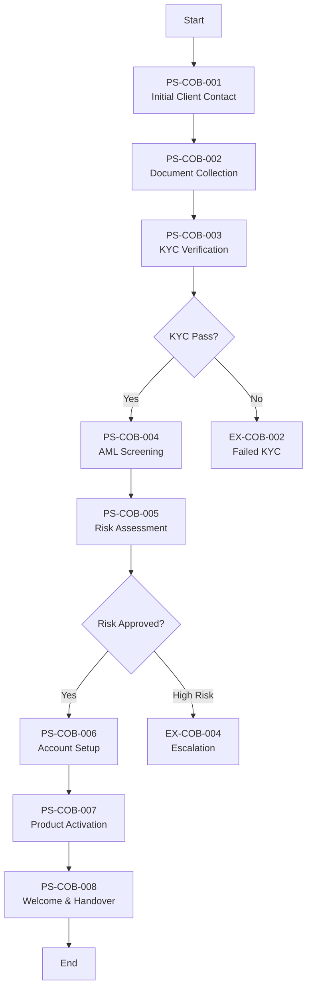

# As-Is Process Documentation: Client Onboarding process

**Document Type:** Current State Process Analysis
**Business Unit:** BizBanking
**Process ID:** COB-002
**Document Owner:** Markus
**Last Updated:** 2025-12-09
**Version:** 1.0.0
**Status:** COMPLETE

---

## Executive Summary

The Client Onboarding process establishes the formal banking relationship between the organization and new BizBanking clients. Its primary purpose is to verify client identity, assess risk, and set up the appropriate accounts and products while ensuring full compliance with regulatory requirements including KYC and AML obligations.

This 8-step process involves four key roles (Relationship Manager, Compliance Officer, Operations, Onboarding Specialist) and relies on six systems. The standard SLA target is 5 business days for completion.

Through this documentation exercise, 8 pain points were identified with 5 classified as quick wins. The most significant opportunities for improvement relate to system integration (manual data re-entry across 3 systems) and process visibility (manual SLA tracking via spreadsheets).

### Key Metrics at a Glance

| Metric | Value |
|--------|-------|
| Process Steps | 8 |
| Exceptions Identified | 6 |
| Pain Points Captured | 8 |
| Control Points Mapped | 8 |
| Systems Involved | 6 |
| Overall Confidence | HIGH |

---

## How to Read This Document

> This document captures the **current state (AS-IS)** of the Client Onboarding process. It provides a comprehensive overview with summary tables. For detailed analysis, see the linked companion documents.
>
> **Companion Documents:**
> - [Exception Details](./exceptions-detail.md) - Full exception analysis with root causes
> - [Pain Point Details](./pain-points-detail.md) - Detailed pain point analysis with improvement ideas
> - [Control Point Details](./control-points-detail.md) - Complete control mapping with compliance analysis
>
> **Confidence Indicators:** Each section includes an AI-assessed completeness confidence:
> - **[HIGH]** - Comprehensive coverage, validated by multiple sources
> - **[MEDIUM]** - Good coverage, some details may need validation
> - **[LOW]** - Preliminary capture, requires additional SME input

---

## 1. Process Overview

> **About this section:** Foundational context - what this process is, who owns it, and what business need it serves.

### 1.1 Process Identification

| Attribute | Value |
|-----------|-------|
| **Process Name** | Client Onboarding process |
| **Process ID** | COB-002 |
| **Process Category** | Client Lifecycle Management |
| **Scope** | BizBanking |
| **Process Owner** | Relationship Management |

### 1.2 Purpose and Trigger

**Purpose:**
The Client Onboarding process establishes the formal banking relationship between the organization and new BizBanking clients. Its primary purpose is to verify client identity, assess risk, and set up the appropriate accounts and products while ensuring full compliance with regulatory requirements including KYC and AML obligations. A secondary purpose is risk management — ensuring only clients meeting the bank's risk appetite are onboarded.

**Trigger:**
The process is initiated when a prospective BizBanking client expresses intent to establish a banking relationship. Primary triggers include: direct client inquiry, RM-initiated acquisition, referrals from existing clients/partners, or product upgrades from retail to BizBanking segment. The formal process begins when the RM creates a new client record in the CRM.

### 1.3 Operational Characteristics

**Frequency:**
Continuous, demand-driven basis with no fixed schedule. Cases processed daily by Compliance and Operations teams. Approvals within SLA windows (same-day or next-day). Peak periods at month-end and quarter-end.

**Volume:**
Monthly: 40-60 new onboardings. Weekly average: 10-15 cases in processing. Active pipeline: 25-35 cases at any time. Distribution: 70% standard, 25% enhanced due diligence, 5% complex/high-risk. Peak capacity: ~80 cases/month.

### 1.4 Key Stakeholders

| Role | Responsibility |
|------|----------------|
| Relationship Manager | Client engagement, document collection, welcome & handover |
| Compliance Officer | KYC verification, AML screening, risk assessment |
| Operations | Account setup in Core Banking |
| Onboarding Specialist | Product activation |

> **Section Confidence:** HIGH | **Basis:** Validated through SME input and imported DTP

---

## 2. Process Steps

> **About this section:** The step-by-step flow of this process from start to finish.

### 2.1 Process Step Summary

| PS# | Step Name | Owner | System(s) | Rationale |
|-----|-----------|-------|-----------|-----------|
| PS-COB-001 | Initial Client Contact | Relationship Manager | CRM | Capture client interest and basic information |
| PS-COB-002 | Document Collection | Relationship Manager | CRM | Gather required documentation for KYC |
| PS-COB-003 | KYC Verification | Compliance Officer | KYC Platform | Verify client identity and documentation |
| PS-COB-004 | AML Screening | Compliance Officer | KYC Platform | Screen against sanctions and PEP lists |
| PS-COB-005 | Risk Assessment | Compliance Officer | KYC Platform | Determine client risk rating |
| PS-COB-006 | Account Setup | Operations | Core Banking | Create accounts in core banking system |
| PS-COB-007 | Product Activation | Onboarding Specialist | Core Banking, CRM | Activate requested products and services |
| PS-COB-008 | Welcome & Handover | Relationship Manager | CRM | Complete onboarding and handover to BAU |

### 2.2 Process Flow Diagram

### 2.3 Step Details

**PS-COB-001: Initial Client Contact**
The Relationship Manager initiates contact with the prospective client, captures basic information about their business needs, and creates a new client record in the CRM system. This establishes the pipeline entry and triggers the onboarding workflow.

**PS-COB-002: Document Collection**
The RM provides the client with a document checklist and collects required documentation for KYC verification. Documents are uploaded to the Document Management System. This step often experiences delays due to incomplete documentation (EX-COB-001).

**PS-COB-003: KYC Verification**
The Compliance Officer reviews submitted documentation, verifies client identity against regulatory requirements, and checks document authenticity. Multiple controls apply at this step (CP-COB-001, CP-COB-006).

**PS-COB-004: AML Screening**
The Compliance Officer screens the client against global sanctions lists, PEP databases, and adverse media using the KYC Platform. A positive hit triggers immediate escalation (EX-COB-003).

**PS-COB-005: Risk Assessment**
Based on KYC findings and AML screening results, the Compliance Officer assigns a risk rating. High-risk clients require escalation for senior approval (EX-COB-004). PEP clients trigger enhanced due diligence (CP-COB-007).

**PS-COB-006: Account Setup**
Operations creates the client accounts in the Core Banking system. Four-eyes control requires a second person to review and approve the setup (CP-COB-004).

**PS-COB-007: Product Activation**
The Onboarding Specialist activates the requested products and services. Final approval is required before activation (CP-COB-005).

**PS-COB-008: Welcome & Handover**
The RM welcomes the client, provides account details and access credentials, and formally hands over to Business-as-Usual relationship management.

> **Section Confidence:** HIGH | **Basis:** Validated through imported DTP and SME confirmation

---

## 3. Exception Paths and Variations

> **About this section:** Summary of exceptions. For full details including root cause analysis and handling procedures, see [Exception Details](./exceptions-detail.md).

### 3.1 Exception Summary

The Client Onboarding process has 6 identified exception paths. The most critical is an AML/Sanctions Hit (EX-COB-003), which triggers immediate escalation to Compliance leadership and potential regulatory reporting. The most frequent exception is Incomplete Documentation (EX-COB-001), which is the primary source of onboarding delays.

### 3.2 Exception Summary Table

| EX# | Exception | Trigger | Affected Steps | Frequency | Impact |
|-----|-----------|---------|----------------|-----------|--------|
| EX-COB-001 | Incomplete Documentation | Client unable to provide required documents | PS-COB-002, PS-COB-003 | MEDIUM | MEDIUM |
| EX-COB-002 | Failed KYC Verification | Identity verification fails or documents invalid | PS-COB-003 | LOW | HIGH |
| EX-COB-003 | AML/Sanctions Hit | Client matches sanctions list or PEP database | PS-COB-004 | LOW | CRITICAL |
| EX-COB-004 | High-Risk Client Escalation | Risk rating requires senior approval | PS-COB-005 | MEDIUM | MEDIUM |
| EX-COB-005 | System Downtime | Core Banking or KYC Platform unavailable | PS-COB-003, PS-COB-006 | LOW | HIGH |
| EX-COB-006 | Product Not Available | Requested product not available for client type | PS-COB-007 | LOW | LOW |

### 3.3 Exception Statistics

| Metric | Value |
|--------|-------|
| Total Exceptions | 6 |
| Critical Impact | 1 |
| High Impact | 2 |
| Medium Impact | 2 |
| Low Impact | 1 |

> **Full Analysis:** [View Exception Details](./exceptions-detail.md)
>
> **Section Confidence:** HIGH | **Basis:** Imported and SME-validated

---

## 4. Control Points and Compliance

> **About this section:** Summary of controls. For full regulatory mapping and effectiveness analysis, see [Control Point Details](./control-points-detail.md).

### 4.1 Control Summary

The Client Onboarding process has 8 identified control points ensuring regulatory compliance and operational integrity. Six are PREVENTIVE controls (75%) and two are DETECTIVE controls (25%). All regulatory controls trace to specific AML/KYC requirements or internal policies.

### 4.2 Control Point Summary Table

| CP# | Control Name | Type | Regulation | Process Step | Effectiveness |
|-----|--------------|------|------------|--------------|---------------|
| CP-COB-001 | KYC Verification Check | PREVENTIVE | AML/KYC Regulations | PS-COB-003 | HIGH |
| CP-COB-002 | AML/Sanctions Screening | PREVENTIVE | AML Regulations | PS-COB-004 | HIGH |
| CP-COB-003 | Risk Rating Approval | PREVENTIVE | Internal Risk Policy | PS-COB-005 | MEDIUM |
| CP-COB-004 | Four-Eyes Account Setup | DETECTIVE | Internal Policy - SoD | PS-COB-006 | HIGH |
| CP-COB-005 | Final Onboarding Approval | PREVENTIVE | Internal Policy | PS-COB-007 | MEDIUM |
| CP-COB-006 | Document Authenticity Check | PREVENTIVE | KYC Regulations | PS-COB-003 | MEDIUM |
| CP-COB-007 | PEP Enhanced Due Diligence | PREVENTIVE | AML / FATF Guidelines | PS-COB-004, PS-COB-005 | HIGH |
| CP-COB-008 | Audit Trail Logging | DETECTIVE | Data Protection / Audit | All Steps | HIGH |

### 4.3 Regulatory Coverage

| Regulation | Controls Mapped | Coverage Status |
|------------|-----------------|-----------------|
| AML/KYC Regulations | CP-COB-001, CP-COB-002, CP-COB-006 | COVERED |
| FATF Guidelines | CP-COB-007 | COVERED |
| Internal Risk Policy | CP-COB-003 | COVERED |
| Segregation of Duties | CP-COB-004 | COVERED |
| Data Protection | CP-COB-008 | COVERED |

### 4.4 Control Statistics

| Metric | Value |
|--------|-------|
| Total Control Points | 8 |
| Regulatory Controls | 5 |
| Internal Controls | 3 |
| PREVENTIVE Controls | 6 |
| DETECTIVE Controls | 2 |

> **Full Analysis:** [View Control Point Details](./control-points-detail.md)
>
> **Section Confidence:** HIGH | **Basis:** Imported and SME-validated

---

## 5. System Dependencies

> **About this section:** What technology supports this process?

### 5.1 System Summary

| SYS# | System Name | Type | Purpose | Process Steps |
|------|-------------|------|---------|---------------|
| SYS-COB-001 | Core Banking | CORE | Account creation and product management | PS-COB-006, PS-COB-007 |
| SYS-COB-002 | CRM | SUPPORTING | Client relationship and pipeline management | PS-COB-001, PS-COB-002, PS-COB-007, PS-COB-008 |
| SYS-COB-003 | KYC Platform | CORE | Identity verification and AML screening | PS-COB-003, PS-COB-004, PS-COB-005 |
| SYS-COB-004 | Document Management System | SUPPORTING | Document storage and retrieval | PS-COB-002, PS-COB-003 |
| SYS-COB-005 | Email/Outlook | EXTERNAL | Client communication | PS-COB-001, PS-COB-002, PS-COB-008 |
| SYS-COB-006 | Excel (SLA Tracker) | EXTERNAL | Manual SLA tracking | All Steps |

### 5.2 System Integration Overview

| From | To | Integration Status |
|------|----|--------------------|
| CRM | Core Banking | MANUAL (data re-entered) |
| CRM | KYC Platform | MANUAL (data re-entered) |
| KYC Platform | Core Banking | PARTIAL (limited sync) |
| DMS | KYC Platform | INTEGRATED |

### 5.3 Data Flow Summary

Client data flows from CRM (initial capture) to KYC Platform (verification) to Core Banking (account setup). Currently, data is manually re-entered at each handoff point, creating efficiency issues and error risk (see PP-COB-002).

> **Section Confidence:** HIGH | **Basis:** SME-validated

---

## 6. Organizational Mapping

> **About this section:** Who does what? Roles and responsibilities.

### 6.1 RACI Matrix

| Step | Relationship Manager | Compliance Officer | Operations | Onboarding Specialist |
|------|---------------------|-------------------|------------|----------------------|
| PS-COB-001 Initial Contact | **R/A** | I | - | - |
| PS-COB-002 Document Collection | **R/A** | I | - | - |
| PS-COB-003 KYC Verification | I | **R/A** | - | - |
| PS-COB-004 AML Screening | I | **R/A** | - | - |
| PS-COB-005 Risk Assessment | I | **R/A** | - | - |
| PS-COB-006 Account Setup | I | I | **R/A** | - |
| PS-COB-007 Product Activation | I | - | I | **R/A** |
| PS-COB-008 Welcome & Handover | **R/A** | - | - | I |

*R = Responsible, A = Accountable, C = Consulted, I = Informed*

### 6.2 Team Responsibilities

**Relationship Manager:** Owns the client relationship from first contact through handover. Responsible for client communication and document collection.

**Compliance Officer:** Owns the verification block (KYC, AML, Risk). Responsible for regulatory compliance.

**Operations:** Owns account setup in Core Banking. Responsible for system accuracy.

**Onboarding Specialist:** Owns product activation. Bridges between Operations and RM.

> **Section Confidence:** HIGH | **Basis:** SME-validated

---

## 7. Existing Documentation References

> **About this section:** Related documents and metrics.

### 7.1 Related Documents

| Document | Type | Location |
|----------|------|----------|
| DTP-BizBanking-Client-Onboarding-v2.3.pdf | Detailed Task Procedure | Imported |

### 7.2 KPIs and Metrics

| KPI | Target | Current |
|-----|--------|---------|
| Standard Onboarding SLA | 5 business days | To be measured |
| First-time document completeness | >80% | To be measured |
| KYC pass rate | >95% | To be measured |

### 7.3 DTPs (Detailed Task Procedures)

Referenced DTP was imported and analyzed as part of this documentation exercise.

> **Section Confidence:** MEDIUM | **Basis:** Partial documentation available

---

## 8. Process Gaps and Issues

> **About this section:** Known gaps and inconsistencies.

### 8.1 Identified Gaps

1. **System Integration Gap:** No automated data flow between CRM, KYC Platform, and Core Banking
2. **Visibility Gap:** No real-time SLA dashboard; reliance on manual spreadsheet tracking
3. **Handoff Gap:** No formal notification system between process steps/roles

### 8.2 Missing Documentation

- Detailed escalation matrices for exception handling
- Formal SLA definitions by client complexity type
- System user guides specific to onboarding workflow

### 8.3 Inconsistencies

- Risk rating criteria applied inconsistently across Compliance Officers (PP-COB-005)
- Client communication frequency varies by RM

> **Section Confidence:** HIGH | **Basis:** Gap analysis performed

---

## 9. Pain Points and Improvement Opportunities

> **About this section:** Summary of pain points. For full analysis including root causes and improvement ideas, see [Pain Point Details](./pain-points-detail.md).

### 9.1 Pain Points Summary

The Client Onboarding process has 7 identified pain points spanning efficiency, consistency, and client experience dimensions. Three are HIGH severity and five are identified as quick wins.

### 9.2 Pain Point Summary Table

| PP# | Pain Point | Category | Affected Steps | Severity | Quick Win? |
|-----|------------|----------|----------------|----------|------------|
| PP-COB-001 | Document Chase | Efficiency | PS-COB-002 | HIGH | Yes |
| PP-COB-002 | Manual Data Re-entry | Error-prone | PS-COB-001, PS-COB-006 | HIGH | No |
| PP-COB-003 | KYC Platform Slowness | Bottleneck | PS-COB-003, PS-COB-004 | MEDIUM | No |
| PP-COB-004 | Unclear Handoff Points | Communication | PS-COB-002, PS-COB-003 | MEDIUM | Yes |
| PP-COB-005 | Risk Rating Subjectivity | Consistency | PS-COB-005 | MEDIUM | Yes |
| PP-COB-006 | SLA Tracking Manual | Visibility | All Steps | HIGH | Yes |
| PP-COB-007 | Client Communication Gaps | Client Experience | PS-COB-002, PS-COB-008 | MEDIUM | Yes |
| PP-COB-008 | No Client Portal | Client Experience | PS-COB-001, PS-COB-002, PS-COB-008 | HIGH | No |

### 9.3 Pain Point Statistics

| Metric | Value |
|--------|-------|
| Total Pain Points | 8 |
| HIGH Severity | 4 |
| MEDIUM Severity | 4 |
| Quick Win Opportunities | 5 |

### 9.4 Top Improvement Opportunities

1. **PP-COB-006 SLA Tracking:** Implement automated SLA dashboard to replace Excel
2. **PP-COB-001 Document Chase:** Implement automated document checklist and reminders
3. **PP-COB-004 Handoff Points:** Implement workflow notifications at handoff points
4. **PP-COB-005 Risk Rating:** Develop standardized risk scoring matrix
5. **PP-COB-007 Client Communication:** Implement automated status notifications
6. **PP-COB-008 No Client Portal:** Implement client self-service portal for onboarding (Strategic)

> **Full Analysis:** [View Pain Point Details](./pain-points-detail.md)
>
> **Section Confidence:** HIGH | **Basis:** SME-elicited

---

## Document Metadata

**SME Contributors:** Markus (CEO)
**Interview Date(s):** 2025-12-09
**Documentation Method:** Progressive elicitation via ProcessMiner

### Overall Document Confidence

| Section | Confidence | Key Gaps |
|---------|------------|----------|
| 1. Process Overview | HIGH | None |
| 2. Process Steps | HIGH | None |
| 3. Exceptions | HIGH | None |
| 4. Controls | HIGH | None |
| 5. Systems | HIGH | Integration details could be expanded |
| 6. Organization | HIGH | None |
| 7. Documentation | MEDIUM | Limited existing documentation |
| 8. Gaps & Issues | HIGH | None |
| 9. Pain Points | HIGH | None |

**Overall Confidence:** HIGH

### Companion Documents

| Document | Purpose | Link |
|----------|---------|------|
| Exception Details | Full exception analysis | [exceptions-detail.md](./exceptions-detail.md) |
| Pain Point Details | Full pain point analysis | [pain-points-detail.md](./pain-points-detail.md) |
| Control Point Details | Full control analysis | [control-points-detail.md](./control-points-detail.md) |

---

## Change Log

| Date | Contributor | Role | Changes |
|------|-------------|------|---------|
| 2025-12-09 | Markus | CEO | Initial documentation - COMPLETE |
| 2025-12-09 | Peter | SME | Added PP-COB-008 (No Client Portal) |

---

## Glossary

| Term | Definition |
|------|------------|
| AML | Anti-Money Laundering |
| BAU | Business as Usual |
| CRM | Customer Relationship Management |
| DMS | Document Management System |
| DTP | Detailed Task Procedure |
| EDD | Enhanced Due Diligence |
| FATF | Financial Action Task Force |
| KYC | Know Your Customer |
| PEP | Politically Exposed Person |
| RM | Relationship Manager |
| SLA | Service Level Agreement |
| SoD | Segregation of Duties |

---

_Generated by ProcessMiner Process Documentation Analyst_
_Document ID: COB-002-as-is_
_Status: COMPLETE_
