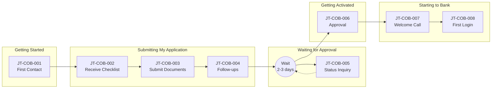

# Client Experience Journey: Client Onboarding process

**Document Type:** Client Experience AS-IS Analysis
**Process ID:** COB-002
**Business Unit:** BizBanking
**Client Segment:** BizBanking
**Analyst:** Peter
**Last Updated:** 2025-12-09
**Version:** 1.0.0

---

## Executive Summary

{{executive_summary_paragraph_1}}

{{executive_summary_paragraph_2}}

{{executive_summary_paragraph_3}}

### Key Metrics at a Glance

| Metric | Value |
|--------|-------|
| Journey Touchpoints | {{total_touchpoints}} |
| Friction Points Identified | {{total_friction_points}} |
| Enhancement Ideas Captured | {{total_enhancement_ideas}} |
| Client Effort Score (CES) | {{ces_score}} |
| Moments That Matter | {{total_moments_that_matter}} |
| Channels Used | {{total_channels}} |
| Overall Confidence | {{overall_confidence}} |

### CES Baseline Summary

| Metric | Count | Weight | Weighted Score |
|--------|-------|--------|----------------|
| Client Actions | {{metrics.client_actions}} | 1.0 | {{metrics.client_actions_weighted}} |
| Documents Required | {{metrics.documents}} | 1.5 | {{metrics.documents_weighted}} |
| Information Requests | {{metrics.info_requests}} | 1.0 | {{metrics.info_requests_weighted}} |
| Follow-ups Required | {{metrics.follow_ups}} | 2.0 | {{metrics.follow_ups_weighted}} |
| Channel Switches | {{metrics.channel_switches}} | 1.5 | {{metrics.channel_switches_weighted}} |
| Active Time (minutes) | {{metrics.active_time}} | 0.5 | {{metrics.active_time_weighted}} |
| **TOTAL CES** | | | **{{ces_score}}** |

---

## How to Read This Document

> This document captures the **client experience perspective (AS-IS)** of the Client Onboarding process process. It maps the journey through client eyes, measuring effort and identifying friction.
>
> **Companion Documents:**
> - [Client Touchpoints Detail](./client-touchpoints-detail.md) - Full touchpoint analysis with CES contribution
> - [Friction Points Detail](./friction-points-detail.md) - Detailed friction analysis with enhancement ideas
> - [AS-IS Process Documentation](./as-is-process-documentation.md) - Operational process view
>
> **CES Interpretation:**
> - **Low CES (< 20)** - Excellent client experience, minimal effort
> - **Medium CES (20-40)** - Acceptable experience, improvement opportunities exist
> - **High CES (> 40)** - Poor experience, significant transformation required

---

## 1. Journey Overview

> **About this section:** What is this journey from the client's perspective? What outcome are they trying to achieve?

### 1.1 Journey Identification

| Attribute | Value |
|-----------|-------|
| **Journey Name** | Becoming a Business Banking Client |
| **Process ID** | COB-002 |
| **Client Goal** | Get my business set up with bank accounts and products to manage my finances |
| **Journey Trigger** | Business owner decides they need banking services (new relationship, switching banks, or upgrading from retail) |
| **Success Outcome** | Active bank accounts, access credentials, and requested products ready to use |
| **Typical Duration** | 5 business days (standard) |

### 1.2 Client Persona

| Attribute | Value |
|-----------|-------|
| **Segment** | BizBanking |
| **Typical Profile** | Small to medium business owner or CFO/Finance Director; established business seeking professional banking relationship; annual revenue typically €500K-€10M |
| **Key Motivations** | Access to business credit facilities, professional cash management, separation of personal/business finances, credibility with suppliers and customers |
| **Expected Experience** | Professional, efficient, low-friction; expects digital options; values clear communication and timeline transparency; compares to retail banking simplicity |

### 1.3 Journey Context

The typical client embarking on this journey is primarily new to BizBanking, though some are upgrading from retail banking or arriving via referrals from existing clients and partners. Time pressure is moderate to high — business owners typically need banking in place to operate, and delays directly impact their ability to receive payments, pay suppliers, or access credit facilities.

The emotional stakes are medium-high. This represents a significant business relationship decision, and rejection feels personal. The waiting period creates anxiety about business continuity. Clients are acutely aware of alternatives — the banking market is highly competitive, with multiple traditional banks offering BizBanking services and fintechs offering faster digital onboarding experiences. Poor experience during onboarding can easily result in client abandonment or switching.

> **Section Confidence:** HIGH | **Basis:** Based on AS-IS documentation analysis with SME validation of AI proposals

---

## 2. Client Touchpoints

> **About this section:** Every interaction point where the client engages with the bank. For full details including CES contribution and emotional analysis, see [Client Touchpoints Detail](./client-touchpoints-detail.md).

### 2.1 Touchpoint Summary

The client journey comprises 8 touchpoints across 5 stages, with a total Client Effort Score (CES) of 38.0. The heaviest effort burden falls in Stage 2 (Submitting My Application), which accounts for 58% of total CES — driven primarily by document gathering (JT-COB-003, CES: 15.0) and follow-up requests (JT-COB-004, CES: 6.0). Human-assisted touchpoints dominate (6 of 8), reflecting the manual, relationship-driven nature of the current process. Notably, there is no self-service portal for document upload or status checking, forcing clients to rely on email and phone interactions.

### 2.2 Touchpoint Summary Table

| JT# | Touchpoint Name | Stage | Channel | What Client SEES | What Client DOES | CES Contribution |
|-----|-----------------|-------|---------|------------------|------------------|------------------|
| JT-COB-001 | First Contact with RM | Getting Started | Phone/Email/In-Person | RM introduction, qualification discussion | Explains needs, answers questions | 4.0 |
| JT-COB-002 | Receiving Document Checklist | Submitting My Application | Email | Document requirements list | Reviews list, plans gathering | 1.0 |
| JT-COB-003 | Gathering & Submitting Documents | Submitting My Application | Email/Physical | Checklist to complete | Gathers 8-12 docs, submits | 15.0 |
| JT-COB-004 | Document Follow-up Requests | Submitting My Application | Email/Phone | Requests for additional docs | Provides missing items | 6.0 |
| JT-COB-005 | Status Inquiry | Waiting for Approval | Phone/Email | Silence (must initiate) | Calls/emails for status | 4.0 |
| JT-COB-006 | Approval Notification | Getting Activated | Phone/Email | Approval confirmation | Receives good news | 1.0 |
| JT-COB-007 | Welcome Call/Meeting | Starting to Bank | Phone/In-Person | Account details, credentials | Attends, receives info | 3.0 |
| JT-COB-008 | First Login/Access | Starting to Bank | Digital | Online banking portal | Logs in, sets security | 4.0 |

### 2.3 Journey Flow Diagram

### 2.4 Touchpoint Statistics

| Metric | Value |
|--------|-------|
| Total Touchpoints | 8 |
| Digital Touchpoints | 2 |
| Human-Assisted Touchpoints | 6 |
| Self-Service Touchpoints | 1 |
| Wait Points | 3 |

> **Full Analysis:** [View Client Touchpoints Detail](./client-touchpoints-detail.md)
>
> **Section Confidence:** HIGH | **Basis:** Based on AS-IS process step mapping with SME validation

---

## 3. Moments That Matter

> **About this section:** Critical touchpoints that disproportionately define client perception. These must be protected or enhanced in any transformation.

### 3.1 Identified Moments

{{moments_that_matter}}

### 3.2 Moments Summary

| Moment | Touchpoint | Current State | Enhancement Priority |
|--------|-----------|---------------|---------------------|
{{moments_summary_table}}

> **Section Confidence:** {{section_3_confidence}} | **Basis:** {{section_3_confidence_basis}}

---

## 4. Friction Point Analysis

> **About this section:** Summary of friction points. For full details including root cause analysis and enhancement ideas, see [Friction Points Detail](./friction-points-detail.md).

### 4.1 Friction Summary

{{friction_summary_paragraph}}

### 4.2 Friction Point Summary Table

| FP# | Friction Point | Stage | Touchpoint | Severity | CES Impact | Client Emotion |
|-----|----------------|-------|------------|----------|------------|----------------|
{{friction_point_summary_table}}

### 4.3 Friction by Type

| Friction Type | Count | Combined CES Impact | Priority Items |
|---------------|-------|---------------------|----------------|
{{friction_by_type_table}}

### 4.4 Friction Statistics

| Metric | Value |
|--------|-------|
| Total Friction Points | {{total_friction_points}} |
| High-Severity (P1) | {{high_severity_friction}} |
| Medium-Severity (P2) | {{medium_severity_friction}} |
| Low-Severity (P3) | {{low_severity_friction}} |
| Quick Win Opportunities | {{quick_win_friction}} |

> **Full Analysis:** [View Friction Points Detail](./friction-points-detail.md)
>
> **Section Confidence:** {{section_4_confidence}} | **Basis:** {{section_4_confidence_basis}}

---

## 5. Client Effort Score (CES) Analysis

> **About this section:** Quantified measurement of client effort across the journey. This is the baseline for transformation target comparison.

### 5.1 CES Breakdown by Stage

| Journey Stage | Actions | Documents | Info Requests | Follow-ups | Channel Switches | Wait Time | Stage CES |
|---------------|---------|-----------|---------------|------------|------------------|-----------|-----------|
{{ces_by_stage_table}}

### 5.2 CES Breakdown by Touchpoint

| Touchpoint | CES Contribution | % of Total | Reduction Priority |
|------------|------------------|------------|-------------------|
{{ces_by_touchpoint_table}}

### 5.3 Benchmark Comparison

| Benchmark | Score | Our Gap |
|-----------|-------|---------|
| Industry Average | {{benchmarks.industry_avg}} | {{benchmarks.industry_gap}} |
| Best-in-Class | {{benchmarks.best_in_class}} | {{benchmarks.best_gap}} |
| Internal Target | {{benchmarks.internal_target}} | {{benchmarks.internal_gap}} |

### 5.4 CES Baseline Statement

> **CES BASELINE FOR TO-BE COMPARISON**
>
> This AS-IS CES score (**{{ces_score}}**) establishes the baseline for transformation.
> During TO-BE design, this score will be compared against the target state to measure
> improvement. Industry standard for transformation projects is **30-40% CES reduction**.
>
> After the Transformation Agent designs the TO-BE state, the Client Journey Analyst
> will recalculate CES in **Flow 2 (Target Validation)** to verify improvements.

> **Section Confidence:** {{section_5_confidence}} | **Basis:** {{section_5_confidence_basis}}

---

## 6. Channel Analysis

> **About this section:** How clients interact across different channels throughout the journey.

### 6.1 Channel Usage

| CH# | Channel | Touchpoints Using | Primary Purpose | Client Preference |
|-----|---------|-------------------|-----------------|-------------------|
{{channel_summary_table}}

### 6.2 Channel Switching Analysis

{{channel_switching_analysis}}

### 6.3 Channel Gaps

{{channel_gaps}}

> **Section Confidence:** {{section_6_confidence}} | **Basis:** {{section_6_confidence_basis}}

---

## 7. Enhancement Ideas

> **About this section:** Captured enhancement ideas for TO-BE consideration. Prioritization will occur during transformation design.

### 7.1 Enhancement Catalog

| EI# | Target Friction | Enhancement Idea | Est. CES Reduction | Complexity | Priority |
|-----|-----------------|------------------|-------------------|------------|----------|
{{enhancement_summary_table}}

### 7.2 Enhancement Statistics

| Metric | Value |
|--------|-------|
| Total Enhancement Ideas | {{total_enhancement_ideas}} |
| Quick Wins (Low Effort) | {{quick_win_enhancements}} |
| Strategic (High Effort) | {{strategic_enhancements}} |
| Automation Opportunities | {{automation_enhancements}} |
| Total Est. CES Reduction | {{total_ces_reduction_potential}} |

### 7.3 Innovation Considerations

{{innovations_considered}}

### 7.4 Exclusions (Not Recommended)

{{exclusions}}

> **Section Confidence:** {{section_7_confidence}} | **Basis:** {{section_7_confidence_basis}}

---

## 8. Industry Research & Benchmarks

> **About this section:** How does this journey compare to industry standards and emerging trends?

### 8.1 Industry Benchmarks

| Metric | Industry Average | Best-in-Class | Our AS-IS | Gap |
|--------|-----------------|---------------|-----------|-----|
{{industry_benchmark_table}}

### 8.2 Relevant Trends

| Trend | Relevance | Assessment | Enhancement Alignment |
|-------|-----------|------------|----------------------|
{{validated_trends_table}}

### 8.3 Competitive Landscape

{{competitive_analysis}}

> **Section Confidence:** {{section_8_confidence}} | **Basis:** {{section_8_confidence_basis}}

---

## 9. Inputs for TO-BE Design

> **About this section:** Consolidated inputs for the Transformation Agent.

### 9.1 CES Baseline Summary

The Transformation Agent should use these metrics as the baseline:

| Metric | AS-IS Value | Target (30% Reduction) |
|--------|-------------|------------------------|
| Overall CES Score | {{ces_score}} | {{ces_target}} |
| Client Actions | {{metrics.client_actions}} | {{metrics.client_actions_target}} |
| Documents Required | {{metrics.documents}} | {{metrics.documents_target}} |
| Channel Switches | {{metrics.channel_switches}} | {{metrics.channel_switches_target}} |

### 9.2 Critical Success Factors

For a successful TO-BE from a CX perspective:

{{success_factors}}

### 9.3 Experience Degradation Risks

**DO NOT** make these changes in TO-BE (would worsen CX):

{{degradation_risks}}

### 9.4 Enhancement Ideas Available

The Transformation Agent has **{{total_enhancement_ideas}}** enhancement ideas to consider (see Section 7).

---

## 10. Discovery Logging Summary

> **About this section:** New items discovered during CX analysis that should be added to the AS-IS process documentation.

### 10.1 New Items Logged

| Type | Count | Files Updated |
|------|-------|---------------|
| Pain Points | {{new_pain_points_count}} | pain-points-detail.md, as-is-process-documentation.md |
| Exceptions | {{new_exceptions_count}} | exceptions-detail.md, as-is-process-documentation.md |
| Controls | {{new_controls_count}} | control-points-detail.md, as-is-process-documentation.md |

### 10.2 Cross-References

- [pain-points-detail.md](./pain-points-detail.md) - Full pain point documentation
- [exceptions-detail.md](./exceptions-detail.md) - Full exception documentation
- [control-points-detail.md](./control-points-detail.md) - Full control documentation
- [as-is-process-documentation.md](./as-is-process-documentation.md) - Master AS-IS document

---

## Document Metadata

**SME Contributors:** Peter (SME)
**Analysis Date(s):** 2025-12-09
**Documentation Method:** Progressive elicitation via ProcessMiner Client Journey Analyst

### Overall Document Confidence

| Section | Confidence | Key Gaps |
|---------|------------|----------|
| 1. Journey Overview | {{section_1_confidence}} | {{section_1_gaps}} |
| 2. Client Touchpoints | {{section_2_confidence}} | {{section_2_gaps}} |
| 3. Moments That Matter | {{section_3_confidence}} | {{section_3_gaps}} |
| 4. Friction Points | {{section_4_confidence}} | {{section_4_gaps}} |
| 5. CES Analysis | {{section_5_confidence}} | {{section_5_gaps}} |
| 6. Channel Analysis | {{section_6_confidence}} | {{section_6_gaps}} |
| 7. Enhancement Ideas | {{section_7_confidence}} | {{section_7_gaps}} |
| 8. Industry Research | {{section_8_confidence}} | {{section_8_gaps}} |

**Overall Confidence:** {{overall_confidence}}

### Companion Documents

| Document | Purpose | Link |
|----------|---------|------|
| Client Touchpoints Detail | Full touchpoint analysis | [client-touchpoints-detail.md](./client-touchpoints-detail.md) |
| Friction Points Detail | Full friction analysis | [friction-points-detail.md](./friction-points-detail.md) |
| AS-IS Process Documentation | Operational view | [as-is-process-documentation.md](./as-is-process-documentation.md) |

---

## Change Log

| Date | Contributor | Role | Changes |
|------|-------------|------|---------|
| 2025-12-09 | Peter | SME | Initial CX analysis |

---

## Glossary

| Term | Definition |
|------|------------|
| CES | Client Effort Score - quantified measure of effort required from client |
| JT | Journey Touchpoint - client interaction point |
| FP | Friction Point - point causing client difficulty |
| EI | Enhancement Idea - improvement opportunity |
| CH | Channel - communication/interaction channel |

---

_Generated by ProcessMiner Client Journey Analyst_
_Document ID: COB-002-cx-journey_
