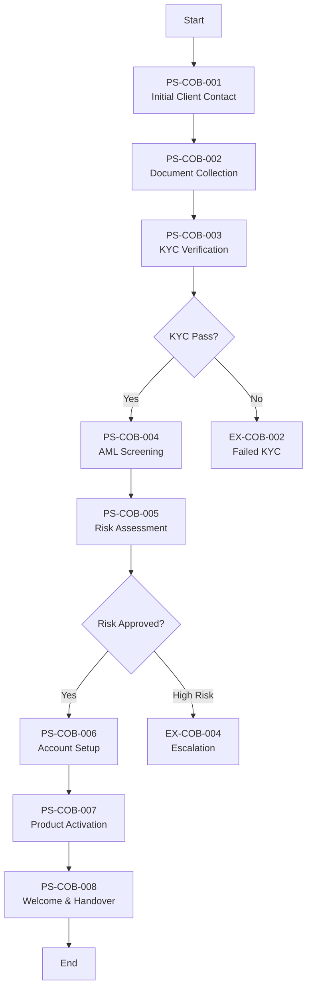

# Management Summary: Client Onboarding Process

**Document Type:** Process Documentation Management Summary (Amazon 6-Pager Format)
**Process ID:** COB-002
**Business Unit:** BizBanking
**Document Owner:** Relationship Management
**Date:** 2025-12-09
**Version:** 1.0

---

## 1. Introduction

### The Problem

We are losing productivity and risking SLA breaches because 30% of Relationship Manager time is consumed chasing documents, while the same client data is manually entered three times across disconnected systems. With 40-60 new client onboardings monthly and no real-time visibility into case status, we cannot identify at-risk cases until SLAs are already breached. This memo proposes three strategic priorities that will recover RM capacity, reduce errors, and improve client experience.

### Background

The Client Onboarding process establishes formal banking relationships with new BizBanking clients through an 8-step workflow involving four key roles (Relationship Manager, Compliance Officer, Operations, Onboarding Specialist) and six systems. The standard SLA target is 5 business days. The process handles 40-60 new onboardings monthly with 25-35 cases active at any time. Distribution is 70% standard cases, 25% enhanced due diligence, and 5% complex/high-risk.

### Purpose of This Document

This management summary analyzes the current state of the **Client Onboarding process** and recommends 3 strategic actions to reduce processing time, improve operational efficiency, and enhance client experience.

**Decision Required:** Approve prioritized remediation plan to address system integration gaps, implement SLA automation, and standardize risk assessment.

### Scope

| Attribute | Value |
|-----------|-------|
| **Process Category** | Client Lifecycle Management |
| **Geographic Scope** | BizBanking operations |
| **Organizational Scope** | BizBanking |
| **Analysis Period** | Current state as of December 2025 |

### Key Definitions

| Term | Definition |
|------|------------|
| KYC | Know Your Customer - regulatory identity verification requirements |
| AML | Anti-Money Laundering - regulatory screening requirements |
| PEP | Politically Exposed Person - individuals with heightened due diligence requirements |
| SLA | Service Level Agreement - 5 business days for standard onboarding |

---

## 2. Goals

### What Success Looks Like

A client who initiates onboarding receives a seamless, transparent experience with proactive status updates, completes the process within 5 business days, and is fully activated with all requested products — all while meeting 100% regulatory compliance.

### Primary Objectives

| Objective | Baseline | Current | Target | Gap | Status |
|-----------|----------|---------|--------|-----|--------|
| Onboarding SLA compliance | UNKNOWN ⚠️ | To be measured | 95% within 5 days | Gap unknown | ⚠️ Measurement required |
| First-time document completeness | UNKNOWN ⚠️ | ~70-80% (estimated) | >80% | ~10% | ⚠️ Needs baseline |
| KYC pass rate | UNKNOWN ⚠️ | ~95% (estimated) | >95% | Minimal | ⚠️ Needs baseline |
| RM time on document chase | ~30% | 30% | <10% | 20% | ❌ Off track |

### Success Metrics Summary

- **Primary Metric:** SLA Compliance Rate (Current: UNKNOWN → Target: 95%)
- **Secondary Metric:** RM Productive Time (Current: 70% → Target: 90%)
- **Lagging Indicator:** Client satisfaction with onboarding experience

---

## 3. Tenets

### Guiding Principles

**1. Compliance First**
Regulatory requirements (KYC, AML, FATF) are non-negotiable. Every process optimization must maintain or strengthen compliance posture.
*Trade-off: We prioritize compliance over speed. A delayed onboarding is acceptable; a compliance failure is not.*

**2. Data Once, Use Everywhere**
Client data should be captured once and flow automatically to all systems that need it. Manual re-entry is waste.
*Trade-off: We invest in integration over quick fixes. Short-term workarounds that perpetuate data silos are rejected.*

**3. Transparency for All Stakeholders**
Both staff and clients should have real-time visibility into case status. No one should need to ask "where is this case?"
*Trade-off: We invest in dashboards and notifications over manual status tracking. Staff time on status inquiries is waste.*

### Hard Constraints

| Constraint | Why It's Non-Negotiable | Impact If Violated |
|------------|-------------------------|-------------------|
| All clients screened against sanctions lists | AML regulatory requirement | Regulatory action, reputational damage, potential criminal liability |
| Four-eyes principle on account creation | Segregation of duties policy | Fraud risk, audit findings |
| Audit trail for all decisions | Data protection and regulatory requirement | Unable to respond to regulatory inquiries |

---

## 4. State of the Business

### Executive Summary

The Client Onboarding process is structurally sound with comprehensive compliance controls but operationally inefficient. We have 8 pain points identified — 4 HIGH severity — and manual processes dominate where automation should exist. Staff are entering the same data three times, tracking SLAs in spreadsheets, and spending nearly a third of their time chasing documents. Compliance controls are working (zero regulatory incidents), but we are leaving significant efficiency gains on the table.

### Scorecard

| Metric | Value | Target | Status | Trend |
|--------|-------|--------|--------|-------|
| Pain Points Identified | 8 | 0 | ❌ | — |
| HIGH Severity Issues | 4 | 0 | ❌ | — |
| Quick Win Opportunities | 5 | — | ✅ | — |
| Control Effectiveness | 5 HIGH / 3 MEDIUM | All HIGH | ⚠️ | — |

### What's Working

1. **Compliance controls are effective** — 8 control points mapped to regulations, all regulatory requirements covered, zero compliance incidents identified
2. **Process structure is sound** — 8 well-defined steps with clear ownership and RACI matrix
3. **Risk management is robust** — AML screening, PEP detection, and escalation procedures functioning correctly
4. **Audit trail is comprehensive** — All decisions documented with rationale and timestamps

### What's NOT Working

1. **No system integration** — CRM, KYC Platform, and Core Banking are silos. Same data entered 3 times per case. This is inexcusable in 2025.
2. **No real-time visibility** — SLA tracking lives in an Excel spreadsheet. We discover breaches after they happen, not before.
3. **No formal handoff notifications** — Cases sit idle at handoff points averaging 4-hour delays. Staff check queues manually.
4. **Risk rating is subjective** — Different Compliance Officers rate the same client profile differently. This is an audit finding waiting to happen.
5. **No client self-service** — Clients cannot upload documents or check status. All interactions require manual RM coordination.

### Top 5 Critical Items

| Rank | Issue | Impact | Evidence | Owner |
|------|-------|--------|----------|-------|
| 1 | Manual Data Re-entry (PP-COB-002) | Triple effort per case, transcription errors, data inconsistencies | Data entered in CRM, KYC Platform, Core Banking separately | Operations/IT |
| 2 | SLA Tracking Manual (PP-COB-006) | Cannot identify at-risk cases proactively, breaches discovered late | Excel spreadsheet as primary tracking tool | Operations |
| 3 | Document Chase (PP-COB-001) | 30% RM time consumed, client frustration, SLA delays | No automated reminders or document portal | Relationship Management |
| 4 | No Client Portal (PP-COB-008) | No self-service, high RM workload, competitive disadvantage | All interactions via email/phone | IT/Digital |
| 5 | Risk Rating Subjectivity (PP-COB-005) | Inconsistent decisions, audit risk, training difficulty | No standardized scoring matrix | Compliance |

---

## 5. Lessons Learned

### What We Got Right

1. **Compliance framework is comprehensive** — All regulatory requirements have mapped controls. No orphan controls or uncontrolled requirements identified.
2. **Segregation of duties is enforced** — Four-eyes principle on account setup is system-enforced in Core Banking.
3. **Exception handling is documented** — 6 exception paths identified with clear handling procedures and ownership.
4. **Process documentation exists** — We now have a complete AS-IS process documentation that didn't exist before this analysis.

### What We Got Wrong

1. **We've tolerated manual processes too long** — Excel-based SLA tracking, email-based document collection, and manual data re-entry are operational debt accumulated over years. We've normalized inefficiency.
2. **We never integrated our systems** — CRM, KYC Platform, and Core Banking were implemented as silos. We never invested in integration and accepted triple data entry as "how things work."
3. **We have no measurement baselines** — We cannot answer basic questions: What is our actual SLA compliance rate? How many cases breach? We're operating blind.
4. **We've ignored client experience** — Competitors offer digital onboarding portals. We ask clients to email documents and wait for phone updates. We're behind market expectations.

### Root Causes

| Problem | Root Cause | Evidence | Accountability |
|---------|------------|----------|----------------|
| Manual data re-entry | Systems never integrated; historical siloed implementation | CRM→KYC→Core all require separate data entry | IT/Operations Leadership |
| SLA breaches | No proactive monitoring; reliance on spreadsheet tracking | Excel as primary tool; breaches discovered post-facto | Operations Leadership |
| Document delays | No automated reminders; no self-service portal | 30% RM time on manual follow-ups | Relationship Management |

### Key Insights

1. **Process design is not the problem — execution is.** The 8-step workflow is sound. The issue is manual execution of what should be automated.
2. **Five quick wins can deliver immediate value.** 5 of 8 pain points are addressable with moderate effort while strategic integration is planned.
3. **Measurement must come first.** We cannot improve what we don't measure. Baseline establishment is Priority 1.

---

## 6. Strategic Priorities

### Priority 1: Implement Automated SLA Dashboard & Workflow Notifications

**Objective:** Replace Excel-based SLA tracking with automated dashboard providing real-time visibility into case status and proactive alerts for at-risk cases.

**Why Now:** Without visibility, we cannot manage. Every day we continue with spreadsheet tracking, we discover SLA breaches after they occur. This is unacceptable for client experience and operational efficiency.

**Actions:**

| # | Action | Owner | Deadline | Dependencies |
|---|--------|-------|----------|--------------|
| 1 | Define SLA thresholds and alert triggers (50%, 75%, 90%) | Operations Manager | TBD | None |
| 2 | Implement automated handoff notifications in CRM | IT/CRM Team | TBD | Threshold definition |
| 3 | Create management dashboard with real-time KPIs | IT/BI Team | TBD | Data feed setup |
| 4 | Establish baseline metrics for all KPIs | Operations Manager | TBD | Dashboard live |

**Success Criteria:** 100% of cases tracked automatically; alerts generated for all at-risk cases before breach; management dashboard showing real-time status.

**If We Don't Do This:** Continued late discovery of SLA breaches, inability to capacity plan, staff time wasted on manual tracking and status inquiries.

---

### Priority 2: Deploy Document Automation & Client Communication

**Objective:** Reduce RM time on document chase from 30% to <10% through automated checklists, reminders, and status notifications.

**Why Now:** RMs are spending nearly one-third of productive time on manual follow-ups. This directly impacts capacity for new client acquisition and creates poor client experience.

**Actions:**

| # | Action | Owner | Deadline | Dependencies |
|---|--------|-------|----------|--------------|
| 1 | Implement automated document checklist at Initial Contact | IT/CRM Team | TBD | None |
| 2 | Configure automated reminder emails at Day 3, 5, 7 | IT/CRM Team | TBD | Checklist live |
| 3 | Deploy client status notification at key milestones | IT/CRM Team | TBD | Process step triggers defined |
| 4 | Measure RM time allocation post-implementation | Operations Manager | TBD | Automation live |

**Success Criteria:** RM time on document chase reduced to <10%; first-time document completeness increased to >85%; client inquiries about status reduced by 50%.

**If We Don't Do This:** Continued RM productivity drain, client frustration with repeated requests, competitive disadvantage in client experience.

---

### Priority 3: Standardize Risk Rating with Scoring Matrix

**Objective:** Eliminate subjectivity in risk assessment by implementing standardized scoring matrix with weighted criteria.

**Why Now:** Inconsistent risk ratings across Compliance Officers create audit risk and make training difficult. This is a compliance finding waiting to happen.

**Actions:**

| # | Action | Owner | Deadline | Dependencies |
|---|--------|-------|----------|--------------|
| 1 | Document current risk factors and weight criteria | Compliance Manager | TBD | None |
| 2 | Create standardized scoring matrix with thresholds | Compliance Manager | TBD | Factors documented |
| 3 | Implement scoring tool or checklist | IT/Compliance | TBD | Matrix approved |
| 4 | Conduct calibration sessions across Compliance team | Compliance Manager | TBD | Tool live |

**Success Criteria:** 100% of risk assessments using standardized matrix; inter-rater reliability >90%; audit finding prevention confirmed.

**If We Don't Do This:** Continued inconsistency in risk decisions, potential audit findings, difficulty training new Compliance Officers.

---

### Quick Wins (Do This Week)

| Action | Owner | Effort | Impact | Deadline |
|--------|-------|--------|--------|----------|
| Implement workflow notifications at handoff points | IT/CRM Team | Low | Medium | TBD |
| Create standardized document checklist for RMs | Relationship Management | Low | High | TBD |
| Develop risk scoring matrix draft | Compliance Manager | Low-Medium | Medium | TBD |
| Implement automated status email templates | IT/CRM Team | Low | Medium | TBD |
| Establish baseline SLA metrics (manual count) | Operations Manager | Low | High | TBD |

### Immediate Next Steps

| Step | Owner | By When | Deliverable |
|------|-------|---------|-------------|
| Secure executive sponsorship for dashboard project | Operations Manager | TBD | Approval to proceed |
| Assess CRM capability for workflow automation | IT Lead | TBD | Technical assessment report |
| Draft risk scoring matrix for Compliance review | Compliance Manager | TBD | Draft matrix document |
| Manual baseline measurement of current SLA compliance | Operations Manager | TBD | Baseline metrics report |

---

## Appendix

### A.1 Process Flow Diagram

### A.2 Complete Pain Point Register

| PP# | Pain Point | Category | Impact | Frequency | Priority | Root Cause |
|-----|------------|----------|--------|-----------|----------|------------|
| PP-COB-001 | Document Chase | Efficiency | HIGH | Daily | Quick Win | No automated checklist/reminders |
| PP-COB-002 | Manual Data Re-entry | Error-prone | HIGH | Every case | Strategic | Systems not integrated |
| PP-COB-003 | KYC Platform Slowness | Bottleneck | MEDIUM | Constant | Strategic | Legacy infrastructure |
| PP-COB-004 | Unclear Handoff Points | Communication | MEDIUM | Every case | Quick Win | No workflow automation |
| PP-COB-005 | Risk Rating Subjectivity | Consistency | MEDIUM | Frequent | Quick Win | No standardized scoring |
| PP-COB-006 | SLA Tracking Manual | Visibility | HIGH | Daily | Quick Win | Manual spreadsheet tracking |
| PP-COB-007 | Client Communication Gaps | Client Experience | MEDIUM | Most cases | Quick Win | No automated notifications |
| PP-COB-008 | No Client Portal | Client Experience | HIGH | Every case | Strategic | No digital platform |

### A.3 Complete Exception Register

| EX# | Exception | Trigger | Affected Steps | Frequency | Impact | Handling |
|-----|-----------|---------|----------------|-----------|--------|----------|
| EX-COB-001 | Incomplete Documentation | Client unable to provide docs | PS-COB-002, PS-COB-003 | MEDIUM | MEDIUM | RM follow-up, deadline set |
| EX-COB-002 | Failed KYC Verification | Identity verification fails | PS-COB-003 | LOW | HIGH | Return to RM, escalate if repeated |
| EX-COB-003 | AML/Sanctions Hit | Sanctions list or PEP match | PS-COB-004 | LOW | CRITICAL | Immediate escalation to Compliance Leadership |
| EX-COB-004 | High-Risk Client Escalation | Risk rating requires senior approval | PS-COB-005 | MEDIUM | MEDIUM | Senior CO review |
| EX-COB-005 | System Downtime | Core Banking/KYC Platform unavailable | PS-COB-003, PS-COB-006 | LOW | HIGH | Queue cases, process when restored |
| EX-COB-006 | Product Not Available | Product not available for client type | PS-COB-007 | LOW | LOW | Propose alternatives |

### A.4 Control Point Matrix

| CP# | Control | Type | Regulation | Step | Effectiveness | Evidence |
|-----|---------|------|------------|------|---------------|----------|
| CP-COB-001 | KYC Verification Check | PREVENTIVE | AML/KYC Regulations | PS-COB-003 | HIGH | KYC checklist, verified docs |
| CP-COB-002 | AML/Sanctions Screening | PREVENTIVE | AML Regulations | PS-COB-004 | HIGH | Screening results report |
| CP-COB-003 | Risk Rating Approval | PREVENTIVE | Internal Risk Policy | PS-COB-005 | MEDIUM | Risk assessment form |
| CP-COB-004 | Four-Eyes Account Setup | DETECTIVE | Internal Policy - SoD | PS-COB-006 | HIGH | System audit trail |
| CP-COB-005 | Final Onboarding Approval | PREVENTIVE | Internal Policy | PS-COB-007 | MEDIUM | Manager sign-off |
| CP-COB-006 | Document Authenticity Check | PREVENTIVE | KYC Regulations | PS-COB-003 | MEDIUM | Document review notes |
| CP-COB-007 | PEP Enhanced Due Diligence | PREVENTIVE | AML / FATF Guidelines | PS-COB-004, PS-COB-005 | HIGH | EDD documentation |
| CP-COB-008 | Audit Trail Logging | DETECTIVE | Data Protection / Audit | All Steps | HIGH | System audit logs |

### A.5 System Dependency Map

| SYS# | System | Type | Purpose | Integration Points |
|------|--------|------|---------|-------------------|
| SYS-COB-001 | Core Banking | CORE | Account creation, product management | Manual from CRM, partial from KYC |
| SYS-COB-002 | CRM | SUPPORTING | Client relationship, pipeline management | Manual to KYC and Core Banking |
| SYS-COB-003 | KYC Platform | CORE | Identity verification, AML screening | Integrated with DMS, partial to Core Banking |
| SYS-COB-004 | Document Management System | SUPPORTING | Document storage, retrieval | Integrated with KYC Platform |
| SYS-COB-005 | Email/Outlook | EXTERNAL | Client communication | No integration |
| SYS-COB-006 | Excel (SLA Tracker) | EXTERNAL | Manual SLA tracking | No integration |

### A.6 RACI Matrix

| Step | Relationship Manager | Compliance Officer | Operations | Onboarding Specialist |
|------|---------------------|-------------------|------------|----------------------|
| PS-COB-001 Initial Contact | **R/A** | I | - | - |
| PS-COB-002 Document Collection | **R/A** | I | - | - |
| PS-COB-003 KYC Verification | I | **R/A** | - | - |
| PS-COB-004 AML Screening | I | **R/A** | - | - |
| PS-COB-005 Risk Assessment | I | **R/A** | - | - |
| PS-COB-006 Account Setup | I | I | **R/A** | - |
| PS-COB-007 Product Activation | I | - | I | **R/A** |
| PS-COB-008 Welcome & Handover | **R/A** | - | - | I |

*R = Responsible, A = Accountable, C = Consulted, I = Informed*

### A.7 Document Confidence Analysis

| Section | Confidence | Key Gaps | Validation Required |
|---------|------------|----------|---------------------|
| Process Overview | HIGH | None | None |
| Process Steps | HIGH | None | None |
| Exceptions | HIGH | None | None |
| Controls | HIGH | None | None |
| Systems | HIGH | Integration details could be expanded | IT validation |
| Organization | HIGH | None | None |
| Documentation | MEDIUM | Limited existing documentation | Historical doc review |
| Gaps & Issues | HIGH | None | None |
| Pain Points | HIGH | None | None |

### A.8 Source Documents

| Document | Type | Date | Relevance |
|----------|------|------|-----------|
| as-is-process-documentation.md | AS-IS Process Documentation | 2025-12-09 | Primary source |
| pain-points-detail.md | Pain Point Analysis | 2025-12-09 | Pain point details |
| exceptions-detail.md | Exception Analysis | 2025-12-09 | Exception details |
| control-points-detail.md | Control Point Analysis | 2025-12-09 | Control details |
| DTP-BizBanking-Client-Onboarding-v2.3.pdf | Detailed Task Procedure | Imported | Historical reference |

### A.9 Contributors

| Name | Role | Contribution | Date |
|------|------|--------------|------|
| Markus | CEO | Initial documentation, SME input | 2025-12-09 |
| Peter | SME | Pain point review, PP-COB-008 addition | 2025-12-09 |

---

**Document Metadata**

| Attribute | Value |
|-----------|-------|
| Source Document | [as-is-process-documentation.md](./as-is-process-documentation.md) |
| Generated By | ProcessMiner Process Documentation Analyst |
| Document ID | COB-002-mgmt-summary |
| Last Updated | 2025-12-09 |

---

_This management summary follows the Amazon 6-Pager format for executive decision-making._
_Generated by ProcessMiner Module_
