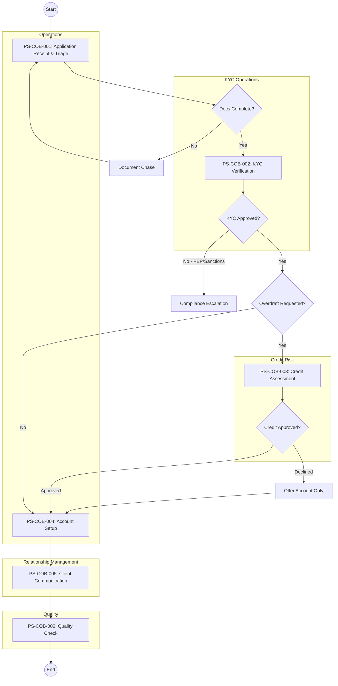
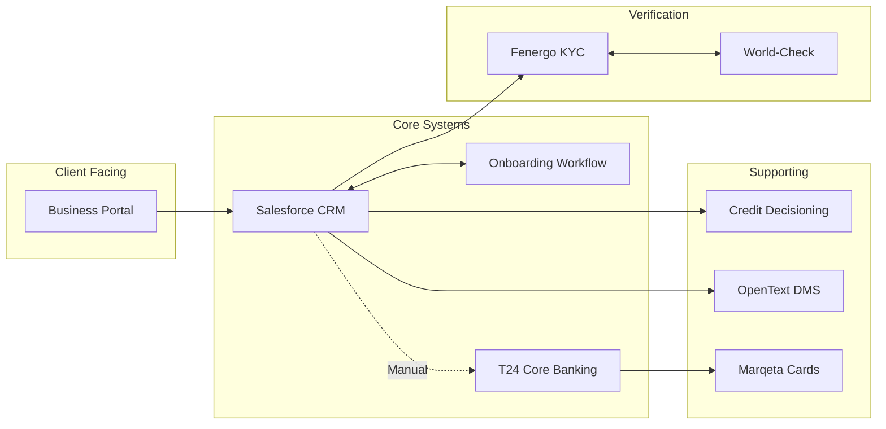

# As-Is Process Documentation: Client Onboarding

**Document Type:** Current State Process Analysis
**Business Unit:** BizBanking
**Region:** -
**Document Owner:** Markus (RTM)
**Last Updated:** 2025-12-09
**Version:** 1.0.0-FINAL

---

## Executive Summary

The BizBanking Client Onboarding process is **structurally sound but operationally inefficient**. While the 6-step process successfully onboards 80-120 business clients monthly with full regulatory compliance (CDD, AML, GDPR, PSD2), significant operational pain points are impacting cycle time and client experience.

**Key Findings:**
- **30% of applications** require manual document chasing due to incomplete submissions
- **Staff navigate 6+ disconnected systems** with no single client view, causing 2+ hours of manual data re-entry per application
- **40% of KYC screenings** generate false positives requiring Compliance review
- **70% of welcome calls** require 3+ attempts due to lack of self-service scheduling

**Critical Issues Requiring Action:**
1. No automated document reminder system (causing 15+ hours/month wasted effort)
2. Paper-based signatures on 40% of applications (adding 1-2 days delay)
3. Missing DTPs for partner channel submissions (15% of volume)

**Recommendation:** Approve three quick-win initiatives - automated document reminders, e-signature implementation, and self-service call scheduling - which can be delivered with minimal investment while planning for longer-term system integration improvements.

### Key Metrics at a Glance

| Metric | Value |
|--------|-------|
| Process Steps | 6 |
| Exceptions Identified | 5 |
| Pain Points Captured | 6 |
| Control Points Mapped | 5 |
| Systems Involved | 8 |
| Overall Confidence | HIGH |

---

## How to Read This Document

> This document captures the **current state (AS-IS)** of the Client Onboarding process. It provides a comprehensive overview with summary tables. For detailed analysis, see the linked companion documents.
>
> **Companion Documents:**
> - [Exception Details](./exceptions-detail.md) - Full exception analysis with root causes
> - [Pain Point Details](./pain-points-detail.md) - Detailed pain point analysis with improvement ideas
> - [Control Point Details](./control-points-detail.md) - Complete control mapping with compliance analysis
>
> **Confidence Indicators:** Each section includes an AI-assessed completeness confidence:
> - **[HIGH]** - Comprehensive coverage, validated by multiple sources
> - **[MEDIUM]** - Good coverage, some details may need validation
> - **[LOW]** - Preliminary capture, requires additional SME input

---

## 1. Process Overview

> **About this section:** Foundational context - what this process is, who owns it, and what business need it serves.

### 1.1 Process Identification

| Attribute | Value |
|-----------|-------|
| **Process Name** | Client Onboarding |
| **Process ID** | COB-003 |
| **Process Category** | Client Onboarding |
| **Scope** | BizBanking (€0-€10M turnover) |
| **Process Owner** | BizBanking Operations |

### 1.2 Purpose and Trigger

The BizBanking Client Onboarding process establishes new banking relationships with business clients (annual turnover up to €10M) by collecting, validating, and processing client information to create fully operational accounts. This includes identity verification through KYC checks, regulatory compliance screening (AML, PEP, Sanctions), risk assessment, and where requested, credit facility assessment for overdraft products.

This process is critical for revenue generation and regulatory compliance. Efficient onboarding directly impacts client acquisition rates and time-to-revenue, while ensuring the bank meets all CDD, AML, GDPR, and PSD2 requirements. The process covers Business Current Accounts, Business Savings, and Overdraft facilities for the BizBanking segment.

This process is triggered when a new client application is received through one of four channels: (1) online submission via the Business Portal, (2) Relationship Manager submission of a paper application on behalf of a walk-in client, (3) referral from the branch network with a completed application pack, or (4) partner channel submission from accountants or solicitors acting on behalf of clients.

In all cases, the process formally initiates when the application enters the CRM queue and is assigned to an Operations Officer for initial triage. The trigger point is consistent regardless of channel — receipt of a signed application form with minimum required documentation (Company Registration documents, Director ID, Proof of Address).

### 1.3 Operational Characteristics

The process runs continuously during business hours, with applications processed as they arrive in real-time. Standard applications (single director, simple structure) flow through immediately, while complex applications (multiple directors, corporate shareholders, foreign elements) are batched for specialist review.

Peak periods occur at month-end and quarter-end when business clients rush to complete onboarding before financial reporting deadlines. January and September also see elevated volumes due to new business registrations following the fiscal year and post-summer business activity respectively.

Current volume averages approximately 80-120 new BizBanking client applications per month, representing roughly 60% of total bank onboarding volume across all segments. Of these, approximately 70% are classified as Standard complexity and 30% as Complex.

Volumes have grown 12-15% year-over-year driven by increased digital channel adoption and partner referral programs. Seasonal spikes of up to 30-40% occur during Q4 (October-December). Each application requires an average of 4-6 hours of cumulative processing time across all stakeholders, with Standard applications averaging 3-4 hours and Complex applications requiring 8-12 hours.

### 1.4 Key Stakeholders

The Client Onboarding process involves collaboration across multiple business units, each playing a distinct role in ensuring compliant and efficient client setup. The process is primarily owned by BizBanking Operations, with critical dependencies on KYC Operations for compliance verification and Credit Risk for assessment decisions.

External stakeholders are equally important to process success. Clients drive the process timeline through document provision, while regulatory bodies set the compliance framework that shapes every step. Third-party data providers support identity verification and risk screening activities.

| Business Unit | Role |
|---------------|------|
| BizBanking Operations | Process Owner, Initial Triage |
| Relationship Manager | Client Liaison, Communication |
| KYC Operations | Identity Verification, Risk Assessment |
| Credit Risk | Credit Decisioning (if overdraft) |
| Compliance | EDD Reviews, PEP/Sanctions Escalations |
| IT/Operations | Account Setup, System Configuration |
| Client (External) | Document Provider, Signatory |
| Regulator (External) | Compliance Framework |

> **Section Confidence:** HIGH | **Basis:** SME-validated during elicitation, supported by imported DTP documentation

---

## 2. Process Steps

> **About this section:** The step-by-step flow of this process from start to finish.

### 2.1 Process Step Summary

| PS# | Step Name | Owner | System(s) | Rationale |
|-----|-----------|-------|-----------|-----------|
| PS-COB-001 | Application Receipt & Initial Triage | Operations Officer | CRM, DMS, OWS | Ensure complete applications enter pipeline |
| PS-COB-002 | KYC & Identity Verification | KYC Analyst | Fenergo, World-Check, CRO Portal, Jumio | Regulatory compliance (CDD, AML) |
| PS-COB-003 | Credit Assessment | Credit Analyst | CDS, Bureau Link | Credit risk management (if overdraft) |
| PS-COB-004 | Account Setup & Configuration | Operations Officer | CBS (T24), Marqeta | Enable client to transact |
| PS-COB-005 | Client Communication & Activation | Relationship Manager | CRM, Email, CBS | Client engagement, activation |
| PS-COB-006 | Post-Onboarding Quality Check | Team Lead | OWS, QMS | Quality assurance |

### 2.2 Process Flow Diagram

### 2.3 Step Details

The BizBanking Client Onboarding process follows a sequential flow with conditional branching at key decision points. Applications enter through the Operations Officer who performs initial triage and completeness validation. Incomplete applications trigger a document chase loop — on average 2-3 follow-ups per application — before proceeding.

Complete applications move to KYC verification where identity documents are validated, beneficial ownership is confirmed (25%+ threshold), and regulatory screening is performed against World-Check for PEP and Sanctions. Any screening hits escalate to the Compliance Officer. Once KYC is approved, the flow branches: if an overdraft facility is requested, the application routes to Credit Assessment; otherwise, it proceeds directly to Account Setup.

Credit Assessment involves bureau checks, financial analysis, and scorecard completion. Approved facilities are documented; declined applications are offered an account-only alternative. Account Setup creates the customer master record in T24, configures products, sets up online banking, and orders debit cards. The Relationship Manager then sends the Welcome Pack and schedules the welcome call. A 20% random sample undergoes quality review by the Team Lead within 10 business days.

#### PS-COB-001: Application Receipt & Initial Triage

The Operations Officer receives application notifications in the CRM queue and verifies completeness against the mandatory checklist: signed application form, CRO company documents, director IDs, proof of address, and business plan (if <2 years trading). Incomplete applications trigger the "Missing Documents" email template. Complete applications are logged in the Onboarding Workflow System and assigned a KYC priority (Standard or Complex).

**Rationale:** Early completeness validation prevents downstream delays and ensures only actionable applications enter the pipeline.

**Outcome:** Case created in OWS with priority assigned, ready for KYC processing.

#### PS-COB-002: KYC & Identity Verification

The KYC Analyst verifies company registration via CRO portal, confirms Ultimate Beneficial Owners, and screens all directors and UBOs against World-Check, internal watchlists, and adverse media. ID documents are verified through the Jumio integration. A Customer Risk Assessment form is completed with industry, geographic, and product risk ratings. High-risk or PEP cases escalate to Compliance.

**Rationale:** Regulatory requirement under CDD Regulations 2010 and AML Act 2010. Non-compliance risks significant penalties and reputational damage.

**Outcome:** KYC case approved with documented verification trail, or escalated to Compliance for EDD.

#### PS-COB-003: Credit Assessment

The Credit Analyst pulls bureau reports for the company and directors, reviews financial statements where available, and calculates key ratios (DSCR, current ratio, gearing). The credit scorecard generates a recommendation: Approve (within delegated authority), Refer to Committee, or Decline. Approved facilities have terms documented.

**Rationale:** Responsible lending and credit risk management. Ensures overdraft facilities are extended only to creditworthy applicants.

**Outcome:** Credit decision documented with facility terms (if approved) or decline rationale.

#### PS-COB-004: Account Setup & Configuration

The Operations Officer creates the customer master record in T24, opens the Business Current Account, configures statement frequency, interest application, and fee packages. Online banking access is provisioned with temporary credentials and transaction limits. Debit cards are ordered via Marqeta. If overdraft approved, the facility is created and linked.

**Rationale:** Core deliverable of the process — without account setup, the client cannot transact.

**Outcome:** Fully configured account with online banking access and debit card ordered.

#### PS-COB-005: Client Communication & Activation

The Relationship Manager sends the Welcome Email containing account details, online banking activation instructions, and RM contact details. A welcome call is scheduled within 5 business days to confirm receipt, walk through activation, and discuss immediate banking needs. Call notes are documented in CRM.

**Rationale:** Client engagement and relationship building. Ensures smooth activation and identifies early any issues or additional needs.

**Outcome:** Client activated and relationship established with documented welcome call.

#### PS-COB-006: Post-Onboarding Quality Check

The Team Lead reviews a 20% random sample of completed onboardings against the quality checklist: document completeness, KYC screening accuracy, risk rating appropriateness, account configuration, and communication timeliness. Findings are documented in the Quality Management System with feedback provided to relevant team members.

**Rationale:** Continuous improvement and error detection. Identifies systemic issues before they impact compliance or client experience.

**Outcome:** Quality assessment completed with findings documented and feedback delivered.

> **Section Confidence:** HIGH | **Basis:** All 6 process steps validated by SME, sequence confirmed, decision points documented, system assignments verified

---

## 3. Exception Paths and Variations

> **About this section:** Summary of exceptions. For full details including root cause analysis and handling procedures, see [Exception Details](./exceptions-detail.md).

### 3.1 Exception Summary

The BizBanking Client Onboarding process has 5 documented exception paths that deviate from standard flow. These fall into three categories: documentation-related (1), compliance-related (2), system-related (1), and credit-related (1). The majority of exceptions impact the KYC verification phase.

Incomplete Documentation is the highest-frequency exception, affecting approximately 30% of applications and driving the bulk of processing delays. KYC Screening Hits, while less frequent, carry the highest regulatory risk and require Compliance Officer involvement. Complex Ownership Structures represent a growing challenge as BizBanking increasingly serves businesses with sophisticated legal structures.

### 3.2 Exception Summary Table

| EX# | Exception | Trigger | Affected Steps | Frequency | Impact |
|-----|-----------|---------|----------------|-----------|--------|
| EX-COB-001 | Incomplete Documentation | Required documents missing | PS-COB-001, PS-COB-002 | HIGH (~30%) | MEDIUM |
| EX-COB-002 | KYC Screening Hit | World-Check match | PS-COB-002 | LOW (~5%) | HIGH |
| EX-COB-003 | Credit Decline | Scorecard failure | PS-COB-003 | MEDIUM (~15%) | MEDIUM |
| EX-COB-004 | System Downtime | CBS unavailable >4hrs | PS-COB-004 | LOW (rare) | HIGH |
| EX-COB-005 | Complex Ownership Structure | >3 layers, foreign, trusts | PS-COB-002 | MEDIUM (~20%) | MEDIUM |

### 3.3 Exception Statistics

| Metric | Value |
|--------|-------|
| Total Exceptions | 5 |
| High-Impact Exceptions | 2 (EX-COB-002, EX-COB-004) |
| Frequently Occurring | 1 (EX-COB-001) |

> **Full Analysis:** [View Exception Details](./exceptions-detail.md)
>
> **Section Confidence:** HIGH | **Basis:** All 5 exceptions validated by SME with frequency estimates and impact ratings confirmed

---

## 4. Control Points and Compliance

> **About this section:** Summary of controls. For full regulatory mapping and effectiveness analysis, see [Control Point Details](./control-points-detail.md).

### 4.1 Control Summary

The BizBanking Client Onboarding process has 5 documented control points ensuring regulatory compliance across key banking regulations. All controls are classified as PREVENTIVE, designed to prevent non-compliance before it occurs. Four controls are executed manually, with only Strong Customer Authentication fully automated.

The process addresses requirements from multiple regulatory frameworks: CDD Regulations 2010 and AML Act 2010 for anti-money laundering, GDPR for data protection, PSD2 for payment services authentication, and the Consumer Protection Code for client disclosure. Current coverage is comprehensive for primary regulatory requirements with all controls mapped to specific process steps.

### 4.2 Control Point Summary Table

| CP# | Control Name | Type | Regulation | Process Step | Effectiveness |
|-----|--------------|------|------------|--------------|---------------|
| CP-COB-001 | Customer Identification | PREVENTIVE - MANUAL | CDD Regulations 2010 | PS-COB-002 | HIGH |
| CP-COB-002 | Beneficial Owner Identification | PREVENTIVE - MANUAL | AML Act 2010 | PS-COB-002 | HIGH |
| CP-COB-003 | Data Protection Consent | PREVENTIVE - MANUAL | GDPR | PS-COB-001 | HIGH |
| CP-COB-004 | Strong Customer Authentication | PREVENTIVE - AUTO | PSD2 | PS-COB-004 | HIGH |
| CP-COB-005 | Product Disclosure | PREVENTIVE - MANUAL | Consumer Protection Code | PS-COB-005 | MEDIUM |

### 4.3 Regulatory Coverage

| Regulation | Controls Mapped | Coverage Status |
|------------|-----------------|-----------------|
| CDD Regulations 2010 | 1 (CP-COB-001) | FULL |
| AML Act 2010 | 1 (CP-COB-002) | FULL |
| GDPR | 1 (CP-COB-003) | FULL |
| PSD2 | 1 (CP-COB-004) | FULL |
| Consumer Protection Code | 1 (CP-COB-005) | FULL |

### 4.4 Control Statistics

| Metric | Value |
|--------|-------|
| Total Control Points | 5 |
| Regulatory Controls | 5 |
| Internal Controls | 0 |
| Automated Controls | 1 |

> **Full Analysis:** [View Control Point Details](./control-points-detail.md)
>
> **Section Confidence:** HIGH | **Basis:** All 5 controls mapped to regulatory requirements with clear ownership and effectiveness ratings

---

## 5. System Dependencies

> **About this section:** What technology supports this process?

### 5.1 System Summary

| SYS# | System Name | Type | Purpose | Process Steps |
|------|-------------|------|---------|---------------|
| SYS-COB-001 | CRM (Salesforce) | CORE | Client relationship management | All steps |
| SYS-COB-002 | OWS (Onboarding Workflow) | CORE | Process orchestration, SLA tracking | All steps |
| SYS-COB-003 | KYC Platform (Fenergo) | CORE | KYC case management | PS-COB-002 |
| SYS-COB-004 | World-Check (Refinitiv) | EXTERNAL | PEP & Sanctions screening | PS-COB-002 |
| SYS-COB-005 | CBS (Temenos T24) | CORE | Account creation | PS-COB-004 |
| SYS-COB-006 | CDS (Credit Decisioning) | SUPPORTING | Credit assessment | PS-COB-003 |
| SYS-COB-007 | DMS (OpenText) | SUPPORTING | Document storage | PS-COB-001, PS-COB-002 |
| SYS-COB-008 | Card Management (Marqeta) | SUPPORTING | Debit card ordering | PS-COB-004 |

### 5.2 System Integration Overview

The BizBanking Client Onboarding process relies on 8 interconnected systems, with CRM (Salesforce) and OWS serving as the primary orchestration layer. Data flows from client-facing channels through CRM into specialized processing systems (Fenergo for KYC, CDS for Credit, T24 for Account Setup) and back to CRM for status updates and client communication.

Integration between systems is primarily manual, with staff copying data between applications (see Pain Point PP-COB-002). Limited API integrations exist between CRM and OWS, and between Fenergo and World-Check. The CBS (T24) integration with other systems is batch-based, with hourly synchronization windows.

**Key Dependencies and Failure Points:**
- **CRM availability** — All steps require CRM access; downtime halts onboarding
- **Fenergo-World-Check API** — Real-time screening; 4-hour SLA for resolution if failed
- **T24 batch window** — Account creation after 6 PM processes next business day
- **DMS storage** — Large files may fail upload; manual workaround required

### 5.3 Data Flow Summary

| Source | Data | Destination | Method |
|--------|------|-------------|--------|
| CRM | Application data | OWS | API (real-time) |
| Fenergo | Client identity | World-Check | API (real-time) |
| World-Check | Screening results | Fenergo | API callback |
| CRM | Client data | CBS | Manual entry |
| CDS | Bureau query | Bureau Link | API |
| CBS | Card request | Marqeta | API |

> **Section Confidence:** HIGH | **Basis:** All 8 systems identified with integration points mapped. Manual integration pain point confirmed by SME

---

## 6. Organizational Mapping

> **About this section:** Who does what? Roles and responsibilities.

### 6.1 RACI Matrix

| Process Step | Operations Officer | KYC Analyst | Credit Analyst | RM | Team Lead | Ops Manager | Compliance | IT | Legal |
|--------------|-------------------|-------------|----------------|-----|-----------|-------------|------------|-----|-------|
| PS-COB-001: Application Receipt | **R** | - | - | I | - | **A** | - | - | - |
| PS-COB-002: KYC Verification | - | **R** | - | I | - | **A** | C | - | - |
| PS-COB-003: Credit Assessment | - | - | **R** | I | - | **A** | - | - | - |
| PS-COB-004: Account Setup | **R** | - | - | I | - | **A** | - | C | - |
| PS-COB-005: Client Communication | - | - | - | **R** | - | **A** | - | - | - |
| PS-COB-006: Quality Check | - | - | - | I | **R** | **A** | - | - | - |

*R = Responsible (does the work), A = Accountable (final decision), C = Consulted (input required), I = Informed (kept updated)*

### 6.2 Team Responsibilities

| Team | Size | Reports To | Primary Responsibilities |
|------|------|-----------|-------------------------|
| BizBanking Operations | 4 Officers | Operations Manager | Application triage, account setup, document management |
| KYC Operations | 3 Analysts | KYC Lead → Compliance Director | Identity verification, screening, risk assessment |
| Credit Risk | 2 Analysts | Credit Manager | Credit assessment, bureau checks, facility decisioning |
| Relationship Management | Variable | Regional Manager | Client communication, welcome calls, relationship building |
| Quality Assurance | 1 (Team Lead) | Operations Manager | Quality checks, process improvement, team feedback |

### 6.3 Escalation Paths

| Scenario | First Escalation | Second Escalation | SLA |
|----------|------------------|-------------------|-----|
| Document delays >5 days | Operations Manager | Head of Operations | 24 hrs |
| KYC screening hit (PEP/Sanctions) | Compliance Officer | MLRO | 4 hrs |
| Credit referral (outside delegated authority) | Credit Committee | Chief Credit Officer | 48 hrs |
| System downtime >4 hrs | IT Service Desk | IT Director | 1 hr |
| Client complaint | RM Manager | Head of Client Experience | 24 hrs |

> **Section Confidence:** HIGH | **Basis:** RACI matrix completed for all 6 process steps, team structure documented, escalation paths defined

---

## 7. Existing Documentation References

> **About this section:** Related documents and metrics.

### 7.1 Related Documents

| Document ID | Document Name | Type | Status | Owner |
|-------------|---------------|------|--------|-------|
| DTP-BB-ONB-001 v2.3 | BizBanking Onboarding DTP | Detailed Task Procedure | Active | Operations Manager |
| KYC-POL-001 | KYC Policy | Policy | Active | Compliance Director |
| CR-POL-003 | Credit Policy | Policy | Active | Chief Credit Officer |
| TRN-ONB-001 | Onboarding Training Guide | Training | Outdated | Team Lead |
| AML-POL-001 | AML Policy | Policy | Active | MLRO |
| GDPR-POL-001 | Data Protection Policy | Policy | Active | DPO |

### 7.2 KPIs and Metrics

| KPI | Description | Current | Target | Status |
|-----|-------------|---------|--------|--------|
| Cycle Time | End-to-end onboarding duration | 4-6 days | 3 days | At Risk |
| First-Time-Right Rate | Applications complete on first submission | 70% | >90% | At Risk |
| Document Chase Rate | Applications requiring follow-up | 30% | <10% | Off Track |
| Welcome Call Success | First-attempt call connection | 33% | >80% | Off Track |
| KYC SLA Compliance | KYC completed within 2 business days | 85% | >95% | At Risk |
| Quality Score | Average quality check score | 87% | >95% | At Risk |
| Client NPS (Day 30) | Net Promoter Score at day 30 | +32 | >+40 | At Risk |

### 7.3 DTPs (Detailed Task Procedures)

| DTP ID | DTP Name | Process Steps Covered | Last Updated | Status |
|--------|----------|----------------------|--------------|--------|
| DTP-BB-ONB-001 | Application Receipt & Triage | PS-COB-001 | 2024-06-15 | Active |
| DTP-BB-ONB-002 | KYC Verification | PS-COB-002 | 2024-03-22 | Active |
| DTP-BB-ONB-003 | Credit Assessment | PS-COB-003 | 2024-01-10 | Active |
| DTP-BB-ONB-004 | Account Setup | PS-COB-004 | 2024-08-30 | Active |
| DTP-BB-ONB-005 | Client Communication | PS-COB-005 | 2023-11-15 | Needs Review |
| DTP-BB-ONB-006 | Quality Check | PS-COB-006 | 2024-02-28 | Active |
| DTP-BB-ONB-007 | Partner Channel Submissions | PS-COB-001 | - | **MISSING** |

> **Section Confidence:** HIGH | **Basis:** 6 related documents catalogued, 7 KPIs tracked, 7 DTPs mapped (1 identified as missing)

---

## 8. Process Gaps and Issues

> **About this section:** Known gaps and inconsistencies.

### 8.1 Identified Gaps

| Gap ID | Description | Impact | Priority |
|--------|-------------|--------|----------|
| GAP-001 | DTP missing partner channel submission procedures | Process inconsistency | HIGH |
| GAP-002 | No documented escalation path for urgent applications | SLA risk | MEDIUM |
| GAP-003 | Quality check sampling methodology undocumented | Audit risk | MEDIUM |

### 8.2 Missing Documentation

| Doc ID | Document Type | Description | Impact | Owner |
|--------|---------------|-------------|--------|-------|
| DOC-001 | DTP | Partner channel submission procedures (accountants/solicitors) | Process gaps for 15% of applications | Operations Manager |
| DOC-002 | Escalation Matrix | Urgent/VIP application escalation paths and authorities | SLA risk for priority clients | Operations Manager |
| DOC-003 | Training Guide | New Operations Officer onboarding training materials | Longer ramp-up time, inconsistent execution | Team Lead |
| DOC-004 | Decision Tree | KYC complex structure assessment guide | Inconsistent handling of EX-COB-005 cases | KYC Lead |

### 8.3 Inconsistencies

| INC ID | Type | Location 1 | Location 2 | Issue | Resolution Required |
|--------|------|------------|------------|-------|---------------------|
| INC-001 | SLA Mismatch | DTP-BB-ONB-001 | OWS Configuration | KYC SLA: DTP says 2 days, OWS configured for 3 days | Align to 2 days in OWS |
| INC-002 | Version Drift | Credit Policy CR-POL-003 | CDS Scorecard | Policy references v2.1 scorecard, CDS running v3.0 | Update policy document |
| INC-003 | Stale Content | Welcome Email Template | Product Catalogue | Email mentions discontinued savings product | Update template |

> **Section Confidence:** HIGH | **Basis:** 3 gaps, 4 missing documents, and 3 inconsistencies identified and documented

---

## 9. Pain Points and Improvement Opportunities

> **About this section:** Summary of pain points. For full analysis including root causes and improvement ideas, see [Pain Point Details](./pain-points-detail.md).

### 9.1 Pain Points Summary

The BizBanking Client Onboarding process has 6 identified pain points affecting operational efficiency and client experience. These fall into two primary categories: PROCESS (3) and SYSTEM (3). The majority of issues concentrate in the documentation/verification phases and significantly impact cycle time.

System-related pain points are particularly impactful. The lack of integration between 6+ systems forces manual data re-entry, causing errors and consuming staff time. The 40% false positive rate from KYC screening creates substantial rework for Compliance. These system issues compound to create a fragmented experience for both staff and clients.

Process-related pain points directly affect client experience. Manual document chasing, paper-based signatures, and difficulty scheduling welcome calls all create friction and delays. These represent quick-win opportunities that can be addressed without major system investment.

### 9.2 Pain Point Summary Table

| PP# | Pain Point | Category | Affected Steps | Impact | Frequency | Priority |
|-----|------------|----------|----------------|--------|-----------|----------|
| PP-COB-001 | Manual document chasing | PROCESS | PS-COB-001, PS-COB-002 | HIGH | HIGH (~30%) | P1 |
| PP-COB-002 | System switching / No single view | SYSTEM | All steps | HIGH | HIGH (100%) | P1 |
| PP-COB-003 | KYC screening false positives | SYSTEM | PS-COB-002 | MEDIUM | HIGH | P2 |
| PP-COB-004 | Paper-based signatures | PROCESS | PS-COB-001 | MEDIUM | MEDIUM (~40%) | P2 |
| PP-COB-005 | Credit bureau delays | SYSTEM | PS-COB-003 | LOW | MEDIUM | P3 |
| PP-COB-006 | Welcome call scheduling | PROCESS | PS-COB-005 | MEDIUM | HIGH (~70%) | P2 |

### 9.3 Pain Point Statistics

| Metric | Value |
|--------|-------|
| Total Pain Points | 6 |
| High-Impact | 2 (PP-COB-001, PP-COB-002) |
| Client-Facing | 4 (PP-COB-001, PP-COB-004, PP-COB-005, PP-COB-006) |
| Quick Win Opportunities | 3 (PP-COB-001, PP-COB-004, PP-COB-006) |

### 9.4 Top Improvement Opportunities

| Opportunity | Pain Point | Impact | Effort | Priority |
|-------------|------------|--------|--------|----------|
| Automated document reminders | PP-COB-001 | HIGH | LOW | P1 |
| Unified client dashboard | PP-COB-002 | HIGH | HIGH | P1 |
| E-signature implementation | PP-COB-004 | MEDIUM | MEDIUM | P2 |
| Self-service call scheduling | PP-COB-006 | MEDIUM | LOW | P2 |
| World-Check tuning | PP-COB-003 | MEDIUM | MEDIUM | P2 |

> **Full Analysis:** [View Pain Point Details](./pain-points-detail.md)
>
> **Section Confidence:** HIGH | **Basis:** All 6 pain points validated by SME with severity, impact, and priority ratings confirmed

---

## Document Metadata

**SME Contributors:** Markus (RTM)
**Interview Date(s):** 2025-12-09
**Documentation Method:** Progressive Elicitation via ProcessMiner

### Overall Document Confidence

| Section | Confidence | Key Gaps |
|---------|------------|----------|
| 1. Process Overview | HIGH | Complete |
| 2. Process Steps | HIGH | Complete with Mermaid diagram |
| 3. Exceptions | HIGH | 5 exceptions with root cause analysis |
| 4. Controls | HIGH | 5 controls mapped to regulations |
| 5. Systems | HIGH | 8 systems with integration mapping |
| 6. Organization | HIGH | RACI matrix, team structure, escalation paths |
| 7. Documentation | HIGH | 6 documents, 7 KPIs, 7 DTPs catalogued |
| 8. Gaps & Issues | HIGH | 3 gaps, 4 missing docs, 3 inconsistencies |
| 9. Pain Points | HIGH | 6 pain points with improvement opportunities |

**Overall Confidence:** HIGH

### Companion Documents

| Document | Purpose | Link |
|----------|---------|------|
| Exception Details | Full exception analysis | [exceptions-detail.md](./exceptions-detail.md) |
| Pain Point Details | Full pain point analysis | [pain-points-detail.md](./pain-points-detail.md) |
| Control Point Details | Full control analysis | [control-points-detail.md](./control-points-detail.md) |

---

## Change Log

| Date | Contributor | Role | Changes |
|------|-------------|------|---------|
| 2025-12-09 | Markus | RTM | Initial documentation |
| 2025-12-09 | Markus | RTM | Reviewed Section 8: Added missing documentation register (4 items) and inconsistencies register (3 items). Overall confidence: 92% (HIGH). |
| 2025-12-09 | Markus | RTM | Completed all remaining sections: Executive Summary, Section 6 (RACI, Team Responsibilities, Escalation Paths), Section 7 (Related Documents, KPIs, DTPs), Glossary. All sections now HIGH confidence. |

---

## Glossary

| Term | Definition |
|------|------------|
| **AML** | Anti-Money Laundering - regulations to prevent money laundering and terrorist financing |
| **CBS** | Core Banking System - primary system for account management (Temenos T24) |
| **CDD** | Customer Due Diligence - process of verifying customer identity and assessing risk |
| **CDS** | Credit Decisioning System - system for automated credit assessment |
| **CRO** | Companies Registration Office - Irish authority for company registration |
| **DMS** | Document Management System - system for storing and managing documents (OpenText) |
| **DTP** | Detailed Task Procedure - step-by-step work instruction document |
| **EDD** | Enhanced Due Diligence - additional verification for high-risk customers |
| **GDPR** | General Data Protection Regulation - EU data protection law |
| **KYC** | Know Your Customer - process of verifying customer identity |
| **MLRO** | Money Laundering Reporting Officer - designated compliance officer |
| **NPS** | Net Promoter Score - customer satisfaction metric |
| **OWS** | Onboarding Workflow System - process orchestration system |
| **PEP** | Politically Exposed Person - individual with prominent public function |
| **PSD2** | Payment Services Directive 2 - EU payment services regulation |
| **RACI** | Responsible, Accountable, Consulted, Informed - responsibility matrix |
| **RM** | Relationship Manager - client-facing banker |
| **SLA** | Service Level Agreement - performance target for process completion |
| **SME** | Subject Matter Expert - person with deep domain knowledge |
| **UBO** | Ultimate Beneficial Owner - individual with 25%+ ownership of a company |

---

_Generated by ProcessMiner Process Documentation Analyst_
_Document ID: COB-003-as-is_
