# Management Summary: Client Onboarding - Client Experience

**Document Type:** Client Experience Management Summary (Amazon 6-Pager Format)
**Process ID:** COB-003
**Business Unit:** BizBanking
**Client Segment:** SME (up to €10M turnover)
**Analyst:** Markus
**Date:** 2025-12-09
**Version:** 1.0

---

## 1. Introduction

### The Client Experience Problem

Our BizBanking clients invest 90 minutes of active effort and endure 4-6 days of anxious waiting to open an account that fintechs deliver in 10 minutes. Client Effort Score sits at **46.5** — nearly double the industry best-in-class of 18 and above our own target of 25. One in three clients gets trapped in document-chasing purgatory, receiving multiple "you forgot something" emails that erode trust before the relationship even begins. The welcome call — designed as a relationship builder — has devolved into a phone-tag exercise requiring 3+ attempts for 70% of clients. This is not a minor inconvenience. It's a competitive vulnerability that is costing us acquisition and damaging our brand promise.

### Background

The BizBanking Client Onboarding journey serves SME clients opening business current accounts with optional overdraft facilities. This journey comprises 9 client touchpoints across 4 stages (Initiation, Verification, Decision, Activation), requiring clients to perform 22 distinct actions, submit 6 documents, and switch channels 4 times. The process is compliant and structurally sound, but operationally deaf to client experience. We have optimized for internal efficiency while neglecting the fundamental question: **What does the client actually experience?**

### Purpose of This Document

This management summary synthesizes the client experience (CX) analysis of the **Client Onboarding** journey. It provides executives with a client-centric view of the current experience, quantified friction, and strategic improvement opportunities following the Amazon 6-Pager format for executive decision-making.

### Scope

| Attribute | Value |
|-----------|-------|
| **Journey Type** | New Client Onboarding |
| **Client Segment** | BizBanking (SME up to €10M turnover) |
| **Geographic Scope** | Ireland |
| **Analysis Period** | Current AS-IS State |

### Key Definitions

| Term | Definition |
|------|------------|
| CES (Client Effort Score) | Weighted measure of total client effort across all touchpoints (lower is better) |
| Friction Point | Any interaction that creates unnecessary effort or negative emotion |
| Moment That Matters | Critical touchpoint that disproportionately defines client perception |
| Touchpoint | Any point of interaction between client and bank |

---

## 2. Goals

### Primary Objectives

| Objective | Baseline | Current | Target | Target Date |
|-----------|----------|---------|--------|-------------|
| Client Effort Score (CES) | N/A (new metric) | 46.5 | 28 | TBD |
| Friction points resolved | 0 | 7 identified | 0 P1 items | TBD |
| First-time-right rate | Not tracked | 70% | 90% | TBD |
| Welcome call first-attempt success | 33% | 33% | 80% | TBD |

### Success Metrics

- **CES Reduction Target:** 40% (from 46.5 to 28) — Industry standard for transformation projects: 30-40%
- **Friction Point Elimination:** 3 HIGH-severity items must be addressed
- **Channel Consolidation:** Reduce channel switches from 4 to 2
- **Moments That Matter:** Protect and enhance First Impression, The Wait, and Human Connection touchpoints

---

## 3. Tenets

### Core Principles

1. **Client Sees Journey, Not Process**
   Clients experience end-to-end outcomes (apply → approved → serviced), not internal steps. Every decision must be evaluated from the client's perspective.

2. **Effort Over Time**
   A fast process requiring 20 client actions is worse than a slower process requiring 2 actions. Minimize client effort relentlessly.

3. **Moments That Matter Are Sacred**
   Critical touchpoints (first impression, decision notification, problem resolution) define perception. These must be protected in any transformation.

4. **Invisible Work Stays Invisible**
   Clients shouldn't see back-office complexity. Internal optimization is good ONLY if it improves or maintains client-facing experience.

5. **Exception Handling Defines Experience**
   Happy path is easy. How we handle exceptions, errors, and rejections determines true client satisfaction.

### Constraints

| Constraint | Rationale | Impact on CX |
|------------|-----------|--------------|
| Regulatory KYC/AML requirements | CDD, AML Act compliance mandatory | Some document collection unavoidable |
| Legacy system architecture | 6+ disconnected systems | Channel switching, data re-entry |
| Credit risk policy | Overdraft assessment required | Wait time for complex cases |

---

## 4. State of the Business

### Journey Overview

The Client Onboarding journey is **functional but friction-heavy**. From the bank's perspective, it's a 6-step compliance process. From the client's perspective, it's a journey with 9 touchpoints, 7 friction points, and far too much waiting in uncertainty. The gap between operational reality and client expectation is the root cause of poor performance.

Two touchpoints stand out as high-friction: **Document Request** (JT-COB-002) impacts 30% of applications with 2-3 follow-up cycles, and **Welcome Call** (JT-COB-008) requires 3+ attempts for 70% of clients. These represent the primary CX improvement opportunities.

### Key Metrics Summary

| Metric | Value | Industry Benchmark | Gap |
|--------|-------|-------------------|-----|
| Client Effort Score (CES) | 46.5 | 42 (avg) / 18 (best) | +4.5 to avg, +28.5 to best |
| Total Touchpoints | 9 | 6-8 | +1-3 |
| Friction Points | 7 | 3-4 | +3-4 |
| Channel Switches | 4 | 2 | +2 |
| Average Journey Duration | 4-6 days | 3-5 days (banks) / <1 day (fintech) | +1-3 days |
| Documents Required | 6 | 4-5 | +1-2 |

### CES Breakdown

| Component | Count | Weight | Weighted Score | % of Total |
|-----------|-------|--------|----------------|------------|
| Client Actions | 22 | 1.0 | 22.0 | 47% |
| Documents Required | 6 | 1.5 | 9.0 | 19% |
| Information Requests | 3 | 1.0 | 3.0 | 6% |
| Follow-ups Required | 5 | 2.0 | 10.0 | 22% |
| Channel Switches | 4 | 1.5 | 6.0 | 13% |
| Active Time (90 mins) | - | 0.05 | 4.5 | 10% |
| Wait Penalty | - | - | -8.0 | -17% |
| **TOTAL CES** | | | **46.5** | **100%** |

### Critical Friction Points (Top 5)

| Rank | Friction Point | Stage | Severity | CES Impact | Client Emotion |
|------|----------------|-------|----------|------------|----------------|
| 1 | FP-COB-002: Repeated document chasing | Initiation | HIGH | +6 | Annoyed, Distrustful |
| 2 | FP-COB-005: No status visibility | All Stages | HIGH | +4 | Anxious, Uncertain |
| 3 | FP-COB-004: Complex ownership questions | Verification | MEDIUM | +4 | Confused, Stressed |
| 4 | FP-COB-001: Unclear document requirements | Initiation | HIGH | +3 | Confused, Frustrated |
| 5 | FP-COB-006: Missed welcome calls | Relationship | MEDIUM | +3 | Annoyed, Obligated |

### Moments That Matter

| Moment | Touchpoint | Current Experience | Risk if Degraded |
|--------|------------|-------------------|------------------|
| First Impression | JT-COB-001 | Mixed — 30% experience doc friction within 24hrs | Abandonment, negative word-of-mouth |
| The Wait | JT-003→005 | Black hole — no visibility, 3-5 days silence | Competitor defection, eroded trust |
| Human Connection | JT-COB-008 | 70% require 3+ call attempts — feels like chase | Loss of relationship advantage |

### Channel Analysis

| Channel | Touchpoints | CES Contribution | Client Preference |
|---------|-------------|------------------|-------------------|
| Business Portal | JT-001, JT-007, JT-009 | LOW | HIGH — preferred for self-service |
| Email | JT-002, JT-004, JT-005, JT-006 | MEDIUM | MEDIUM — expected for formal comms |
| Phone | JT-002, JT-004, JT-008 | HIGH | LOW — time-poor clients avoid |

---

## 5. Lessons Learned

### What Clients Value

When we get it right, clients notice. The welcome call — when it actually connects — receives positive feedback. Clients appreciate having a named Relationship Manager and access to a "real person when needed." The digital portal is clean and the ID verification (Jumio) is quick when it works. These represent our competitive advantages over pure-digital fintechs.

### What Frustrates Clients

**Clients hate the document chase.** 30% receive "you're missing something" emails after believing they submitted a complete application. Worse, requests often come in multiple waves — a new item surfaces after the first batch is resolved. Quote: *"I thought I was done, then another email. And another. It felt like they were making it up as they went."*

**Clients hate the silence.** After submitting everything, they enter a "black hole" with no visibility into progress. The only communication is when the bank needs something from them. No proactive updates, no status tracker, no estimated timeline. Quote: *"I had no idea if my application was stuck or moving. I called twice just to check it was still being processed."*

**Clients hate being chased for the welcome call.** The call is positioned as relationship-building but experienced as obligation. Unknown numbers are screened, calls come during business hours when SME owners are working, and there's no scheduling option. Quote: *"They kept calling at 10am. I'm running a business. Give me a slot I can book."*

### Root Cause Analysis

| Friction Issue | Root Cause | Evidence | Client Impact |
|----------------|------------|----------|---------------|
| Document chase loops | Incomplete initial triage + sequential discovery | 30% of apps, 2-3 cycles avg | 2-5 day delay, trust erosion |
| No status visibility | No client portal, reactive communication only | 100% of apps, multiple status calls | Anxiety, competitor comparison |
| Welcome call failure | No scheduling, business-hours only, unknown caller ID | 70% require 3+ attempts | Annoyance, avoided calls |

### Key Insights

1. **Fintech comparison is constant.** Every delay is measured against "Revolut took 10 minutes." We can't match fintech speed, but we can match fintech visibility.

2. **First-time-right is non-negotiable.** The document chase is the #1 experience killer. Fix the requirements upfront, validate in real-time, and never send "you forgot something" emails.

3. **The wait feels longer than it is.** Actual processing time is reasonable. Perceived wait is terrible because of silence. Proactive updates — even "still processing" — dramatically improve experience.

### Competitive Comparison

| Competitor | Their Approach | Our Gap | Learning |
|------------|---------------|---------|----------|
| Revolut Business | 10-min fully digital onboarding | CRITICAL speed gap | We won't match speed; match visibility |
| Tide | Self-service status tracker | No equivalent | Table stakes — clients expect this now |
| AIB | Similar timeline, better portal UX | Moderate | Opportunity to leapfrog on CX |

### Experience Degradation Risks

**DO NOT** make these changes in transformation (would worsen CX):

| Risk | Explanation | Alternative |
|------|-------------|-------------|
| Remove human touchpoint for complex cases | RM relationship is differentiator | Keep human option, make it scheduled |
| Fully automate credit decisions | Decline handling needs empathy | Automate approvals, humanize declines |
| Force digital-only path | 15% value branch option | Maintain multichannel, optimize each |

---

## 6. Strategic Priorities

### Priority 1: Eliminate Document Chase

**Objective:** Achieve 90%+ first-time-right rate on application submissions

**CES Impact:** -9 point reduction (EI-COB-001: -6, EI-COB-002: -3)

**Rationale:** Document chasing affects 30% of applications, adds 2-5 days, generates 4-6 email exchanges, and erodes trust before the relationship begins. This is the single highest-impact friction point.

**Actions Required:**

| Action | Owner | CES Reduction | Status |
|--------|-------|---------------|--------|
| Implement smart document checklist with real-time validation | IT/Digital | -6 | Not Started |
| Add clear examples for each document type | Digital Team | -2 | Not Started |
| Deploy automated reminder system with escalation | Operations | -3 | Not Started |

**Success Criteria:** First-time-right rate >90%, document chase rate <10%, average follow-up cycles <1

---

### Priority 2: Deliver Status Visibility

**Objective:** Enable real-time application status tracking for all clients

**CES Impact:** -6 point reduction (EI-COB-005: -4, EI-COB-007: -2)

**Rationale:** 100% of clients experience the "black hole" after submission. No visibility creates anxiety, triggers status calls, and invites unfavorable fintech comparison. Status visibility is table stakes in 2025.

**Actions Required:**

| Action | Owner | CES Reduction | Status |
|--------|-------|---------------|--------|
| Build self-service status tracker in portal/app | IT/Digital | -4 | Not Started |
| Implement proactive notifications at each stage transition | Operations/IT | -2 | Not Started |
| Add expected timeline communication to each notification | Operations | -2 | Not Started |

**Success Criteria:** Real-time status available in portal/app, proactive notifications at all stage transitions, 50% reduction in "status check" calls

---

### Priority 3: Transform Welcome Call Experience

**Objective:** Convert welcome call from "chase" to "client-controlled connection"

**CES Impact:** -3 point reduction (EI-COB-006: -3)

**Rationale:** 70% of welcome calls require 3+ attempts. The call is intended as relationship-building but experienced as obligation. Self-service scheduling transforms the dynamic entirely.

**Actions Required:**

| Action | Owner | CES Reduction | Status |
|--------|-------|---------------|--------|
| Implement self-service scheduling (Calendly/Bookings) | RM Team/IT | -3 | Not Started |
| Add video call option for flexibility | IT/RM Team | -1 | Not Started |
| Send scheduling link in welcome email | Operations | -1 | Not Started |

**Success Criteria:** First-attempt connection rate >80%, average time-to-connect <2 days, client satisfaction with call >90%

---

### Quick Wins (Immediate CX Impact)

| Quick Win | Effort | CES Reduction | Owner | Target |
|-----------|--------|---------------|-------|--------|
| Automated document reminders (Day 2, 4, 7) | LOW | -3 | Operations | TBD |
| Self-service call scheduling link | LOW | -3 | RM Team | TBD |
| Timeline communication in notifications | LOW | -2 | Operations | TBD |

### Enhancement Ideas Summary

| Category | Count | Total CES Reduction Potential |
|----------|-------|------------------------------|
| Quick Wins (Low Effort) | 3 | -8 points |
| Strategic Initiatives (Medium Effort) | 3 | -12 points |
| Complex Initiatives (High Effort) | 1 | -2 points |
| **TOTAL** | **7** | **-22 points (47% reduction)** |

### Recommendations

1. **Immediate:** Deploy the three quick wins (automated reminders, self-service scheduling, timeline communication). Combined CES reduction: -8 points. Minimal investment, immediate client impact.

2. **Short-term:** Implement smart document checklist with real-time validation and status tracker in portal/app. Combined CES reduction: -10 points. Requires IT investment but delivers transformational improvement.

3. **Long-term:** Complete e-signature rollout across all channels and consider interactive ownership wizard for complex structures. Remaining CES reduction: -4 points.

### Next Steps

| Step | Responsible | Deadline | Expected CES Impact |
|------|-------------|----------|---------------------|
| Prioritize and approve quick wins | Operations Manager | TBD | -8 points |
| Scope status tracker requirements | IT/Digital Lead | TBD | -4 points |
| Pilot smart document checklist | Digital Team | TBD | -6 points |

---

## Appendix

### A.1 Client Journey Map

```mermaid
graph LR
    subgraph "INITIATION"
        JT001[JT-COB-001<br/>Application]
        JT002[JT-COB-002<br/>Doc Request]
    end

    subgraph "VERIFICATION"
        JT003[JT-COB-003<br/>ID Verify]
        JT004[JT-COB-004<br/>Info Request]
    end

    subgraph "DECISION"
        JT005[JT-COB-005<br/>Credit Decision]
    end

    subgraph "ACTIVATION"
        JT006[JT-COB-006<br/>Account Details]
        JT007[JT-COB-007<br/>Online Banking]
        JT008[JT-COB-008<br/>Welcome Call]
        JT009[JT-COB-009<br/>First Transaction]
    end

    START((Client<br/>Need)) --> JT001
    JT001 -->|Complete| JT003
    JT001 -->|Incomplete 30%| JT002
    JT002 --> JT003
    JT003 --> JT004
    JT003 -->|Simple 80%| JT005
    JT004 -->|Complex 20%| JT005
    JT005 --> JT006
    JT006 --> JT007
    JT007 --> JT008
    JT008 --> JT009
    JT009 --> SUCCESS((Account<br/>Active))

    style JT002 fill:#ffcccc
    style JT008 fill:#ffcccc
```

### A.2 Complete Touchpoint Register

| JT# | Touchpoint Name | Stage | Channel | What Client SEES | What Client DOES | CES Contribution |
|-----|-----------------|-------|---------|------------------|------------------|------------------|
| JT-COB-001 | Application Submission | Initiation | Portal/RM/Branch | Application form, document checklist | Complete form, gather 5-8 documents, submit | 8 |
| JT-COB-002 | Document Request | Initiation | Email/Phone | Missing docs notification | Find documents, scan, upload/email | 6 (30% of clients) |
| JT-COB-003 | ID Verification | Verification | Digital (Jumio) | Selfie prompt, ID scan request | Take selfie, photograph ID | 3 |
| JT-COB-004 | Information Request | Verification | Email/Phone | KYC/ownership questions | Respond to queries, clarify structure | 4 (20% of clients) |
| JT-COB-005 | Credit Decision | Decision | Email/Phone | Approval/decline notification | Read decision, accept terms | 2 |
| JT-COB-006 | Account Details | Activation | Email/Post | Welcome pack, account numbers | Store details, wait for card | 2 |
| JT-COB-007 | Online Banking Setup | Activation | Portal/App | Activation instructions | Download app, set credentials | 4 |
| JT-COB-008 | Welcome Call | Relationship | Phone | RM calling (often missed) | Answer/return call, discuss needs | 5 |
| JT-COB-009 | First Transaction | Activation | Portal/App | Account dashboard | Make first payment | 2 |

### A.3 Complete Friction Point Register

| FP# | Friction Point | Stage | Touchpoint | Severity | CES Impact | Enhancement Idea |
|-----|----------------|-------|------------|----------|------------|------------------|
| FP-COB-001 | Unclear document requirements | Initiation | JT-COB-001 | HIGH | +3 | EI-COB-001 |
| FP-COB-002 | Repeated document chasing | Initiation | JT-COB-002 | HIGH | +6 | EI-COB-001, EI-COB-002 |
| FP-COB-003 | Paper signature requirement | Initiation | JT-COB-001 | MEDIUM | +2 | EI-COB-003 |
| FP-COB-004 | Complex ownership questions | Verification | JT-COB-004 | MEDIUM | +4 | EI-COB-004 |
| FP-COB-005 | No status visibility | All Stages | All | HIGH | +4 | EI-COB-005, EI-COB-007 |
| FP-COB-006 | Missed welcome calls | Relationship | JT-COB-008 | MEDIUM | +3 | EI-COB-006 |
| FP-COB-007 | Wait time uncertainty | Decision | JT-COB-005 | MEDIUM | +2 | EI-COB-007 |

### A.4 Enhancement Ideas Catalog

| EI# | Target Friction | Enhancement | CES Reduction | Complexity | Priority |
|-----|-----------------|-------------|---------------|------------|----------|
| EI-COB-001 | FP-COB-001, FP-COB-002 | Smart document checklist with real-time validation | -6 | MEDIUM | P1 |
| EI-COB-002 | FP-COB-002 | Automated document reminder with escalation | -3 | LOW | P1 |
| EI-COB-003 | FP-COB-003 | E-signature implementation (DocuSign/Adobe Sign) | -2 | MEDIUM | P2 |
| EI-COB-004 | FP-COB-004 | Interactive ownership structure wizard | -2 | HIGH | P3 |
| EI-COB-005 | FP-COB-005 | Real-time status tracker with proactive notifications | -4 | MEDIUM | P1 |
| EI-COB-006 | FP-COB-006 | Self-service welcome call scheduling | -3 | LOW | P1 |
| EI-COB-007 | FP-COB-007 | Expected timeline communication at each stage | -2 | LOW | P2 |

### A.5 CES Calculation Methodology

| Metric | Count | Weight | Weighted Score | Notes |
|--------|-------|--------|----------------|-------|
| Client Actions | 22 | 1.0 | 22.0 | Forms, clicks, uploads |
| Documents Required | 6 | 1.5 | 9.0 | Gather, scan, upload |
| Information Requests | 3 | 1.0 | 3.0 | Respond to queries |
| Follow-ups Required | 5 | 2.0 | 10.0 | Doc chase, call attempts |
| Channel Switches | 4 | 1.5 | 6.0 | Portal→email→phone |
| Active Time (90 mins) | - | 0.05 | 4.5 | Client time invested |
| Wait Penalty | - | - | -8.0 | Offset for excessive wait |
| **TOTAL CES** | | | **46.5** | |

**CES Interpretation:**
- **< 20:** Excellent — minimal client effort
- **20-30:** Good — competitive experience
- **30-40:** Acceptable — improvement opportunities
- **40-50:** Poor — significant friction (**Current: 46.5**)
- **> 50:** Critical — urgent transformation needed

### A.6 Industry Benchmarks

| Metric | Industry Average | Best-in-Class | Our Score | Gap to Best |
|--------|-----------------|---------------|-----------|-------------|
| End-to-End Time | 5-7 days | 1-2 days | 4-6 days | -2 to -4 days |
| First-Time-Right Rate | 75% | 95% | 70% | -25% |
| Document Upload Success | 80% | 98% | 70% | -28% |
| Client Effort Score | 42 | 18 | 46.5 | +28.5 |
| Welcome Call Success (1st attempt) | 50% | 80% | 33% | -47% |
| NPS (Day 30) | +35 | +55 | +32 | -23 |
| Digital Completion Rate | 70% | 95% | 60% | -35% |

### A.7 Source Documents

| Document | Type | Date | Relevance |
|----------|------|------|-----------|
| cx-journey-documentation.md | CX Analysis | 2025-12-09 | PRIMARY SOURCE |
| friction-points-detail.md | Friction Analysis | 2025-12-09 | Supporting detail |
| client-touchpoints-detail.md | Touchpoint Analysis | 2025-12-09 | Supporting detail |
| as-is-process-documentation.md | Process Documentation | 2025-12-09 | Operational context |

### A.8 Contributors

| Name | Role | Contribution | Date |
|------|------|--------------|------|
| Markus | SME | CX analysis, friction identification, validation | 2025-12-09 |

---

**Document Metadata**

| Attribute | Value |
|-----------|-------|
| Source Document | [cx-journey-documentation.md](./cx-journey-documentation.md) |
| Generated By | ProcessMiner Client Journey Analyst |
| Document ID | COB-003-mgmt-summary-cx |
| Last Updated | 2025-12-09 |

---

_This management summary follows the Amazon 6-Pager format for executive decision-making._
_Generated by ProcessMiner Module_
