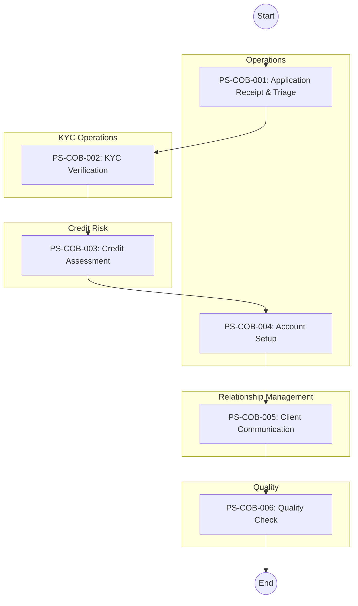

# Management Summary: Client Onboarding

**Document Type:** Process Documentation Management Summary (Amazon 6-Pager Format)
**Process ID:** COB-003
**Business Unit:** BizBanking
**Document Owner:** Markus (RTM)
**Date:** 2025-12-09
**Version:** 1.0-FINAL

---

## 1. Introduction

### The Problem

We are processing 80-120 BizBanking onboarding applications monthly with an average cycle time of 4-6 hours per application, but 30% of applications stall due to incomplete documentation. Staff navigate 6+ disconnected systems with no single client view, causing data re-entry errors and 2+ hours of wasted effort per application. This operational inefficiency costs approximately 200+ hours monthly in rework and delays client time-to-revenue.

### Background

The BizBanking Client Onboarding process establishes banking relationships with business clients (turnover up to 10M) through KYC verification, regulatory compliance screening, and account setup. The process serves as a critical revenue gateway - every day of delay is a day without client deposits and transaction fees.

### Purpose of This Document

This management summary analyzes the current state of the **Client Onboarding** process and recommends **3** strategic actions to **reduce cycle time, eliminate manual inefficiencies, and improve client experience**.

**Decision Required:** Approval to proceed with automation of document reminders, e-signature implementation, and self-service scheduling.

### Scope

| Attribute | Value |
|-----------|-------|
| **Process Category** | Client Onboarding |
| **Geographic Scope** | Ireland |
| **Organizational Scope** | BizBanking |
| **Analysis Period** | 2025 |

### Key Definitions

| Term | Definition |
|------|------------|
| UBO | Ultimate Beneficial Owner - individual with 25%+ ownership |
| SLA | Service Level Agreement - target completion time per step |

---

## 2. Goals

### What Success Looks Like

A business client who applies for a BizBanking account is fully onboarded within 3 business days, with zero manual document chasing and a single welcome call scheduled on first attempt.

### Primary Objectives

| Objective | Baseline | Current | Target | Gap | Status |
|-----------|----------|---------|--------|-----|--------|
| Cycle Time (Days) | 5 days | 4-6 days | 3 days | -2 days | At Risk |
| Document Chase Rate | 30% | 30% | <10% | -20% | Off Track |
| First-Time-Right Rate | 70% | 70% | >90% | +20% | At Risk |
| Welcome Call Success | 33% | 33% | >80% | +47% | Off Track |

### Success Metrics Summary

- **Primary Metric:** Cycle Time (Current: 4-6 days, Target: 3 days)
- **Secondary Metric:** Document Chase Rate (<10%)
- **Lagging Indicator:** Client NPS at Day 30

---

## 3. Tenets

### Guiding Principles

**1. Compliance Over Speed**
Regulatory requirements (KYC, AML, GDPR) are non-negotiable. We will never shortcut compliance to meet cycle time targets.
*Trade-off: We accept longer processing for complex structures over compliance risk.*

**2. Data Entry Once**
Client data should be entered once and flow to all systems. Manual re-keying is a process failure.
*Trade-off: We invest in integration over accepting status quo inefficiency.*

**3. Client Time is Sacred**
Every document chase, every failed call attempt, every delay erodes client trust. We design for minimal client effort.
*Trade-off: We automate our burden, not push it to clients.*

### Hard Constraints

| Constraint | Why It's Non-Negotiable | Impact If Violated |
|------------|-------------------------|-------------------|
| CDD/AML Verification | Regulatory requirement | Fines, license risk |
| GDPR Consent | Data protection law | Legal action, fines up to 4% revenue |

---

## 4. State of the Business

### Executive Summary

The Client Onboarding process is structurally sound but operationally inefficient. All six process steps are documented and compliant, but execution is hampered by system fragmentation (6+ systems, no single view) and manual workarounds (document chasing, paper signatures). Two of four KPIs are off-track. The root cause is underinvestment in automation - staff are doing manually what should be automated.

### Scorecard

| Metric | Value | Target | Status | Trend |
|--------|-------|--------|--------|-------|
| Applications/Month | 80-120 | N/A | On Track | 12-15% YoY |
| Cycle Time | 4-6 days | 3 days | At Risk | Flat |
| Document Chase Rate | 30% | <10% | Off Track | Flat |
| KYC False Positive Rate | 40% | <15% | Off Track | Flat |

### What's Working

- **KYC compliance is robust** - 5 controls mapped to regulations, 0 compliance breaches in 12 months
- **Process structure is sound** - 6 clearly defined steps with ownership and SLAs
- **Quality check is effective** - 20% sample review catches errors before client impact

### What's NOT Working

- **System fragmentation is unacceptable** - Staff copy-paste between 6+ systems. This is 2025, not 2005. We have no single client view. Every application requires 2+ hours of manual data entry that adds zero value.
- **Document chasing is a failure** - 30% of applications require 2-3 manual follow-ups. We have no automated reminders. Staff track deadlines in personal spreadsheets. This is a process governance failure.
- **Paper signatures still exist** - 40% of applications arrive on paper requiring manual digitization. We delay onboarding by 1-2 days to scan documents.
- **Welcome calls are broken** - 70% of clients require 3+ call attempts. We have no self-service scheduling. RMs are playing phone tag.

### Top 5 Critical Items

| Rank | Issue | Impact | Evidence | Owner |
|------|-------|--------|----------|-------|
| 1 | No single client view | 2+ hrs/app wasted | PP-COB-002 | IT/Operations |
| 2 | Manual document chasing | 30% delay rate | PP-COB-001, EX-COB-001 | Operations Manager |
| 3 | 40% KYC false positives | 8-12 hrs/month Compliance time | PP-COB-003 | KYC Lead |
| 4 | Paper signatures | 1-2 day delay on 40% apps | PP-COB-004 | Operations Manager |
| 5 | Welcome call scheduling | 3 attempts average | PP-COB-006 | RM Manager |

---

## 5. Lessons Learned

### What We Got Right

- **Process documentation is comprehensive** - 6 steps, 5 exceptions, 5 controls, 6 pain points all documented with structured IDs. This gives us a clear foundation for improvement.
- **Regulatory compliance is not compromised** - Despite operational inefficiencies, we have maintained 100% compliance with CDD, AML, GDPR, and PSD2 requirements.

### What We Got Wrong

- **We have tolerated manual workarounds for too long** - Staff tracking document deadlines in personal spreadsheets is not a process - it's improvisation. We've accepted this as "how things are" instead of fixing it.
- **We underinvested in integration** - Six systems with manual data transfer between them is a choice we made. Every copy-paste is a potential error. We've traded IT investment for staff time, and that's the wrong trade.
- **We didn't prioritize client experience** - Paper forms, phone tag for welcome calls, 4-6 day cycle times - we've optimized for our convenience, not the client's.

### Root Causes

| Problem | Root Cause | Evidence | Accountability |
|---------|------------|----------|----------------|
| Document chasing | No automated reminder system in OWS | PP-COB-001 | Operations Manager |
| System switching | Systems implemented without integration strategy | PP-COB-002 | IT Director |
| Welcome call failures | No self-service scheduling option | PP-COB-006 | RM Manager |

### Key Insights

1. **Process structure is NOT the problem; execution is.** The 6-step process is sound. The issue is how we execute within those steps.
2. **Quick wins exist.** Automated reminders, e-signatures, and self-service scheduling require minimal investment for high impact.
3. **System integration is strategic, not tactical.** The unified client view requires proper investment and prioritization.

---

## 6. Strategic Priorities

### Priority 1: Eliminate Manual Document Chasing

**Objective:** Implement automated document reminder system to reduce chase rate from 30% to <10%.

**Why Now:** Every manual chase consumes 30 minutes of Operations Officer time. With ~30 incomplete applications per month, we're burning 15+ hours monthly on preventable administrative work. Automated reminders typically improve response rates by 40%.

**Actions:**

| # | Action | Owner | Deadline | Dependencies |
|---|--------|-------|----------|--------------|
| 1 | Configure automated email reminders at Day 3, 7, 14 | Operations Manager | Week 2 | OWS configuration |
| 2 | Create client-facing document checklist with upload portal | IT | Week 4 | Portal enhancement |
| 3 | Implement real-time document status tracking | IT | Week 6 | DMS integration |

**Success Criteria:** Document chase rate <10%, average follow-ups per incomplete app <1.

**If We Don't Do This:** Continued 15+ hours/month wasted, sustained 4-6 day cycle times, staff frustration leading to turnover risk.

---

### Priority 2: Implement E-Signatures

**Objective:** Eliminate paper-based signatures to reduce processing delays by 1-2 days for 40% of applications.

**Why Now:** Paper signatures are a 1990s solution to a 2025 problem. Every paper application adds 1-2 days of delay for scanning and indexing. We're losing approximately 15,000-20,000 annually in printing, postage, and scanning costs.

**Actions:**

| # | Action | Owner | Deadline | Dependencies |
|---|--------|-------|----------|--------------|
| 1 | Select and procure e-signature platform (DocuSign/Adobe Sign) | IT | Week 2 | Budget approval |
| 2 | Integrate with application forms and CRM | IT | Week 6 | Vendor setup |
| 3 | Train staff and update DTPs | Operations Manager | Week 8 | Platform live |

**Success Criteria:** 0% paper signatures on new applications, 1-2 day cycle time reduction.

**If We Don't Do This:** Continued 15-20K annual waste, sustained delays on 40% of applications, poor client experience vs. digital competitors.

---

### Priority 3: Self-Service Welcome Call Scheduling

**Objective:** Implement self-service scheduling to reduce average call attempts from 3 to 1.

**Why Now:** RMs are spending 15-20 minutes per client on phone tag. With 100 onboardings per month, that's 25-33 hours monthly wasted. Clients are frustrated by repeated call attempts.

**Actions:**

| # | Action | Owner | Deadline | Dependencies |
|---|--------|-------|----------|--------------|
| 1 | Implement Calendly or similar scheduling tool | IT | Week 2 | License procurement |
| 2 | Integrate scheduling link into Welcome Email template | Operations | Week 3 | Tool configured |
| 3 | Track scheduling adoption and call success rates | RM Manager | Week 6 | Reporting setup |

**Success Criteria:** >80% first-attempt success rate, <1.2 average attempts per client.

**If We Don't Do This:** Continued 25-33 hours/month wasted, delayed relationship building, poor first impression with new clients.

---

### Quick Wins (Do This Week)

| Action | Owner | Effort | Impact | Deadline |
|--------|-------|--------|--------|----------|
| Create document checklist PDF with examples | Operations Officer | 2 hrs | Reduce incomplete submissions | This week |
| Update email templates with clearer requirements | Operations Officer | 1 hr | Reduce confusion | This week |
| Pilot Calendly with 2 RMs | RM Manager | 1 hr | Validate scheduling solution | This week |

### Immediate Next Steps

| Step | Owner | By When | Deliverable |
|------|-------|---------|-------------|
| Present business case for e-signature platform | Operations Manager | Week 1 | Budget request |
| Configure OWS automated reminder rules | IT | Week 2 | Test in UAT |
| Draft updated Welcome Email with scheduling link | RM Manager | Week 1 | Email template |

---

## Appendix

### A.1 Process Flow Diagram

### A.2 Complete Pain Point Register

| PP# | Pain Point | Category | Impact | Frequency | Priority |
|-----|------------|----------|--------|-----------|----------|
| PP-COB-001 | Manual document chasing | PROCESS | HIGH | HIGH (~30%) | P1 |
| PP-COB-002 | System switching / No single view | SYSTEM | HIGH | HIGH (100%) | P1 |
| PP-COB-003 | KYC screening false positives | SYSTEM | MEDIUM | HIGH | P2 |
| PP-COB-004 | Paper-based signatures | PROCESS | MEDIUM | MEDIUM (~40%) | P2 |
| PP-COB-005 | Credit bureau delays | SYSTEM | LOW | MEDIUM | P3 |
| PP-COB-006 | Welcome call scheduling | PROCESS | MEDIUM | HIGH (~70%) | P2 |

### A.3 Complete Exception Register

| EX# | Exception | Trigger | Affected Steps | Frequency | Impact |
|-----|-----------|---------|----------------|-----------|--------|
| EX-COB-001 | Incomplete Documentation | Required docs missing | PS-COB-001, PS-COB-002 | HIGH (~30%) | MEDIUM |
| EX-COB-002 | KYC Screening Hit | World-Check match | PS-COB-002 | LOW (~5%) | HIGH |
| EX-COB-003 | Credit Decline | Scorecard failure | PS-COB-003 | MEDIUM (~15%) | MEDIUM |
| EX-COB-004 | System Downtime | CBS unavailable >4hrs | PS-COB-004 | LOW (rare) | HIGH |
| EX-COB-005 | Complex Ownership Structure | >3 layers, foreign, trusts | PS-COB-002 | MEDIUM (~20%) | MEDIUM |

### A.4 Control Point Matrix

| CP# | Control | Type | Regulation | Step | Effectiveness |
|-----|---------|------|------------|------|---------------|
| CP-COB-001 | Customer Identification | PREVENTIVE - MANUAL | CDD Regulations 2010 | PS-COB-002 | HIGH |
| CP-COB-002 | Beneficial Owner Identification | PREVENTIVE - MANUAL | AML Act 2010 | PS-COB-002 | HIGH |
| CP-COB-003 | Data Protection Consent | PREVENTIVE - MANUAL | GDPR | PS-COB-001 | HIGH |
| CP-COB-004 | Strong Customer Authentication | PREVENTIVE - AUTO | PSD2 | PS-COB-004 | HIGH |
| CP-COB-005 | Product Disclosure | PREVENTIVE - MANUAL | Consumer Protection Code | PS-COB-005 | MEDIUM |

### A.5 System Dependency Map

| SYS# | System | Type | Purpose |
|------|--------|------|---------|
| SYS-COB-001 | CRM (Salesforce) | CORE | Client relationship management |
| SYS-COB-002 | OWS (Onboarding Workflow) | CORE | Process orchestration |
| SYS-COB-003 | KYC Platform (Fenergo) | CORE | KYC case management |
| SYS-COB-004 | World-Check (Refinitiv) | EXTERNAL | PEP & Sanctions screening |
| SYS-COB-005 | CBS (Temenos T24) | CORE | Account creation |
| SYS-COB-006 | CDS (Credit Decisioning) | SUPPORTING | Credit assessment |
| SYS-COB-007 | DMS (OpenText) | SUPPORTING | Document storage |
| SYS-COB-008 | Card Management (Marqeta) | SUPPORTING | Debit card ordering |

### A.6 Source Documents

| Document | Type | Date |
|----------|------|------|
| as-is-process-documentation.md | AS-IS Process Documentation | 2025-12-09 |
| exceptions-detail.md | Exception Analysis | 2025-12-09 |
| pain-points-detail.md | Pain Point Analysis | 2025-12-09 |
| control-points-detail.md | Control Point Analysis | 2025-12-09 |

### A.7 Contributors

| Name | Role | Contribution | Date |
|------|------|--------------|------|
| Markus | RTM | Process documentation, validation, review | 2025-12-09 |

---

**Document Metadata**

| Attribute | Value |
|-----------|-------|
| Source Document | [as-is-process-documentation.md](./as-is-process-documentation.md) |
| Generated By | ProcessMiner Process Documentation Analyst |
| Document ID | COB-003-management-summary |
| Last Updated | 2025-12-09 |
| Status | FINAL |

---

_This management summary follows the Amazon 6-Pager format for executive decision-making._
_Generated by ProcessMiner Module_
