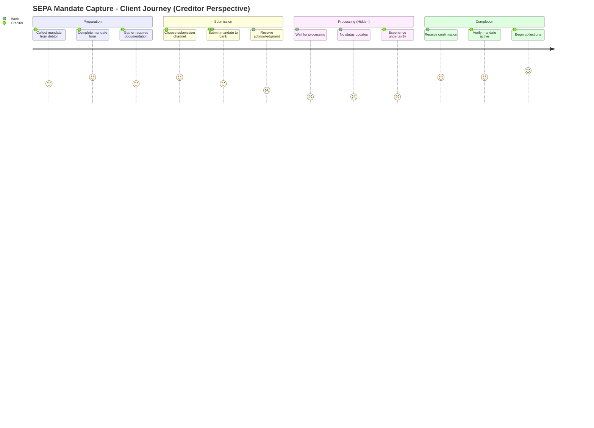

# Client Experience AS-IS Analysis: SEPA Mandate Capture

**Bank:** Regional Bank AG
**Analysis Date:** 2025-12-04
**Status:** Complete

---

## 1. Executive Summary

### Key Findings
- Clients experience a fragmented journey with significant friction at paper submission, status uncertainty, and notification delays
- The process requires 8 client actions on average, with corporate creditors experiencing 12+ touchpoints
- Current Client Effort Score (CES) of 47 is significantly above industry best-in-class of 25
- Status visibility is the #1 client complaint - "black box" experience after submission
- Paper mandate clients experience 1.5x longer cycle time and 2x higher rejection rate

### Overall CES Score
- **Current Score:** 47 (Above average effort required)
- **Baseline for TO-BE comparison** (industry standard: 30-40% reduction target)

### Critical Friction Points
1. **FP01:** No status visibility after mandate submission (Impact: High)
2. **FP02:** Paper mandate collection and submission burden (Impact: High)
3. **FP03:** Multi-day wait without communication (Impact: High)
4. **FP04:** Correction cycle requiring debtor re-engagement (Impact: Medium)

### Enhancement Ideas Summary
- **Total Ideas Documented:** 14
- **Innovations Considered:** 6
- Prioritization will occur during TO-BE transformation design

### New Discoveries Logged
- Pain Points: 3 additional (from CX perspective)
- Exceptions: 1 additional (client-triggered)
- Controls: 0 new

---

## 2. Client Journey Map

### 2.1 Journey Overview

### 2.2 Journey Stages Detail

| Stage | What Client SEES | What Client DOES | Touchpoints | Channels | Wait Time | Emotions |
|-------|------------------|------------------|-------------|----------|-----------|----------|
| Preparation | Blank mandate form, instructions | Collects debtor signature, completes form | 2-4 | Paper, Email | 1-7 days | Neutral to Frustrated |
| Submission | Portal/Branch/Email | Uploads or delivers mandate | 1-2 | Portal, Branch, Email, Post | Minutes to hours | Hopeful |
| Processing | "Submitted" status only | Waits, may call for status | 0-3 inquiries | Portal, Phone | 2-5 days | Anxious, Frustrated |
| Completion | Confirmation email/letter | Reviews confirmation, files records | 1-2 | Email, Letter | N/A | Relieved |

### 2.3 Moments That Matter

**1. First Submission Acknowledgment**
- **Stage:** Submission
- **Why Critical:** Sets expectation for entire journey. Immediate acknowledgment builds trust; silence creates anxiety.
- **Current Experience:** Digital submissions get instant "Received" message; paper mandates get nothing until processing begins.

**2. Status During Processing**
- **Stage:** Processing
- **Why Critical:** This is where clients feel most vulnerable. Their money is on the line, and they have no visibility.
- **Current Experience:** Complete blackout. Clients describe it as "throwing mandate into a void."

**3. Confirmation Receipt**
- **Stage:** Completion
- **Why Critical:** Validates the effort was worthwhile. Enables creditor to begin collections with confidence.
- **Current Experience:** Email confirmation for digital, letter for paper (1-3 day delay). No immediate celebration moment.

---

## 3. Friction Point Analysis

### 3.1 Friction Summary by Type

| Friction Type | Count | Priority Items |
|--------------|-------|----------------|
| Information Gap | 4 | FP01, FP03, FP06, FP09 |
| Process Complexity | 3 | FP02, FP05, FP08 |
| Communication Failure | 3 | FP04, FP07, FP10 |
| Channel Limitation | 2 | FP11, FP12 |
| Waiting | 2 | FP03, FP13 |

### 3.2 Priority Friction Points (P1)

#### FP01: Status Visibility Blackout

| Attribute | Value |
|-----------|-------|
| **Stage** | Processing |
| **Type** | Information Gap |
| **Description** | After submission, clients see only "Submitted" status with no progress indication. Portal does not show validation results, approval stage, or estimated completion. |
| **Impact** | High (5/5) |
| **Frequency** | 100% of mandates |
| **Linked Steps** | PS01-PS12 (all) |

#### FP02: Paper Mandate Collection Burden

| Attribute | Value |
|-----------|-------|
| **Stage** | Preparation |
| **Type** | Process Complexity |
| **Description** | Creditors must physically collect signed mandates from debtors, often involving postal exchange or in-person meetings. Digital alternative not promoted or easy to use. |
| **Impact** | High (4/5) |
| **Frequency** | 45% of mandates |
| **Linked Steps** | PS01, PS02 |

#### FP03: Multi-Day Silent Processing

| Attribute | Value |
|-----------|-------|
| **Stage** | Processing |
| **Type** | Waiting / Information Gap |
| **Description** | Average 3.2-day processing time with zero proactive communication. Clients don't know if mandate is progressing normally or stuck. |
| **Impact** | High (4/5) |
| **Frequency** | 100% of mandates |
| **Linked Steps** | PS04-PS10 |

#### FP04: Correction Cycle Friction

| Attribute | Value |
|-----------|-------|
| **Stage** | Post-Submission |
| **Type** | Communication Failure |
| **Description** | When mandates fail validation, creditors receive rejection notification but must re-engage debtors for corrections. New mandate collection cycle begins. |
| **Impact** | Medium (3/5) |
| **Frequency** | 4.2% of mandates |
| **Linked Steps** | Exception handling |

### 3.3 Quick Wins Identified

| ID | Friction | Fix | Effort | Impact |
|----|----------|-----|--------|--------|
| FP01 | Status visibility | Expose processing stages in portal | Low | High |
| FP07 | Email confirmation delay | Real-time email on registration | Low | Medium |
| FP09 | Estimated completion unknown | Add expected completion date | Low | Medium |
| FP06 | No submission confirmation | Instant acknowledgment for all channels | Low | Medium |

### 3.4 Systemic Issues

- **SI-01:** Channel-centric design, not client-centric
  - Root Cause: Process designed around internal operations, not client journey
  - Requires: Journey redesign with client at center

- **SI-02:** Batch processing mentality in real-time world
  - Root Cause: Legacy system architecture
  - Requires: Event-driven architecture upgrade

- **SI-03:** Paper as default, digital as afterthought
  - Root Cause: Historical client preferences, regulatory caution
  - Requires: Strategic shift to digital-first

---

## 4. Client Effort Score (CES) Analysis

### 4.1 Current CES Metrics

| Metric | Count | Weight | Weighted Score |
|--------|-------|--------|----------------|
| Client Actions | 8 | 1.0 | 8.0 |
| Documents Required | 3 | 1.5 | 4.5 |
| Information Requests | 2 | 1.0 | 2.0 |
| Follow-ups Required | 1.5 avg | 2.0 | 3.0 |
| Channel Switches | 2 | 1.5 | 3.0 |
| Active Time (minutes) | 45 | 0.5 | 22.5 |
| Waiting Time Factor | - | - | 4.0 |
| **TOTAL** | | | **47.0** |

### 4.2 Benchmark Comparison

| Benchmark | Score | Our Gap |
|-----------|-------|---------|
| Industry Average | 38 | +9 (24% worse) |
| Best-in-Class | 25 | +22 (88% worse) |

### 4.3 Next Steps

> **📊 CES BASELINE FOR TO-BE COMPARISON**
>
> This AS-IS CES score (**47**) establishes the baseline for transformation.
> During TO-BE design, this score will be compared against the target state to measure
> improvement. Industry standard for transformation projects is 30-40% CES reduction.
>
> After the Transformation Agent designs the TO-BE state, the Client Journey Analyst
> will recalculate CES in **Flow 2 (Target Validation)** to verify improvements.

---

## 5. Enhancement Ideas

### 5.1 Enhancement Catalog

| ID | Friction | Enhancement | Impact | Complexity | Est. CES Reduction |
|----|----------|-------------|--------|------------|-------------------|
| EI01 | FP01 | Real-time status tracking in portal | High | Low | -8 |
| EI02 | FP02 | Digital mandate with e-signature | High | Medium | -12 |
| EI03 | FP03 | Push notifications at milestones | Medium | Low | -4 |
| EI04 | FP04 | Self-service correction portal | Medium | Medium | -3 |
| EI05 | FP07 | Instant confirmation email | Medium | Low | -2 |
| EI06 | FP06 | Multi-channel submission acknowledgment | Medium | Low | -2 |
| EI07 | FP09 | Estimated completion time display | Low | Low | -2 |
| EI08 | FP05 | Pre-filled mandate from debtor data | Medium | High | -4 |
| EI09 | FP08 | Bulk mandate upload for creditors | Medium | Medium | -3 |
| EI10 | FP10 | Debtor mandate notification portal | Low | Medium | -2 |
| EI11 | FP11 | Mobile mandate submission | Medium | Medium | -3 |
| EI12 | FP12 | WhatsApp/SMS status updates | Low | Low | -2 |
| EI13 | FP13 | Express processing option | Low | High | -1 |
| EI14 | Multiple | Conversational AI for inquiries | Medium | Medium | -3 |

### 5.2 Traceability

Each enhancement traces back to its origin:

| Enhancement | Friction Point | Original Pain Point (PDA) |
|-------------|----------------|---------------------------|
| EI01 | FP01 | PP03 (No Real-time Status) |
| EI02 | FP02 | PP01 (Manual Paper Entry) |
| EI03 | FP03 | PP03, PP09 |
| EI04 | FP04 | PP10 (Amendment Friction) |
| EI05 | FP07 | PP09 (Notification Delays) |

### 5.3 Innovations Considered

| Source | Innovation | Applicability | Notes |
|--------|-----------|---------------|-------|
| Fintech (GoCardless) | One-click mandate via Open Banking | High | PSD2 enables; investigate |
| Competitor Bank A | QR code mandate signing | Medium | Innovative but niche |
| Retail (Amazon) | Proactive status at every step | High | Baseline expectation now |
| Telecom | Self-service cancellation | Medium | Apply to amendment |
| AI/Chatbot | Conversational mandate capture | Medium | Emerging capability |
| Blockchain | Immutable mandate registry | Low | Overkill for current need |

### 5.4 Exclusions (Tried and Failed)

- **Video verification for signature:** Regulatory uncertainty, client friction too high
- **Mandate-as-a-Service (external):** Loss of control, compliance concerns

### 5.5 Next Steps

These enhancement ideas will be prioritized during TO-BE transformation design. The Transformation Agent will use this catalog along with the CES baseline (Section 4) to design the target state.

---

## 6. Industry Trend Research

### 6.1 Bank Strategic Context

**Bank's Stated CX Strategy:**
"Deliver effortless banking experiences that anticipate client needs and reduce friction at every touchpoint." (Strategic Plan 2024-2027)

**Relevant Digital Initiatives:**
- Digital Onboarding Program (in progress)
- Mobile Banking 3.0 (launched 2024)
- Open Banking Platform (pilot phase)
- Customer Data Platform (planned 2025)

### 6.2 Industry Benchmarks

| Metric | Industry Average | Best-in-Class | Our AS-IS |
|--------|-----------------|---------------|-----------|
| CES Score | 38 | 25 | 47 |
| Digital Mandate % | 65% | 90% | 55% |
| STP Rate | 85% | 95% | 55% |
| Status Updates | 3 | Real-time | 2 |
| Cycle Time (days) | 2 | Same-day | 3.2 |

### 6.3 Relevant Trends

| Trend | Relevance | User Assessment | Enhancement Alignment |
|-------|-----------|-----------------|----------------------|
| Open Banking Mandates | High | Strategic fit | EI02 (e-signature) |
| Real-time Everything | High | Client expectation | EI01, EI03 |
| Mobile-First | High | Demographic shift | EI11 |
| Self-Service | High | Cost reduction | EI04 |
| Conversational AI | Medium | Emerging | EI14 |
| Embedded Finance | Low | Not immediate priority | - |

### 6.4 Innovation Examples

| Bank/Org | Innovation | Applicability | Decision |
|----------|-----------|---------------|----------|
| ING | Instant mandate activation | High | Include in TO-BE |
| Revolut | One-tap recurring payment | High | Include in TO-BE |
| Stripe | Self-service mandate portal | High | Include in TO-BE |
| N26 | Real-time everything | High | Include in TO-BE |
| Traditional Bank X | Paper + 5-day processing | Low | Do not follow |

### 6.5 Gap Analysis

Trends that suggest opportunities not currently addressed by enhancements:

#### Gap 1: Open Banking Mandate Initiation

**Trend:** Open Banking / PSD2 enables account-to-account mandate setup
> Clients can authorize mandates directly from their bank, eliminating paper entirely

**Current Coverage:** Not addressed - EI02 focuses on e-signature, not Open Banking

**The Gap:** No enhancement leverages Open Banking APIs for mandate creation

**Potential Impact if Not Addressed:** Competitors using Open Banking will offer superior experience; eventual client expectation

---

## 7. Inputs for TO-BE Design

### 7.1 CES Baseline

The Transformation Agent should use these metrics as the baseline:

| Metric | AS-IS Value |
|--------|-------------|
| Overall CES Score | 47 |
| Industry Average | 38 |
| Best-in-Class | 25 |

Industry standard target: 30-40% CES reduction from AS-IS baseline.

### 7.2 Enhancement Ideas Available

The Transformation Agent has **14** enhancement ideas to consider for TO-BE design (see Section 5).

### 7.3 Critical Success Factors

For a successful TO-BE from a CX perspective:

- **Visibility:** Clients must see their mandate status at all times
- **Speed:** Target same-day processing for digital mandates
- **Self-Service:** Enable clients to track, modify, and resolve issues independently
- **Proactive Communication:** Push updates, don't wait for client to check
- **Digital-First:** Make digital the easy path, paper the exception

### 7.4 Warning: Experience Degradation Risks

**DO NOT** make these changes in TO-BE (would worsen CX):

- **Adding more verification steps:** Already high effort; don't add friction
- **Removing paper option entirely:** Some clients need it; keep as fallback
- **Automated rejections without explanation:** Clients need to understand why
- **Hiding status to reduce inquiries:** Backfires; increases frustration

---

## 8. Appendix: Discovery Logging Summary

### 8.1 New Items Logged

| Type | Count | Files Updated |
|------|-------|---------------|
| Pain Points | 3 | pain-points-detail.md, as-is-process-documentation.md |
| Exceptions | 1 | exceptions-detail.md, as-is-process-documentation.md |
| Controls | 0 | - |

### 8.2 Detailed Discovery Log

#### Pain Points Added
- [x] **PP-CX01:** Debtor confusion about mandate purpose (Source: Journey mapping)
- [x] **PP-CX02:** Creditor uncertainty about collection start date (Source: Journey mapping)
- [x] **PP-CX03:** No mobile-friendly mandate signing option (Source: Journey mapping)

#### Exceptions Added
- [x] **EX-CX01:** Client-initiated mandate inquiry overload (Source: Journey mapping)

#### Controls Added
- None identified during CX analysis

### 8.3 Cross-References

- [pain-points-detail.md](./pain-points-detail.md) - Full pain point documentation
- [exceptions-detail.md](./exceptions-detail.md) - Full exception documentation
- [control-points-detail.md](./control-points-detail.md) - Full control documentation
- [as-is-process-documentation.md](./as-is-process-documentation.md) - Master AS-IS document

---

**Document Version:** 1.0
**Generated By:** Client Journey Analyst
**For:** Transformation Agent (TO-BE Design Input)

---

*This document was generated as part of the ProcessMiner workflow.*
*Client Experience AS-IS Analysis complete.*
