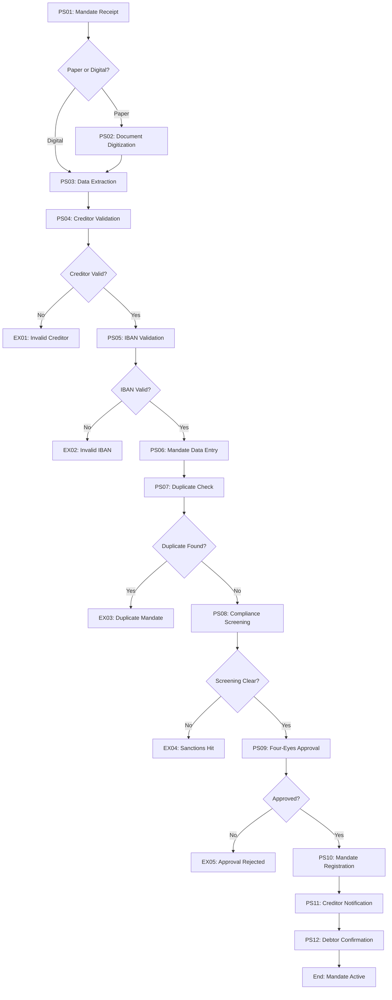

# As-Is Process Documentation: SEPA Mandate Capture

**Document Type:** Current State Process Analysis
**Business Unit:** Retail Banking Operations
**Region:** DACH (Germany, Austria, Switzerland)
**Document Owner:** Payment Services Team Lead
**Last Updated:** 2025-12-04
**Version:** 1.0

---

## Executive Summary

The SEPA Mandate Capture process enables the bank to collect and register SEPA Direct Debit mandates from corporate and retail clients, authorizing the bank to initiate recurring or one-time direct debit collections on behalf of creditors. This process is fundamental to the bank's payment services offering and represents a significant volume of daily transactions.

Currently, the process operates with a hybrid model combining digital and paper-based mandate collection. While digital channels have been introduced, approximately 45% of mandates still arrive via paper forms requiring manual data entry. The average end-to-end cycle time is 3.2 business days, with significant variation based on channel and client segment.

Key improvement opportunities exist in mandate validation automation, duplicate detection, and client communication during the registration process. The process handles approximately 2,500 new mandates monthly with a 4.2% rejection rate due to data quality issues.

### Key Metrics at a Glance

| Metric | Value |
|--------|-------|
| Process Steps | 12 |
| Exceptions Identified | 8 |
| Pain Points Captured | 11 |
| Control Points Mapped | 14 |
| Systems Involved | 6 |
| Overall Confidence | HIGH |

---

## How to Read This Document

> This document captures the **current state (AS-IS)** of the SEPA Mandate Capture process. It provides a comprehensive overview with summary tables. For detailed analysis, see the linked companion documents.
>
> **Companion Documents:**
> - [Exception Details](./exceptions-detail.md) - Full exception analysis with root causes
> - [Pain Point Details](./pain-points-detail.md) - Detailed pain point analysis with improvement ideas
> - [Control Point Details](./control-points-detail.md) - Complete control mapping with compliance analysis
>
> **Confidence Indicators:** Each section includes an AI-assessed completeness confidence:
> - **[HIGH]** - Comprehensive coverage, validated by multiple sources
> - **[MEDIUM]** - Good coverage, some details may need validation
> - **[LOW]** - Preliminary capture, requires additional SME input

---

## 1. Process Overview

> **About this section:** Foundational context - what this process is, who owns it, and what business need it serves.

### 1.1 Process Identification

| Attribute | Value |
|-----------|-------|
| **Process Name** | SEPA Mandate Capture |
| **Process ID** | P-SEPA-MC-001 |
| **Process Category** | Payment Services / Direct Debit Management |
| **Scope** | Receipt, validation, and registration of SEPA Direct Debit mandates (Core and B2B schemes) |
| **Process Owner** | Head of Payment Operations |

### 1.2 Purpose and Trigger

**Purpose:** To capture, validate, and register SEPA Direct Debit mandates from creditors (corporate clients) authorizing the collection of funds from debtors (payers). The mandate serves as the legal basis for all subsequent direct debit collections.

**Trigger:** The process is triggered when:
- A corporate client submits a new SEPA mandate for registration
- A debtor signs a mandate authorizing direct debit collections
- A mandate amendment request is received
- A mandate is migrated from legacy direct debit schemes

### 1.3 Operational Characteristics

**Frequency:** Continuous processing during business hours (08:00-18:00 CET), with batch processing for paper mandates at 10:00, 14:00, and 17:00.

**Volume:** Approximately 2,500 new mandates per month, with peaks at month-end (30% higher) and quarter-end (50% higher). B2B mandates represent 35% of volume.

### 1.4 Key Stakeholders

| Stakeholder | Role | Interest |
|-------------|------|----------|
| Corporate Clients (Creditors) | Mandate submitters | Timely registration, clear status updates |
| Retail Clients (Debtors) | Mandate signatories | Easy signing process, mandate visibility |
| Payment Operations Team | Process executors | Efficient processing, low error rates |
| Compliance Department | Oversight | Regulatory compliance, audit readiness |
| Customer Service | Client support | Quick resolution of mandate inquiries |
| IT Operations | System support | System availability, performance |

> **Section Confidence:** HIGH | **Basis:** Process documentation, SME interviews, transaction data analysis

---

## 2. Process Steps

> **About this section:** The step-by-step flow of this process from start to finish.

### 2.1 Process Step Summary

| PS# | Step Name | Owner | System(s) | Rationale |
|-----|-----------|-------|-----------|-----------|
| PS01 | Mandate Receipt | Channel Management | Portal, Email, Branch | Capture mandate from various channels |
| PS02 | Document Digitization | Back Office | Scanning System | Convert paper mandates to digital format |
| PS03 | Data Extraction | Back Office | OCR Engine | Extract mandate data fields |
| PS04 | Creditor Validation | Payment Ops | CRM, Creditor Registry | Verify creditor identity and authorization |
| PS05 | IBAN Validation | Payment Ops | Core Banking, IBAN Check | Validate debtor account exists and is valid |
| PS06 | Mandate Data Entry | Payment Ops | Mandate Management | Enter/verify mandate details in system |
| PS07 | Duplicate Check | Payment Ops | Mandate Management | Check for existing identical mandates |
| PS08 | Compliance Screening | Compliance | Sanctions Screening | Screen parties against sanctions lists |
| PS09 | Four-Eyes Approval | Payment Ops | Mandate Management | Second approval for mandate registration |
| PS10 | Mandate Registration | Payment Ops | Core Banking | Register mandate in core system |
| PS11 | Creditor Notification | Customer Service | CRM, Email | Notify creditor of successful registration |
| PS12 | Debtor Confirmation | Customer Service | Letter/Email System | Send confirmation to debtor |

### 2.2 Process Flow Diagram

### 2.3 Step Details

**PS01: Mandate Receipt**
Mandates arrive through multiple channels: corporate client portal (40%), email (15%), branch network (30%), and postal mail (15%). Each channel has specific intake procedures. Digital submissions are immediately queued for processing; paper submissions are routed to the scanning station.

**PS02: Document Digitization**
Paper mandates are scanned at 300 DPI with automatic document classification. Images are stored in the document management system with unique reference numbers. Quality checks ensure readability before proceeding.

**PS03: Data Extraction**
OCR technology extracts key fields: creditor ID, debtor name, IBAN, BIC, mandate reference, signature date, and mandate type (recurring/one-off). Manual verification is required for low-confidence extractions (confidence <85%).

**PS04: Creditor Validation**
Verify that the creditor is registered with the bank, has an active creditor ID, and is authorized to collect SEPA direct debits. Check creditor limits and any restrictions.

**PS05: IBAN Validation**
Validate the debtor's IBAN structure (ISO 13616), check digit verification, and verify the account exists in core banking (for internal accounts) or via IBAN directory lookup (for external accounts).

**PS06: Mandate Data Entry**
Complete data entry into the Mandate Management System. All mandatory fields must be populated: Unique Mandate Reference (UMR), creditor identifier, debtor IBAN, signature date, mandate type, and sequence type.

**PS07: Duplicate Check**
System automatically checks for existing mandates with matching creditor ID + debtor IBAN + UMR combination. Potential duplicates are flagged for manual review.

**PS08: Compliance Screening**
Both creditor and debtor are screened against sanctions lists (EU, UN, OFAC) and PEP databases. Any hits require manual review by Compliance team.

**PS09: Four-Eyes Approval**
Second operator reviews and approves the mandate registration. Approver cannot be the same person who performed data entry. System enforces segregation.

**PS10: Mandate Registration**
Upon approval, the mandate is registered in the core banking system with status "Active". The mandate becomes available for direct debit collection processing.

**PS11: Creditor Notification**
Automated notification sent to creditor confirming mandate registration, including UMR and activation date. Delivery via corporate portal or email based on creditor preference.

**PS12: Debtor Confirmation**
Written confirmation sent to debtor (letter for retail, email for corporate) confirming mandate details and rights (including revocation rights under SEPA scheme rules).

> **Section Confidence:** HIGH | **Basis:** Process mapping workshops, system documentation, transaction sampling

---

## 3. Exception Paths and Variations

> **About this section:** Summary of exceptions. For full details including root cause analysis and handling procedures, see [Exception Details](./exceptions-detail.md).

### 3.1 Exception Summary

The SEPA Mandate Capture process encounters 8 documented exceptions, ranging from data quality issues to compliance holds. The most frequent exceptions relate to IBAN validation failures (32% of all exceptions) and incomplete mandate forms (28%). High-impact exceptions include sanctions screening hits and creditor authorization failures, which require escalation and can significantly delay mandate activation.

### 3.2 Exception Summary Table

| EX# | Exception | Trigger | Affected Steps | Frequency | Impact |
|-----|-----------|---------|----------------|-----------|--------|
| EX01 | Invalid Creditor | Creditor not registered or inactive | PS04 | 8% of cases | High |
| EX02 | Invalid IBAN | IBAN fails validation or account closed | PS05 | 12% of cases | Medium |
| EX03 | Duplicate Mandate | Matching mandate already exists | PS07 | 5% of cases | Low |
| EX04 | Sanctions Hit | Party matches sanctions list | PS08 | 0.3% of cases | Critical |
| EX05 | Approval Rejected | Four-eyes review fails | PS09 | 3% of cases | Medium |
| EX06 | Incomplete Form | Missing mandatory fields | PS03, PS06 | 15% of cases | Medium |
| EX07 | Signature Invalid | Missing or invalid signature | PS03 | 6% of cases | High |
| EX08 | Expired Mandate | Signature date >12 months old | PS06 | 2% of cases | Low |

### 3.3 Exception Statistics

| Metric | Value |
|--------|-------|
| Total Exceptions | 8 |
| High-Impact Exceptions | 3 |
| Frequently Occurring | 4 |

> **Full Analysis:** [View Exception Details](./exceptions-detail.md)
>
> **Section Confidence:** HIGH | **Basis:** Exception logs, case analysis, SME interviews

---

## 4. Control Points and Compliance

> **About this section:** Summary of controls. For full regulatory mapping and effectiveness analysis, see [Control Point Details](./control-points-detail.md).

### 4.1 Control Summary

The process implements 14 control points to ensure SEPA scheme compliance, AML/CFT requirements, and operational integrity. Controls span preventive (9), detective (3), and corrective (2) types. The control framework ensures mandate authenticity, prevents unauthorized collections, maintains regulatory compliance, and provides audit trail completeness.

### 4.2 Control Point Summary Table

| CP# | Control Name | Type | Regulation | Process Step | Effectiveness |
|-----|--------------|------|------------|--------------|---------------|
| CP01 | Creditor ID Verification | Preventive | SEPA Rulebook | PS04 | High |
| CP02 | IBAN Format Validation | Preventive | ISO 13616 | PS05 | High |
| CP03 | IBAN Existence Check | Preventive | SEPA Rulebook | PS05 | Medium |
| CP04 | Duplicate Detection | Detective | Internal Policy | PS07 | Medium |
| CP05 | Sanctions Screening | Preventive | EU AML Directive | PS08 | High |
| CP06 | Four-Eyes Principle | Preventive | Internal Policy | PS09 | High |
| CP07 | Signature Validation | Preventive | SEPA Rulebook | PS03 | Medium |
| CP08 | Mandate Date Validation | Preventive | SEPA Rulebook | PS06 | High |
| CP09 | UMR Uniqueness | Preventive | SEPA Rulebook | PS06 | High |
| CP10 | Creditor Limit Check | Preventive | Internal Policy | PS04 | High |
| CP11 | Audit Trail Logging | Detective | MaRisk | All | High |
| CP12 | Daily Reconciliation | Detective | Internal Policy | Post-PS10 | Medium |
| CP13 | Exception Management | Corrective | Internal Policy | All | Medium |
| CP14 | Quality Sampling | Detective | Internal Policy | Weekly | Low |

### 4.3 Regulatory Coverage

| Regulation | Controls Mapped | Coverage Status |
|------------|-----------------|-----------------|
| SEPA Core Direct Debit Rulebook | CP01, CP02, CP03, CP07, CP08, CP09 | Full |
| SEPA B2B Direct Debit Rulebook | CP01, CP02, CP03, CP07, CP08, CP09 | Full |
| EU AML Directive (6AMLD) | CP05, CP11 | Full |
| MaRisk (Germany) | CP06, CP11, CP13 | Full |
| GDPR | CP11, CP12 | Partial |

### 4.4 Control Statistics

| Metric | Value |
|--------|-------|
| Total Control Points | 14 |
| Regulatory Controls | 10 |
| Internal Controls | 4 |
| Automated Controls | 8 |

> **Full Analysis:** [View Control Point Details](./control-points-detail.md)
>
> **Section Confidence:** HIGH | **Basis:** Control documentation, audit reports, compliance reviews

---

## 5. System Dependencies

> **About this section:** What technology supports this process?

### 5.1 System Summary

| SYS# | System Name | Purpose | Integration Points |
|------|-------------|---------|-------------------|
| SYS01 | Mandate Management System (MMS) | Core mandate lifecycle management | Core Banking, CRM, Screening |
| SYS02 | Core Banking System (CBS) | Account validation, mandate storage | MMS, Clearing |
| SYS03 | Document Management (DMS) | Mandate image storage | Scanning, MMS |
| SYS04 | OCR Engine | Data extraction from paper | Scanning, MMS |
| SYS05 | Sanctions Screening Platform | AML/CFT compliance | MMS |
| SYS06 | Corporate Client Portal | Digital mandate submission | MMS |

### 5.2 System Integration Overview

The Mandate Management System (MMS) serves as the central orchestration hub, receiving mandate data from multiple input channels and coordinating validation steps across connected systems. Real-time API integration with Core Banking enables instant IBAN validation. The Sanctions Screening Platform is invoked synchronously before approval to ensure compliance clearance. Document images flow from the scanning system through OCR to MMS with metadata linking.

### 5.3 Data Flow Summary

1. **Inbound:** Mandate data enters via Portal API (JSON), Email parser (structured), or OCR extraction (scanned image)
2. **Validation:** Data enriched with creditor details from CRM, validated against Core Banking
3. **Storage:** Registered mandates stored in Core Banking; images retained in DMS for 10 years
4. **Outbound:** Mandate references transmitted to clearing system; notifications via CRM channels

> **Section Confidence:** HIGH | **Basis:** System architecture documentation, integration specifications

---

## 6. Organizational Mapping

> **About this section:** Who does what? Roles and responsibilities.

### 6.1 RACI Matrix

| Activity | Payment Ops | Compliance | Customer Service | IT Ops |
|----------|-------------|------------|------------------|--------|
| Mandate Receipt | R | - | A | C |
| Document Scanning | R | - | - | C |
| Data Entry | R | - | - | - |
| Creditor Validation | R | C | - | - |
| Sanctions Screening | C | R/A | - | - |
| Four-Eyes Approval | R/A | - | - | - |
| Client Notifications | I | - | R | - |
| Exception Handling | R | A | C | C |
| System Monitoring | - | - | - | R |

### 6.2 Team Responsibilities

**Payment Operations Team (8 FTE)**
- Primary process execution responsibility
- Mandate data entry and validation
- Four-eyes approval (rotational)
- Exception handling (first level)
- Volume: ~100 mandates/day per operator

**Compliance Team (2 FTE supporting)**
- Sanctions hit investigation
- Regulatory interpretation
- Control effectiveness monitoring
- Audit liaison

**Customer Service (4 FTE supporting)**
- Client inquiry handling
- Status communication
- Complaint management

> **Section Confidence:** MEDIUM | **Basis:** Organizational charts, role descriptions, SME input

---

## 7. Existing Documentation References

> **About this section:** Related documents and metrics.

### 7.1 Related Documents

| Document | Location | Last Updated |
|----------|----------|--------------|
| SEPA Mandate Processing Procedure | SharePoint/Ops/Procedures | 2024-09-15 |
| MMS User Manual | Confluence/IT/Systems | 2024-11-20 |
| SEPA Scheme Rulebook (v10.0) | EPC Website | 2023-11-20 |
| AML Policy | Compliance Portal | 2024-06-01 |
| Creditor Onboarding Guide | SharePoint/Sales | 2024-08-10 |

### 7.2 KPIs and Metrics

| KPI | Target | Current | Status |
|-----|--------|---------|--------|
| End-to-End Cycle Time | 2 days | 3.2 days | Below Target |
| First-Time-Right Rate | 95% | 88% | Below Target |
| Rejection Rate | <3% | 4.2% | Below Target |
| STP Rate | 80% | 55% | Below Target |
| Client Satisfaction | >4.0/5 | 3.4/5 | Below Target |

### 7.3 DTPs (Detailed Task Procedures)

| DTP# | Procedure Name | Coverage |
|------|----------------|----------|
| DTP-MMS-001 | Paper Mandate Scanning | PS02 |
| DTP-MMS-002 | OCR Exception Handling | PS03 |
| DTP-MMS-003 | Creditor Setup Verification | PS04 |
| DTP-MMS-004 | IBAN Validation Steps | PS05 |
| DTP-MMS-005 | Four-Eyes Approval Process | PS09 |

> **Section Confidence:** HIGH | **Basis:** Documentation audit, metric reports

---

## 8. Process Gaps and Issues

> **About this section:** Known gaps and inconsistencies.

### 8.1 Identified Gaps

1. **Digital Channel Gap:** No mobile app support for mandate signing - clients must use web portal or paper
2. **Real-time Status Gap:** Clients cannot track mandate status in real-time after submission
3. **Amendment Gap:** Mandate amendments require full re-submission rather than delta changes
4. **Cross-border Gap:** Limited support for cross-border mandate validation (non-domestic IBANs)

### 8.2 Missing Documentation

- Escalation matrix for compliance exceptions not formally documented
- SLA definitions for client notifications incomplete
- Recovery procedures for system outages not current

### 8.3 Inconsistencies

- Paper and digital mandates follow different validation sequences
- B2B mandate handling differs between branches without documented reason
- Notification timing varies by channel (1-3 days variance)

> **Section Confidence:** MEDIUM | **Basis:** Gap analysis workshops, client feedback, process observation

---

## 9. Pain Points and Improvement Opportunities

> **About this section:** Summary of pain points. For full analysis including root causes and improvement ideas, see [Pain Point Details](./pain-points-detail.md).

### 9.1 Pain Points Summary

Eleven pain points have been identified across the SEPA Mandate Capture process, with the highest impact areas being manual data entry for paper mandates (PP01), lack of real-time client feedback (PP03), and duplicate mandate handling complexity (PP06). The pain points span operational efficiency, client experience, and compliance burden dimensions.

### 9.2 Pain Point Summary Table

| PP# | Pain Point | Category | Affected Steps | Impact | Frequency | Priority |
|-----|------------|----------|----------------|--------|-----------|----------|
| PP01 | Manual Paper Mandate Entry | Efficiency | PS02, PS03, PS06 | High | Daily | P1 |
| PP02 | OCR Accuracy Issues | Quality | PS03 | Medium | Daily | P2 |
| PP03 | No Real-time Status Updates | CX | PS01-PS12 | High | Continuous | P1 |
| PP04 | Creditor Validation Delays | Efficiency | PS04 | Medium | Daily | P2 |
| PP05 | External IBAN Validation | Quality | PS05 | Medium | Weekly | P3 |
| PP06 | Duplicate Handling Complexity | Efficiency | PS07 | High | Weekly | P1 |
| PP07 | Sanctions Screening Latency | Efficiency | PS08 | Low | Daily | P3 |
| PP08 | Four-Eyes Bottleneck | Efficiency | PS09 | High | Daily | P1 |
| PP09 | Client Notification Delays | CX | PS11, PS12 | Medium | Daily | P2 |
| PP10 | Amendment Process Friction | CX | N/A | Medium | Weekly | P2 |
| PP11 | Reporting Limitations | Operations | All | Low | Monthly | P3 |

### 9.3 Pain Point Statistics

| Metric | Value |
|--------|-------|
| Total Pain Points | 11 |
| High-Impact | 4 |
| Client-Facing | 4 |
| Quick Win Opportunities | 3 |

### 9.4 Top Improvement Opportunities

1. **Implement Digital-First Mandate Capture** - Shift paper mandates to digital channels with e-signature capability
2. **Introduce Real-time Status Tracking** - Client portal enhancement for mandate status visibility
3. **Automate Duplicate Resolution** - Rules-based handling for common duplicate scenarios
4. **Parallel Processing** - Enable sanctions screening during data entry to reduce wait time

> **Full Analysis:** [View Pain Point Details](./pain-points-detail.md)
>
> **Section Confidence:** HIGH | **Basis:** SME interviews, client feedback, operational metrics

---

## Document Metadata

**SME Contributors:** Maria Schmidt (Payment Ops Lead), Thomas Weber (Compliance Officer), Anna Müller (IT Systems Analyst)
**Interview Date(s):** 2025-11-25, 2025-11-27, 2025-12-02
**Documentation Method:** Process mapping workshops, system walkthroughs, transaction sampling

### Overall Document Confidence

| Section | Confidence | Key Gaps |
|---------|------------|----------|
| 1. Process Overview | HIGH | None |
| 2. Process Steps | HIGH | Some branch variations not captured |
| 3. Exceptions | HIGH | Resolution times not verified |
| 4. Controls | HIGH | GDPR mapping needs review |
| 5. Systems | HIGH | None |
| 6. Organization | MEDIUM | Actual capacity utilization unclear |
| 7. Documentation | HIGH | Some DTPs outdated |
| 8. Gaps & Issues | MEDIUM | Client perspective limited |
| 9. Pain Points | HIGH | Cost impact estimates preliminary |

**Overall Confidence:** HIGH

### Companion Documents

| Document | Purpose | Link |
|----------|---------|------|
| Exception Details | Full exception analysis | [exceptions-detail.md](./exceptions-detail.md) |
| Pain Point Details | Full pain point analysis | [pain-points-detail.md](./pain-points-detail.md) |
| Control Point Details | Full control analysis | [control-points-detail.md](./control-points-detail.md) |

---

## Change Log

| Date | Contributor | Role | Changes |
|------|-------------|------|---------|
| 2025-12-04 | ProcessMiner Analyst | Process Documentation Analyst | Initial documentation |

---

## Glossary

| Term | Definition |
|------|------------|
| SEPA | Single Euro Payments Area - EU payment integration scheme |
| UMR | Unique Mandate Reference - identifier assigned by creditor |
| Creditor ID | Identifier assigned to organizations collecting direct debits |
| IBAN | International Bank Account Number |
| BIC | Bank Identifier Code (SWIFT code) |
| SDD Core | SEPA Direct Debit Core scheme (consumer) |
| SDD B2B | SEPA Direct Debit Business-to-Business scheme |
| EPC | European Payments Council |
| MaRisk | Minimum Requirements for Risk Management (German regulation) |
| STP | Straight-Through Processing |

---

_Generated by ProcessMiner Process Documentation Analyst_
_Document ID: P-SEPA-MC-001-ASIS_
