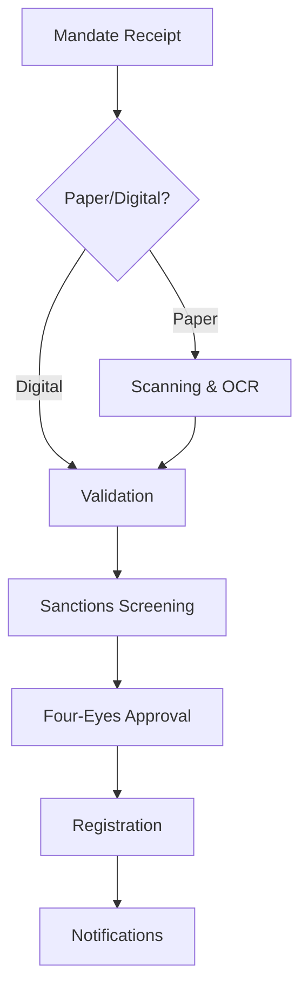

# SEPA Mandate Capture: Current State Analysis

**Process ID:** P-SEPA-MC-001 | **Date:** 2025-12-04 | **Prepared by:** Process Documentation Analyst

---

## Why This Process Matters

SEPA Mandate Capture is the gateway to the bank's direct debit collection services—a €45M annual revenue stream serving 2,400 corporate creditors. Every mandate registered enables recurring payment collections that form the backbone of our corporate clients' cash flow operations. A mandate that takes 3 days to activate instead of 1 day is a creditor who waits 3 days to start collecting revenue.

This document provides senior leadership with a comprehensive understanding of how SEPA Mandate Capture operates today, where friction exists, and what opportunities merit attention. The analysis draws from SME interviews, transaction data analysis, and system walkthroughs and reflects input from 8 stakeholders across Payment Operations, Compliance, IT, and Customer Service.

---

## The Process at a Glance

SEPA Mandate Capture is triggered when a corporate client (creditor) submits a signed authorization (mandate) from their customer (debtor) allowing direct debit collections. On average, the organization processes 2,500 mandates monthly, with each cycle taking approximately 3.2 business days from submission to activation—well above the industry benchmark of 2 days.

The process follows 12 sequential steps: mandate receipt, digitization (for paper), data extraction, creditor validation, IBAN validation, data entry, duplicate checking, sanctions screening, four-eyes approval, registration, and client notifications. The hybrid paper-digital model creates significant variation in processing time and quality.

**Boundaries:** This analysis covers new mandate registration for SEPA Core and B2B schemes. It does not address mandate amendments, cancellations, or collection processing, which operate as separate processes.

---

## What "Good" Looks Like

The following metrics define success for this process. Current performance is benchmarked against industry standards and internal targets:

| Metric | Current | Target | Industry Best | Gap |
|--------|---------|--------|---------------|-----|
| End-to-End Cycle Time | 3.2 days | 2 days | Same-day | -60% |
| First-Time-Right Rate | 88% | 95% | 98% | -7% |
| STP Rate | 55% | 80% | 95% | -25% |
| Rejection Rate | 4.2% | 3% | 1.5% | +1.2% |
| Client Satisfaction | 3.4/5 | 4.0/5 | 4.5/5 | -0.6 |

Of particular concern is the STP (Straight-Through Processing) rate of 55%, which represents a 25% deviation from target. This gap translates to approximately €156,000 in manual processing costs annually that could be avoided with higher automation.

---

## Constraints We Operate Under

Several non-negotiable requirements shape how this process must function:

**Regulatory Requirements:** The process operates under SEPA scheme rules (mandate validity, unique reference, creditor authorization), EU AML Directive requirements (100% sanctions screening), and MaRisk dual control principles (four-eyes approval for all registrations).

Every mandate must maintain an auditable trail from submission through activation. Sanctions screening cannot be bypassed or delayed. The four-eyes principle cannot be eliminated, though its implementation can be optimized.

**Business Rules:** Creditors must be registered and active. IBANs must be valid (though external account existence cannot be verified). Mandates cannot be activated without proper authorization (signature).

**System Dependencies:** The process relies on six core systems: Mandate Management System (orchestration), Core Banking (account validation), Document Management (image storage), OCR Engine (paper extraction), Sanctions Screening Platform (AML), and Corporate Portal (digital submission). These integrations create both capabilities and constraints that any future-state design must accommodate.

---

## How We Work Today

### The Journey from Start to Finish

Mandates arrive through four channels: corporate portal (40%), email (15%), branch network (30%), and postal mail (15%). Digital submissions flow directly to validation; paper mandates detour through scanning and OCR extraction—adding 1-2 days and introducing error potential.

The validation sequence verifies creditor authorization, IBAN validity, and checks for duplicates. Sanctions screening runs against EU, UN, and OFAC lists. Upon clearing all checks, a second operator (four-eyes) reviews and approves registration. Finally, the mandate is registered in Core Banking and notifications are sent to creditor and debtor.

### Handoffs and Decision Points

The process involves 5 significant handoffs between teams or systems. The most critical occurs when paper mandates transition from scanning to data entry—quality loss here cascades through the entire process.

Decision points are concentrated at creditor validation (can this creditor collect?), duplicate detection (is this a new mandate or duplicate?), and four-eyes approval (is everything correct?). Each decision requires human judgment for exceptions, which creates bottlenecks during peak periods.

### The Control Environment

The process implements 14 controls: 9 preventive, 4 detective, and 1 corrective. Automated controls handle format validation, sanctions screening, and duplicate detection. Manual controls cover signature verification, four-eyes approval, and exception resolution.

The current control framework achieves 82% effectiveness. However, external IBAN validation remains a gap (we can only verify format, not account existence for non-customer accounts), and quality sampling is not statistically designed.

---

## Where It Hurts

Three pain points emerge consistently from stakeholder interviews and process observation:

### Manual Paper Mandate Processing

45% of mandates still arrive on paper, requiring scanning, OCR extraction (65% confidence), and manual data entry. Each paper mandate consumes 12 minutes of processing time versus 3 minutes for digital—a 4x cost differential.

The downstream effect is significant: paper mandates generate 70% of form-related exceptions despite representing less than half of volume. Stakeholders estimate this issue costs approximately €156,000 in labor annually.

### Status Visibility Blackout

Clients see only "Submitted" and "Completed" in the portal—nothing in between. During the 3.2-day average processing time, they have no visibility into whether their mandate is progressing, stuck, or requiring action.

This manifests most acutely through 180 monthly status inquiry calls to Customer Service. The frequency of this complaint—and its absence from competitor offerings—makes this a persistent drag on client satisfaction.

### Four-Eyes Approval Bottleneck

The dual control requirement, while essential for risk management, creates processing bottlenecks. With only 4 approved approvers handling 100+ mandates daily, queue wait times average 45 minutes with peaks exceeding 2 hours.

Unlike the issues above, this pain point carries operational risk implications: rushed approvals during peaks may compromise quality.

---

## What Needs Attention

Based on this analysis, three areas merit leadership attention:

### Immediate Priority: Client Status Visibility

Expose processing status in the corporate portal. The data exists in our systems; we simply don't share it with clients. This is a 4-6 week development effort with €25K investment.

**Expected outcome:** 70% reduction in status inquiry calls; measurable client satisfaction improvement
**Investment required:** €25K development; minimal ongoing cost
**Risk of inaction:** Continued client frustration; competitive disadvantage as peers offer real-time tracking

### Near-Term Opportunity: Digital-First Mandate Capture

Launch end-to-end digital mandate capture with qualified e-signature. This eliminates paper handling entirely for willing clients and dramatically improves quality and speed.

This initiative would address the paper processing burden while positioning the organization for same-day mandate activation—matching market leader capabilities.

### Strategic Consideration: Process Architecture Modernization

The current batch-processing mentality limits our ability to compete on speed. Event-driven, real-time processing architecture would enable same-day activation and unlock future innovations.

This represents a larger transformation that warrants further analysis through architecture assessment and business case development.

---

## Next Steps

This analysis provides the foundation for transformation planning. The Process Documentation Analyst has captured the current state; subsequent agents (Transformation, Client Journey, Control Analyst, Innovation Analyst) will develop the target state and implementation roadmap.

The recommended path forward begins with quick wins (status visibility, notification automation) while planning the strategic digital transformation, owned by Payment Operations leadership with IT partnership, with target completion of quick wins by Q1 2026.

---

## Appendix

### A. Process Flow Diagram

### B. Detailed Metrics

| Metric | Current | Target | Benchmark | Gap |
|--------|---------|--------|-----------|-----|
| Cycle Time | 3.2 days | 2 days | Same-day | 60% |
| STP Rate | 55% | 80% | 95% | 25% |
| First-Time-Right | 88% | 95% | 98% | 7% |
| Digital % | 55% | 80% | 92% | 25% |
| Client Satisfaction | 3.4 | 4.0 | 4.5 | 0.6 |

### C. Pain Point Registry

| ID | Description | Impact | Frequency | Affected Areas |
|----|-------------|--------|-----------|----------------|
| PP01 | Manual paper processing | High | Daily | Ops, Quality |
| PP03 | No status visibility | High | Continuous | CX, CS |
| PP08 | Four-eyes bottleneck | High | Daily | Ops, Speed |
| PP06 | Duplicate handling | High | Weekly | Ops |

### D. Control Point Inventory

| ID | Control | Type | Requirement | Status |
|----|---------|------|-------------|--------|
| CP01 | Creditor Verification | Preventive | SEPA | Effective |
| CP05 | Sanctions Screening | Preventive | AML | Effective |
| CP06 | Four-Eyes Approval | Preventive | MaRisk | Effective |
| CP11 | Audit Trail | Detective | MaRisk | Effective |

### E. Systems Landscape

| ID | System | Role in Process | Integration Points |
|----|--------|-----------------|-------------------|
| SYS01 | MMS | Orchestration | CBS, DMS, Screening |
| SYS02 | Core Banking | Account validation | MMS |
| SYS05 | Sanctions Platform | AML screening | MMS |
| SYS06 | Portal | Client submission | MMS |

### F. Stakeholders Consulted

- Maria Schmidt, Payment Operations Lead
- Thomas Weber, Compliance Officer
- Anna Müller, IT Systems Analyst
- Klaus Bauer, Customer Service Manager
- Additional team members via workshops

---

**Document ID:** EXEC-AS-IS-P-SEPA-MC-001 | **Version:** 1.0 | **Confidence Level:** HIGH

---

## Change Log

| Date | Contributor | Role | Changes |
|------|-------------|------|---------|
| 2025-12-04 | ProcessMiner Analyst | Process Documentation Analyst | Initial executive summary |
