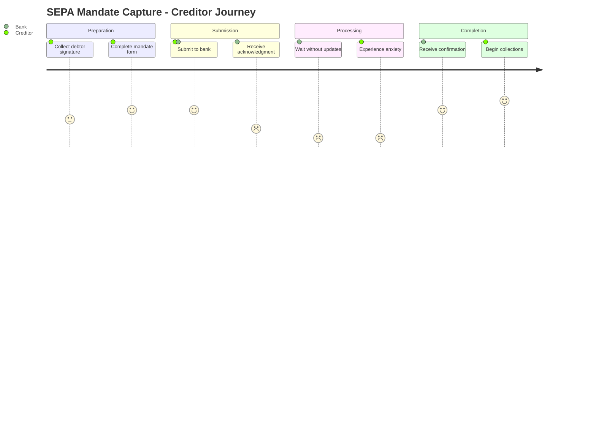

# SEPA Mandate Capture: Client Journey Analysis

**Process ID:** P-SEPA-MC-001 | **Date:** 2025-12-04 | **Prepared by:** Client Journey Analyst

---

## Why Client Experience Matters Here

The mandate capture journey is often the first operational interaction a new creditor has with our payment services. This moment shapes perception of our entire corporate banking relationship. A frustrated creditor at mandate stage is a creditor questioning their bank choice.

This analysis examines how clients actually experience SEPA Mandate Capture—not how we designed it to work, but how it feels from their perspective. The findings draw from client feedback surveys, call center inquiry analysis, and journey mapping workshops and represent the voice of corporate creditors and retail debtors.

The business case is direct: client experience in this process correlates with creditor retention and share-of-wallet. When clients struggle here, they consolidate mandates with competitors offering better experience. When the journey flows smoothly, they expand their mandate portfolio with us.

---

## Who Our Clients Are

**Corporate Creditors** range from small businesses submitting 5 mandates monthly to large enterprises submitting 500+. They vary in digital sophistication but share common needs: speed (time is money), predictability (when will collection start?), and minimal effort (not their core business).

**Retail Debtors** are the signatories—customers of our creditors who authorize direct debits. They interact briefly but critically: signing the mandate. Their experience affects creditor success rates.

These clients come to SEPA Mandate Capture with a clear goal: authorize and activate direct debit collection as quickly and simply as possible. They expect acknowledgment, progress visibility, and prompt completion. Their tolerance for friction is low because alternatives exist—competitors and fintechs offer same-day activation.

Understanding this context is essential. A journey that seems "good enough" internally may feel entirely different to a creditor who just lost 3 days of collections because we couldn't process their mandate.

---

## Their Journey Today

### The Path from Start to Finish

The creditor's journey begins before they reach us—collecting the signed mandate from their customer. For paper mandates, this alone takes 1-7 days. Then they submit to us and wait. And wait. With no visibility. Until—perhaps 3 days later—a confirmation arrives.

The journey unfolds across 4 distinct stages, each with its own emotional arc:

**Stage 1: Preparation**

The creditor must collect debtor signatures. For paper mandates, this means printing forms, mailing or meeting in person, waiting for return, and checking completion. Digital mandate options exist but aren't prominently offered.

At this point, clients feel resignation (paper is cumbersome) or hope (if they find digital option). Their effort level is HIGH. The experience is outdated compared to other banking interactions.

**Stage 2: Submission**

The creditor chooses a channel and submits. Digital portal users get instant acknowledgment; paper submitters get nothing. The creditor has done their part and now must wait.

Emotion shifts to hopeful but uncertain. Effort drops post-submission. This stage works adequately but misses opportunity to set expectations.

**Stage 3: Processing (The Black Box)**

This is where we fail our clients. For 2-5 days, they see nothing. "Submitted" status in portal. No updates. No indication of progress or problems. Clients don't know if we're processing, stuck, or waiting for them.

By now, clients are anxious and frustrated. The cumulative uncertainty has eroded the trust built in prior interactions.

**Stage 4: Completion**

A confirmation finally arrives—email for digital, letter for paper (with additional 1-3 day delay). The mandate is active, collections can begin.

The journey concludes with clients feeling relief rather than delight. Their lasting impression is "that took too long" rather than "that was easy."

---

## Where It Breaks Down

Three pain points consistently emerge from client feedback. Each represents a moment where we fail to meet expectations:

### The Visibility Void

After submitting a mandate, clients enter a communication blackout. The portal shows "Submitted"—and nothing else until "Completed" appears days later. No progress, no expected completion date, no indication if action is needed.

Clients describe this in their own words: *"I submitted 50 mandates on Monday. It's Thursday. Are they stuck? Did something fail? I have no idea."*

This friction occurs during the entire processing stage and affects 100% of journeys. The emotional impact is significant—clients feel ignored and anxious.

The business consequence: 180 monthly inquiry calls. 3% duplicate submissions from clients who weren't sure if the first one worked. Competitor mentions in feedback surveys.

### Paper Mandate Burden

The dominant paper channel requires creditors to physically collect signatures—printing, mailing, meeting, waiting. This creates 1-7 days of client effort before they even reach us.

As one client put it: *"Why am I mailing paper in 2025? My accountant does everything else digitally."*

This pain point manifests at the very start of the journey, occurring for 45% of mandates. Clients experience frustration that their bank—which offers mobile banking—can't offer digital mandate signing.

### Correction Cycle Nightmare

When we reject a mandate for errors (4.2% rate), the client receives a rejection notice and must re-engage their debtor for corrections. A simple IBAN typo means another round of debtor contact, signature collection, and submission.

Client feedback: *"You rejected my mandate for a typo. Now I have to go back to my customer, embarrassed, and ask them to sign again. This should be fixable without involving them."*

Unlike the issues above, this pain point particularly affects client relationships with their own customers. It makes them look unprofessional.

---

## The Moments That Matter

Not all touchpoints carry equal weight. Three "moments of truth" disproportionately shape how clients remember this journey:

### First Response After Submission

This moment matters because it sets expectations for everything that follows. Currently, we perform inconsistently: digital gets instant acknowledgment, paper gets silence.

The gap between expectation (immediate confirmation) and reality (silence for paper) creates early trust erosion.

### Status During Processing Wait

This is the make-or-break moment. Days of silence feel like days of neglect. Clients expect the Amazon experience—track every step. We deliver the 1990s experience—call us if you want to know.

Current performance: zero proactive updates. Target: notifications at each milestone. Getting this moment right would transform perception from "black box" to "transparent partner."

### Problem Notification and Resolution

How we handle exceptions defines the relationship. Currently: impersonal rejection email, full re-submission required, debtor re-engagement needed.

This final moment determines whether a frustrated client stays or goes. Our current delivery fails to recognize that a rejected mandate is a stressed client needing help, not just an exception to log.

---

## How We Compare

Client expectations are shaped by experiences beyond banking. They compare us to Amazon (real-time tracking), Uber (proactive updates), and fintech payment providers (instant everything).

| What We Measure | Our Performance | What Clients Experience Elsewhere | The Gap |
|-----------------|-----------------|-----------------------------------|---------|
| Client Effort Score | 47 | Best-in-class: 25 | +22 |
| Status Updates | 2 (start/end) | Real-time | Missing |
| Digital Mandate | 55% | 92% | -37% |
| Cycle Time | 3.2 days | Same-day | -3+ days |

The benchmark narrative is stark: we are not just behind our banking peers—we are generations behind the digital experiences clients have in other aspects of their lives. The expectation is real-time visibility and same-day completion. We deliver neither.

---

## What Needs to Change

Based on this analysis, we recommend focusing on three areas:

### Quick Win: Real-Time Status Tracking

Expose processing status in the portal. Show clients where their mandate is: Received → Validating → Approving → Registered → Active. Add expected completion date based on historical data.

This improvement requires €25K investment and can be implemented within 6 weeks. Expected impact: 70% reduction in status inquiries, +0.5 NPS points, elimination of uncertainty-driven duplicate submissions.

### Quick Win: Proactive Notifications

Don't wait for clients to check. Push email/SMS at key milestones: received, approved, activated. Notify immediately if action needed.

Implementation effort: €20K. Timeline: 4 weeks. Expected impact: clients feel informed and valued; inquiry calls reduced further.

### Strategic Initiative: Digital Mandate with e-Signature

Transform the end-to-end journey by enabling fully digital mandate capture. Debtor receives email link, signs digitally, mandate auto-submits. Zero paper, zero postal delay, same-day activation.

This represents a more significant undertaking, requiring €120K investment over 4-6 months. The payoff is substantial: competitive parity with market leaders, 30%+ CES improvement, new creditor acquisition enablement.

### Strategic Initiative: Self-Service Correction

Enable creditors to fix simple errors (IBAN typos, date corrections) without re-engaging debtors. Reduce correction cycle from days to minutes.

Investment: €50K. Timeline: 8 weeks. This initiative addresses the root cause of correction cycle frustration.

---

## The Path Forward

The client journey analysis reveals a clear verdict: we have designed a process that works for us, not for our clients. The operational focus on risk management and efficiency has created a journey that is slow, opaque, and frustrating compared to modern expectations.

Immediate priorities:
1. Implement status tracking in portal (6 weeks)
2. Launch proactive notifications (4 weeks)
3. Begin digital mandate initiative (planning now, launch Q2 2026)

Success requires executive sponsorship to prioritize client experience alongside operational efficiency. Leadership attention is needed on resource allocation for quick wins and strategic commitment to digital-first transformation.

---

## Appendix

### A. Client Journey Map

### B. Touchpoint Inventory

| Stage | Touchpoint | Channel | Satisfaction | Effort | Emotion |
|-------|------------|---------|--------------|--------|---------|
| Preparation | Form collection | Paper/Digital | 3/5 | High | Frustrated |
| Submission | Portal submission | Digital | 4/5 | Low | Hopeful |
| Processing | Status check | Portal | 2/5 | Medium | Anxious |
| Completion | Confirmation | Email | 4/5 | Low | Relieved |

### C. Channel Performance

| Channel | Usage | Satisfaction | Trend |
|---------|-------|--------------|-------|
| Portal | 40% | 3.8/5 | Improving |
| Email | 15% | 3.2/5 | Stable |
| Branch | 30% | 3.5/5 | Declining |
| Post | 15% | 2.8/5 | Declining |

### D. Improvement Priority Matrix

| Improvement | Impact | Effort | Priority |
|-------------|--------|--------|----------|
| Status tracking | High | Low | P1 |
| Push notifications | Medium | Low | P1 |
| Digital mandate | High | Medium | P2 |
| Self-service correction | Medium | Medium | P2 |

### E. Supporting Documentation

- Full Client Journey Analysis: `Client-Experience-AS-IS-Analysis.md`
- Enhancement Ideas: `enhancement-ideas-detail.md`
- Pain Points: `pain-points-detail.md`

---

**Document ID:** EXEC-JOURNEY-P-SEPA-MC-001 | **Version:** 1.0 | **Confidence Level:** HIGH

---

## Change Log

| Date | Contributor | Role | Changes |
|------|-------------|------|---------|
| 2025-12-04 | ProcessMiner Analyst | Client Journey Analyst | Initial executive summary |
