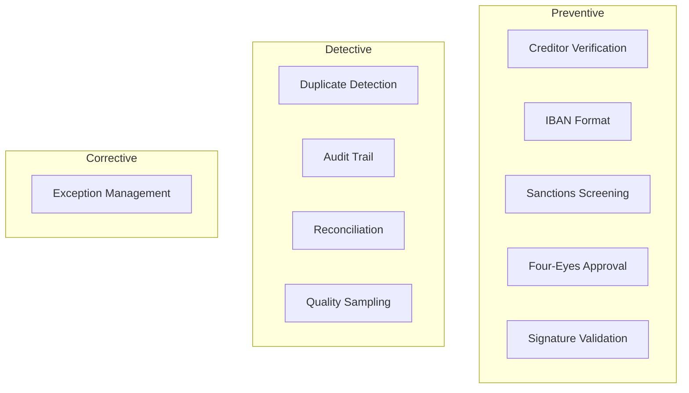

# SEPA Mandate Capture: Compliance & Control Assessment

**Process ID:** P-SEPA-MC-001 | **Date:** 2025-12-04 | **Prepared by:** Control Analyst

---

## Why Compliance Matters Here

Compliance is not bureaucracy—it is our license to operate. SEPA Mandate Capture sits at the intersection of payment scheme rules, anti-money laundering requirements, and banking supervision expectations. A mandate registered without proper controls could enable fraud, sanctions evasion, or unauthorized collections. A control failure could result in regulatory sanctions, scheme suspension, and reputational damage.

This assessment examines how SEPA Mandate Capture manages regulatory obligations and operational risk. The findings inform both our audit readiness and our ability to serve clients without exposing the organization to unacceptable risk.

The process operates under SEPA scheme rules (EPC mandate requirements), EU AML Directive (sanctions screening), German MaRisk (dual control principle), and GDPR (data processing), touching regulations that carry significant penalties for non-compliance. Our current posture: MEDIUM overall risk, with ADEQUATE audit readiness.

---

## Our Regulatory Landscape

SEPA Mandate Capture operates at the intersection of multiple regulatory frameworks:

### SEPA Direct Debit Rulebook

The European Payments Council rulebook defines how direct debit mandates must be structured, validated, and managed. It requires valid Creditor Identifiers, unique mandate references, proper debtor authorization (signature), and defined data formats.

This regulation requires strict adherence to mandate validity criteria. Our current compliance status: FULL. The consequence of non-compliance includes collection rejections, scheme penalties, and potential suspension from SEPA.

### EU 6th Anti-Money Laundering Directive (6AMLD)

The AML framework mandates customer due diligence, sanctions screening, and suspicious activity reporting. For mandate capture, this means screening both creditor and debtor against sanctions and PEP lists before registration.

Key requirements include real-time screening, record retention, and escalation procedures. Status: FULL compliance. This is non-negotiable—failure carries criminal liability for responsible persons.

### MaRisk (German Banking Supervision)

Germany's Minimum Requirements for Risk Management require dual control (four-eyes principle) for material transactions, segregation of duties, comprehensive audit trails, and operational risk management.

This framework mandates specific control designs that cannot be optimized away. We are currently FULLY compliant, though efficiency improvements are possible within the control constraints.

The regulatory environment continues to evolve. DORA (Digital Operational Resilience Act) takes effect January 2025 with new ICT risk requirements. PSD3 is in draft with potential mandate capture implications.

---

## How We Manage Risk Today

### Our Control Philosophy

The control framework is designed with three objectives: prevent unauthorized mandate registration, ensure AML compliance, and maintain complete audit trails. We accept that controls create processing friction but view this as the cost of operating safely in a regulated environment.

The control framework comprises 14 controls organized across three lines of defense:

**Preventive Controls (9):** These stop problems before they occur. Creditor verification prevents unauthorized parties from registering mandates. IBAN validation prevents collection to invalid accounts. Sanctions screening prevents mandates involving prohibited parties. Four-eyes approval prevents individual errors from reaching production.

**Detective Controls (4):** These identify issues that slip past prevention. Duplicate detection catches mandate duplication. Daily reconciliation identifies discrepancies. Quality sampling catches systematic errors. Audit logging enables investigation.

**Corrective Controls (1):** These remediate identified problems. Exception management ensures issues are tracked and resolved.

### Control Effectiveness

Of our 14 controls, 11 are operating effectively (82% rate). This represents a SATISFACTORY control environment—adequate for regulatory compliance but with room for improvement.

The controls that require attention fall into two categories:

**Design gaps:** External IBAN validation (CP03) cannot verify account existence at other banks—a design limitation we share with the industry. Quality sampling (CP14) is not statistically designed, reducing its effectiveness.

**Operating gaps:** Duplicate detection (CP04) has high false positive rate creating manual burden. Exception aging is not actively monitored.

---

## Where We Have Gaps

An honest assessment reveals 4 compliance gaps requiring attention:

### GAP-01: External IBAN Existence — MEDIUM Severity

The regulation requires reasonable steps to verify debtor accounts exist. Our current state: we verify format but cannot verify existence for accounts at other banks.

The gap exists because no industry-standard external IBAN verification service exists, though third-party solutions are emerging.

**Risk exposure:** 2% return rate from invalid external IBANs, with associated fees and client complaints
**Remediation path:** Evaluate third-party IBAN verification services by Q2 2026

### GAP-02: Quality Sampling Design — LOW Severity

MaRisk expects quality assurance with statistical rigor. Our current state: 2% ad-hoc sampling without statistical design.

The gap exists because quality sampling was implemented pragmatically without statistician input.

**Risk exposure:** Systematic errors may not be detected; audit finding risk
**Remediation path:** Implement statistical sampling program by Q1 2026

### GAP-03: DORA Incident Reporting — MEDIUM Severity

DORA (effective January 2025) requires major ICT incident reporting within 72 hours. Our current process: 5-day notification.

This gap creates non-compliance risk when DORA takes effect.

**Risk exposure:** Regulatory finding, potential penalties
**Remediation path:** Update incident management process by January 2025 (in progress)

**Summary:** 0 critical gaps, 2 medium-severity gaps, 2 low-severity gaps require remediation.

---

## Our Audit Readiness

The next regulatory audit is scheduled for September 2026. Our current readiness:

The control documentation is current and comprehensive. Evidence capture is automated for most controls. Previous audit findings have been largely addressed (2 of 3 closed). The remaining finding (quality sampling) is in remediation.

| Audit Dimension | Status | Assessment |
|-----------------|--------|------------|
| Policy Documentation | Current | Ready |
| Procedure Documentation | Current | Ready |
| Control Evidence | Automated | Ready |
| Testing Records | Complete | Ready |

**Overall assessment:** PREPARED for audit with observations expected on quality sampling and external IBAN validation.

The areas of greatest concern for the upcoming audit are the quality sampling methodology and DORA readiness. We have 9 months to address these before auditors arrive.

---

## Key Findings

Three findings from this assessment warrant leadership attention:

### Finding 1: DORA Compliance Gap Requires Immediate Action

The Digital Operational Resilience Act takes effect January 2025. Our incident reporting process does not meet the 72-hour requirement.

This finding matters because non-compliance from Day 1 creates immediate regulatory risk.

**Recommendation:** Accelerate incident management process update; target December 2024 completion.

### Finding 2: External IBAN Validation Remains Industry Challenge

While competitors share this limitation, emerging third-party solutions could provide differentiation. The return fee impact (€4K/month) plus client relationship damage justifies evaluation.

The implication: this is an opportunity to turn a compliance gap into competitive advantage.

**Recommendation:** Conduct vendor evaluation for third-party IBAN verification by Q1 2026.

### Finding 3: Transformation Must Preserve Control Integrity

The proposed digital mandate and real-time processing initiatives will require control redesign. Controls cannot be "optimized away" in pursuit of speed.

**Recommendation:** Require compliance sign-off on TO-BE design before implementation approval.

---

## What Needs Attention

Based on this assessment, remediation efforts should prioritize:

### Immediate: DORA Incident Process

Update incident reporting to achieve 72-hour capability before January 2025 regulatory deadline.

This action addresses GAP-03 and is owned by IT Operations with Compliance oversight. Target completion: December 2024.

**Why immediate:** Regulatory deadline creates hard constraint.

### Near-term: Quality Sampling Program

Implement statistically-designed quality sampling with defined sample sizes, stratification, and action thresholds.

Owner: Quality Management. Target: Q1 2026.

### Strategic: External IBAN Verification

Evaluate and potentially implement third-party IBAN verification service to close the validation gap and reduce return rates.

This represents a more significant undertaking that addresses GAP-01 and positions the bank ahead of competitors.

---

## Transformation Control Impact

The proposed transformation initiatives require careful control consideration:

### Digital Mandate Impact

**Control CP07 (Signature Validation):** Must be redesigned for e-signature validation. QES certificates must be verified. Evidence retention requirements must be met.

**Verdict:** Digital mandate can ENHANCE control environment if properly implemented. e-Signature provides stronger evidence than manual signature review.

### Real-Time Processing Impact

**Control CP06 (Four-Eyes):** Cannot be eliminated. Must be redesigned for real-time workflow. Risk-based approval (auto-approve low-risk) is acceptable with appropriate criteria.

**Verdict:** Real-time processing is COMPLIANT if controls are adapted, not removed.

### Self-Service Correction Impact

**Control CP06 (Four-Eyes):** Scope definition required—which fields can be self-service corrected? Approval waiver only for defined low-risk corrections.

**Verdict:** Self-service correction is ACCEPTABLE within defined boundaries.

---

## The Path Forward

The control environment is adequate but not optimal. Transformation is possible within regulatory constraints if properly designed.

Leadership decisions needed:
1. Approve DORA remediation timeline (Board awareness)
2. Commit to compliance sign-off on TO-BE design
3. Budget allocation for external IBAN verification evaluation

Resource requirements:
- DORA remediation: €20K, IT/Compliance resources
- Quality sampling: €15K, Quality Management resources
- IBAN evaluation: Business case development, then decision

The compliance function can execute this remediation plan within existing budget if priorities are aligned. Additional investment decision on IBAN verification is €80K+ if approved.

---

## Appendix

### A. Control Framework Visualization

### B. Control Inventory

| ID | Control | Type | Requirement | Owner | Effectiveness |
|----|---------|------|-------------|-------|---------------|
| CP01 | Creditor Verification | Preventive | SEPA | Payment Ops | High |
| CP05 | Sanctions Screening | Preventive | 6AMLD | Compliance | High |
| CP06 | Four-Eyes Approval | Preventive | MaRisk | Payment Ops | High |
| CP11 | Audit Trail | Detective | MaRisk | IT Ops | High |
| CP03 | IBAN Existence | Preventive | SEPA | Payment Ops | Medium |
| CP14 | Quality Sampling | Detective | MaRisk | Quality | Low |

### C. Gap Register

| ID | Regulation | Requirement | Current State | Gap | Severity |
|----|------------|-------------|---------------|-----|----------|
| GAP-01 | SEPA | IBAN verification | Format only (external) | Account existence | Medium |
| GAP-02 | MaRisk | Statistical QA | 2% ad-hoc | Not statistical | Low |
| GAP-03 | DORA | 72-hour reporting | 5-day process | Timeline | Medium |
| GAP-04 | MaRisk | SoD enforcement | Partial | Not all areas | Low |

### D. Risk Heat Map

| Risk | Likelihood | Impact | Rating | Trend |
|------|------------|--------|--------|-------|
| Authorization Fraud | Low | High | Medium | Stable |
| AML/Sanctions | Low | Critical | Medium | Stable |
| Data Quality | Medium | Medium | Medium | Improving |
| Compliance Breach | Low | High | Low | Stable |
| DORA Non-compliance | High | Medium | Medium | Improving |

### E. Remediation Timeline

| Priority | Action | Gap Addressed | Owner | Target Date |
|----------|--------|---------------|-------|-------------|
| 1 | DORA incident process | GAP-03 | IT Ops | Dec 2024 |
| 2 | Quality sampling design | GAP-02 | Quality | Q1 2026 |
| 3 | IBAN verification eval | GAP-01 | IT/Ops | Q2 2026 |
| 4 | SoD system enforcement | GAP-04 | IT | Q3 2026 |

### F. Supporting Documentation

- Full Compliance Assessment: `compliance-control-assessment.md`
- Control Points Detail: `control-points-detail.md`
- AS-IS Documentation: `as-is-process-documentation.md`

---

**Document ID:** EXEC-COMPLIANCE-P-SEPA-MC-001 | **Version:** 1.0 | **Confidence Level:** HIGH

---

## Change Log

| Date | Contributor | Role | Changes |
|------|-------------|------|---------|
| 2025-12-04 | ProcessMiner Analyst | Control Analyst | Initial executive summary |
